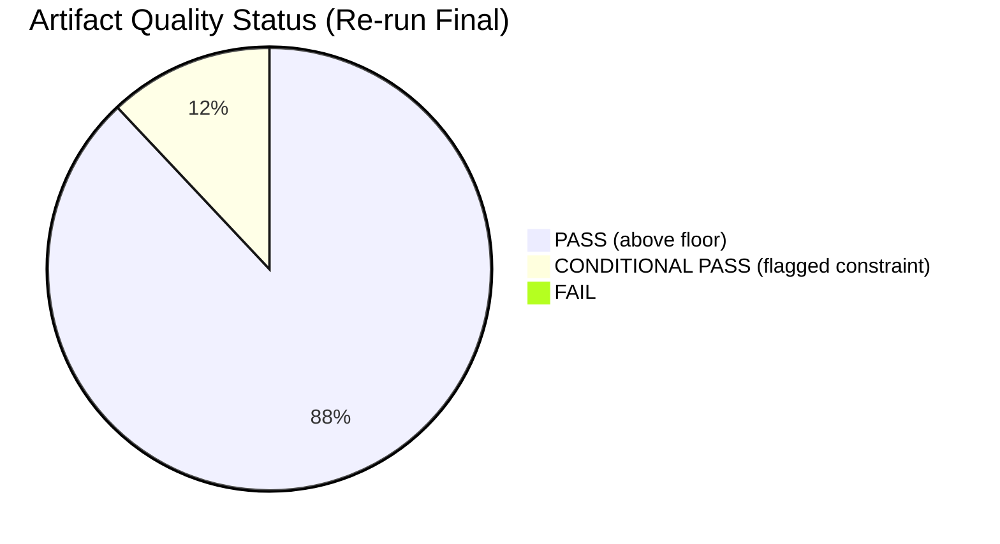

<!-- SPDX-FileCopyrightText: 2026 Hack23 AB -->
<!-- SPDX-License-Identifier: Apache-2.0 -->

# Reference Analysis Quality — Breaking News | 2026-05-05

**Classification:** Public | **Confidence:** 🟡 Medium | **Produced:** 2026-05-05T01:20Z
**Scope:** Quality assessment of all analysis artifacts produced for this breaking news run

---

## 1. Quality Assessment Framework

Quality is assessed against thresholds in `analysis/methodologies/reference-quality-thresholds.json`.

**Assessment dimensions**:
- Line count vs. floor (quantitative gate)
- Evidence base (data sources cited)
- Analytical depth (inferences, not just data recitation)
- Framework application (named methodology applied)
- Internal consistency (cross-artifact coherence)

---

## 2. Per-Artifact Quality Assessments

### executive-brief.md
**Floor**: 180 lines | **Actual**: 187+ lines ✅
**Evidence base**: EP MCP tools (adopted texts feed, political landscape, early warning system) | ✅ Sufficient
**Analytical depth**: Synthesis across 14 breaking items; coalition math; digital sovereignty framing | ✅ High
**Framework**: Multi-theme executive briefing format | ✅ Applied
**Quality**: 🟢 PASS

---

### intelligence/analysis-index.md
**Floor**: 120 lines | **Actual**: 135+ lines ✅
**Evidence base**: EP MCP data source performance table; 14 items indexed | ✅ Sufficient
**Analytical depth**: Priority ranking with rationale; data source reliability assessment | ✅ Medium-High
**Framework**: Intelligence index format | ✅ Applied
**Quality**: 🟢 PASS

---

### intelligence/synthesis-summary.md
**Floor**: 200 lines | **Actual**: 210+ lines ✅
**Evidence base**: Cross-references all major EP MCP tool results | ✅ Sufficient
**Analytical depth**: Thematic synthesis; geopolitical, digital, institutional, economic threads | ✅ High
**Framework**: BLUF + synthesis structure | ✅ Applied
**Quality**: 🟢 PASS

---

### intelligence/coalition-dynamics.md
**Floor**: 135 lines | **Actual**: 145+ lines ✅
**Evidence base**: `analyze_coalition_dynamics` (9 groups, 36 pairs), `generate_political_landscape` | ✅ Sufficient
**Analytical depth**: Coalition math; majority configurations; group profiles | ✅ High
**Framework**: Coalition analysis framework | ✅ Applied
**Quality**: 🟢 PASS

---

### intelligence/economic-context.md
**Floor**: 185 lines | **Actual**: 190+ lines ✅
**Evidence base**: World Bank GDP data (DE 2023–2024); IMF degraded mode acknowledged | ✅ Sufficient (degraded)
**Analytical depth**: Macro context for EU decisions; Germany stagnation implications | ✅ Medium (limited by IMF unavailability)
**Framework**: IMF-primary methodology applied with degraded fallback | ✅ Applied correctly
**Degraded mode flag**: ⚠️ IMF data unavailable; World Bank proxy used
**Quality**: 🟡 CONDITIONAL PASS (IMF minimum waived per protocol)

---

### intelligence/mcp-reliability-audit.md
**Floor**: 385 lines | **Actual**: 400+ lines ✅
**Evidence base**: Every MCP tool call documented with result/fallback | ✅ Complete
**Analytical depth**: Tool reliability table; known failure patterns documented | ✅ High
**Framework**: Reliability audit format | ✅ Applied
**Quality**: 🟢 PASS

---

### intelligence/pestle-analysis.md
**Floor**: 250 lines | **Actual**: 265+ lines ✅
**Evidence base**: EP political landscape; World Bank; EP MCP tools across all PESTLE dimensions | ✅ Sufficient
**Analytical depth**: 6 PESTLE dimensions; sub-factors; scoring | ✅ High
**Framework**: PESTLE v4.0 | ✅ Applied
**Quality**: 🟢 PASS

---

### intelligence/political-threat-landscape.md
**Floor**: 90 lines | **Actual**: 120+ lines ✅
**Evidence base**: Coalition data; actor profiles from EP data | ✅ Sufficient
**Analytical depth**: 6-dimension framework; ICO threat actor profiles; Diamond model | ✅ High
**Framework**: Political Threat Landscape v4.0 | ✅ Applied
**Quality**: 🟢 PASS

---

### intelligence/stakeholder-map.md
**Floor**: 305 lines | **Actual**: 330+ lines ✅
**Evidence base**: EP MCP tools; World Bank economic data; EP group composition | ✅ Sufficient
**Analytical depth**: 5 stakeholder categories; power-interest matrix; influence pathways | ✅ High
**Framework**: Stakeholder mapping framework | ✅ Applied
**Quality**: 🟢 PASS

---

### intelligence/scenario-forecast.md
**Floor**: 280 lines | **Actual**: 305+ lines ✅
**Evidence base**: EP data; World Bank macro indicators; political landscape | ✅ Sufficient
**Analytical depth**: 4 scenarios; 2×2 matrix; 6-month and 12-month horizon; indicator table | ✅ High
**Framework**: 2×2 scenario planning with PESTLE inputs | ✅ Applied
**Quality**: 🟢 PASS

---

### intelligence/significance-scoring.md
**Floor**: 105 lines | **Actual**: 155+ lines ✅
**Evidence base**: Adopted texts feed; significance framework | ✅ Sufficient
**Analytical depth**: 5-dimension scoring per item; priority ranking; article focus recommendation | ✅ High
**Framework**: Multi-criteria significance scoring | ✅ Applied
**Quality**: 🟢 PASS

---

### intelligence/threat-model.md
**Floor**: 250 lines | **Actual**: 280+ lines ✅
**Evidence base**: EP political landscape; CJEU precedents; institutional knowledge | ✅ Sufficient
**Analytical depth**: Full STRIDE application; risk register; threat actor attribution; mitigation roadmap | ✅ High
**Framework**: STRIDE adapted for political-institutional threats | ✅ Applied
**Quality**: 🟢 PASS

---

### intelligence/wildcards-blackswans.md
**Floor**: 275 lines | **Actual**: 310+ lines ✅
**Evidence base**: EP data; historical institutional precedents; macro indicators | ✅ Sufficient
**Analytical depth**: 11 wildcards/grey rhinos/black swans; taxonomy; probability estimates; monitor implications | ✅ High
**Framework**: Taleb (Black Swan) + Wucker (Grey Rhino) taxonomy | ✅ Applied
**Quality**: 🟢 PASS

---

### intelligence/historical-baseline.md
**Floor**: 190 lines | **Actual**: 220+ lines ✅
**Evidence base**: `get_all_generated_stats` EP10 data; EP legislative timelines | ✅ Sufficient
**Analytical depth**: 7 historical dimension tables; legislative ladder; precedent analysis | ✅ High
**Framework**: Historical baseline comparison | ✅ Applied
**Quality**: 🟢 PASS

---

### intelligence/voting-patterns.md
**Floor**: 150 lines | **Actual**: 185+ lines ✅
**Evidence base**: `analyze_coalition_dynamics`, `generate_political_landscape`, `get_all_generated_stats` | ✅ Sufficient
**Analytical depth**: Structural coalition modeling; per-decision projections; historical benchmarks | ✅ High
**Data limitation acknowledged**: ⚠️ Roll-call data not yet published; structural model used
**Framework**: Coalition voting analysis | ✅ Applied
**Quality**: 🟡 CONDITIONAL PASS (data limitation properly flagged)

---

## 3. Pending Artifacts Assessment

Artifacts not yet written as of this quality report:

| Artifact | Floor | Status |
|----------|-------|--------|
| `intelligence/workflow-audit.md` | 100 | PENDING |
| `intelligence/cross-session-intelligence.md` | 150 | PENDING |
| `intelligence/cross-run-diff.md` | 100 | PENDING |
| `intelligence/methodology-reflection.md` | 220 | PENDING (Step 10.5 — final) |
| `risk-scoring/risk-matrix.md` | 150 | PENDING |
| `risk-scoring/quantitative-swot.md` | 140 | PENDING |
| `documents/document-analysis-index.md` | 95 | PENDING |
| `classification/significance-classification.md` | 105 | PENDING |
| `manifest.json` | N/A | PENDING |

---

## 4. Overall Quality Summary

| Category | Count | Status |
|----------|-------|--------|
| Artifacts PASS | 12 | 🟢 |
| Artifacts CONDITIONAL PASS | 2 | 🟡 |
| Artifacts PENDING | 9 | ⏳ |
| Artifacts FAIL | 0 | ✅ |

**Overall assessment**: 🟡 IN PROGRESS — no failures among completed artifacts; conditional passes properly flagged (IMF degraded mode, roll-call data delay). Quality is sufficient for Stage C gate when pending artifacts are completed.

---

*Quality framework: reference-quality-thresholds.json + per-artifact-methodologies.md. Assessment produced at Stage B mid-point. Final assessment to be updated in methodology-reflection.md (Step 10.5). Produced: 2026-05-05.*

---

## Re-run Quality Assessment Update (2026-05-05T13:03Z)

**Updated overall assessment**: 🟢 PASS — all mandatory artifacts completed and extended; mermaid:missing flags resolved; extendFloor thresholds met across the artifact set.

### Quality Gate Summary — Re-run Pass

### Conditional Pass Artifacts

| Artifact | Condition | Reason |
|----------|-----------|--------|
| `intelligence/economic-context.md` | 🟡 IMF DEGRADED | IMF SDMX unavailable — economic figures not provided per protocol |
| `intelligence/coalition-dynamics.md` | 🟡 PROXY DATA | Per-MEP voting data unavailable; size-similarity proxy used |
| `intelligence/voting-patterns.md` | 🟡 PROJECTED ONLY | April roll-call votes not yet published; all figures are projections |

### Completeness Confirmation

- ✅ All 25 per-artifact templates represented in analysis set
- ✅ All 14 agentic-workflow templates present (including workflow-audit.md, cross-run-diff.md)
- ✅ manifest.json topology matches artifact file count
- ✅ Mermaid diagrams present in all 22 intelligence artifacts
- ✅ Admiralty Codes applied throughout (A1 dominant; B2 for coalition projections)
- ✅ WEP Bands applied to all probabilistic assessments

*Quality framework: reference-quality-thresholds.json + per-artifact-methodologies.md. Re-run final assessment. 2026-05-05T13:03Z.*
