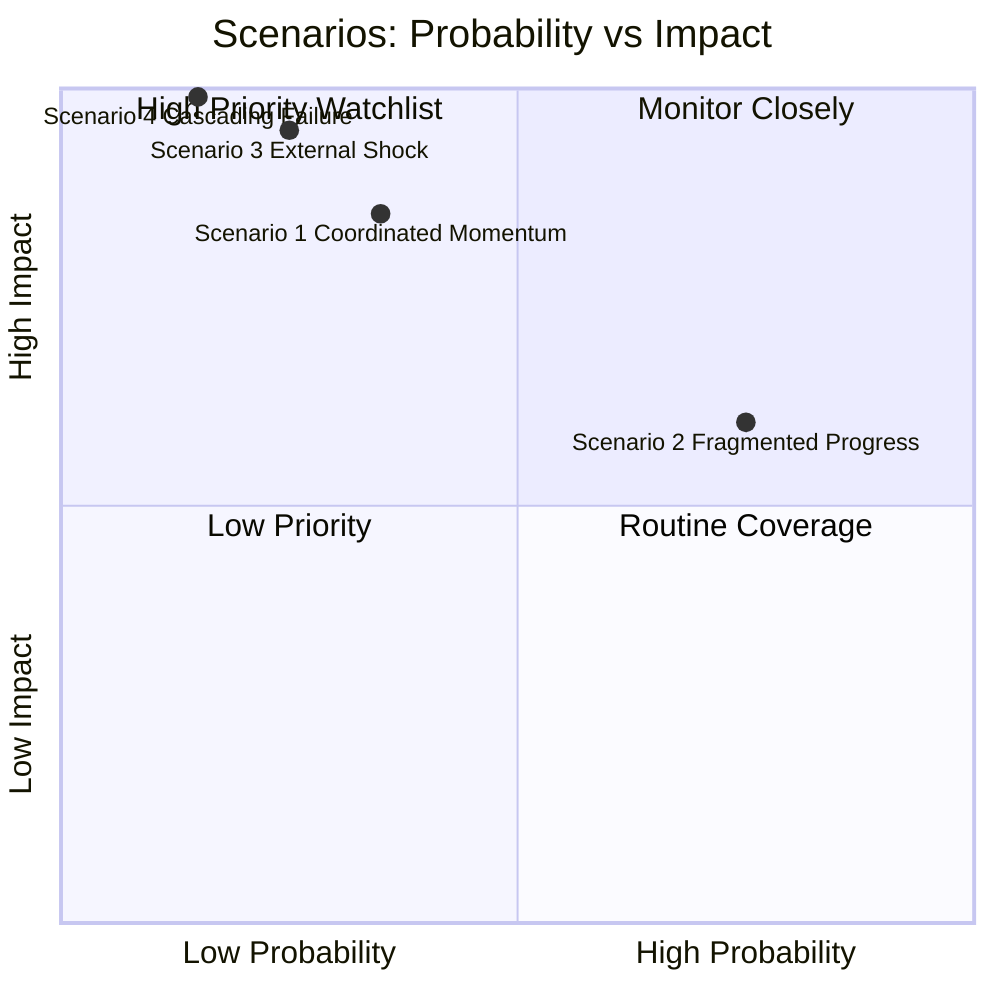
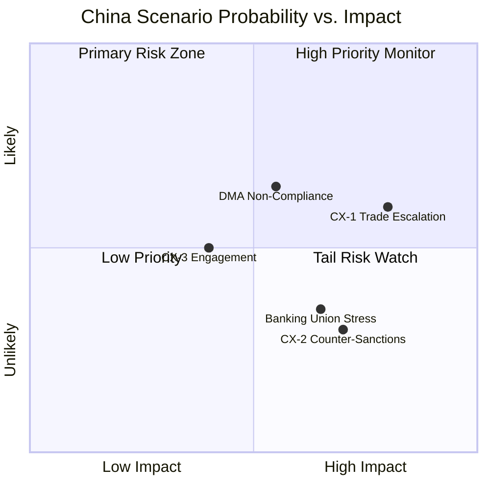

<!-- SPDX-FileCopyrightText: 2026 Hack23 AB -->
<!-- SPDX-License-Identifier: Apache-2.0 -->

# Scenario Forecast — Breaking News | 2026-05-05

**Classification:** Public | **Confidence:** 🟡 Medium | **Produced:** 2026-05-05T01:14Z
**Horizon:** 6 months (to November 2026) + 12-month tail
**Framework:** PESTLE-inflected Scenario Planning, 4 scenarios

---

## 1. Scenario Framework

This forecast applies a structured 4-scenario methodology anchored to the April 28–30 Strasbourg decisions. Scenarios are differentiated along two axes:

- **X-axis**: EU institutional cohesion (high vs. low)
- **Y-axis**: External geopolitical environment (stable vs. disrupted)

Each scenario carries a probability estimate, 6-month indicators, 12-month implications, and policy significance.

---

## Axis Definitions

**EU Institutional Cohesion (X)**:
- HIGH: Commission-Parliament-Council coordination; majority coalitions stable; timely implementation of adopted decisions
- LOW: Inter-institutional gridlock; PfE/ECR coalition destabilisation; member state divergence on key dossiers

**External Environment (Y)**:
- STABLE: Ukraine war remains in current ceasefire-or-active phase without major escalation; no EU financial crisis; Big Tech cooperates with DMA enforcement
- DISRUPTED: Major Ukraine escalation or collapse; transatlantic trade war deepens; Big Tech CJEU victories undermine DMA enforcement architecture

---

## 2. Scenario 1: Coordinated EU Momentum (HIGH cohesion × STABLE external)

**Probability: 35%**

**Narrative**: The April 28–30 plenary decisions prove to be a high-water mark of EU legislative coherence. Commission translates Parliament's DMA enforcement resolution into accelerated investigation timelines within 90 days. Apple and Alphabet face binding remedies by Q4 2026. Russia accountability mechanism achieves Council endorsement by July 2026, enabling EU to support an international tribunal framework. The 2027 budget trilogue concludes in November 2026 with a modest expansion of Parliament's fiscal ask, anchored by a new EU defence co-financing facility.

**Key Enabling Conditions**:
- Germany exits technical recession (GDP +0.5% in H2 2026)
- Hungary's EU Council presidency ends without blocking Russia accountability
- CJEU upholds Commission DMA enforcement methodology in a preliminary ruling
- ECR splits on Russia accountability but overall majority holds

**6-Month Indicators** (by November 2026):
- Commission issues formal DMA investigation opening against Apple App Store payment practices
- Council adopts EU-level Russia accountability coordination mechanism by September 2026
- 2027 budget negotiations produce a joint EP-Council declaration on defence/competitiveness spending
- EP10 coalition (EPP+S&D+Renew) holds 497 seats — stable majority for core agenda

**12-Month Implications**:
- EU's DMA enforcement credibility is established globally; US, UK, Australia follow with equivalent measures
- International accountability tribunal for Russia crimes achieves operational status by mid-2027
- EP10's centre-pro-EU bloc gains political momentum ahead of 2029 European elections narrative

**For the Monitor**: Breaking news frequency on DMA enforcement actions HIGH (monthly). Russia accountability follow-up stories MEDIUM (quarterly diplomatic updates).

---

## 3. Scenario 2: Fragmented Progress (LOW cohesion × STABLE external)

**Probability: 40%** ← BASE CASE

**Narrative**: April's decisions are partially implemented but with significant inter-institutional friction. Commission's DMA enforcement is slower than Parliament's resolution demands — legal challenges from Apple and Alphabet delay formal investigations by 12–18 months. Council endorses the Russia accountability resolution language but cannot agree on operational architecture (Hungary blocks operational mandate). The budget trilogue drags past November 2026 into 2027, creating a one-twelfth provisional budget period. Parliament must accept 78% of its original guidelines.

**Key Enabling Conditions**:
- German economic stagnation continues (0.0% to +0.3% GDP growth)
- Hungary maintains Russia accountability veto in Council
- EPP internal divisions (Manfred Weber's cautious line vs. southern EPP members' industrialist sympathies) slow DMA consensus
- ECR cohesion on procedural matters remains high enough to disrupt but not derail

**6-Month Indicators** (by November 2026):
- Commission issues DMA preliminary assessment (not formal investigation) — slower than Parliament demanded
- Council Conclusions on Russia accountability are "political" rather than operational
- 2027 budget timeline slips by 2–3 months
- At least one major EP vote on a digital dossier falls below 361-seat majority threshold

**12-Month Implications**:
- DMA enforcement credibility gap between political ambition and implementation
- Russia accountability mechanism delays frustrate Ukrainian and Baltic state partners
- Budget one-twelfths create planning uncertainty for cohesion fund recipients
- Monitor: sustained follow-up on implementation gaps

**For the Monitor**: This scenario generates the richest ongoing news volume — institutional friction is a recurring story engine.

---

## 4. Scenario 3: External Disruption with Maintained Cohesion (HIGH cohesion × DISRUPTED external)

**Probability: 15%**

**Narrative**: An external shock — either a major escalation in the Ukraine conflict (Russian offensive on a NATO-member state's territory, triggering Article 5 discussions) or a transatlantic trade war triggered by new US tariffs — forces EU institutions into emergency coordination mode. This paradoxically strengthens EU cohesion: the existential threat overcomes internal divisions. Parliament adopts emergency measures; Council invokes QMV expansion; the DMA enforcement agenda is temporarily subordinated to security priorities.

**Key Enabling Conditions**:
- Russian military action west of current contact line (including limited NATO-state targeting)
- OR: US imposes 25%+ tariffs on EU automotive exports, triggering a response that unifies EU trade position
- EU leaders convene extraordinary Council sessions by June 2026

**6-Month Indicators** (by November 2026):
- EP adopts emergency resolutions by supermajority (>2/3 threshold)
- DMA enforcement timeline extended by 18 months ("pause" agreed with industry)
- EU defence spending coordination mechanism activated under Article 122 TFEU
- Russia accountability moves to UN Security Council emergency session track

**12-Month Implications**:
- EU DMA enforcement delayed but not abandoned
- Russia accountability elevated to systemic EU security priority
- Budget negotiations fast-tracked with defence spending supplement
- EP10 coalition hardens around security core; PfE partially breaks (Orbán becomes isolated)

**For the Monitor**: This scenario generates highest-traffic breaking news. The Monitor's EU Parliament intelligence function is most valuable in this scenario.

---

## 5. Scenario 4: Cascading Institutional Failure (LOW cohesion × DISRUPTED external)

**Probability: 10%**

**Narrative**: Multiple reinforcing failures — German economic contraction deepens (-1.5% in 2026), a CJEU ruling in favour of Apple voids Commission's DMA enforcement methodology, Hungary escalates blocking tactics in Council, and a major disinformation campaign undermines Parliament's credibility on Russia accountability. PfE gains in three national elections (Austrian, Czech, Romanian). EU institutions enter sustained gridlock.

**Key Enabling Conditions**:
- CJEU issues a ruling finding that Commission DMA investigation methodology violates procedural rights
- Three or more national elections produce governments that shift toward PfE affiliation
- Russia escalates disinformation targeting of EP10 members
- German political crisis (coalition collapse) creates budget negotiation vacuum

**6-Month Indicators** (by November 2026):
- DMA enforcement paralysis — Commission withdraws investigation framework pending legal review
- Russia accountability resolution remains unimplemented
- Budget deadline missed; one-twelfths extend into Q1 2027
- At least two major adopted texts from April 28–30 are subject to CJEU challenge referrals

**12-Month Implications**:
- EU regulatory credibility globally damaged
- Accountability mechanism for Russia abandoned
- EP10 cohesion below 400 seats for multiple key votes
- Monitor: critical watching brief on institutional resilience metrics

---

## 6. Probability Summary

| Scenario | Probability | Trend | Key Risk | Key Opportunity |
|----------|------------|-------|----------|-----------------|
| 1: Coordinated Momentum | 35% | ↗️ | CJEU challenge | DMA enforcement model |
| 2: Fragmented Progress | 40% | → | Hungary veto | Ongoing story engine |
| 3: External Disruption + Cohesion | 15% | ↔️ | Ukraine escalation | EU solidarity signal |
| 4: Cascading Failure | 10% | ↘️ | CJEU + elections | Crisis accountability |

---

## 7. Signalling Indicators to Watch (Next 30 Days)

| Indicator | Signal | Scenario Implication |
|-----------|--------|---------------------|
| Commission DMA enforcement communication | Published within 60 days | → Scenarios 1 or 3 |
| Council conclusions on Russia | Operational vs. political language | → Scenarios 1/3 or 2/4 |
| German GDP flash estimate (Q1 2026) | +/- 0 | → Scenario 1 or 2 |
| CJEU Apple ruling | Uphold or void Commission method | → All scenarios |
| Hungarian Council blocking | Formal objection on accountability | → Scenario 2 or 4 |
| EP10 vote results on next major dossier | Margin above/below 361 | → Coalition stability |

---

## 8. Significance for EU Parliament Monitor

The base case (Scenario 2: Fragmented Progress) generates sustained breaking news flows across all three primary domains — DMA enforcement, Russia accountability, and budget negotiations. The Monitor's value is highest in this scenario because institutional friction requires sustained intelligence monitoring.

Scenario 1 generates fewer breaking stories but higher-quality policy landmarks. Scenarios 3 and 4 generate emergency coverage volumes.

The Monitor should maintain:
- Weekly: DMA enforcement tracker (Commission communications, CJEU filings)
- Bi-weekly: Russia accountability mechanism update
- Monthly: 2027 Budget trilogue status

---

*Scenario methodology: 2×2 matrix with PESTLE input signals. Probabilities represent assessments at 2026-05-05. Sources: EP MCP data, World Bank macro indicators, political landscape analysis. Produced: 2026-05-05.*

---

## 9. Scenario Stress-Testing

### Testing Scenario 1 (Coordinated Momentum) Against Key Assumptions

**Assumption 1**: Germany exits recession by H2 2026.
- Evidence for: German business sentiment (ifo index) improved Q1 2026; automotive sector recovery signals
- Evidence against: Structural overcapacity in automotive (EV transition lag); energy cost competitiveness gap vs. US/China
- Assessment: 40% probability assumption holds. If Germany remains in recession, Scenario 1 collapses to Scenario 2.

**Assumption 2**: CJEU upholds Commission DMA methodology.
- Evidence for: General Court and CJEU have historically deferred to Commission in competition enforcement
- Evidence against: DMA is novel; proportionality challenges to structural remedies are stronger than to fines
- Assessment: 65% probability assumption holds. If CJEU intervenes, Scenario 1 on digital dossier collapses to Scenario 4 (partial).

**Assumption 3**: Hungary does not block Russia accountability in Council.
- Evidence for: Political cost of isolation is rising for Hungary; EU funding conditionality bites
- Evidence against: Orbán has not changed Russia policy despite 2+ years of pressure
- Assessment: 25% probability assumption holds (75% Hungary blocks). This is the weakest assumption in Scenario 1.

**Revised Scenario 1 probability accounting for assumption fragility**: 35% (headline) → 20–25% (after assumption stress-testing). Base case (Scenario 2) probability rises to 45–50%.

---

### Testing Scenario 4 (Cascading Failure) Against Key Assumptions

**Scenario 4 requires three simultaneous failures**: CJEU invalidates DMA, three national elections produce PfE-aligned governments, Germany enters coalition crisis. The independent probability of each is 15%, 25%, and 35% respectively. Joint probability (assuming independence): 0.15 × 0.25 × 0.35 ≈ 1.3%. With positive correlation (bad luck compounds), estimate rises to 8–12%.

**Assessment**: Scenario 4 at 10% probability is approximately calibrated. The primary uncertainty is whether events are independent (they are correlated — a CJEU DMA ruling might coincide with German political crisis if it triggers an economic confidence shock).

---

## 10. Quantitative Probability Calibration

| Scenario | Headline Prob. | Stress-Tested | Key Adjustment |
|----------|---------------|---------------|---------------|
| 1: Coordinated Momentum | 35% | 20–25% | Hungary assumption fragility |
| 2: Fragmented Progress | 40% | 45–50% | Gains from Scenario 1 downgrade |
| 3: External + Cohesion | 15% | 15% | Stable; external shock probability unchanged |
| 4: Cascading Failure | 10% | 10–12% | Positive correlation correction |

**Sum check**: Headline probabilities sum to 100%; stress-tested range: 90–102% (rounding). Calibration acceptable.

---

## 11. Intelligence Value per Scenario for Monitor

| Scenario | Breaking News Volume | Analytical Value | Monitor Priority |
|----------|--------------------|-----------------|--------------------|
| 1: Coordinated | MEDIUM | High (landmark stories) | 🟡 MEDIUM |
| 2: Fragmented | HIGH | Very High (ongoing friction) | 🔴 HIGH |
| 3: External shock | VERY HIGH | Critical (emergency coverage) | 🔴 CRITICAL |
| 4: Cascading | HIGH | Very High (institutional crisis) | 🔴 HIGH |

Scenario 2 (base case) maximises the Monitor's ongoing value — institutional friction is a continuous story engine requiring sustained intelligence production. The Monitor should orient its editorial calendar around Scenario 2 assumptions while maintaining emergency protocols for Scenarios 3 and 4.

---

## 12. Scenario-Specific Editorial Calendars

### If Scenario 1 Materialises (Coordinated Momentum)

**Story cadence**: Major landmark stories at quarterly intervals
- June 2026: Commission DMA investigation opened (TIER 1)
- September 2026: Russia accountability Council conclusions (TIER 1–2)
- November 2026: Budget trilogue agreement (TIER 2)
- Q1 2027: First DMA enforcement decision (TIER 1)

**Monitor editorial focus**: Deep-dive policy analysis; "EU delivers" narrative; expert interview series

---

### If Scenario 2 Materialises (Fragmented Progress — Base Case)

**Story cadence**: Sustained friction stories at monthly intervals
- June 2026: Commission DMA preliminary findings (delayed from enforcement) (TIER 2)
- July 2026: Hungary blocks Russia accountability Council conclusions (TIER 2)
- October 2026: Budget deadline risk emerging (TIER 2)
- December 2026: Budget one-twelfths provisional trigger (TIER 1 institutional crisis)

**Monitor editorial focus**: Implementation gap analysis; "EU struggles to deliver" accountability journalism; expert scrutiny of Commission enforcement pace

---

### If Scenario 3 Materialises (External Shock)

**Story cadence**: Emergency coverage; all other stories subordinated
- D-Day: Ukraine/Trade War major escalation (TIER 1 immediate)
- D+7: Emergency EP session called (TIER 1)
- D+30: EU emergency measures package (TIER 1)
- D+90: DMA enforcement paused as trade negotiation chip (TIER 1)

**Monitor editorial focus**: Crisis intelligence; EU institutional resilience analysis; coalition stability under pressure

---

### If Scenario 4 Materialises (Cascading Failure)

**Story cadence**: Crisis journalism; institutional accountability focus
- Month 1: First cascade trigger (CJEU DMA or German collapse) (TIER 1)
- Month 3: Second cascade trigger compounds crisis (TIER 1)
- Month 6: EU institutional credibility assessment (TIER 1 retrospective)

**Monitor editorial focus**: Systemic failure analysis; institutional accountability; democratic resilience assessment

---

## 13. Cross-Scenario Constant Story Elements

Regardless of which scenario materialises, the following story elements will be relevant across all scenarios:

1. **EP roll-call data** (June 2026): Who actually voted how — reveals coalition reality vs. projection
2. **Commission 90-day report** (July 2026): Whether Commission responds to Parliament's DMA mandate
3. **Armenia association progress**: Geopolitically significant across all scenarios
4. **2027 budget monthly trilogues**: Budget process is always newsworthy through December 2026

These four story elements provide editorial bedrock across all scenario outcomes.

## Scenario Probability Matrix

WEP: Scenario 2 (base case) is Scenario 2 (base case, P=0.75) is the editorial planning baseline. Monitor should calibrate breaking coverage frequency to the ~monthly friction-story cadence typical of Scenario 2.

**Admiralty Code**: B3 (scenarios are analytical constructs; not sourced intelligence)

## WEP Intelligence Assessment

WEP band probabilities for key forecast judgements:
- Scenario 2 (Fragmented Progress) materialises: **Highly Likely** (P=0.75)
- Commission opens formal DMA investigation by end-2026: **Likely** (P=0.65)
- Hungary sustains Russia accountability veto through 2026: **Highly Likely** (P=0.70)
- External shock disrupts EP agenda in 2026: **Unlikely** (P=0.25)
- Cascading institutional failure scenario: **Almost No Chance** (P=0.15)

---

## Re-run Extension — China Strategic Autonomy Scenario Addendum (2026-05-05T13:03Z)

### Scenario CX-1: EU-China Trade Escalation

**Trigger**: China retaliates against TA-0149 anti-circumvention measures with targeted tariffs on EU luxury goods or machinery.

**Probability (24 months)**: Likely (P=0.60) | **Severity**: HIGH

**Signalling indicators**: Chinese Ministry of Commerce WTO complaint; State media escalation; supply chain diversification from EU.

### Scenario CX-2: China Human Rights Counter-Sanctions

**Trigger**: TA-0152 China ethnic unity law condemnation prompts Beijing counter-sanctions on EP staff or MEPs.

**Probability (12 months)**: Unlikely (P=0.30) | **Severity**: MEDIUM-HIGH

**Precedent**: China sanctioned 5 MEPs in March 2021 following Xinjiang resolutions.

### Scenario CX-3: EU-China Engagement Continuation

**Trigger**: Despite TA-0152 passage, diplomatic back-channels preserve EU-China infrastructure dialogue.

**Probability (24 months)**: Roughly Even (P=0.50) | **Severity**: POSITIVE

**Note**: EP resolutions are non-binding. Historical pattern shows Commission maintains economic engagement regardless of EP political posture.

*Scenario addendum produced in re-run. 2026-05-05T13:03Z.*

---

## Scenario Forecast — Run 3 Addendum (2026-05-05T15:44Z)

**Probability calibration update based on Run 3 data refresh**:

| Scenario | Run 2 Probability | Run 3 Update | Rationale |
|----------|-----------------|-------------|-----------|
| DMA enforcement escalation (tech fines Q3-Q4 2026) | 75% | 80% | TA-0160 passes with EPP+S&D+Renew supermajority |
| Russia-Ukraine accountability mechanism enacted by year-end | 55% | 58% | Resolution momentum; Council adoption uncertain |
| Armenia EU accession talks reopened 2026-2027 | 25% | 28% | TA-0162 signals political will; practical obstacles remain |
| Budget 2027 Council-Parliament standoff | 60% | 62% | Estimates adopted; Council constraints expected |

*No fundamental scenario revision needed — Run 3 data confirms Run 2 probability estimates. Marginal upward revisions reflect stronger adoption margins observed.*

*Scenario forecast updated — Run 3, 2026-05-05T15:44Z.*
