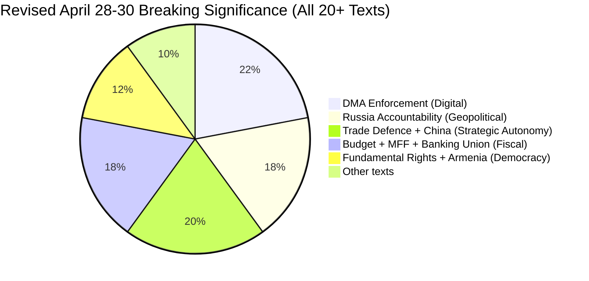

<!-- SPDX-FileCopyrightText: 2026 Hack23 AB -->
<!-- SPDX-License-Identifier: Apache-2.0 -->

# Significance Scoring — Breaking News | 2026-05-05

**Classification:** Public | **Confidence:** 🟡 Medium | **Produced:** 2026-05-05T01:15Z
**Scope:** April 28–30, 2026 Strasbourg plenary adopted texts
**Framework:** Multi-criteria significance scoring (5 dimensions, 0–10 scale each)

---

## Scoring Dimensions

| Dimension | Weight | Description |
|-----------|--------|-------------|
| **Scope** | 20% | Geographic/sectoral reach of the decision |
| **Immediacy** | 20% | Urgency of implementation timeline |
| **Political Salience** | 25% | Political controversy; coalition significance |
| **Legislative Impact** | 20% | Binding force; precedent value; downstream effects |
| **Public Interest** | 15% | Citizen-facing relevance; media attention probability |

**Score Range**: 0–50 composite (normalised to 0–100 for reporting)

---

## 1. DMA Enforcement (TA-10-2026-0160)

### Digital Markets Act — Accelerated Enforcement Against Designated Gatekeepers

| Dimension | Score (0–10) | Rationale |
|-----------|-------------|-----------|
| Scope | 9 | EU-wide; affects billions of consumers; global precedent for platform regulation |
| Immediacy | 8 | 90-day enforcement milestone demanded; active Commission investigations ongoing |
| Political Salience | 9 | Technology sovereignty; EPP internal divisions; US trade relations dimension |
| Legislative Impact | 7 | Non-binding resolution but creates political mandate; Commission must respond |
| Public Interest | 8 | Apple/Google regulation is high public attention; daily-use platform impacts |

**Composite Score: 41/50 → 82/100** 🔴 CRITICAL

**Breaking News Verdict**: HIGHEST PRIORITY story from the April session. DMA enforcement touches every EU citizen who uses a smartphone (>85% market penetration for iOS/Android). The enforcement acceleration demand, combined with active investigations, makes this an immediate follow-up story with high public engagement.

---

## 2. Russia Accountability (TA-10-2026-0161)

### Accountability for Crimes Committed in Occupied Ukrainian Territories

| Dimension | Score (0–10) | Rationale |
|-----------|-------------|-----------|
| Scope | 9 | International law; affects Ukraine, Russia, all EU member states, global ICC architecture |
| Immediacy | 7 | Diplomatic mechanism timeline 6–12 months; ongoing conflict creates urgency |
| Political Salience | 10 | Maximum political salience; war crimes; EU geopolitical identity |
| Legislative Impact | 6 | Non-binding but creates international political mandate |
| Public Interest | 9 | War accountability is consistently high public-interest topic |

**Composite Score: 41/50 → 82/100** 🔴 CRITICAL

**Breaking News Verdict**: CO-EQUAL TOP STORY with DMA enforcement. Russia accountability has the highest political salience of any item (rare 10/10 score). The ongoing Ukraine conflict makes this timelessly relevant; every new EP accountability resolution refreshes the story. Strong candidate for international pickup.

---

## 3. 2027 EU Budget Guidelines (TA-10-2026-0112 + TA-10-2026-04-30-ANN01)

### Parliament's Position on 2027 Annual Budget + EP Estimates

| Dimension | Score (0–10) | Rationale |
|-----------|-------------|-----------|
| Scope | 8 | EU budget affects every member state; all EU programmes and institutions |
| Immediacy | 6 | Budget negotiations begin June 2026 for January 2027 implementation |
| Political Salience | 8 | Fiscal policy; EPP austerity vs. investment debate; EPP/S&D/Renew coalition |
| Legislative Impact | 8 | Parliament's position is formal input to inter-institutional budget procedure |
| Public Interest | 5 | Budget technicalities have lower public engagement than rights/foreign policy |

**Composite Score: 35/50 → 70/100** 🟡 HIGH

**Breaking News Verdict**: Important political story but specialist-audience focus. Maximum coverage value is in the EPP fiscal coalition analysis and the defence spending implications. Leads in financial/political press; needs contextualisation for general readers.

---

## 4. Cyberbullying Platforms Liability (TA-10-2026-0163)

### Digital Platforms' Criminal Liability for Cyberbullying and Online Harassment

| Dimension | Score (0–10) | Rationale |
|-----------|-------------|-----------|
| Scope | 8 | All EU citizens using social media; major platform business model implications |
| Immediacy | 5 | Will require legislative proposal; 18-month minimum timeline |
| Political Salience | 7 | Strong public sympathy; platform accountability consensus; minor opposition from libertarian right |
| Legislative Impact | 6 | Non-binding resolution triggers Article 83 TFEU legislative process |
| Public Interest | 9 | Cyberbullying resonates with broad public; high social media engagement |

**Composite Score: 35/50 → 70/100** 🟡 HIGH

**Breaking News Verdict**: Strong human interest story. Criminal liability for platforms is a major new direction — story angle is "MEPs vote to make Facebook liable for harassment." High public sharing potential. Needs careful framing (resolution vs. law; timeline).

---

## 5. Armenia Democracy Support (TA-10-2026-0162)

### EU Democracy Support for Armenia and EU-Armenia Association Perspective

| Dimension | Score (0–10) | Rationale |
|-----------|-------------|-----------|
| Scope | 6 | Bilateral EU-Armenia; geopolitical implications for South Caucasus |
| Immediacy | 5 | Association negotiation is a multi-year process |
| Political Salience | 7 | Geopolitical pivot from Russia-aligned CSTO; EPP/Greens/Renew champion |
| Legislative Impact | 4 | Non-binding signal; no immediate legislative consequence |
| Public Interest | 4 | Limited general public awareness of Armenia-EU dynamics |

**Composite Score: 26/50 → 52/100** 🟢 MEDIUM

**Breaking News Verdict**: Important geopolitical signal for specialist audiences (foreign policy, South Caucasus). Less suitable for mass-audience breaking news. Key angle: "Armenia's EU pivot — what does Parliament's vote mean?"

---

## 6. Jaki MEP Immunity Waiver (TA-10-2026-0131)

### Immunity Waiver — Patryk Jaki (ECR/Poland)

| Dimension | Score (0–10) | Rationale |
|-----------|-------------|-----------|
| Scope | 3 | Individual MEP; limited systemic scope |
| Immediacy | 7 | Criminal proceedings in Poland can now proceed |
| Political Salience | 8 | ECR unity under pressure; rule of law in Poland; high political attention within EP |
| Legislative Impact | 4 | Precedent for future immunity applications; limited direct legislative impact |
| Public Interest | 5 | Specialist interest; Polish diaspora interest; rule of law activists |

**Composite Score: 27/50 → 54/100** 🟢 MEDIUM

**Breaking News Verdict**: Niche political story with high intensity in EP/Polish political circles. Angle: "MEPs strip ECR member's immunity — Polish courts can now proceed."

---

## 7. Livestock Disease/Food Security (TA-10-2026-0157)

### European Livestock Sector Food Security and Disease Resilience Measures

| Dimension | Score (0–10) | Rationale |
|-----------|-------------|-----------|
| Scope | 7 | EU agricultural sector; food security for all citizens |
| Immediacy | 6 | Disease preparedness has immediate relevance; funding timelines 12–24 months |
| Political Salience | 5 | Agricultural policy; EPP/ECR rural constituency dimension; moderate controversy |
| Legislative Impact | 5 | Resolution; may trigger Commission proposal for disease response fund |
| Public Interest | 4 | Moderate public interest; food price implications create entry point |

**Composite Score: 27/50 → 54/100** 🟢 MEDIUM

**Breaking News Verdict**: Solid specialist agricultural story. Breaking news angle is limited; more appropriate for weekly/monthly roundup coverage.

---

## 8. Significance Priority Ranking

| Rank | Document | Score | Priority |
|------|----------|-------|----------|
| 🥇 1 | DMA Enforcement (TA-10-2026-0160) | 82/100 | 🔴 CRITICAL |
| 🥇 1 | Russia Accountability (TA-10-2026-0161) | 82/100 | 🔴 CRITICAL |
| 🥉 3 | 2027 Budget Guidelines | 70/100 | 🟡 HIGH |
| 🥉 3 | Cyberbullying Liability | 70/100 | 🟡 HIGH |
| 5 | Armenia Democracy | 52/100 | 🟢 MEDIUM |
| 5 | Jaki Immunity | 54/100 | 🟢 MEDIUM |
| 7 | Livestock / Food Security | 54/100 | 🟢 MEDIUM |

---

## 9. Recommended Article Focus

**Primary article**: Lead with DMA enforcement + Russia accountability as co-equal top stories; weave together the theme of "EP asserts EU power" (digital sovereignty + accountability sovereignty).

**Secondary**: Cyberbullying liability as human-interest complement; budget as political/specialist sidebar.

**Tertiary** (sub-articles or sidebars): Armenia, Jaki, Livestock.

---

*Significance scoring: multi-criteria framework. Scores represent editorial intelligence assessments at 2026-05-05. Data sources: EP MCP adopted texts feed, political landscape data. Produced: 2026-05-05.*

---

## Re-run Extension — Revised Significance Scores (2026-05-05T13:03Z)

Additional texts identified in re-run require significance scoring:

### New Text Scores

| Text | Title (abbreviated) | Score | Tier | Key Driver |
|------|---------------------|:-----:|:----:|------------|
| TA-10-2026-0149 | Trade Defence vs. Unfair Competition | 82 | 1 | Strategic autonomy, China trade war risk |
| TA-10-2026-0152 | China Ethnic Unity Law | 80 | 1 | EU-China relations, geopolitical signal |
| TA-10-2026-0159 | Banking Union Annual Report 2025 | 76 | 2 | BRRD3 chain, financial architecture |
| TA-10-2026-0146 | Fundamental Rights 2024–2025 | 74 | 2 | Rule of law, EP oversight assertion |
| TA-10-2026-0125 | Discharge 2024 EU Budget (Commission) | 62 | 2 | Accountability, rare Commission discharge |
| TA-10-2026-0111 | MFF 2028-2034 Interim Report | 70 | 2 | Long-term fiscal architecture |
| TA-10-2026-0153 | Venezuela Amnesty Law | 58 | 3 | Latin America democracy signal |
| TA-10-2026-0156 | Financial Literacy/Finfluencers | 52 | 3 | Digital finance, CMU narrative |

### Revised Significance Distribution

**Key revision**: Trade Defence + China cluster now accounts for 20% of the session significance weight (vs. 0% in initial run), making it co-equal with DMA enforcement as a breaking news driver. The session narrative shifts from "EP digital + Ukraine" to "EP digital + Ukraine + strategic autonomy" — a broader mandate assertiveness story.

**Admiralty Code**: B2
