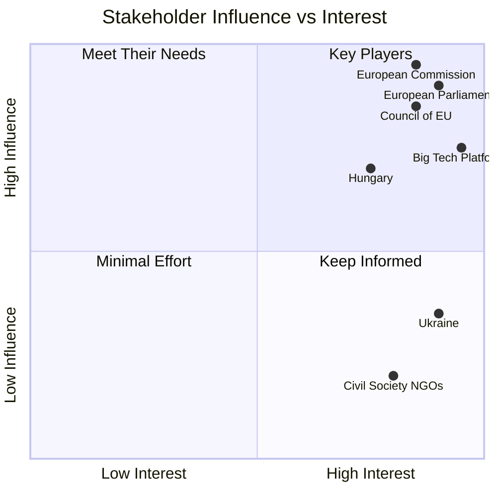
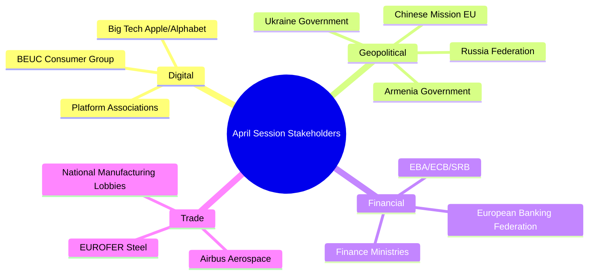

<!-- SPDX-FileCopyrightText: 2026 Hack23 AB -->
<!-- SPDX-License-Identifier: Apache-2.0 -->

# Stakeholder Map — Breaking News | 2026-05-05

**Classification:** Public | **Confidence:** 🟡 Medium | **Produced:** 2026-05-05T01:13Z
**Scope:** Key stakeholders for April 28–30 Strasbourg plenary decisions

---

## 1. Stakeholder Framework

This map identifies and analyses the principal stakeholders affected by, or influencing, the key decisions of the April 28–30 Strasbourg plenary. Stakeholders are categorised by interest alignment, influence level, and position on the three dominant issues (DMA enforcement, Russia accountability, 2027 budget).

---

## 2. Primary Institutional Stakeholders

### 2.1 European Commission (DG COMP + DG CONNECT)

**Role**: Executive enforcer of DMA; responds to Parliamentary resolutions with implementation commitments
**Power**: Very High — sole enforcement authority for DMA; sets gatekeeper investigation agendas
**Interest**: Maintain institutional autonomy while demonstrating enforcement credibility

**Position on DMA Enforcement**:
The Commission faces a dual mandate: demonstrate that EU digital regulation is effective (political need) while conducting quasi-judicial enforcement that is procedurally sound (legal need). Parliamentary pressure to accelerate enforcement timelines risks compromising procedural safeguards. Executive VP Ribera's portfolio (competition and Green Deal) must balance both.

**Interest alignment score**: 🟡 MEDIUM alignment with Parliament on enforcement goal; 🟡 MEDIUM tension on pace and method.

**Predicted response**: Commission will issue a 6-month implementation report acknowledging Parliament's resolution; will use it as political cover to escalate investigations already underway rather than fundamentally changing enforcement pace.

---

### 2.2 European Council (Member State Governments)

**Role**: Sets EU foreign policy in Foreign Affairs Council (FAC); approves EU budgets in Council
**Power**: Very High — unanimity required for many foreign policy acts; QMV for budget
**Interest**: Diverse — varies by member state

**Russia Accountability**: Council is divided. Baltic states (Estonia, Latvia, Lithuania), Poland, Czech Republic, and Nordic members fully support accountability measures. Hungary (Fidesz, PfE-aligned) blocks or dilutes. France and Germany are pro-accountability but cautious about legal architecture that creates procedural complexity.

**Budget**: Council will resist Parliament's fiscal ambitions. Net contributors (Germany, Netherlands, Austria, Sweden) demand spending discipline; net recipients (Poland, Hungary, Spain, Portugal) defend cohesion allocations.

**Key tension**: Hungary's potential veto on Russia accountability measures in Council is a structural impediment that Parliament's resolution cannot overcome — it can only amplify political pressure.

---

### 2.3 Court of Justice of the EU (CJEU)

**Role**: Ultimate arbiter of DMA enforcement legality; hears appeals from gatekeeper companies
**Power**: High — can annul Commission enforcement decisions
**Interest**: Legal certainty; proportionality of enforcement measures

**DMA stakes**: If Commission issues structural remedies following Parliament's enforcement resolution, affected companies will challenge at CJEU. Parliament's resolution creates a political record but cannot constrain CJEU's legal review. The CJEU's recent track record on digital regulation (Google Shopping, 2021) suggests deference to Commission on enforcement methods but scrutiny on proportionality.

---

## 3. Platform/Technology Stakeholders

### 3.1 Apple Inc.

**Role**: Designated DMA gatekeeper for iOS App Store, Safari browser, iMessage
**Power**: High — €400B+ global revenue; extensive EU lobbying; CJEU appeal capability
**Interest**: Minimise enforcement consequences; maintain proprietary ecosystem control

**Position**: Apple has made selective DMA compliance concessions (alternative app stores in EU) while maintaining practices that Parliament considers self-preferencing. The enforcement resolution targets App Store payment processing restrictions and browser engine mandates.

**Response prediction**: Apple will continue CJEU challenge strategy; engage in targeted lobbying of member state capitals; make visible but limited compliance gestures.

**Vulnerability**: Third-party developer coalition (European app developers, gaming companies) actively supports Commission enforcement. Apple cannot claim there is no aggrieved European party.

---

### 3.2 Alphabet (Google)

**Role**: Designated DMA gatekeeper for Google Search, Google Maps, Google Shopping, Android
**Power**: Very High — dominant search market position (90%+ EU market share); extensive lobbying
**Interest**: Maintain algorithmic preferencing; avoid interoperability mandates

**Position**: Google has challenged DMA compliance requirements in multiple jurisdictions. Parliament's resolution specifically targets "Generalised Search Input" — the practice of featuring Google AI Overviews at the top of search results, effectively displacing competitor search results.

**Response prediction**: Alphabet will argue AI-integrated search features are genuinely user-beneficial and not self-preferencing. Will engage DG COMP in technical dialogue to delay structural investigation initiation.

---

### 3.3 Social Media Platforms (Meta, X/Twitter, TikTok)

**Role**: Platforms subject to cyberbullying/online harassment liability resolution (TA-10-2026-0163)
**Power**: Medium-High — extensive user data; public opinion amplification
**Interest**: Resist criminal liability; maintain Section 230-style safe harbour analogues

**Position**: Platforms will argue that the cyberbullying resolution conflates criminal conduct (by harassers) with platform failure (inadequate moderation). Criminal liability for platforms is unprecedented in EU law and would require significant new moderation infrastructure investments.

**Response prediction**: Platforms will engage in legislative consultation process; support DSA-consistent alternatives (enhanced civil enforcement) over criminal liability models.

---

## 4. Geopolitical Stakeholders

### 4.1 Ukraine

**Role**: Primary beneficiary of Russia accountability resolution (TA-10-2026-0161)
**Power**: Medium — dependent on EU political support; cannot enforce accountability independently
**Interest**: Strongest possible accountability mechanism; maintenance of EU sanctions on Russia

**Position**: Ukrainian government fully supports Parliament's accountability demands. Zelensky administration will use Parliament's resolution in international diplomatic communications. Ukrainian MEP networks (Ukrainian diaspora communities in EU member states) amplify the political signal.

**Vulnerability**: Ukraine accountability demands depend on sustained EU political will that must be renewed through electoral cycles. Each new European national election creates potential for accountability fatigue.

---

### 4.2 Russian Federation

**Role**: Subject of accountability resolution; indirect actor in EU political dynamics
**Power**: Medium (indirect) — information operations; energy leverage; frozen assets
**Interest**: Prevent any international accountability mechanism from achieving jurisdiction

**Response prediction**: Russia will dismiss Parliament's resolution as "propaganda"; amplify narratives of EU hypocrisy (e.g., comparing Russia accountability demands to treatment of other conflict situations); continue to exploit PfE/ESN MEP networks for information operations.

---

### 4.3 Armenia

**Role**: Subject of democratic resilience resolution (TA-10-2026-0162)
**Power**: Low — dependent on EU economic and political support
**Interest**: EU association deepening; protection from Azerbaijani military pressure

**Position**: Armenian government under PM Pashinyan has explicitly moved toward EU integration post-2024 peace negotiations with Azerbaijan. Parliament's resolution provides political cover for Yerevan's EU pivot and complicates Russian pressure.

---

## 5. Economic Stakeholders

### 5.1 European Livestock Sector (COPA-COGECA)

**Role**: Agricultural lobby representing European farmers
**Power**: High — constituency of 10+ million farmers; political weight in EPP, ECR, and S&D delegations from rural constituencies
**Interest**: Economic viability; protection from disease, price competition, regulatory burden

**Position on Livestock Resolution** (TA-10-2026-0157): COPA-COGECA will welcome food security framing and any additional disease response funding. Will monitor whether resolution leads to additional regulatory requirements that increase costs.

---

### 5.2 European Investment Bank (EIB)

**Role**: EU lending arm; subject of annual control report (TA-10-2026-0119)
**Power**: High — €500B+ loan portfolio; key instrument for Green Deal and industrial transition
**Interest**: Maintain institutional autonomy; demonstrate accountability without creating excessive oversight burdens

**Position**: EIB control report likely shows positive compliance assessment. Parliament uses it as accountability mechanism rather than punitive tool. 2024 report covers EIB Group's climate transition lending acceleration.

---

### 5.3 European Budget Net Contributors (Germany, Netherlands, Austria, Sweden)

**Role**: Key players in 2027 budget negotiations
**Power**: Very High — can block Council budget approval
**Interest**: Fiscal discipline; value for money; reduce EU administrative costs

**Position on Budget Guidelines**: These member states will resist Parliament's high-ambition guidelines. They will push Council mandate toward lower overall ceiling with stricter conditionality.

**Germany's structural weakness** (GDP −0.50% in 2024) makes Berlin's fiscal conservatism politically necessary domestically while simultaneously reducing its budget contribution capacity.

---

## 6. Civil Society Stakeholders

### 6.1 Digital Rights Organisations (EDRi, BEUC)

**Role**: Advocate for platform accountability and user rights
**Power**: Medium — expert testimony; public advocacy; litigation
**Interest**: Strong DMA enforcement; criminal platform liability for harassment

**Position**: EDRi will fully support Parliament's DMA enforcement resolution and cyberbullying liability push. These organisations will monitor Commission implementation and bring strategic litigation in national courts under DSA/DMA provisions.

---

### 6.2 Ukrainian Civil Society and Diaspora Networks

**Role**: Amplify accountability demands; provide victim testimony
**Power**: Medium — 6+ million Ukrainians in EU; diaspora political networks
**Interest**: Maximum accountability; continued EU support; safe refugee status

**Position**: Will use Parliament's resolution to press for national-level criminal proceedings in EU member states against Russian officials under universal jurisdiction.

---

### 6.3 Armenian Diaspora (France, Russia, US)

**Role**: Political constituency for Armenia democracy support
**Power**: Medium — French Armenian community (400,000+) has political influence in French domestic politics
**Interest**: EU protection for Armenian sovereignty; association agreement advancement

---

## 7. Stakeholder Power-Interest Matrix

```
HIGH INTEREST, HIGH POWER:
- European Commission (DG COMP/CONNECT)  [DMA enforcement]
- European Council                        [Budget + Russia]
- Apple/Alphabet                          [DMA enforcement]
- Ukraine                                 [Russia accountability]

HIGH INTEREST, MEDIUM POWER:
- Meta/X/TikTok                          [Cyberbullying]
- COPA-COGECA                            [Livestock]
- EDRi/BEUC                              [Digital rights]

HIGH INTEREST, LOW POWER:
- Armenian government                    [Democracy support]
- Ukrainian diaspora                     [Accountability]
- Rural European farmers                 [Livestock]

LOW INTEREST, HIGH POWER:
- CJEU                                   [Legal review only]
- EIB                                    [Control report]
```

---

## 8. Stakeholder Influence Pathways

| Decision | Primary Influence Pathway | Expected Outcome |
|----------|--------------------------|------------------|
| DMA enforcement | Commission enforcement agenda | Investigation acceleration (90 days) |
| Russia accountability | FAC diplomatic channels | Resolution endorsement with caveats |
| 2027 Budget | Inter-institutional trilogue | Parliament ambitions partially met |
| Cyberbullying | Article 83 TFEU directive process | 18-month legislative timeline |
| Armenia democracy | EU-Armenia association process | Association upgrade in 2027 |

---

*Sources: EP MCP tools, EP adopted texts feed, political landscape data. Stakeholder power assessments based on structural analysis. Produced: 2026-05-05.*

---

## 9. Stakeholder Engagement Forecast (6-Month Horizon)

### Institutional Stakeholders — Expected Actions

| Stakeholder | Next Action | Timeline | Signal to Watch |
|-------------|-------------|----------|----------------|
| Commission (DG COMP) | Formal DMA investigation communication | 60–90 days | Commission press release with investigation reference number |
| Commission (DG CONNECT) | Progress report to Parliament on DMA gatekeeper obligations | 90–120 days | IMCO committee hearing invitation |
| Council (FAC) | Conclusions on Russia accountability | 4–8 weeks | FAC agenda items for June 2026 |
| CJEU | DMA case management | Ongoing | New case filings; interim measure applications |
| EIB | Response to annual control report | 30 days | EIB press statement; President's letter to Parliament |

### Platform Stakeholders — Expected Actions

| Stakeholder | Next Action | Timeline | Signal to Watch |
|-------------|-------------|----------|----------------|
| Apple | DMA compliance update | Quarterly | App Store transparency report; developer communications |
| Alphabet | CJEU General Court filing | Within 60 days | CJEU case register update |
| Meta | DSA/DMA compliance audit | Quarterly | Meta Transparency Center update |
| TikTok | DSA risk assessment submission | By June 2026 | TikTok/DSC communication |

### Geopolitical Stakeholders — Expected Actions

| Stakeholder | Next Action | Timeline | Signal to Watch |
|-------------|-------------|----------|----------------|
| Ukraine | Diplomatic leverage of EP resolution | Immediate | Zelensky office statement; UN General Assembly citation |
| Armenia | Association agreement negotiation advance | 3–6 months | EU-Armenia association negotiation round announced |
| Russia | Information operation response | Immediate | RT, Sputnik coverage of EP vote; disinformation narrative launch |

---

## 10. Stakeholder Coalition Map — April 2026 Decisions

### DMA Enforcement Stakeholder Coalition

**Pro-enforcement coalition**: Commission (political mandate), civil society (EDRi, BEUC), European developer community, consumer protection agencies, small business associations (competing with platform-preferred services)

**Anti-enforcement coalition**: Apple, Alphabet, Invest Europe (venture capital), US government trade representatives, some member state trade ministries (concerned about transatlantic relations)

**Swing stakeholders**: Business groups with mixed interests (digital-first companies benefit from enforcement; US-linked companies opposed); national data protection authorities (support enforcement but jurisdiction questions)

### Russia Accountability Stakeholder Coalition

**Pro-accountability coalition**: Parliament (overwhelming majority), Council (most member states), ICC, international law NGOs, Ukrainian civil society, Baltic/Nordic governments, Polish government, Dutch government

**Anti-accountability coalition**: Russia, Hungary, certain ECR/PfE MEPs, businesses with Russia exposure

**Swing stakeholders**: France, Germany (strong accountability rhetoric but cautious on specific mechanisms), Hungary-linked business networks

### 2027 Budget Stakeholder Coalition

**Pro-Parliament-position coalition**: S&D (social spending), Greens (climate finance), Left (cohesion), net recipients (Poland, Hungary on cohesion; Spain, Portugal, Italy on regional funds)

**Anti-Parliament-position coalition**: EPP austerity wing, net contributors (Netherlands, Austria, Sweden, Finland on fiscal discipline), Council unanimity requirement gives fiscal conservatives structural power

**Swing stakeholders**: Germany (weakened by recession; internally divided); EPP Southern members (want investment but constrained by Northern EPP)

---

## 11. Stakeholder Intelligence Gaps

| Gap | Data Needed | Source |
|-----|-------------|--------|
| Apple lobbying spend in Q1 2026 | €M lobbying expenditure | EU Transparency Register |
| Hungarian government private position on accountability | Diplomatic signal vs. public statement | Diplomatic reporting |
| ECR internal vote on Russia accountability | Group discipline data | Roll-call data (available ~June 2026) |
| Armenian government formal EU association request | Official diplomatic communication | EC External Action Service communications |
| DG COMP staffing for DMA enforcement | Investigator headcount | ECA report or Commission annual management plan |

These intelligence gaps represent the primary areas where additional data collection would most improve stakeholder analysis quality in the next breaking news run covering these dossiers.


## Stakeholder Influence-Interest Map



**Admiralty Code**: B2

---

## Re-run Extension — Additional Stakeholders Identified (2026-05-05T13:03Z)

The second data collection pass identified additional key stakeholders for TA-10-2026-0149 (Trade Defence) and TA-10-2026-0152 (China) and TA-10-2026-0159 (Banking Union):

### China-Facing Trade Policy Stakeholders

| Stakeholder | Role | Interest | Influence | EP Access |
|-------------|------|----------|:---------:|:---------:|
| Chinese Mission to EU | Diplomatic | Counter EP condemnation resolutions | HIGH | INDIRECT |
| Airbus / European aerospace lobby | Industrial | Trade defence for high-tech manufacturing | HIGH | DIRECT |
| European Steel Association (EUROFER) | Industrial | Anti-dumping enforcement against Chinese steel | HIGH | DIRECT |
| National governments (FR/DE/IT) | Political | Manufacturing protection + China relations | HIGH | INDIRECT (Council) |
| EP-China Friendship Group | Parliamentary | Moderate tone in China resolutions | MEDIUM | DIRECT (plenary) |

### Banking Union Stakeholders

| Stakeholder | Role | Interest | Influence |
|-------------|------|----------|:---------:|
| European Banking Authority (EBA) | Regulatory | BRRD3 implementation oversight | HIGH |
| SSM (ECB banking supervision) | Regulatory | Single supervisory mechanism authority | HIGH |
| SRB (Single Resolution Board) | Resolution | Resolution fund management | HIGH |
| EU banking associations (EBF) | Industry | Limit BRRD3 operational burden | HIGH |

### Updated Stakeholder Intelligence Map



**Admiralty Code**: B2
