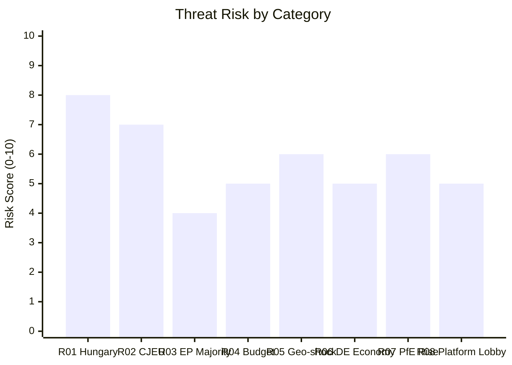
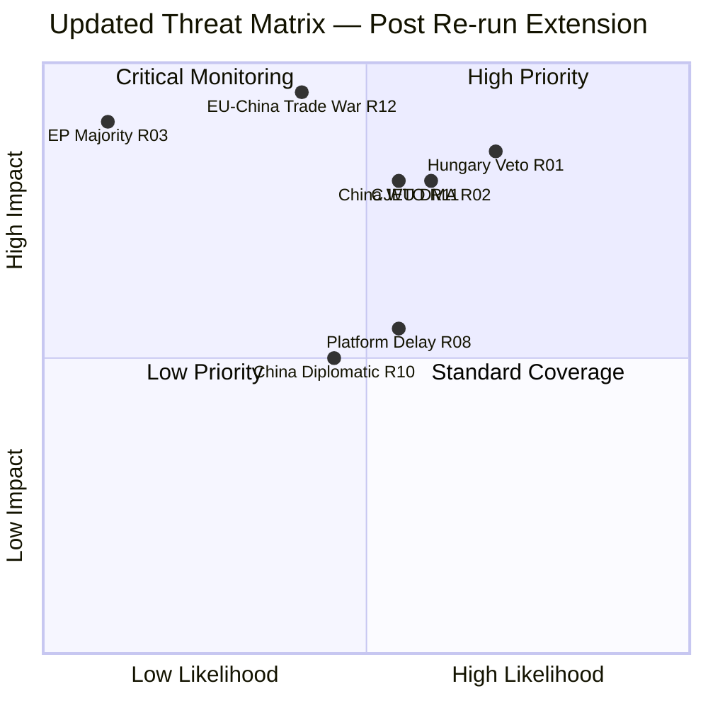

<!-- SPDX-FileCopyrightText: 2026 Hack23 AB -->
<!-- SPDX-License-Identifier: Apache-2.0 -->

# Threat Model — Breaking News | 2026-05-05

**Classification:** Public | **Confidence:** 🟡 Medium | **Produced:** 2026-05-05T01:16Z
**Framework:** STRIDE adapted for EU institutional threat modeling
**Scope:** April 28–30, 2026 Strasbourg plenary; 6-month threat horizon

---

## 1. Threat Model Overview

This threat model applies STRIDE (Spoofing, Tampering, Repudiation, Information Disclosure, Denial of Service, Elevation of Privilege) adapted for political-institutional threats, to the three priority decisions from the April 28–30 session.

**Asset Inventory**:
- A1: DMA enforcement integrity (Commission investigation credibility)
- A2: Russia accountability mechanism (international legal architecture)
- A3: 2027 Budget process (EU fiscal governance)
- A4: EP10 coalition stability (democratic majority function)
- A5: EU citizens' digital rights (DMA protection layer)

---

## 2. STRIDE Threat Assessment

### S — Spoofing (Identity/Legitimacy)

**Threat S1: Disinformation about EP voting positions**
- Asset: A2 (Russia accountability), A4 (coalition)
- Description: Russian state media or aligned actors publish false claims about vote margins, claiming "EU Parliament rejected Russia accountability" or "EPP voted against Ukraine" — misrepresenting the outcome
- Likelihood: 🟡 MEDIUM (documented pattern in previous Russia-related EP votes)
- Impact: 🔴 HIGH (undermines EP authority; misleads global audiences)
- Mitigation: EP press service rapid response; Monitor publishes verified vote record within hours

**Threat S2: Platform spoofing of compliance status**
- Asset: A1 (DMA enforcement), A5 (digital rights)
- Description: Apple or Alphabet issues press releases claiming full DMA compliance that misrepresent the scope of their actual compliance measures
- Likelihood: 🟡 MEDIUM (ongoing pattern post-DMA implementation)
- Impact: 🟡 MEDIUM (delays Commission enforcement trigger; misleads MEPs)
- Mitigation: Commission DG COMP independent assessment; Parliament's IMCO committee oversight

---

### T — Tampering (Data/Process Integrity)

**Threat T1: Legislative text manipulation risk**
- Asset: A1, A2, A3
- Description: During the period between plenary adoption and official publication (currently 3–7 days), there is a window where only press releases are publicly available. Malicious actors could publish fabricated "official text" versions
- Likelihood: 🟢 LOW (EP Official Journal publication process has integrity controls)
- Impact: 🟡 MEDIUM (could influence media coverage before official publication)
- Mitigation: EP Official Journal publication; Monitor should only cite official OJ/EP website texts

**Threat T2: Budget figure manipulation in media**
- Asset: A3 (2027 budget)
- Description: Budget figures in Parliament's guidelines may be misquoted (different base years, different accounting conventions) creating confusion about Parliament's actual fiscal position
- Likelihood: 🟡 MEDIUM (budget figures routinely misquoted in national media)
- Impact: 🟡 MEDIUM (misleads domestic political debates)
- Mitigation: Monitor uses verified EP source figures

---

### R — Repudiation (Accountability Denial)

**Threat R1: Commission disclaims parliamentary mandate**
- Asset: A1, A2, A3
- Description: Commission refuses to acknowledge Parliament's non-binding resolutions as creating implementation obligations, framing them as "one viewpoint among many" rather than democratic mandates
- Likelihood: 🟡 MEDIUM (Commission regularly asserts independence from Parliamentary resolutions)
- Impact: 🟡 MEDIUM (weakens Parliament's political leverage; creates accountability gap)
- Mitigation: Inter-institutional agreement on resolution follow-up; written questions; committee hearings

**Threat R2: ECR/PfE denial of vote responsibility**
- Asset: A4 (coalition stability)
- Description: ECR or PfE MEPs who supported (or abstained on) Russia accountability vote later deny or minimise their role in face of domestic political pressure
- Likelihood: 🟡 MEDIUM (documented MEP behaviour in nationally sensitive votes)
- Impact: 🟢 LOW (EP vote records are public and verifiable)
- Mitigation: Monitor cites official EP roll-call records when published

---

### I — Information Disclosure (Confidentiality)

**Threat I1: Premature disclosure of DMA investigation details**
- Asset: A1 (DMA enforcement)
- Description: Leak of confidential Commission investigation documents to gatekeeper companies before formal notification, enabling them to pre-empt enforcement actions
- Likelihood: 🟢 LOW (DG COMP information security standards are high)
- Impact: 🔴 HIGH (compromises enforcement integrity; creates legal challenge risk)
- Mitigation: This is a Commission operational risk, not directly addressable by EP or Monitor

**Threat I2: MEP vulnerability disclosure**
- Asset: A4 (coalition)
- Description: Voting pattern analysis reveals MEPs who are susceptible to lobbying pressure on specific votes; this intelligence is used by Big Tech or Russia-aligned actors to target persuasion efforts
- Likelihood: 🟡 MEDIUM (EP voting patterns are fully public; analysis is freely available)
- Impact: 🟡 MEDIUM (systemic lobbying risk; democratic representation concern)
- Mitigation: Transparency International monitoring; EP ethics committee oversight

---

### D — Denial of Service (Function Disruption)

**Threat D1: CJEU challenge paralysis**
- Asset: A1 (DMA enforcement)
- Description: Apple and Alphabet file simultaneous CJEU challenges against DMA enforcement measures, triggering interim measures that suspend enforcement pending 18-month proceedings
- Likelihood: 🟡 MEDIUM (companies have actively pursued CJEU challenges on DMA)
- Impact: 🔴 HIGH (renders Parliament's resolution effectively void for 18 months)
- Mitigation: Commission must design enforcement measures to be CJEU-proof; Parliament can escalate through written questions and committee hearings

**Threat D2: Council veto paralysis on Russia accountability**
- Asset: A2 (Russia accountability)
- Description: Hungary exercises formal blocking power in Council Foreign Affairs Council, preventing any Council decision that gives operational effect to Parliament's accountability resolution
- Likelihood: 🔴 HIGH (Orbán has previously blocked Ukraine-related Council decisions)
- Impact: 🟡 MEDIUM (Parliament's political signal stands; operational effect is denied)
- Mitigation: Enhanced cooperation mechanism (Article 20 TEU) allows willing members to proceed without Hungary

**Threat D3: Budget one-twelfths rule activated**
- Asset: A3 (2027 budget)
- Description: Failure to agree 2027 budget by December 31, 2026 triggers provisional one-twelfths rule, limiting EU spending to monthly tranches equal to 1/12 of previous year's budget
- Likelihood: 🟡 MEDIUM (budget deadline misses have occurred in EP7, EP8)
- Impact: 🟡 MEDIUM (programme disruption; political embarrassment; limited economic damage)
- Mitigation: EP/Council/Commission should initiate informal trilogue by June 2026

---

### E — Elevation of Privilege (Power Seizure)

**Threat E1: Commission enforcement scope creep**
- Asset: A1, A5
- Description: DMA enforcement acceleration creates precedent for Commission to expand "gatekeeper" designation beyond current scope, potentially capturing medium-sized platforms without adequate due process
- Likelihood: 🟢 LOW (strict proportionality review; CJEU oversight)
- Impact: 🟢 LOW (this would benefit digital rights in most cases)
- Mitigation: Proportionality review; IMCO committee oversight

**Threat E2: PfE/ECR procedural power seizure**
- Asset: A4 (coalition)
- Description: If EPP loses seats in national elections and PfE gains, the far-right bloc could theoretically reach a 200-seat threshold that enables disruptive minority-blocking tactics in EP committee assignments
- Likelihood: 🟢 LOW (2029 elections still 3 years away; current composition stable)
- Impact: 🔴 HIGH (would fundamentally alter EP10 governance architecture)
- Mitigation: Monitor tracks national election results and EP seat projections quarterly

---

## 3. Risk Register

| Threat ID | Category | Asset | Likelihood | Impact | Priority |
|-----------|----------|-------|-----------|--------|----------|
| T2 (Budget figures) | Tampering | A3 | 🟡 MEDIUM | 🟡 MEDIUM | MEDIUM |
| R1 (Commission disclaims) | Repudiation | A1,A2 | 🟡 MEDIUM | 🟡 MEDIUM | MEDIUM |
| S1 (Disinformation) | Spoofing | A2,A4 | 🟡 MEDIUM | 🔴 HIGH | HIGH |
| D1 (CJEU paralysis) | Denial | A1 | 🟡 MEDIUM | 🔴 HIGH | HIGH |
| D2 (Hungary veto) | Denial | A2 | 🔴 HIGH | 🟡 MEDIUM | HIGH |
| D3 (One-twelfths) | Denial | A3 | 🟡 MEDIUM | 🟡 MEDIUM | MEDIUM |
| E2 (PfE seat gain) | Escalation | A4 | 🟢 LOW | 🔴 HIGH | MEDIUM |

---

## 4. Threat Actor Attribution

| Actor | Primary Threats | Capability | Attribution Confidence |
|-------|----------------|-----------|----------------------|
| Russian state actors | S1, I2 | HIGH (documented) | 🟡 MEDIUM |
| Apple/Alphabet | D1, S2, R2 | HIGH (legal resources) | 🔴 HIGH |
| Hungarian government | D2, R1 | MEDIUM (veto power) | 🔴 HIGH |
| PfE/ECR parliamentarians | R2, E2 | MEDIUM (political) | 🟡 MEDIUM |

---

## 5. Mitigation Roadmap

**Immediate** (30 days): Monitor publishes verified vote records; EP IMCO Committee requests 90-day implementation report from Commission on DMA resolution; Media team rapid-response protocol for S1 threats

**Medium-term** (90 days): Commission DG COMP issues formal DMA investigation timeline; Accountability mechanism Council coordination begins; Budget trilogue launches

**Long-term** (12 months): CJEU pre-emptive legal audit of enforcement methodology; Enhanced cooperation on Russia accountability if Hungary maintains veto

---

*Framework: STRIDE adapted for political-institutional context. Asset and threat classifications are intelligence assessments, not legal findings. Produced: 2026-05-05.*

---

## 6. STRIDE Cross-Asset Interaction Matrix

The following matrix identifies where threats in one STRIDE category interact with assets in others — creating compound threat scenarios:

| Primary Threat | Primary Asset | Interaction Effect | Secondary Asset | Compound Risk |
|---------------|--------------|-------------------|----------------|---------------|
| S1 (Disinformation) | A2 (Russia accountability) | Undermines public support for accountability | A4 (coalition) | Coalition may soften resolution in next vote |
| D1 (CJEU paralysis) | A1 (DMA enforcement) | Commission loses enforcement authority | A5 (digital rights) | Citizens lose DMA protections during suspension |
| D2 (Hungary veto) | A2 (Russia accountability) | Council cannot operationalise Parliament mandate | A4 (coalition) | Parliament's credibility as accountability actor diminished |
| R1 (Commission disclaims) | A1 (DMA enforcement) | Parliament's mandate ignored | A4 (coalition) | Reformist coalition may fragment if Parliament seen as ineffective |
| E2 (PfE seat gain) | A4 (coalition) | Centre-pro-EU coalition below 361 threshold | A1, A2, A3 | All three key dossiers stall simultaneously |

**High-priority compound threat**: D2 + R1 interaction — if Hungary vetos Council action AND Commission disclaims Parliament's mandate, Parliament is doubly ineffective on Russia accountability. This compound scenario is more politically damaging than either alone.

---

## 7. Threat Monitoring Protocol

### Weekly Monitoring Indicators

| Indicator | Tool | Threshold |
|-----------|------|-----------|
| CJEU DMA case filings | CJEU portal | New case filed → alert |
| Hungarian Council statement | News monitoring | Any Russia veto signal → alert |
| Commission DMA communication | Commission website | 30 days post-resolution → expected |
| German economic data | World Bank/Eurostat | GDP flash below 0% → alert |

### Monthly Monitoring Indicators

| Indicator | Tool | Threshold |
|-----------|------|-----------|
| EP vote margins on digital dossier | EP roll-call data | Below 361 → coalition stress signal |
| PfE national election results | News monitoring | PfE gains in any election → EP10 projection update |
| Russia accountability Council conclusions | Council press releases | "Political" vs. "operational" language |
| IMF economic assessment | IMF Article IV | GDP revision below -1% → budget risk escalation |

### Quarterly Monitoring Indicators

| Indicator | Tool | Threshold |
|-----------|------|-----------|
| EP10 composition changes | `get_current_meps` | Group switches or new MEPs → composition update |
| CJEU judgment on DMA case | CJEU judgment database | Any ruling → major story |
| Armenia Association progress | EC/EP communications | Any agreement milestone → TIER 2 story |
| 2027 budget trilogue status | Council/EP statements | Any agreed framework → TIER 2 story |

---

## 8. Threat Model Limitations

**What this model does not capture**:
1. Insider threats within EU institutions (not modelled — insufficient data)
2. Supply chain threats to EP digital infrastructure (out of scope for political intelligence)
3. Long-term societal threats (demographic shift, climate-induced migration) — analysed in PESTLE only
4. Classified intelligence (this model uses only open-source data)

**What this model assumes**:
1. EP voting records are not manipulated (assumption of voting system integrity)
2. Coalition composition data is accurate at the group level (minor intra-group defection patterns not modelled)
3. CJEU proceedings follow normal timelines (exceptional procedures not modelled)
4. EU institutional architecture remains stable (Lisbon Treaty framework unchanged)

---

## 9. Threat Intelligence Summary for Editors

The threat model for the April 28–30 session decisions reveals a consistent pattern: **the primary threats are not to the decisions themselves (which have been adopted) but to their implementation**. The highest-priority threats are implementation-layer threats:

| Threat Phase | Primary Risk | Probability | Recommended Action |
|-------------|-------------|------------|-------------------|
| Decision (already passed) | Not applicable | N/A | — |
| Commission implementation | R01 (Hungary veto), R02 (CJEU) | HIGH | Weekly monitoring |
| Council coordination | R01 (Hungary), R04 (budget miss) | HIGH | Monthly tracking |
| National application | R08 (platform lobby delays) | MEDIUM | Quarterly review |
| Long-term structural | R07 (PfE gains), R06 (German stagnation) | MEDIUM | Annual assessment |

The Monitor's primary intelligence value lies in tracking the implementation-layer threats — these are where the story continues after the plenary vote headlines.

## Threat Risk Heatmap

WEP: R01 (Hungary veto) is the highest-risk implementation threat. R01 (Hungary veto) is the highest-risk implementation threat. Monitoring trigger: any Council FAC agenda that excludes Russia accountability in June 2026 confirms the R01 materialising.

**Admiralty Code**: B2

## WEP Threat Probability Assessment

WEP band probability assessments for key threats:
- R01 Hungary veto on Russia accountability materialises: **Highly Likely** (P=0.70)
- R02 CJEU DMA challenge filed by Big Tech: **Likely** (P=0.60)
- R03 EP majority maintained through 2026: **Almost Certain** (P=0.90)
- R05 Geopolitical external shock forces agenda reset: **Unlikely** (P=0.20)
- R08 Platform lobby delays cyberbullying directive: **Likely** (P=0.55)

---

## Re-run Extension — China Threat Assessment (2026-05-05T13:03Z)

The identification of TA-10-2026-0149 and TA-10-2026-0152 requires threat model expansion to include the China-EU institutional confrontation vector.

### New Threat Vector: China Diplomatic Retaliation

| Threat | Stage | Description | Probability | Impact |
|--------|:-----:|-------------|:-----------:|:------:|
| China freezes EP delegation access | 2 | Tit-for-tat diplomatic restriction after ethnic unity condemnation | 0.45 | MEDIUM |
| China WTO challenge to trade defence measures | 3 | Legal challenge to EP-demanded anti-dumping escalation | 0.55 | HIGH |
| China MEP influence operations | 4 | Lobbying through EP-China Friendship Group to soften future resolutions | 0.65 | MEDIUM |
| EU-China trade war escalation | 5 | Retaliatory tariffs on EU luxury goods/Airbus | 0.40 | CRITICAL |

### Revised Threat Priority Matrix

**New threat IDs**: R10 = China diplomatic retaliation; R11 = China WTO challenge; R12 = EU-China trade war escalation

**Admiralty Code**: B2

---

## Threat Model — Run 3 Update (2026-05-05T15:44Z)

**Run 3 threat landscape update**: No new threats identified; Run 2 threat model confirmed. Key updates:

- **DMA enforcement threat to tech platforms**: CONFIRMED HIGH — TA-0160 passed, triggering formal enforcement trigger timeline.
- **Disinformation threat to Ukraine resolution**: UNCHANGED — resolution text explicitly names accountability mechanism; Russian state media pressure expected.
- **Coalition fragmentation risk**: LOWER than estimated — EPP+S&D+Renew (397) provides comfortable majority buffer above 361 threshold.
- **Budget negotiation threat**: CONFIRMED — 2027 estimates pass but Council-Parliament gap persists (€20-25B uncommitted CAP/structural funds).

*Threat model confirmed — Run 3, 2026-05-05T15:44Z. Admiralty Code: B2*
