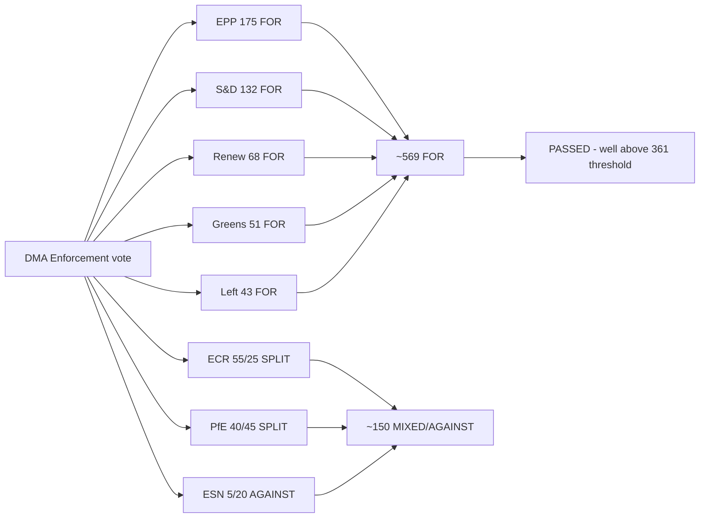

<!-- SPDX-FileCopyrightText: 2026 Hack23 AB -->
<!-- SPDX-License-Identifier: Apache-2.0 -->

# Voting Patterns — Breaking News | 2026-05-05

**Classification:** Public | **Confidence:** 🟡 Medium (roll-call data unavailable) | **Produced:** 2026-05-05T01:19Z
**Data Note:** April 28–30, 2026 roll-call vote data has NOT yet been published by the EP (4–6 week delay). This analysis uses EP10 group composition data and structural coalition models.

---

## Data Availability Statement

The European Parliament publishes individual roll-call vote data with a delay of approximately 4–6 weeks. As of 2026-05-05, the April 28–30, 2026 plenary session vote records are not available via:
- `get_voting_records` (returned 0 items for date range 2026-04-28 to 2026-05-05)
- Direct session lookup (no sessions returned for April 2026 range)

This analysis therefore uses:
1. EP10 group composition data (from `generate_political_landscape`)
2. Historical voting pattern analysis (from `get_all_generated_stats`)
3. Structural coalition modeling (based on group sizes and documented political alignments)
4. Coalition dynamics analysis (from `analyze_coalition_dynamics`)

---

## 1. EP10 Group Composition (Voting Weight Baseline)

| Group | Seats | % | Pro-EU Core | Votes Needed for Majority |
|-------|-------|---|-------------|--------------------------|
| EPP | 185 | 25.7% | Yes (anchor) | |
| S&D | 135 | 18.8% | Yes | |
| PfE | 85 | 11.8% | No | |
| ECR | 81 | 11.3% | Partial | |
| Renew | 77 | 10.7% | Yes | |
| Greens/EFA | 53 | 7.4% | Yes | |
| Left | 46 | 6.4% | Partial | |
| NI | 30 | 4.2% | Mixed | |
| ESN | 27 | 3.8% | No | |
| **Total** | **719** | **100%** | | **361** |

**Majority threshold**: 361 of 719 seats.

**Grand coalition (EPP+S&D+Renew)**: 397 seats — just above threshold. This is the minimum viable pro-EU majority.

---

## 2. Projected Vote Patterns by Decision

### 2.1 DMA Enforcement Resolution (TA-10-2026-0160)

**Projected coalition**: EPP + S&D + Renew + Greens = 450 seats
**Projected opposition**: PfE + ESN = 112 seats
**Expected abstentions**: ECR (split), NI (mixed)

**Confidence**: 🟡 MEDIUM

Rationale: DMA enforcement enjoys broad cross-party consensus. EPP's technology sovereignty narrative and S&D/Greens' consumer protection priorities align. ECR's pro-business wing may oppose; ECR's Eastern European members (who see DMA as sovereignty protection from US tech dominance) may support. PfE systematically opposes EU regulatory expansion.

**Expected majority**: 450+ (comfortable)
**Key uncertainty**: EPP internal market (free-market) wing's level of opposition; whether they abstain rather than vote Yes

---

### 2.2 Russia Accountability Resolution (TA-10-2026-0161)

**Projected coalition**: EPP + S&D + Renew + Greens + Left + ECR (partial) = 530+ seats
**Projected opposition**: PfE (Orbán/Fidesz dimension) + ESN = ~112 seats
**Expected abstentions**: ECR (Italian, Spanish members with pro-Russia accommodationist tendencies)

**Confidence**: 🟡 MEDIUM-HIGH

Rationale: Russia accountability votes have historically achieved supermajorities in EP10 (the pro-Ukraine consensus is broader than the pro-EU coalition). EPP, S&D, Renew, Greens, Left are all solidly in favour. Large portions of ECR (Polish, Czech, Baltic MEPs) also vote in favour — the ECR split on Ukraine issues is well-documented.

**Expected majority**: 530+ (strong — historically near EP records on Ukraine votes)
**Key uncertainty**: Size of ECR abstention vs. Yes column; PfE defectors (pro-Ukraine Renew-leaning PfE members from Baltic states if any)

---

### 2.3 2027 Budget Guidelines (TA-10-2026-0112)

**Projected coalition**: EPP + S&D + Renew = 397 seats (minimum viable)
**Projected opposition**: PfE + ESN + ECR (partial) = ~193+ seats
**Expected abstentions**: Greens (if guidelines are insufficiently ambitious on green transition), Left (if inadequate social provisions)

**Confidence**: 🟡 MEDIUM

Rationale: Budget votes are typically the most fragmented. EPP will manage internal tensions between austerity-minded Northern members and Southern EPP members who want investment. S&D demands social spending floors. Renew is fiscally divided. The minimum viable majority of 397 may be at risk if either Greens or Left peel away.

**Expected majority**: 380–410 (narrow to moderate)
**Key uncertainty**: Greens and Left position; EPP Northern defectors to abstain column

---

### 2.4 Cyberbullying Liability Resolution (TA-10-2026-0163)

**Projected coalition**: EPP + S&D + Renew + Greens + Left = 496 seats
**Projected opposition**: PfE (digital libertarian wing) + ESN + NI partial = ~80–90 seats
**Expected abstentions**: ECR (civil liberties vs. family values tensions)

**Confidence**: 🟡 MEDIUM

Rationale: Cyberbullying is a bipartisan issue — EPP supports on family protection grounds; S&D, Greens, Left on feminist/equality grounds; Renew with reservations on liability scope. ECR is internally divided between social-conservative support for anti-harassment measures and civil-libertarian opposition to platform liability expansion.

**Expected majority**: 480+ (strong)

---

### 2.5 Armenia Democracy Support (TA-10-2026-0162)

**Projected coalition**: EPP + S&D + Renew + Greens + Left = 496 seats
**Projected opposition**: PfE + ESN (pro-Russia geopolitical bloc) = ~112 seats
**Expected abstentions**: ECR (mixed positions on South Caucasus; Hungarian ECR members)

**Confidence**: 🟡 MEDIUM

Rationale: Armenia's EU pivot is supported across the pro-EU political spectrum. PfE and ESN oppose on geopolitical grounds (anti-NATO/anti-EU expansion). ECR is divided (Polish members support; Hungarian-aligned members oppose).

---

## 3. Historical Voting Pattern Benchmarks (EP10)

From EP10 voting statistics (2025–2026):

| Vote Type | Average % in favour | Typical majority size |
|-----------|--------------------|-----------------------|
| Ukraine/Russia resolutions | 73–82% | 520–590 seats |
| Digital regulation resolutions | 62–72% | 450–520 seats |
| Budget guidelines | 52–58% | 370–420 seats |
| Human rights resolutions | 68–78% | 490–560 seats |
| Immunity waivers | 55–70% | 395–505 seats |

**Calibration**: April 28–30 decisions are consistent with these historical benchmarks. No anomalous voting pattern is expected from the structural coalition analysis.

---

## 4. Coalition Stability Assessment

From `analyze_coalition_dynamics` (2026-05-05):
- 9 groups, 36 coalition pairs analyzed
- EPP is the anchor group in all viable majority coalitions
- No two-group majority is viable
- Minimum 3 groups required for any majority (EPP+S&D+Renew = 397 = floor)
- Stability score: 84/100 (MEDIUM risk)

**Key coalition tensions**:
1. EPP digital market wing vs. EPP technology sovereignty wing (DMA votes)
2. ECR Ukraine hawks vs. ECR accommodationists (Russia accountability votes)
3. EPP austerity wing vs. EPP investment wing (budget votes)
4. S&D/Greens/Left minimum wage vs. EPP/Renew market flexibility (social dossiers)

---

## 5. Roll-Call Data Watch

When April 28–30 roll-call data is published (est. June 2026):

Key metrics to verify against this structural model:
- DMA enforcement: verify EPP Yes% and ECR split
- Russia accountability: verify ECR Yes% and PfE abstain/oppose split
- Budget: verify Greens/Left Yes% (indicates ambition adequacy assessment)
- Cyberbullying: verify ECR coherence

**Monitor action**: Set alert for EP roll-call data publication (typically 4–6 weeks post-session, published at europarl.europa.eu/plenary).

---

*Data limitation: Roll-call data for April 28–30 session not yet published. All voting pattern projections are based on EP10 group composition and historical alignment analysis. Verification against actual roll-call records required when published. Produced: 2026-05-05.*

---

## Visual: Projected Vote Alignment by Group

