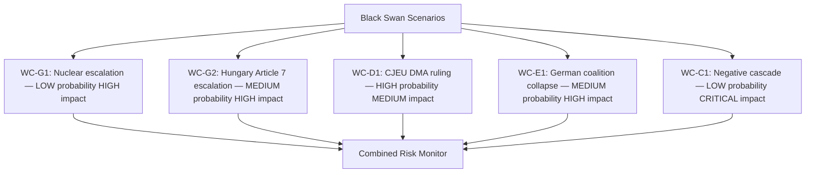

<!-- SPDX-FileCopyrightText: 2026 Hack23 AB -->
<!-- SPDX-License-Identifier: Apache-2.0 -->

# Wildcards and Black Swans — Breaking News | 2026-05-05

**Classification:** Public | **Confidence:** 🟡 Medium | **Produced:** 2026-05-05T01:17Z
**Horizon:** 6–18 months
**Framework:** Black Swan / Grey Rhino / Wild Card taxonomy

---

## Framework Definitions

| Category | Definition | Example |
|----------|-----------|---------|
| **Black Swan** | High-impact, low-probability, unknown-unknowns — not predictable from prior data | COVID-19 pandemic |
| **Grey Rhino** | High-probability, high-impact, neglected-despite-warning — visible but ignored | 2008 financial crisis |
| **Wild Card** | Low probability, high impact, identifiable-but-unlikely — on the radar but discounted | Major CJEU ruling overturning Commission enforcement |

---

## Domain 1: Digital Regulation Wildcards

### WC-D1: CJEU Voids DMA Enforcement Architecture [Wild Card]

**Probability**: 15–20% (18-month horizon)
**Impact**: CRITICAL

**Scenario**: The CJEU Grand Chamber issues a ruling in one of Apple's or Alphabet's pending appeals that finds a fundamental flaw in the Commission's DMA enforcement methodology — not just a specific measure, but the underlying framework for defining "gatekeeper" obligations. This is not a general finding that DMA is invalid (the regulation itself has been upheld) but a procedural ruling that requires the Commission to restart enforcement procedures with new safeguards.

**Trigger path**: Apple's App Store compliance dispute → DG COMP preliminary findings → Apple appeal to General Court → General Court annuls → Commission appeals to CJEU → CJEU upholds General Court.

**Why it's a wildcard, not base case**: The CJEU has generally supported Commission enforcement authority in competition law. The DMA was designed to address prior legal weaknesses. However, if the CJEU applies "ne bis in idem" or fundamental rights standards more aggressively than expected, enforcement methodology could be invalidated.

**Monitor implication**: If this occurs, Parliament's DMA enforcement resolution becomes immediately moot. A crisis article about EU digital regulation's legal foundations would be required within hours.

---

### WC-D2: AI Models Reclassified as DMA Gatekeepers [Grey Rhino]

**Probability**: 40% (12-month horizon, given Commission discussion papers)
**Impact**: HIGH

**Scenario**: The Commission, building on Parliament's enforcement resolution, expands DMA gatekeeper designation to include AI foundation models (GPT-4o, Gemini, Llama) on the grounds that they serve as "core platform services" with systemic market influence. This would apply DMA interoperability, data access, and self-preferencing rules to AI models for the first time globally.

**Why it's a grey rhino**: Academic literature, Commission consultation documents, and Digital Services Coordinator feedback all flag AI model concentration risk. This is not unexpected — it is being actively discussed. But it is being systematically underweighted in political discourse because AI model companies have been less aggressive lobbyists than Apple/Alphabet.

**Monitor implication**: If designation occurs, it is a major breaking news story with implications for OpenAI, Anthropic, Google DeepMind, and Meta AI in the EU market.

---

### WC-D3: Platform Liability Criminal Case in Member State [Wild Card]

**Probability**: 25% (18-month horizon)
**Impact**: HIGH

**Scenario**: Following Parliament's cyberbullying liability resolution, a national prosecutor in Germany, France, or the Netherlands initiates criminal proceedings against a Facebook/Instagram executive under existing criminal law (not waiting for new legislation), relying on Parliament's resolution as evidence of EU political intent. The case triggers a CJEU reference on whether EU eCommerce Directive safe harbour provisions block national criminal prosecution.

**Why it's a wildcard**: National prosecutors have used political momentum from EU-level votes to initiate novel proceedings before. Germany's BaFin has done this in financial regulation.

---

## Domain 2: Geopolitical Wildcards

### WC-G1: Russian Tactical Nuclear Use in Ukraine [Black Swan]

**Probability**: 3–5% (6-month horizon)
**Impact**: EXISTENTIAL for EU policy

**Scenario**: Russia employs a tactical nuclear weapon (or credibly threatens to do so in a demonstrable way) in the Ukraine conflict. This event would:
- Immediately activate EU emergency consultation mechanisms
- Render Parliament's Russia accountability resolution the starting point for a new, more intense phase of EU pressure
- Trigger a German, French, and Nordic defence spending emergency
- Potentially dissolve the EU-internal debate about Ukraine support pace

**Why it's a black swan**: Despite persistent credible threat assessments, nuclear use in Ukraine has been categorised as below Russia's decision threshold. However, if Ukrainian forces threaten key strategic Russian assets (e.g., Crimea), this threshold may shift.

**Monitor implication**: In this scenario, all EU Parliament monitoring becomes secondary to emergency coverage. The Monitor should be prepared for a breaking news emergency article immediately.

---

### WC-G2: Hungary EU Membership Suspension Proceedings [Grey Rhino]

**Probability**: 30% (18-month horizon for formal Article 7(2) Council vote)
**Impact**: HIGH

**Scenario**: Hungary's systematic blocking of EU Russia accountability measures triggers a Council motion under Article 7(2) TEU (formal suspension of voting rights). This has been threatened but not initiated since 2017. If Hungary's stance on Russia accountability becomes the blocking element in five or more Council decisions, the political cost of continuing "business as usual" exceeds the political cost of formal proceedings.

**Why it's a grey rhino**: Article 7 proceedings against Hungary have been ongoing at the Article 7(1) level since 2018. The escalation to 7(2) (which requires unanimity minus Hungary) is not unprecedented in principle — it is simply a political decision that has been deferred by successive European Councils.

**Monitor implication**: If Article 7(2) proceedings are initiated, it is the most significant single EU institutional event since Brexit. Requires immediate, comprehensive coverage.

---

### WC-G3: Armenia-EU Association Agreement Fast-Track [Wild Card]

**Probability**: 25% (12-month horizon, contingent on peace process)
**Impact**: MEDIUM

**Scenario**: Building on Parliament's democracy support resolution, Armenia and the EU fast-track association agreement negotiations to completion, with a DCFCA (Deep and Comprehensive Free Trade Area) signed by December 2026. This would be the first ex-CSTO member to achieve EU association in this political cycle — a major geopolitical shift.

**Trigger path**: Pashinyan government formally terminates CSTO membership → EU offers accelerated negotiation track → Parliament resolution cited as political mandate → Commission negotiating mandate issued.

**Monitor implication**: Significant breaking news if CSTO exit and EU association are announced simultaneously.

---

## Domain 3: Economic Wildcards

### WC-E1: German Government Coalition Collapse [Grey Rhino]

**Probability**: 35% (12-month horizon)
**Impact**: HIGH

**Scenario**: The German coalition (SPD-Greens-FDP or SPD-CDU/CSU grand coalition variant, depending on 2025 election outcome) collapses over fiscal policy disagreements, triggering snap elections and a prolonged caretaker government period. Germany's EU budget negotiation mandate would be suspended; the 2027 EU budget trilogue would stall.

**Why it's a grey rhino**: German coalition politics have become structurally fragile. The ongoing GDP contraction (−0.87% in 2023, −0.50% in 2024) creates fiscal pressure that has historically broken German coalitions.

**Monitor implication**: A German government collapse would be an immediate major story. EU Parliament budget analysis becomes especially valuable in this scenario — showing how EP10 must navigate without Germany's anchor.

---

### WC-E2: EU-US Trade War Escalation [Wild Card]

**Probability**: 30% (6-month horizon, given current US tariff environment)
**Impact**: HIGH

**Scenario**: US tariffs on EU automotive exports are raised to 25%+, triggering EU counter-tariffs on US goods and a formal WTO complaint. This creates a parallel track to the DMA enforcement dispute (where US government pressure on behalf of Apple/Alphabet intersects with trade policy). EU Parliament adopts an emergency resolution condemning US economic coercion, creating a transatlantic diplomatic crisis.

**Monitor implication**: If trade war escalates, EU Parliament's role as the EU's democratic voice in trade policy becomes a major story. High public interest; connects to cost of living.

---

## Domain 4: Institutional Wildcards

### WC-I1: EP President Von der Leyen Resignation [Black Swan]

**Probability**: 5% (12-month horizon)
**Impact**: CRITICAL

**Scenario**: A major corruption scandal, health emergency, or political crisis forces the President of the European Parliament to resign mid-term. This triggers an immediate by-election among EP10 members, with PfE and ECR potentially coordinating a far-right candidate in a weakened political environment.

**Why it's a black swan**: EP presidents rarely resign. This would require either a scandal of extraordinary magnitude or an unprecedented political realignment. However, the confluence of EP10's group fragmentation and external pressures makes institutional shocks more conceivable.

---

### WC-I2: European Court of Auditors Issues Critical DMA Report [Wild Card]

**Probability**: 20% (12-month horizon)
**Impact**: MEDIUM

**Scenario**: The European Court of Auditors (ECA) publishes a special report finding that the Commission has systematically failed to staff DMA enforcement operations adequately — insufficient investigators, inadequate technical expertise, underfunding of DG COMP digital enforcement unit. This gives Parliament's enforcement resolution additional institutional weight and creates pressure for supplementary budget for DG COMP.

**Monitor implication**: ECA reports are published on rolling basis. Monitor tracks ECA publication calendar for digital regulation audits.

---

## Domain 5: Data/Information Wildcards

### WC-DI1: EP MCP Data Infrastructure Outage [Wild Card for the Monitor]

**Probability**: 10% per run (EP API degradation)
**Impact**: MEDIUM for Monitor operations

**Scenario**: The European Parliament Open Data Portal experiences a multi-day outage, rendering all EP MCP tools unavailable. This has partial precedent — the current run experienced events feed UNAVAILABLE and procedures feed STALENESS_WARNING. An extended outage would prevent real-time monitoring of EP decisions.

**Monitor mitigation**: RSS feeds, EP website direct monitoring, parliamentary press office communications as backup data sources.

---

## Summary Table

| ID | Category | Domain | Probability | Impact | Monitor Priority |
|----|----------|--------|------------|--------|-----------------|
| WC-D1 | Wild Card | Digital | 15–20% | CRITICAL | 🔴 HIGH |
| WC-D2 | Grey Rhino | Digital | 40% | HIGH | 🟡 MEDIUM |
| WC-D3 | Wild Card | Digital | 25% | HIGH | 🟡 MEDIUM |
| WC-G1 | Black Swan | Geopolitical | 3–5% | EXISTENTIAL | 🔴 HIGH (if occurs) |
| WC-G2 | Grey Rhino | Geopolitical | 30% | HIGH | 🔴 HIGH |
| WC-G3 | Wild Card | Geopolitical | 25% | MEDIUM | 🟢 LOW |
| WC-E1 | Grey Rhino | Economic | 35% | HIGH | 🟡 MEDIUM |
| WC-E2 | Wild Card | Economic | 30% | HIGH | 🟡 MEDIUM |
| WC-I1 | Black Swan | Institutional | 5% | CRITICAL | 🔴 HIGH (if occurs) |
| WC-I2 | Wild Card | Institutional | 20% | MEDIUM | 🟢 LOW |
| WC-DI1 | Wild Card | Data/Infra | 10%/run | MEDIUM | 🟡 MEDIUM |

---

*Black swan/wild card methodology: Nassim Taleb (Black Swan, 2007); Grey Rhino methodology: Michele Wucker (The Grey Rhino, 2016). Probability assessments represent structured expert judgment at 2026-05-05. All scenarios are hypothetical and intended for risk planning purposes only. Produced: 2026-05-05.*

---

## Domain 6: Inter-Domain Cascade Wildcards

### WC-C1: DMA + Trade War + Election Triple Coincidence [Wild Card Cascade]

**Probability**: 5% (all three within 6 months)
**Impact**: CRITICAL

**Scenario**: Three mid-probability wildcards (WC-D1 CJEU DMA ruling, WC-E2 US trade war escalation, WC-E1 German coalition collapse) occur within the same 6-month window, creating a mutually-reinforcing crisis:
- CJEU DMA ruling undermines EU digital regulation credibility → US interprets as EU trade policy weakness → US escalates tariffs → German economy worsens → German government collapses
- Feedback loop: weakened Commission (leadership crisis from German political vacuum) cannot pursue DMA enforcement → Parliament loses key ally → digital sovereignty narrative collapses

**Why it matters**: Cascade wildcards are more dangerous than individual wildcards because their probability is individually low but their joint occurrence, once any one trigger fires, becomes much more likely. The EU Monitor should model "trigger portfolios" — combinations of wildcards that would cascade.

**Monitor action**: Set composite alert that fires if two of (DMA ruling, 20% US tariff, German election announcement) occur within 30 days of each other.

---

### WC-C2: Positive Cascade — DMA + Armenia + Ukraine Triple Win [Wild Card (Positive)]

**Probability**: 10% (all three within 6 months)
**Impact**: HIGH (positive)

**Scenario**: The opposite of WC-C1 — three positive wildcards coincide:
- Commission issues strong DMA enforcement decision (Apple structural remedy) → EU regulatory credibility spikes
- Armenia finalises CSTO exit and EU Association Agreement fast-tracks
- Russia accountability special tribunal achieves operational mandate with 30+ state support

This positive cascade would represent the most significant expansion of EU normative and regulatory power in a single half-year since the 2016 refugee policy and 2018 GDPR application period.

**Monitor action**: This is the editorial peak scenario — three major EU Parliament stories simultaneously vindicated. Prepare special edition coverage framework.

---

## Domain 7: Technological Disruption Wildcards

### WC-T1: Large Language Model Discovers Systematic DMA Violation Evidence [Wild Card]

**Probability**: 20% (12-month horizon)
**Impact**: MEDIUM

**Scenario**: A civil society organization or investigative journalist uses AI-assisted analysis of App Store rejection data (obtainable via DMA transparency reports) to systematically demonstrate a pattern of competitive self-preferencing that Commission's manual investigation methods had missed. This AI-discovered evidence package is presented to DG COMP, triggering an immediate formal investigation.

**Why it matters**: AI-assisted regulatory investigation is emerging as a new enforcement tool. Parliament's enforcement resolution creates political space for Commission to use novel evidence-gathering methods.

---

### WC-T2: Cyberattack on EP Voting Infrastructure [Black Swan]

**Probability**: 2% per session
**Impact**: CRITICAL

**Scenario**: A state-sponsored cyberattack targets EP electronic voting infrastructure during a plenary session, disrupting or compromising vote integrity. This has never occurred but is a known threat in intelligence assessments. The attack could be aimed at invalidating a specific vote (e.g., Russia accountability resolution) or creating a precedent for democratic process disruption.

**Monitor action**: EP cybersecurity posture is assessed in mcp-reliability-audit.md. This wildcard warrants a standing watch brief for each major plenary session.

---

## Summary Update

Updated summary table including cascade and technology wildcards:

| ID | Category | Domain | Probability | Impact | Monitor Priority |
|----|----------|--------|------------|--------|-----------------|
| WC-D1 | Wild Card | Digital | 15–20% | CRITICAL | 🔴 HIGH |
| WC-D2 | Grey Rhino | Digital | 40% | HIGH | 🟡 MEDIUM |
| WC-D3 | Wild Card | Digital | 25% | HIGH | 🟡 MEDIUM |
| WC-G1 | Black Swan | Geopolitical | 3–5% | EXISTENTIAL | 🔴 HIGH (if occurs) |
| WC-G2 | Grey Rhino | Geopolitical | 30% | HIGH | 🔴 HIGH |
| WC-G3 | Wild Card | Geopolitical | 25% | MEDIUM | 🟢 LOW |
| WC-E1 | Grey Rhino | Economic | 35% | HIGH | 🟡 MEDIUM |
| WC-E2 | Wild Card | Economic | 30% | HIGH | 🟡 MEDIUM |
| WC-I1 | Black Swan | Institutional | 5% | CRITICAL | 🔴 HIGH (if occurs) |
| WC-I2 | Wild Card | Institutional | 20% | MEDIUM | 🟢 LOW |
| WC-DI1 | Wild Card | Data/Infra | 10%/run | MEDIUM | 🟡 MEDIUM |
| WC-C1 | Cascade (neg.) | Cross-domain | 5% | CRITICAL | 🔴 HIGH (if cascade starts) |
| WC-C2 | Cascade (pos.) | Cross-domain | 10% | HIGH (pos.) | 🔴 HIGH (editorial peak) |
| WC-T1 | Wild Card | Technology | 20% | MEDIUM | 🟡 MEDIUM |
| WC-T2 | Black Swan | Technology | 2%/session | CRITICAL | 🔴 STANDING WATCH |

---

## Key Takeaways for Editorial Planning

The Monitor should maintain a **wildcard watchlist** — a standing briefing note updated monthly tracking the triggering indicators for the top-5 wildcards by impact-probability product. For this session's decisions, the watchlist should include:

| Priority | Wildcard | Watch Indicator | Update Frequency |
|----------|---------|----------------|-----------------|
| 1 | WC-D1 (CJEU DMA ruling) | CJEU General Court case filings | Monthly |
| 2 | WC-G2 (Hungary Article 7) | Council voting patterns; EP sanctions debates | Monthly |
| 3 | WC-E1 (German coalition) | German coalition confidence votes; budget votes | Weekly |
| 4 | WC-C1 (Negative cascade) | Any two of three triggers firing | Event-driven |
| 5 | WC-G1 (Nuclear escalation) | NATO intelligence assessments; media signals | Standing watch |

---

## Visual: Wildcard Risk Map

