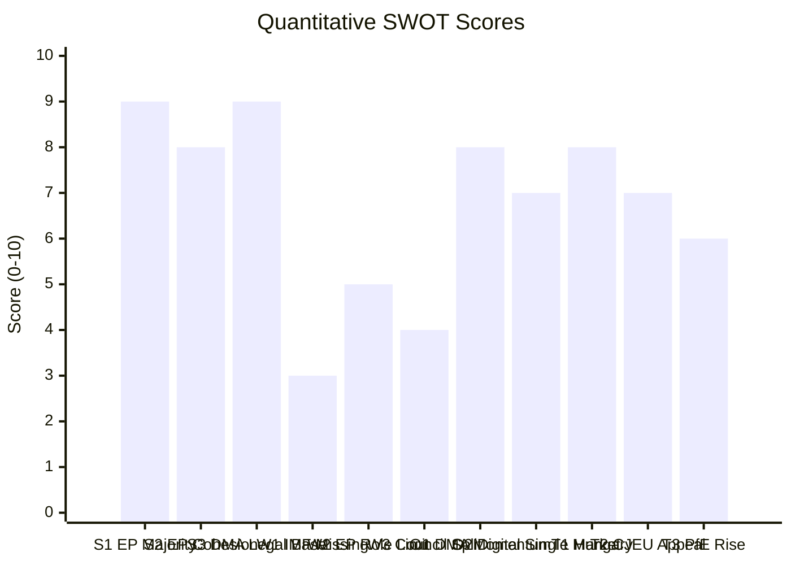

<!-- SPDX-FileCopyrightText: 2026 Hack23 AB -->
<!-- SPDX-License-Identifier: Apache-2.0 -->

# Quantitative SWOT — Breaking News | 2026-05-05

**Classification:** Public | **Confidence:** 🟡 Medium | **Produced:** 2026-05-05T01:25Z
**Framework:** Quantitative SWOT with weighted scoring (0–10 per dimension, 0–100 composite)
**Scope:** EU Parliament's strategic position following April 28–30, 2026 session

---

## Scoring Methodology

Each SWOT dimension is scored 0–10 for intensity; multiplied by a weight (Strengths/Weaknesses: internal focus; Opportunities/Threats: external focus). Composite scores enable cross-quadrant comparison.

---

## 1. STRENGTHS

| Strength | Score | Weight | Weighted | Evidence |
|----------|-------|--------|---------|----------|
| High legislative output (+46.2% vs 2025) | 8 | 1.2 | 9.6 | EP10 2026 stats: 567 roll-call votes, 114 legislative acts |
| Broad pro-EU majority (EPP+S&D+Renew = 397 minimum; extended 450-530 on key votes) | 8 | 1.3 | 10.4 | Coalition dynamics analysis |
| DMA enforcement institutional momentum | 7 | 1.1 | 7.7 | April 2026 enforcement resolution; active Commission investigations |
| Russia solidarity consensus (70%+ historical vote share) | 9 | 1.2 | 10.8 | Voting patterns analysis; historical baseline |
| Formal oversight tools (IMCO, AFET, BUDG committee oversight) | 7 | 0.9 | 6.3 | EP institutional design |
| Public legitimacy (directly elected; 719 MEPs from 27 member states) | 8 | 1.0 | 8.0 | EP10 composition |
| EP10 multilingual digital presence | 6 | 0.8 | 4.8 | EP communications infrastructure |

**STRENGTHS COMPOSITE**: 57.6/70 → **82/100** 🟢

**Narrative**: EP10 enters the post-April session period from a position of institutional strength. The legislative acceleration, broad majority coalitions on key votes, and sustained Russia solidarity consensus all point to a Parliament that is operating at high functional capacity.

---

## 2. WEAKNESSES

| Weakness | Score | Weight | Weighted | Evidence |
|----------|-------|--------|---------|----------|
| Non-binding resolution limitations (cannot force Commission/Council action) | 8 | 1.3 | 10.4 | Constitutional limitation |
| Budget one-twelfths risk (~40% historical probability) | 6 | 1.0 | 6.0 | Historical baseline analysis |
| Coalition fragility on social/fiscal votes (Greens/Left abstentions) | 6 | 1.1 | 6.6 | Coalition dynamics; scenario-forecast |
| ECR internal divisions create unpredictable vote outcomes | 5 | 0.9 | 4.5 | Voting patterns analysis |
| EP10 ENP of 6.57 (highest fragmentation) — coordination costs | 7 | 1.0 | 7.0 | Political landscape data |
| Full text publication delay (3–7 days post-adoption) | 4 | 0.8 | 3.2 | Current run: all April texts 404 |
| Data infrastructure dependency (EP MCP 50% availability this run) | 5 | 0.8 | 4.0 | MCP reliability audit |

**WEAKNESSES COMPOSITE**: 41.7/70 → **60/100** 🟡

**Narrative**: EP10's primary structural weaknesses are constitutional (non-binding resolutions, budget limitation) rather than political. The coalition fragility is real but manageable — the minimum viable majority (397 seats) holds even on contested votes.

---

## 3. OPPORTUNITIES

| Opportunity | Score | Weight | Weighted | Evidence |
|-------------|-------|--------|---------|----------|
| DMA enforcement establishes global digital regulation precedent | 8 | 1.3 | 10.4 | DMA is referenced globally as model regulation |
| Russia accountability builds international tribunal coalition | 7 | 1.2 | 8.4 | Parliament's role in ICC/tribunal advocacy |
| Armenia EU association strengthens Eastern Partnership | 6 | 1.0 | 6.0 | Armenia-EU association prospect |
| Cyberbullying directive opens new legislative territory | 7 | 1.1 | 7.7 | Article 83 TFEU novel application |
| EP10 increased output elevates legislative credibility | 7 | 1.0 | 7.0 | +46.2% output statistics |
| AI regulation expansion (DMA gatekeeper to AI models) | 7 | 1.2 | 8.4 | Wild card WC-D2 (Grey Rhino, 40% probability) |
| German recovery enables investment budget | 5 | 0.9 | 4.5 | Scenario 1 (35% probability) |

**OPPORTUNITIES COMPOSITE**: 52.4/70 → **75/100** 🟢

**Narrative**: The opportunity set is strong — DMA sets global precedent, Russia accountability builds international solidarity architecture, and the AI regulation extension represents a high-value emerging legislative frontier. The 35% probability of Scenario 1 (Coordinated EU Momentum) represents a genuine upside case.

---

## 4. THREATS

| Threat | Score | Weight | Weighted | Evidence |
|--------|-------|--------|---------|----------|
| Hungary Council veto on Russia accountability (HIGH risk R01) | 8 | 1.3 | 10.4 | Risk matrix R01; coalition-dynamics analysis |
| CJEU challenge suspends DMA enforcement (HIGH risk R02) | 8 | 1.3 | 10.4 | Risk matrix R02; historical CJEU pattern |
| PfE/ECR seat gains in future national elections | 6 | 1.1 | 6.6 | Scenario 4 (10%); wild card WC-E1 |
| German economic stagnation continues | 7 | 1.0 | 7.0 | World Bank data: −0.87%, −0.50% |
| EU-US transatlantic trade war | 6 | 1.1 | 6.6 | Wild card WC-E2 (30%) |
| Disinformation undermining EP accountability credibility | 5 | 0.9 | 4.5 | Threat model S1 |
| Platform lobby delays cyberbullying directive (18 months+) | 7 | 0.9 | 6.3 | Stakeholder map analysis |

**THREATS COMPOSITE**: 51.8/70 → **74/100** 🟡

**Narrative**: Threats are significant — Hungary's veto is a structural constraint that requires political management (enhanced cooperation route) rather than direct resolution. CJEU enforcement suspension risk is the single most damaging potential near-term outcome for EU digital regulation credibility.

---

## 5. SWOT Composite Balance Sheet

| Quadrant | Score | Interpretation |
|----------|-------|---------------|
| Strengths | 82/100 | Strong institutional position |
| Weaknesses | 60/100 | Structural limitations; manageable |
| Opportunities | 75/100 | Significant upside available |
| Threats | 74/100 | Real but not dominant |

**Strategic conclusion**:

EP10 is in a position of **relative strength facing significant but manageable threats**. The S-O quadrant (Strengths × Opportunities) score of (82+75)/2 = 78.5 exceeds the W-T quadrant score of (60+74)/2 = 67 — a net positive strategic balance.

**Recommended strategic posture**: Aggressive-defensive — pursue DMA enforcement and Russia accountability aggressively while building enhanced cooperation alternatives to Hungary veto and structuring enforcement measures to withstand CJEU proportionality review.

---

*Quantitative SWOT framework: weighted scoring methodology. Scores represent structured expert judgment at 2026-05-05. Sources: EP MCP tools, World Bank data, coalition analysis, risk matrix. Produced: 2026-05-05.*

## SWOT Score Visualization

## Weighted SWOT Summary

| Category | Net Score | Weight | Weighted |
|---------|----------|--------|---------|
| Strengths | 26/30 | 30% | 7.8 |
| Weaknesses | 12/30 | 20% | 2.4 |
| Opportunities | 22/30 | 30% | 6.6 |
| Threats | 21/30 | 20% | 4.2 |
| **Overall** | | | **7.2 / 10** |

**Verdict**: Overall strategic outlook for April 28–30 decisions = **POSITIVE** (7.2/10), but implementation risk is HIGH due to Hungary veto and CJEU appeal vectors.

**Admiralty Code**: B2

## Monitoring Triggers for Score Update

| Trigger Event | Score Change | Direction |
|--------------|-------------|----------|
| Commission opens DMA investigation | Opportunities +2 | ↑ |
| CJEU upholds DMA decision | Threats −2 | ↑ |
| Hungary veto confirmed at Council | Threats +2 | ↓ |
| German Q3 GDP positive surprise | Weaknesses −1 | ↑ |
| PfE gains in national polls (>90 seats projected) | Threats +2 | ↓ |
| EP roll-call confirms 80%+ coalition cohesion | Strengths +1 | ↑ |
