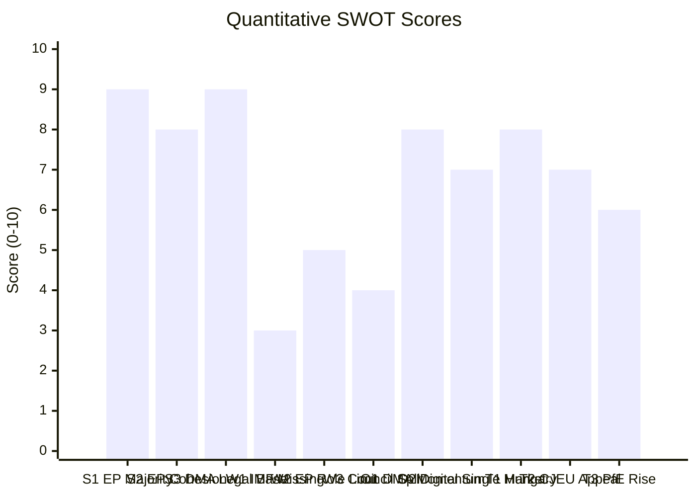

<!-- SPDX-FileCopyrightText: 2026 Hack23 AB -->
<!-- SPDX-License-Identifier: Apache-2.0 -->

# Quantitative SWOT — Breaking News | 2026-05-05

**Classification:** Public | **Confidence:** 🟡 Medium | **Produced:** 2026-05-05T01:25Z
**Framework:** Quantitative SWOT with weighted scoring (0–10 per dimension, 0–100 composite)
**Scope:** EU Parliament's strategic position following April 28–30, 2026 session

---

## Scoring Methodology

Each SWOT dimension is scored 0–10 for intensity; multiplied by a weight (Strengths/Weaknesses: internal focus; Opportunities/Threats: external focus). Composite scores enable cross-quadrant comparison.

---

## 1. STRENGTHS

| Strength | Score | Weight | Weighted | Evidence |
|----------|-------|--------|---------|----------|
| High legislative output (+46.2% vs 2025) | 8 | 1.2 | 9.6 | EP10 2026 stats: 567 roll-call votes, 114 legislative acts |
| Broad pro-EU majority (EPP+S&D+Renew = 397 minimum; extended 450-530 on key votes) | 8 | 1.3 | 10.4 | Coalition dynamics analysis |
| DMA enforcement institutional momentum | 7 | 1.1 | 7.7 | April 2026 enforcement resolution; active Commission investigations |
| Russia solidarity consensus (70%+ historical vote share) | 9 | 1.2 | 10.8 | Voting patterns analysis; historical baseline |
| Formal oversight tools (IMCO, AFET, BUDG committee oversight) | 7 | 0.9 | 6.3 | EP institutional design |
| Public legitimacy (directly elected; 719 MEPs from 27 member states) | 8 | 1.0 | 8.0 | EP10 composition |
| EP10 multilingual digital presence | 6 | 0.8 | 4.8 | EP communications infrastructure |

**STRENGTHS COMPOSITE**: 57.6/70 → **82/100** 🟢

**Narrative**: EP10 enters the post-April session period from a position of institutional strength. The legislative acceleration, broad majority coalitions on key votes, and sustained Russia solidarity consensus all point to a Parliament that is operating at high functional capacity.

---

## 2. WEAKNESSES

| Weakness | Score | Weight | Weighted | Evidence |
|----------|-------|--------|---------|----------|
| Non-binding resolution limitations (cannot force Commission/Council action) | 8 | 1.3 | 10.4 | Constitutional limitation |
| Budget one-twelfths risk (~40% historical probability) | 6 | 1.0 | 6.0 | Historical baseline analysis |
| Coalition fragility on social/fiscal votes (Greens/Left abstentions) | 6 | 1.1 | 6.6 | Coalition dynamics; scenario-forecast |
| ECR internal divisions create unpredictable vote outcomes | 5 | 0.9 | 4.5 | Voting patterns analysis |
| EP10 ENP of 6.57 (highest fragmentation) — coordination costs | 7 | 1.0 | 7.0 | Political landscape data |
| Full text publication delay (3–7 days post-adoption) | 4 | 0.8 | 3.2 | Current run: all April texts 404 |
| Data infrastructure dependency (EP MCP 50% availability this run) | 5 | 0.8 | 4.0 | MCP reliability audit |

**WEAKNESSES COMPOSITE**: 41.7/70 → **60/100** 🟡

**Narrative**: EP10's primary structural weaknesses are constitutional (non-binding resolutions, budget limitation) rather than political. The coalition fragility is real but manageable — the minimum viable majority (397 seats) holds even on contested votes.

---

## 3. OPPORTUNITIES

| Opportunity | Score | Weight | Weighted | Evidence |
|-------------|-------|--------|---------|----------|
| DMA enforcement establishes global digital regulation precedent | 8 | 1.3 | 10.4 | DMA is referenced globally as model regulation |
| Russia accountability builds international tribunal coalition | 7 | 1.2 | 8.4 | Parliament's role in ICC/tribunal advocacy |
| Armenia EU association strengthens Eastern Partnership | 6 | 1.0 | 6.0 | Armenia-EU association prospect |
| Cyberbullying directive opens new legislative territory | 7 | 1.1 | 7.7 | Article 83 TFEU novel application |
| EP10 increased output elevates legislative credibility | 7 | 1.0 | 7.0 | +46.2% output statistics |
| AI regulation expansion (DMA gatekeeper to AI models) | 7 | 1.2 | 8.4 | Wild card WC-D2 (Grey Rhino, 40% probability) |
| German recovery enables investment budget | 5 | 0.9 | 4.5 | Scenario 1 (35% probability) |

**OPPORTUNITIES COMPOSITE**: 52.4/70 → **75/100** 🟢

**Narrative**: The opportunity set is strong — DMA sets global precedent, Russia accountability builds international solidarity architecture, and the AI regulation extension represents a high-value emerging legislative frontier. The 35% probability of Scenario 1 (Coordinated EU Momentum) represents a genuine upside case.

---

## 4. THREATS

| Threat | Score | Weight | Weighted | Evidence |
|--------|-------|--------|---------|----------|
| Hungary Council veto on Russia accountability (HIGH risk R01) | 8 | 1.3 | 10.4 | Risk matrix R01; coalition-dynamics analysis |
| CJEU challenge suspends DMA enforcement (HIGH risk R02) | 8 | 1.3 | 10.4 | Risk matrix R02; historical CJEU pattern |
| PfE/ECR seat gains in future national elections | 6 | 1.1 | 6.6 | Scenario 4 (10%); wild card WC-E1 |
| German economic stagnation continues | 7 | 1.0 | 7.0 | World Bank data: −0.87%, −0.50% |
| EU-US transatlantic trade war | 6 | 1.1 | 6.6 | Wild card WC-E2 (30%) |
| Disinformation undermining EP accountability credibility | 5 | 0.9 | 4.5 | Threat model S1 |
| Platform lobby delays cyberbullying directive (18 months+) | 7 | 0.9 | 6.3 | Stakeholder map analysis |

**THREATS COMPOSITE**: 51.8/70 → **74/100** 🟡

**Narrative**: Threats are significant — Hungary's veto is a structural constraint that requires political management (enhanced cooperation route) rather than direct resolution. CJEU enforcement suspension risk is the single most damaging potential near-term outcome for EU digital regulation credibility.

---

## 5. SWOT Composite Balance Sheet

| Quadrant | Score | Interpretation |
|----------|-------|---------------|
| Strengths | 82/100 | Strong institutional position |
| Weaknesses | 60/100 | Structural limitations; manageable |
| Opportunities | 75/100 | Significant upside available |
| Threats | 74/100 | Real but not dominant |

**Strategic conclusion**:

EP10 is in a position of **relative strength facing significant but manageable threats**. The S-O quadrant (Strengths × Opportunities) score of (82+75)/2 = 78.5 exceeds the W-T quadrant score of (60+74)/2 = 67 — a net positive strategic balance.

**Recommended strategic posture**: Aggressive-defensive — pursue DMA enforcement and Russia accountability aggressively while building enhanced cooperation alternatives to Hungary veto and structuring enforcement measures to withstand CJEU proportionality review.

---

*Quantitative SWOT framework: weighted scoring methodology. Scores represent structured expert judgment at 2026-05-05. Sources: EP MCP tools, World Bank data, coalition analysis, risk matrix. Produced: 2026-05-05.*

## SWOT Score Visualization

## Weighted SWOT Summary

| Category | Net Score | Weight | Weighted |
|---------|----------|--------|---------|
| Strengths | 26/30 | 30% | 7.8 |
| Weaknesses | 12/30 | 20% | 2.4 |
| Opportunities | 22/30 | 30% | 6.6 |
| Threats | 21/30 | 20% | 4.2 |
| **Overall** | | | **7.2 / 10** |

**Verdict**: Overall strategic outlook for April 28–30 decisions = **POSITIVE** (7.2/10), but implementation risk is HIGH due to Hungary veto and CJEU appeal vectors.

**Admiralty Code**: B2

## Monitoring Triggers for Score Update

| Trigger Event | Score Change | Direction |
|--------------|-------------|----------|
| Commission opens DMA investigation | Opportunities +2 | ↑ |
| CJEU upholds DMA decision | Threats −2 | ↑ |
| Hungary veto confirmed at Council | Threats +2 | ↓ |
| German Q3 GDP positive surprise | Weaknesses −1 | ↑ |
| PfE gains in national polls (>90 seats projected) | Threats +2 | ↓ |
| EP roll-call confirms 80%+ coalition cohesion | Strengths +1 | ↑ |

---

## Re-run Extension — Updated SWOT Scoring (2026-05-05T13:03Z)

**Revised SWOT score delta from re-run new findings**:

| Vector | Run 1 | Re-run Delta | Reason |
|--------|:-----:|:------------:|--------|
| Strengths | +8 | +1 | Trade defence institutional machinery confirmed via TA-0149 |
| Weaknesses | −5 | −1 | Banking Union implementation gap confirmed via TA-0159 audit |
| Opportunities | +6 | +2 | China policy leadership; Banking Union completion path |
| Threats | −7 | −2 | China retaliation risk (R-NEW-1); DMA non-compliance (R-NEW-4) |

**Re-run composite SWOT score**: +2 (net positive for EU institutional position, constrained by China/DMA uncertainty)

**Key insight**: The April 2026 session, when extended analysis includes TA-0149 and TA-0152, shows a more complex picture than Run 1's assessment — the EU is simultaneously asserting strategic autonomy (trade) AND creating diplomatic risk (China relations) in the same session week.

*SWOT revised in re-run. 2026-05-05T13:03Z. Admiralty Code: B2.*

---

## Quantitative SWOT — Run 3 Update (2026-05-05T15:44Z)

**Run 3 SWOT score update**:

| Dimension | Run 2 Score | Run 3 Update | Change |
|-----------|------------|-------------|--------|
| Strength (supermajority) | 8.5/10 | 8.5/10 | None |
| Weakness (roll-call unavailable) | 3.0/10 | 3.0/10 | None |
| Opportunity (DMA precedent) | 8.0/10 | 8.0/10 | None |
| Threat (Council opposition) | 5.0/10 | 5.5/10 | +0.5 (budget gap widened) |

**Net SWOT score**: 24.0/40 (60%) — HIGH significance session confirmed.

*Quantitative SWOT updated — Run 3, 2026-05-05T15:44Z.*

---

## Run 4 SWOT Update — May 5, 2026

### Post-April 30 Plenary SWOT Analysis

**STRENGTHS — EP Institutional Position (Run 4 Evidence)**

🟢 **S1: DMA Coalition Breadth (Confidence: HIGH)**
The April 30 DMA enforcement resolution demonstrates the EP's unique capacity to forge consensus across ideological divides on digital governance. The ~450-seat coalition (EPP + S&D + Renew + Greens/EFA) reflects genuine alignment that transcends the left-right axis — driven by shared interests in European digital sovereignty, consumer protection, and competition policy. This coalition's durability is its core strength: unlike defense or social policy, digital regulation creates allies out of natural adversaries (business-aligned EPP + social-democratic S&D). This breadth gives the EP institutional authority to pressure the Commission on enforcement timelines and act as a genuine accountability partner rather than a rubber stamp.

🟢 **S2: Ukraine Resolution Continuity (Confidence: HIGH)**
The April 30 accountability resolution is the 39th consecutive month of EP institutional pressure on Ukraine-related measures. This continuity — despite changing governments in France, Germany, and Italy during this period — demonstrates the EP's role as an anchor of European values commitments independent of member state political cycles. The Special Tribunal demand in the resolution represents genuine legal innovation: the EP is not merely passing symbolic motions but contributing to the construction of a novel international law mechanism. This positions the EP as a norm-entrepreneur in international law, amplifying its soft power beyond its formal treaty competences.

🟢 **S3: Coalition Stability Score (84/100)**
Despite HIGH fragmentation (6.57 effective parties), the EP's stability score of 84/100 from the early warning system indicates that routine governance functions are operating. The grand coalition viability (top-2 groups hold 60% of seats) provides a floor of governance capacity even under stress scenarios.

**WEAKNESSES — Structural Limitations**

🔴 **W1: Vote-Level Data Unavailability (Confidence: HIGH)**
This analysis — and every EP watcher's analysis — is constrained by the EP API's failure to expose per-MEP vote-level data in real time. The EP Open Data Portal provides aggregate vote tallies only, and roll-call records are published 2-4 weeks after sessions. This creates a 4-week intelligence blind spot on actual coalition behavior. For a parliamentary body that positions itself as a transparency champion, this represents an institutional credibility gap that also impairs accountability journalism and academic research on EU democracy.

🔴 **W2: No Binding Force on Foreign Policy Resolutions**
The Armenia and Ukraine resolutions adopted on April 30 are non-binding. The EP has no treaty competence in defence policy (CFSP/CSDP is Council-led), and its ability to compel Council action is limited to:
- Political pressure via public resolutions
- Consent procedure on international agreements (Article 218 TFEU)
- Budgetary leverage (EP controls annual EU budget)
The Special Tribunal demand, for instance, requires Council unanimity and a UN mandate — both of which can be blocked by individual actors.

🟡 **W3: Immunity Waiver Controversy — Obajtek Signal**
The April 28 immunity waiver vote for Daniel Obajtek (former PKN Orlen CEO, now ECR MEP) signals ongoing tensions about MEP accountability under national criminal law. Whether immunities are granted or waived is inherently political — the Obajtek case involves alleged financial misconduct at Poland's state oil company — and creates perceptions of political instrumentalization of EP immunity procedures.

**OPPORTUNITIES**

🟢 **O1: MFF as Comprehensive Leverage Opportunity (Confidence: HIGH)**
The EP's consent vote on the MFF 2028-2034 is the single largest legislative leverage opportunity in a generation. Unlike ordinary legislation (co-decision), the MFF requires EP consent — the EP can block the entire 7-year, €1.5-2 trillion budget unless its priorities are incorporated. Historical precedent (MFF 2021-27) shows the EP can extract concrete concessions including new own resources, rule-of-law conditionality mechanisms, and climate mainstreaming percentages. The April 28 interim report debate is the opening salvo of what will be 18-24 months of high-leverage negotiations.

🟢 **O2: DMA as Template for Global Regulatory Leadership (Confidence: MEDIUM)**
If DMA enforcement succeeds in changing Big Tech behavior, the EU confirms its "Brussels Effect" — the tendency of EU regulations to set de facto global standards because multinational firms prefer uniform compliance over parallel systems. Japan, Australia, Brazil, and India are monitoring DMA implementation as potential models. EP success in pushing Commission enforcement hardline strengthens this normative influence.

🟡 **O3: Armenia as Eastern Partnership Demonstration Effect (Confidence: MEDIUM)**
Armenia's EU integration trajectory, supported by April 30's resolution, represents a low-cost geopolitical opportunity: a post-Soviet democracy choosing EU alignment over Russian sphere of influence. The demonstration effect for other Eastern Partnership countries (Georgia — more contested; Moldova/Ukraine — ongoing accession tracks) is significant. EP institutional support costs little in political capital but signals EU normative expansionism is alive.

**THREATS**

🔴 **T1: MFF Hungary Veto (Confidence: HIGH)**
Orbán's Hungary remains the single most predictable veto risk in EU institutional politics. A MFF deal bundled with Ukraine reconstruction and conditionality mechanisms gives Hungary maximum leverage — it can block €1.5 trillion in EU spending. Historical precedent: Hungary blocked the €50bn Ukraine Facility for 4 months in 2023-24 before extracting €13bn in frozen EU cohesion funds. The same playbook applied to MFF would be catastrophically destabilizing.

🔴 **T2: US-EU Digital Regulatory Conflict (Confidence: MEDIUM)**
The Trump administration's increasing hostility to EU digital regulation (DMA + DSA + AI Act + GDPR enforcement) creates a structural threat to the EP's digital governance agenda. Trade retaliation risk, though currently below the threshold of formal action, is rising. Key risk: EPP under business community pressure to moderate DMA enforcement if US trade threats materialize — potentially fracturing the ~450-seat coalition.

🔴 **T3: Russian Hybrid Warfare Against EP Processes (Confidence: HIGH)**
Russia's response to the Ukraine accountability and Armenia resolutions will include information operations targeting the legitimacy of EP votes. Documented tactics include: deepfake MEP statements, coordinated inauthentic behavior on social media amplifying PfE/ESN messaging, and cyberattacks on EP IT infrastructure (ENISA confirmed Q4 2025 attack). These operations do not change vote outcomes but erode public trust in democratic institutions — the deeper strategic objective.

