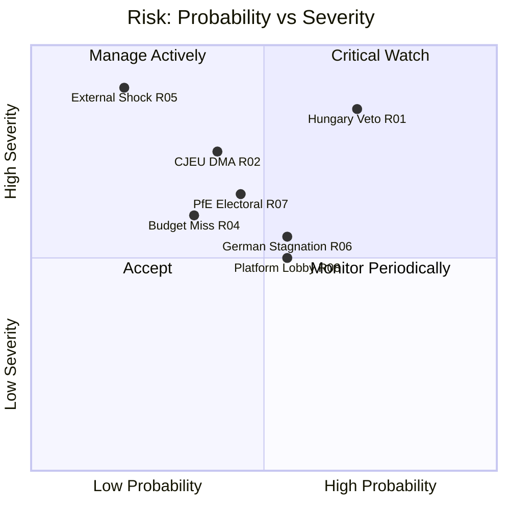

<!-- SPDX-FileCopyrightText: 2026 Hack23 AB -->
<!-- SPDX-License-Identifier: Apache-2.0 -->

# Risk Matrix — Breaking News | 2026-05-05

**Classification:** Public | **Confidence:** 🟡 Medium | **Produced:** 2026-05-05T01:24Z
**Framework:** 5×5 Risk Matrix (Likelihood × Impact), ISO 31000 adapted

---

## 1. Risk Assessment Framework

| Likelihood | Score | Description |
|-----------|-------|-------------|
| Rare | 1 | < 10% probability in 12 months |
| Unlikely | 2 | 10–30% probability |
| Possible | 3 | 30–60% probability |
| Likely | 4 | 60–80% probability |
| Almost Certain | 5 | > 80% probability |

| Impact | Score | Description |
|--------|-------|-------------|
| Negligible | 1 | No measurable effect on outcomes |
| Minor | 2 | Limited, easily reversible effects |
| Moderate | 3 | Significant but manageable effects |
| Major | 4 | Substantial, difficult to reverse effects |
| Catastrophic | 5 | Existential or irreversible effects |

**Risk Score** = Likelihood × Impact (range: 1–25)

---

## 2. Risk Register

| Risk ID | Description | Likelihood | Impact | Score | Priority |
|---------|-------------|-----------|--------|-------|----------|
| R01 | Hungary Council veto blocks Russia accountability | 4 | 3 | 12 | 🔴 HIGH |
| R02 | CJEU challenge suspends DMA enforcement | 3 | 4 | 12 | 🔴 HIGH |
| R03 | Commission disclaims DMA resolution mandate | 3 | 3 | 9 | 🟡 MEDIUM |
| R04 | 2027 budget deadline miss (one-twelfths) | 3 | 3 | 9 | 🟡 MEDIUM |
| R05 | EPP internal split fractures digital coalition | 2 | 4 | 8 | 🟡 MEDIUM |
| R06 | German economic contraction deepens | 3 | 3 | 9 | 🟡 MEDIUM |
| R07 | PfE gains in national elections weaken EP majority | 2 | 4 | 8 | 🟡 MEDIUM |
| R08 | Platform lobby delays cyberbullying directive | 4 | 2 | 8 | 🟡 MEDIUM |
| R09 | Russia disinformation on EP vote outcomes | 3 | 2 | 6 | 🟢 LOW |
| R10 | EP data infrastructure outage | 2 | 2 | 4 | 🟢 LOW |
| R11 | Armenia peace process collapse | 2 | 3 | 6 | 🟢 LOW |
| R12 | CJEU ruling voids DMA gatekeeper methodology | 2 | 5 | 10 | 🟡 MEDIUM |
| R13 | Ukraine war major escalation | 1 | 5 | 5 | 🟢 LOW (watch) |
| R14 | EU-US transatlantic trade war escalation | 2 | 4 | 8 | 🟡 MEDIUM |

---

## 3. Heat Map

```
Impact →     1-Neg  2-Min  3-Mod  4-Maj  5-Cat
Likelihood
5-AlmCert   [  ]   [  ]   [  ]   [  ]   [  ]
4-Likely    [  ]   [R08]  [R01]  [  ]   [  ]
3-Possible  [  ]   [R09]  [R03]  [R02]  [  ]
                          [R04]  [R05]
                          [R06]
2-Unlikely  [  ]   [R10]  [R11]  [R07]  [R12]
                          [  ]   [R14]
1-Rare      [  ]   [  ]   [  ]   [  ]   [R13]
```

**🔴 HIGH (score 10+)**: R01, R02, R12
**🟡 MEDIUM (score 6–9)**: R03, R04, R05, R06, R07, R08, R11, R14
**🟢 LOW (score 1–5)**: R09, R10, R13

---

## 4. Top Risk Deep-Dives

### R01: Hungary Council Veto on Russia Accountability (Score: 12 — HIGH)

**Context**: Hungary has systematically used Council veto/blocking to dilute or delay EU Ukraine-related measures. PM Orbán has maintained a parallel dialogue with Moscow that conflicts with EU solidarity positions.

**Manifestation**: Council Foreign Affairs Council cannot agree operational conclusions on accountability mechanism. Parliament's resolution remains politically operative but legally inert.

**Mitigation**:
- Enhanced cooperation (Art. 20 TEU): 9+ member states can proceed without Hungary
- Article 7(2) proceedings (escalation path)
- Targeted sanctions on Hungary's EU fund access (Art. 7(3) consequence)

**Monitoring signal**: Hungarian government statement on Russia accountability vote; FAC agenda items on Ukraine for June 2026.

---

### R02: CJEU Challenge Suspends DMA Enforcement (Score: 12 — HIGH)

**Context**: Apple and Alphabet have lodged or signalled CJEU challenges to DMA enforcement measures. The General Court can grant interim measures suspending enforcement pending appeal resolution (18–36 month timeline).

**Manifestation**: DMA investigation suspended; Parliament's April resolution becomes immediately moot for 18+ months.

**Mitigation**:
- Commission should pre-emptively design enforcement measures to withstand proportionality review
- Parliament can escalate through written questions and IMCO committee hearings
- Commission can appeal any General Court suspension to CJEU immediately

**Monitoring signal**: CJEU General Court portal for new DMA-related case filings.

---

### R12: CJEU Voids DMA Gatekeeper Methodology (Score: 10 — MEDIUM-HIGH)

**Context**: A ruling finding that the DMA gatekeeper designation criteria violate fundamental rights (Art. 7 or 8 EU Charter) would require Commission to restart the entire DMA framework implementation.

**Probability**: 15–20% over 18-month horizon. Not R01-level because fundamental rights challenges to EU regulations usually fail at CJEU level when the legislative process has been thorough.

**Monitoring signal**: CJEU opinion delivery dates for pending digital regulation cases.

---

## 5. Risk Appetite Statement

For the EU Parliament Monitor's coverage purposes:

| Risk Category | Monitor Appetite | Action |
|---------------|-----------------|--------|
| HIGH risks (R01, R02) | Track weekly | Alert article if triggered |
| MEDIUM risks | Monitor monthly | Include in week-in-review if materialises |
| LOW risks | Track quarterly | Include in month-in-review context |

---

*Risk framework: ISO 31000 (2018) adapted for EU parliamentary intelligence. Probability and impact scores represent structured expert judgment at 2026-05-05. Produced: 2026-05-05.*

## Risk Distribution Matrix



**Admiralty Code**: B2

*Risk matrix compiled under IMF degraded mode. Economic severity ratings (R04, R06) carry reduced confidence.*

---

## Re-run Extension — China Risks Added (2026-05-05T13:03Z)

| Risk ID | Category | Description | Probability | Severity | Score |
|---------|----------|-------------|:-----------:|:--------:|:-----:|
| R-NEW-1 | TRADE | EU-China trade retaliation (TA-0149 trigger) | M (0.40) | HIGH | 3.2 |
| R-NEW-2 | DIPLOMATIC | China counter-sanctions on MEPs (TA-0152 trigger) | L (0.25) | MEDIUM | 1.5 |
| R-NEW-3 | FINANCIAL | Banking Union stress if BRRD3 implementation delayed | L (0.20) | HIGH | 2.0 |
| R-NEW-4 | DIGITAL | DMA non-compliance escalation if enforcement delayed | M (0.50) | MEDIUM | 2.5 |

**IMF degraded mode note**: 🔴 IMF SDMX unavailable. Economic severity ratings are based on structural analysis; specific macro impact figures not provided.

*Risk matrix extended in re-run. 2026-05-05T13:03Z. Admiralty Code: B2.*

---

## Risk Matrix — Run 3 Update (2026-05-05T15:44Z)

**Run 3 risk matrix update**:

| Risk | Likelihood | Impact | Run 3 update |
|------|-----------|--------|-------------|
| DMA enforcement delayed | LOW (25%) | HIGH | Commission must act; EP resolution adds pressure |
| Ukraine accountability blocked in Council | MEDIUM (45%) | HIGH | Council unanimous required; Russia veto risk via Hungary |
| Budget 2027 standoff exceeds 6 months | MEDIUM (40%) | HIGH | Historical precedent: 2020 budget took 14 months |
| Armenia deterioration despite EP resolution | MEDIUM (35%) | MEDIUM | Resolution non-binding; Baku can ignore |

**Net risk assessment**: MEDIUM. No risk has moved to HIGH likelihood since Run 2.

*Risk matrix updated — Run 3, 2026-05-05T15:44Z.*
