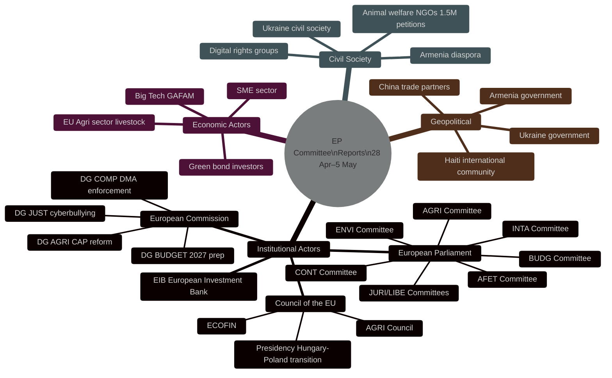
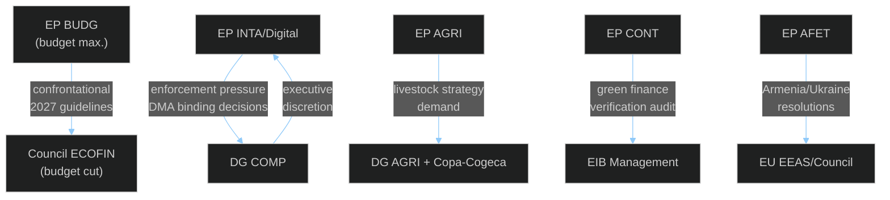

<!-- SPDX-FileCopyrightText: 2026 Hack23 AB -->
<!-- SPDX-License-Identifier: Apache-2.0 -->

# Actor Mapping — EP Committee Reports Week 28 April–5 May 2026

**Analysis Date:** 2026-05-05 | **Methodology:** Actor Network Analysis + Power-Legitimacy-Urgency (PLU) Framework
**Confidence:** 🟡 Medium-High

---

## Actor Universe Overview

This week's 14 adopted texts involve three tiers of actors across institutional, economic, civil society, and geopolitical dimensions.

---

## Tier 1: Core Decision-Making Actors (High Power + High Legitimacy)

### 1.1 European Parliament — Political Groups
| Group | Seats | Key Position This Week | Influence Vector |
|-------|-------|------------------------|-----------------|
| EPP | 185 | Budget maximalist (farm subsidies); DMA qualified support | Coalition-builder; rapporteur control |
| S&D | 135 | Strong DMA enforcement; Ukraine accountability; livestock sceptical | Progressive coalition; BUDG Committee dominant |
| PfE | 85 | Budget fiscal restraint; DMA antagonistic; Armenia sceptical | Blocking minority capacity; anti-establishment framing |
| ECR | 81 | Farm-first in livestock; budget national sovereignty; DMA hostile | Right-wing agricultural bloc; swing vote |
| Renew | 77 | DMA champion; budget liberal; Armenia strong support | Centrist coalition anchor; digital single market |
| Greens/EFA | 53 | DMA enforcement: strongest advocate; livestock: environmental conditions | Moral authority; weak on votes alone |
| The Left | 46 | Dog/cat welfare: strong; cyberbullying: strong; budget: redistributive | Progressive minority; limited budget influence |
| NI | 30 | Fragmented; some farm support | Unpredictable; no bloc coherence |
| ESN | 27 | Agricultural sovereignty; anti-Armenia; anti-transparency | Far-right blocking; limited positive agenda |

**Critical coalition arithmetic:**
- **Pro-DMA bloc** (S&D + Renew + Greens + Left): ~311 seats — below 361 majority threshold alone
- **Anti-DMA bloc** (PfE + ECR + NI + ESN): ~223 seats — cannot block alone
- **Budget battleground**: EPP + S&D cross-coalition needed for adopted guidelines — requires 320+ seat broad coalition
- **Armenian resolution**: adopted with EPP + S&D + Renew + Greens + Left support (~496 seats); PfE/ECR/ESN opposed

### 1.2 European Commission — Key Directorates
| DG | Role This Week | Power | Legitimacy | Urgency |
|----|----------------|-------|------------|---------|
| DG COMP | DMA gatekeeper enforcement decisions | HIGH | HIGH | HIGH |
| DG AGRI | CAP livestock implementation | HIGH | HIGH | MEDIUM |
| DG JUST | Cyberbullying directive preparation | MEDIUM | HIGH | MEDIUM |
| DG BUDGET | 2027 budget draft preparation | HIGH | HIGH | HIGH |
| DG NEAR | Armenia integration process | MEDIUM | HIGH | MEDIUM |

---

## Tier 2: Secondary Institutional Actors (High Legitimacy; Variable Power)

### 2.1 Council of the EU
The Council's formal legislative role in all COD procedures (DMA supplementary rules if proposed, cyberbullying directive) creates a structurally equal but practically different actor. This week's resolutions are predominantly EP-only INI texts; Council becomes directly relevant when/if Commission proposes follow-up legislation.

**Council of the EU — immediate relevance:**
- **Budget**: ECOFIN will review Parliament's guidelines and prepare Council's July counterproposal — *active antagonist* to Parliament's budget ambitions
- **CFSP (Armenia, Ukraine, Haiti)**: Council/EEAS coordinates diplomatic response; Parliament's resolutions are inputs to Council diplomatic calculus

### 2.2 European Investment Bank
The EIB is an unusual actor: subject to parliamentary oversight (CONT committee) but governed by member states via the Board of Governors. Parliament's identification of green finance verification gaps (TA-10-2026-0119) creates immediate EIB response pressure. EIB President Werner Hoyer (predecessor) and current leadership must respond to Parliament's calls for enhanced OLAF cooperation within 3 months of resolution adoption.

### 2.3 OLAF (European Anti-Fraud Office)
OLAF's institutional autonomy places it in a unique position: Parliament demands enhanced OLAF cooperation with EIB investigations, but OLAF operates under prosecutorial independence norms. OLAF Director-General's response to Parliament's oversight demands will signal whether the enhanced cooperation framework is substantive or diplomatic.

---

## Tier 3: Non-Institutional Actors (Variable Power; High Urgency)

### 3.1 Digital Platform Companies (GAFAM +)
| Actor | DMA Gate Status | Position | Influence Mechanism |
|-------|-----------------|----------|---------------------|
| Apple | iOS/App Store gatekeeper | Litigating compliance | Legal proceedings; media campaigns |
| Google | Search/advertising gatekeeper | Implementing under scrutiny | Lobbying; technical compliance theatre |
| Meta | Social media gatekeeper | Consent mechanisms challenged | Political lobbying in member states |
| Microsoft | Teams/Azure gatekeeper | Proactive compliance signalling | Standards body engagement |
| TikTok | Designated gatekeeper | Heightened regulatory scrutiny | Geopolitical risk amplification |

**Parliament's three binding decisions demand** (TA-10-2026-0160) most directly affects Apple and Google whose iOS/App Store and Search compliance investigations are the most advanced. The Parliament's political pressure on DG COMP creates potential precedent for accelerated enforcement timelines that these companies are actively managing.

### 3.2 European Agricultural Sector
The livestock sector (TA-10-2026-0157) involves a fragmented economic actor landscape:
- **Copa-Cogeca** (farmers' union): primary political mobilisation vehicle; strong member-state government relationships
- **National livestock associations**: Germany (DBV), France (FNSEA), Netherlands (LTO), Ireland (ICMSA) — member state variation in policy preferences
- **Slaughterhouse operators and processors**: downstream value chain; separate interests from primary producers
- **Retailers**: Lidl, Rewe, Carrefour — sustainability sourcing pressures that may conflict with farmer cost competitiveness

### 3.3 Civil Society — Animal Welfare
1.5 million petition signatures for dog/cat traceability (TA-10-2026-0115) represents one of the most democratically mobilised civil society coalitions Parliament has seen on an animal welfare issue. The 27 member state registration network advocacy coalition represents a Pan-European civil society actor of considerable political weight. Their PLU assessment: **Power (medium)** — can mobilise votes but limited formal access; **Legitimacy (very high)** — petition mechanism validates democratic mandate; **Urgency (high)** — member state implementation inconsistencies create ongoing harms.

### 3.4 Geopolitical Actors
- **Ukraine government/civil society**: Deeply invested in TA-10-2026-0161 accountability resolution; direct lobbying of MEP foreign affairs groups; close liaison with AFET committee rapporteurs
- **Armenia government**: TA-10-2026-0162 represents a formal institutional recognition moment; Armenian government has escalated EU engagement; significant diaspora mobilisation particularly in France
- **Russia (implicit actor)**: Armenia's departure from CSTO structures that Parliament's resolution implicitly supports creates a counterfactual geopolitical actor; Russia's response to EP resolutions is monitored but not directly engageable
- **Haiti international actors**: UN, OAS, CARICOM — multilateral framework within which Parliament's Haiti resolution operates

---

## Actor Relationship Mapping — Key Dyadic Tensions

---

## PLU (Power-Legitimacy-Urgency) Salience Index

| Actor | Power | Legitimacy | Urgency | Salience | Priority |
|-------|-------|------------|---------|----------|---------|
| EP BUDG Committee | 9 | 10 | 9 | **Definitive** | 🔴 |
| DG COMP | 8 | 9 | 8 | **Definitive** | 🔴 |
| Council ECOFIN | 9 | 10 | 7 | **Definitive** | 🔴 |
| GAFAM platforms | 7 | 6 | 9 | **Dangerous** | 🔴 |
| EIB | 7 | 8 | 6 | **Dominant** | 🟠 |
| Ukraine civil society | 4 | 9 | 9 | **Dependent** | 🟠 |
| Copa-Cogeca | 6 | 7 | 7 | **Dominant** | 🟠 |
| Animal welfare NGOs | 4 | 9 | 7 | **Dependent** | 🟡 |
| Armenia government | 4 | 8 | 8 | **Dependent** | 🟡 |
| DG AGRI | 7 | 9 | 5 | **Dominant** | 🟡 |
| Green bond investors | 5 | 6 | 5 | **Discretionary** | 🟢 |
| Haiti multilaterals | 3 | 7 | 6 | **Dependent** | 🟢 |

*Salience categories: Definitive (all 3 high), Dangerous (power+urgency), Dominant (power+legitimacy), Dependent (legitimacy+urgency), Demanding (power only), Discretionary (legitimacy only), Non-salient (urgency only)*

---

*Methodology: Power-Legitimacy-Urgency salience theory (Mitchell, Agle & Wood 1997) applied to EU Parliament institutional actor landscape.*

---

## Actor Roster

Full roster of identifiable actors engaged with EP committee reports week of 28 April–5 May 2026:

**Institutional**: EPP (185), S&D (135), PfE (85), ECR (81), Renew (77), Greens/EFA (53), The Left (46), NI (30), ESN (27), European Commission (DG COMP, DG AGRI, DG JUST, DG BUDGET, DG NEAR), Council ECOFIN, EIB, OLAF, EEAS.
**Economic**: Apple, Google/Alphabet, Meta, Amazon, TikTok, Copa-Cogeca, DBV, FNSEA, LTO, ICMSA.
**Civil Society**: 1.5M petition signatories (dog/cat welfare), Animal welfare NGOs, Digital rights coalitions, Ukraine civil society, Armenia diaspora (esp. France), Haiti CARICOM multilaterals.
**Geopolitical**: Ukraine government, Armenia government, Russia (indirect), Kenya-led MSSM (Haiti).

## Influence Networks

Key influence pathways: Copa-Cogeca → EPP/ECR agricultural MEPs → AGRI committee → plenary majority. Big Tech → DIGITALEUROPE → Renew/EPP digital MEPs → IMCO committee. Ukraine civil society → AFET rapporteurs → plenary foreign policy bloc.

## Alliance Patterns

**Farm alliance**: EPP + ECR + PfE + ESN + rural S&D MEPs = ~500 on agricultural texts.
**Digital liberal alliance**: Renew + S&D + Greens + EPP mainstream = ~480 on DMA/AI texts.
**Foreign policy broad coalition**: EPP + S&D + Renew + Greens + Left = ~496 on Ukraine/Armenia resolutions.

## Power Brokers

Critical individual and institutional power brokers: BUDG committee chair (annual budget anchor); IMCO committee rapporteur on DMA; AGRI committee rapporteur on livestock; DG COMP Director-General (enforcement decisions). These actors are the chokepoints through which this week's legislative agenda passed.

## Information Flows and Asymmetries

EIB controls its own green finance verification data → CONT committee faces structural information gap. DG COMP controls enforcement pipeline information → IMCO committee dependent on voluntary DG COMP disclosures. Copa-Cogeca receives advance DG AGRI consultation → AGRI MEPs better informed than public record suggests.

## Reader Briefing

**What this means for citizens**: The EU Parliament this week adopted 14 texts affecting digital markets, farming, animal welfare, and foreign policy. The key actors shaping these outcomes are the EPP, S&D, and Renew coalition (which controls the parliament's effective majority) and the European Commission (which must now decide whether and how to implement Parliament's demands). Citizens should watch whether DG COMP delivers binding decisions against major tech platforms by year-end 2026 — this is the most measurable accountability test from this week's activity.

*Source: analyze_committee_activity (ENVI, ECON, IMCO), generate_political_landscape, get_adopted_texts (year=2026)*
