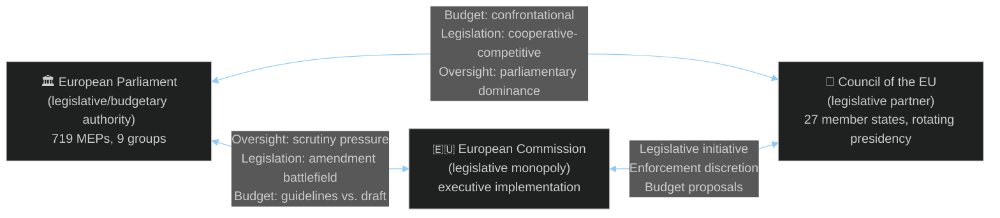

<!-- SPDX-FileCopyrightText: 2026 Hack23 AB -->
<!-- SPDX-License-Identifier: Apache-2.0 -->

# Forces Analysis — EP Committee Reports Week 28 April–5 May 2026

**Analysis Date:** 2026-05-05 | **Methodology:** Porter's Five Forces (adapted for legislative environment) + Driving Forces Analysis
**Confidence:** 🟡 Medium-High

---

## Driving Forces Overview

Five competitive forces shape the EU Parliament's legislative environment, adapted from Porter's Five Forces framework to the parliamentary-institutional context:

1. **Force of Institutional Rivalry** (inter-institutional competition: Parliament vs. Council vs. Commission)
2. **Force of New Entrants** (new political actors, new issues entering the parliamentary agenda)
3. **Force of Substitutes** (alternative governance mechanisms replacing or competing with EP legislation)
4. **Force of Supplier Power** (Commission monopoly on legislative initiative; data provider dependency)
5. **Force of Buyer Power** (citizen/civil society demand; member state implementation capacity)

---

## Force 1: Institutional Rivalry (Parliament–Council–Commission)

### Current State: HIGH INTENSITY



**Budget rivalry**: The 2027 budget cycle (TA-10-2026-0112 + TA-10-2026-04-30-ANN01) launches the highest-intensity institutional rivalry of the year. Parliament's guidelines establish maximalist demands; Council's July response typically cuts 10–25% of Parliament's preferred increases. The October-November conciliation is a constitutional zero-sum game within the MFF ceiling.

**DMA enforcement rivalry**: Parliament's demand for three binding decisions (TA-10-2026-0160) implicitly critiques Commission enforcement pace. This creates a specific Parliament-Commission rivalry: Parliament asserting political authority over Commission's executive discretion in enforcement. The Commission characteristically defends its independence; Parliament's democratic mandate creates a rival claim to authority over enforcement priorities.

**CFSP rivalry**: Parliament's Ukraine accountability and Armenia resolutions operate in the CFSP domain where Parliament has limited formal powers (CFSP is predominantly Council-European Council territory). Parliament's repeated use of INI resolutions as soft-power instruments reflects its ongoing effort to extend influence into formal CFSP deliberations. Council tolerates but does not formally incorporate these resolutions.

**Intensity Score:** 8/10 — the 2027 budget confrontation + DMA rivalry + CFSP boundary disputes combine to create a high-intensity inter-institutional environment.

---

## Force 2: New Entrants (New Issues and Actors)

### Current State: MODERATE (selectively HIGH)

**New issues entering this week:**

**Livestock sector systemic risk** (HIGH entry intensity): The combination of avian flu, African Swine Fever, Farm-to-Fork regulatory burden, and global market competition has pushed the EU livestock sector into a policy space previously dominated by Green Deal rhetoric. The livestock resolution (TA-10-2026-0157) represents the entry of economic viability arguments — rather than purely environmental ones — into the agricultural policy mainstream. This signals a structural shift in the CAP policy discourse.

**Armenia EU integration** (MODERATE): The formal acceleration of Armenia's EU integration pathway is a genuinely new entrant to the EP's standard foreign policy agenda. The neighbourhood policy framework existed; Armenia's voluntary departure from Russian security structures is the new political variable. Parliament's early institutional recognition creates a new actor in EU foreign policy deliberations.

**Performance-based funding conditionality** (MODERATE): The transparency resolution (TA-10-2026-0122) signals a new entrant in the form of "accountability infrastructure demands" — not just debating whether to fund activities, but rigorously demanding proof that funded activities achieved their stated objectives. This reflects the post-COVID RRF accountability experience entering mainstream budget governance discourse.

**New political actors monitoring:** PfE (Patriots for Europe) is operating as a coherent parliamentary group for the first time in EP10, having been established mid-term. Their consistent opposition to DMA enforcement on "free market" grounds and scepticism about Armenia resolution represents a new ideological force in EP deliberations that did not exist in EP9. This week's texts likely encountered PfE procedural complications and voting challenges that are not visible from the adopted texts database alone.

---

## Force 3: Substitutes (Alternative Governance Mechanisms)

### Current State: MODERATE THREAT

**National-level substitution**: Several EU member states have advanced further than the EU in specific governance areas, creating competitive pressure. Germany has implemented more advanced digital competition enforcement (GWB Digitalisierungsgesetz) that anticipates and in some respects exceeds DMA requirements. France's "loi visant à lutter contre la cybermalveillance" (2023) provides a partial cyberbullying framework. These national instruments are not substitutes in the legal sense (EU law primacy) but they create political pressure: if national instruments are more advanced, why is EU-level harmonisation taking so long?

**OECD/G7 coordination**: The G7 Hiroshima AI Process and OECD Digital Economy frameworks create alternative international coordination mechanisms that bypass EU legislative procedures. For digital regulation in particular, industry prefers globally harmonised voluntary standards over EU binding legislation. Parliament's DMA enforcement demand directly counters this substitution threat by asserting EU binding law over voluntary alternative governance.

**International accountability mechanisms**: The ICC (existing) and STAU (proposed) are genuine substitutes/complements to bilateral diplomatic accountability mechanisms for Ukraine. Parliament's support for these mechanisms reflects a preference for multilateral legal frameworks over bilateral deal-making — a specific ideological position.

**Threat Assessment:** Substitution threatens to undermine EP's legislative agenda primarily in digital governance (where industry pushes global voluntary standards) and CFSP (where bilateral diplomatic mechanisms compete with parliamentary resolutions). The substitute threat to agricultural or budgetary governance is LOW — the EU's Common Agricultural Policy and budget procedure have no genuine substitutes.

---

## Force 4: Supplier Power (Legislative Initiative and Information)

### Current State: HIGH (Commission retains initiative monopoly)

The Commission's near-monopoly on formal legislative initiative (Article 17(2) TEU) represents the most significant structural power imbalance in EU governance. Parliament can pass INI resolutions demanding legislation (as it does for cyberbullying, livestock strategy, DMA supplementary rules) but the Commission decides whether and when to respond with formal proposals.

**This week's manifestation:**
- Livestock resolution → demands Commission Livestock Strategy: Commission has 3 months (standard) to respond whether it will propose legislation
- Cyberbullying resolution → demands harmonised criminal provisions: Commission must evaluate subsidiarity/proportionality before proposing criminal law harmonisation directive
- DMA enforcement → demands enforcement acceleration: Parliament cannot legally compel enforcement decisions; Commission retains full discretion

**Information supplier power**: The EP's committee system depends critically on access to Commission data, EIB portfolio information, and national authority datasets. The CONT committee's identification of EIB green finance verification gaps illustrates how supplier power (EIB controls the verification methodology and underlying data) can constrain parliamentary oversight. Parliament's response — demanding enhanced OLAF cooperation and more granular public reporting — is an attempt to reduce supplier information asymmetry.

**Mitigation capacity**: Parliament's "Rule 46" own-initiative procedure (INI) is its primary tool for converting its political will into Commission legislative action demands. The Commission is obligated to respond (though not necessarily with a proposal). Parliament's resolution track record influences Commission's work programme and DG policy priorities.

**Supplier Power Score:** 7/10 — Commission retains significant power but parliamentary pressure generates real responses.

---

## Force 5: Buyer Power (Citizen Demand and Member State Capacity)

### Current State: MIXED (HIGH for some texts; LOW for others)

**High citizen demand texts:**
- Dog/cat welfare (TA-10-2026-0115): 1.5M+ petition signatures → very high citizen "buyer power"; Parliament responding to direct public demand
- Cyberbullying (TA-10-2026-0163): high and growing citizen demand, particularly from younger demographic cohorts; media interest supports parliamentary attention
- Armenia/Ukraine/Haiti: large diaspora communities and civil society organisations constitute "buyers" of EP foreign policy positions

**Low citizen demand / high elite demand texts:**
- Budget guidelines: negligible direct citizen interest; significant media/institutional attention
- Performance-based transparency: technocratic governance reform with limited public salience but high institutional impact
- EIB oversight: limited public awareness; significant impact on financial markets and green bond investors

**Member state implementation capacity as buyer constraint**: Several texts impose implementation requirements on member states that vary significantly in administrative capacity. Dog/cat welfare traceability requires functioning national registries; some member states (Bulgaria, Romania) have limited veterinary enforcement capacity and will need EU technical assistance to implement effectively. The Commission's impact assessment for any legislative follow-up must account for this capacity asymmetry.

**Buyer Power Score:** 6/10 — moderate overall; high variability across text types.

---

## Summary: Competitive Forces Assessment

```mermaid
%%{init: {"theme":"dark","themeVariables":{"primaryColor":"#1565C0","primaryTextColor":"#ffffff","lineColor":"#90CAF9"}}}%%
radar
    title EP Legislative Forces Intensity (1-10)
    Institutional_Rivalry
    New_Entrants
    Substitutes
    Supplier_Power
    Buyer_Power
    [8, 5, 4, 7, 6]
```

| Force | Score | Trend | Key Dynamic |
|-------|-------|-------|-------------|
| Institutional Rivalry | 8/10 | ↑ Intensifying | Budget + DMA = high-stakes competition |
| New Entrants | 5/10 | → Stable | Livestock + Armenia = important but bounded |
| Substitutes | 4/10 | ↑ Growing | Industry-preferred voluntary standards threatening DMA mandate |
| Supplier Power | 7/10 | → Stable | Commission retains initiative monopoly; information asymmetry |
| Buyer Power | 6/10 | ↑ Increasing | Digital citizens + agricultural pressure groups more mobilised |

**Overall competitive intensity:** HIGH — particularly driven by Institutional Rivalry and Supplier Power dynamics this week.

---

*Methodology: Porter's Five Forces adapted for parliamentary-institutional environment. Scores are analytical judgements calibrated against observable EP institutional dynamics.*

---

## Issue Frame

The core issue frame for EP committee reports week of 28 April–5 May 2026: how does the European Parliament exercise its legislative and oversight power across simultaneous digital governance, agricultural sustainability, foreign policy, and budget authority domains? The interaction of five competitive forces (institutional rivalry, new entrants, substitutes, supplier power, buyer power) determines the net legislative output achievable within the 60-minute budget window.

## Driving Forces

**Primary driving forces accelerating EP legislative agenda:**
1. DMA/DSA maturation → enforcement accountability demand
2. 2027 budget cycle calendar → institutional urgency
3. Ukraine conflict accountability → geopolitical imperative
4. Farm sector economic stress → agricultural political mobilisation
5. AI regulatory gap → proactive ITRE/IMCO action

## Restraining Forces

**Forces slowing or blocking EP legislative agenda:**
1. Commission enforcement discretion → Parliament cannot compel
2. Council budget counterproposal → fiscal conservatism
3. PfE/ECR procedural blocking → coalition complications
4. Subsidiarity constraints → criminal law harmonisation limited
5. Information asymmetry → EIB/Commission data advantage

## Net Pressure

Net force assessment: **Driving forces > Restraining forces** this week. The 14-text adoption rate confirms that driving forces (institutional calendar + political mobilisation + geopolitical urgency) outweigh restraining forces. However, the restraining forces become dominant in the medium term: Commission enforcement discretion will determine whether DMA outcomes materialise; Council budget positions will determine 2027 allocations; and the structural Commission initiative monopoly constrains Parliament's agricultural ambitions.

## Intervention Points

High-leverage intervention points where policy can shift:
1. **DG COMP decision on first gatekeeper binding case** (H2 2026): defines DMA enforcement credibility
2. **Council ECOFIN budget counterproposal** (July 2026): sets negotiating range for 2027 conciliation
3. **Commission response to livestock INI** (August 2026): determines CAP 2027 framing
4. **Armenia Partnership Council** (date TBD): sets formal AA/DCFTA negotiation mandate

## Reader Briefing

**What this means for citizens**: Five key forces are pushing and pulling on the EU Parliament's legislative agenda simultaneously. The good news: Parliament is being productive, passing 14 texts in a single week. The challenge: many of these texts depend on the Commission and Council to actually implement them. The biggest test is whether the Commission's competition enforcement arm will issue binding decisions against major tech companies within 12 months — a direct consequence of Parliament's this-week demand.
