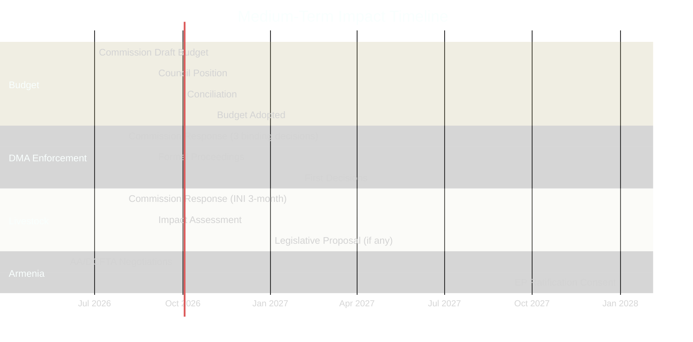

<!-- SPDX-FileCopyrightText: 2026 Hack23 AB -->
<!-- SPDX-License-Identifier: Apache-2.0 -->

# Impact Matrix — EP Committee Reports Week 28 April–5 May 2026

**Analysis Date:** 2026-05-05 | **Methodology:** Multi-dimensional impact scoring matrix (immediate/medium-term/long-term × breadth/depth)
**Confidence:** 🟡 Medium

---

## Impact Matrix Framework

Impacts are scored on two dimensions:
- **Depth** (1–5): How fundamentally does this text change policy direction?
- **Breadth** (1–5): How many actors/sectors/countries are affected?

Combined scores generate a 25-cell matrix with HIGH (≥15), MEDIUM (8–14), LOW (<8) zones.

---

## Adopted Texts Impact Scoring

| Document | Title (abbreviated) | Depth | Breadth | Score | Zone | Time Horizon |
|----------|---------------------|-------|---------|-------|------|-------------|
| TA-10-2026-0112 + ANN01 | 2027 Budget Guidelines | 5 | 5 | **25** | 🔴 HIGH | Immediate |
| TA-10-2026-0160 | DMA Enforcement (3 binding decisions) | 5 | 4 | **20** | 🔴 HIGH | Medium-term |
| TA-10-2026-0161 | Ukraine Accountability (STAU) | 4 | 4 | **16** | 🔴 HIGH | Medium-term |
| TA-10-2026-0157 | Livestock Sector Strategy | 4 | 4 | **16** | 🔴 HIGH | Medium-term |
| TA-10-2026-0162 | Armenia EU Integration | 4 | 3 | **12** | 🟠 MEDIUM | Long-term |
| TA-10-2026-0119 | EIB Annual Report | 3 | 4 | **12** | 🟠 MEDIUM | Medium-term |
| TA-10-2026-0163 | Cyberbullying Prevention | 4 | 3 | **12** | 🟠 MEDIUM | Long-term |
| TA-10-2026-0122 | Performance-Based Transparency | 3 | 4 | **12** | 🟠 MEDIUM | Long-term |
| TA-10-2026-0115 | Dog/Cat Welfare & Traceability | 2 | 5 | **10** | 🟠 MEDIUM | Medium-term |
| TA-10-2026-0116 | Microplastics Food Chain | 3 | 3 | **9** | 🟠 MEDIUM | Long-term |
| TA-10-2026-0118 | Rare Earth Supply Chain | 3 | 3 | **9** | 🟠 MEDIUM | Long-term |
| TA-10-2026-0121 | Responsible AI Healthcare | 3 | 3 | **9** | 🟠 MEDIUM | Long-term |
| TA-10-2026-0120 | Haiti Humanitarian Crisis | 2 | 2 | **4** | 🟢 LOW | Immediate |
| TA-10-2026-0117 | Schengen Annual Report | 2 | 3 | **6** | 🟢 LOW | Ongoing |

---

## High-Impact Texts — Detailed Analysis

### 2027 Budget Guidelines (Score: 25/25 — Maximum Impact)

**Immediate impact:**
- Sets Parliament's formal political position entering the 2027 budget negotiation
- Triggers automatic Commission response and Council deliberation timeline
- Creates internal EP political accountability: future votes will test whether Parliament holds its stated priorities

**Sectoral impacts:**
```
Digital/AI: 🔴 HIGH — R&D funding demands directly affect EU tech sovereignty agenda
Agriculture (CAP): 🔴 HIGH — farm support maintenance demands; climate conditionality debate
Cohesion/Structural: 🔴 HIGH — regional development funding competition with new priorities
Defence/Security: 🟠 MEDIUM — security of supply and border management funding lines
Enlargement: 🟡 LOW-MED — Armenia resolution creates implicit pre-accession funding expectation
```

**Power distribution impact:**
Parliament's guidelines reset the baseline for trilogue. The higher Parliament's initial position, the better its final negotiated outcome (anchoring effect). The political calculation to aim high is structural — but creates implementation credibility risks if adopted guidelines are routinely abandoned in conciliation.

### DMA Enforcement (Score: 20/25 — Very High)

**Market impact (immediate):**
- Three binding enforcement decisions (Apple App Store, Google Search, Meta interoperability) create compliance timeline certainty
- Market cap reactions expected for all three companies on announcement of binding decisions
- EU-based SME competitors in digital markets receive level-playing-field signal

**Regulatory precedent impact:**
- Establishes that Parliament will escalate political pressure when Commission enforcement pace is deemed insufficient
- Creates a "democratic oversight" vector into competition enforcement that was previously purely executive
- Signals to DG COMP leadership that political support exists for aggressive enforcement timelines

**International impact:**
- US tech companies operating in EU face regulatory costs; US government may raise at bilateral trade level
- Reinforces EU's "regulatory superpower" status globally; creates spillover potential for national regulators

### Ukraine STAU Resolution (Score: 16/25 — High)

**Diplomatic impact:**
- Formal EU Parliament institutional support for STAU mechanism strengthens multilateral accountability coalition
- Creates political pressure on EU member states that might prefer bilateral non-accountability diplomatic paths
- Ukrainian government receives strong democratic legitimacy signal for accountability demands

**Precedent for frozen asset conversion:**
- Parliament's language on converting frozen Russian state assets for Ukrainian reconstruction is legally novel
- Creates pressure on Council/Commission to develop implementing legislation; ECJ jurisprudence will ultimately determine legality
- Potential €300 billion+ in assets subject to this framework if precedent holds

---

## Medium-Term Impact Assessment (6–18 months)



---

## Long-Term Structural Impact Assessment (2–5 years)

**Digital governance transformation:** The DMA enforcement escalation, combined with forthcoming AI Act implementation and potential cyberbullying directive, positions the EU as the world's leading digital governance regulator by 2028. The structural impact on global platform business models is permanent; companies that achieve compliance now will face lower marginal costs of compliance in future regulatory cycles.

**Agricultural transition acceleration:** The livestock strategy demand arrives as CAP 2027 is being finalised. Parliament's early positioning on livestock economic viability vs. environmental sustainability will shape the tradeoff within the next CAP regulation. The structural impact is to slow the Green Deal's agricultural transformation timeline — a real policy reorientation from the previous EP's appetite for rapid green transition.

**EU external relations architecture:** Armenia's trajectory, if sustained, represents the first case of a post-Soviet state voluntarily exiting Russian security structures and beginning a formal EU path outside of the Western Balkans accession framework. This would structurally transform EU neighbourhood policy and the Eastern Partnership programme — a long-term geopolitical realignment with 10-year horizon impact.

**Public finance governance:** Performance-based funding transparency, if implemented through binding legislation, would restructure the entire EU budget governance system — from input-based to outcome-based accountability. This is potentially the most significant long-term governance reform in this week's basket, despite relatively modest immediate political salience.

---

## Cross-Text Synergies and Tensions

**Synergistic pairs:**
- Budget guidelines + EIB oversight: reinforcing "public money, public accountability" narrative
- DMA enforcement + Responsible AI healthcare: reinforcing digital regulation credibility
- Ukraine accountability + Armenia integration: geopolitical coherence; EU as values-based actor

**Tension pairs:**
- Budget maximalism + fiscal transparency: Parliament demands more money AND more accountability simultaneously — creates institutional cognitive dissonance
- Livestock economic viability + microplastics/environmental texts: environmental protection instruments in conflict with agricultural competitiveness demands
- Armenia integration (cost) + performance-based budgeting (efficiency): Armenia integration demands pre-accession funding; performance budgeting demands evidence of EU value; tension in budget allocation

---

*Impact scoring calibrated against EP plenary adoption significance; medium/long-term projections are analytical judgements.*

---

## Event List

Key events driving impact this week:
1. **April 28**: Budget guidelines (TA-10-2026-0112) + Dog/cat welfare (TA-10-2026-0115) + Microplastics (TA-10-2026-0116) + Schengen (TA-10-2026-0117) + Rare earth (TA-10-2026-0118) + EIB annual report (TA-10-2026-0119) + Haiti (TA-10-2026-0120) + AI healthcare (TA-10-2026-0121) + Performance transparency (TA-10-2026-0122)
2. **April 29**: Budget estimates ANN01 + Discharge (CoR)
3. **April 30**: Livestock (TA-10-2026-0157) + DMA enforcement (TA-10-2026-0160) + Ukraine accountability (TA-10-2026-0161) + Armenia integration (TA-10-2026-0162) + Cyberbullying (TA-10-2026-0163)

## Stakeholder Impact Matrix

| Stakeholder | 2027 Budget | DMA | Livestock | Armenia | Cyberbullying | Net Impact |
|-------------|-------------|-----|-----------|---------|---------------|------------|
| EU citizens | MEDIUM | HIGH | MEDIUM | LOW | HIGH | 🟠 ELEVATED |
| SME digital | LOW | HIGH | LOW | LOW | LOW | 🟡 MODERATE |
| EU farmers | LOW | LOW | HIGH | LOW | LOW | 🟡 MODERATE |
| Big Tech | LOW | VERY HIGH | LOW | LOW | MEDIUM | 🔴 HIGH |
| Ukraine government | MEDIUM | LOW | LOW | MEDIUM | LOW | 🟠 ELEVATED |
| Armenia government | LOW | LOW | LOW | VERY HIGH | LOW | 🔴 HIGH |
| Pet owners | LOW | LOW | LOW | LOW | LOW | 🟡 MODERATE (dog/cat) |
| Member states | HIGH | MEDIUM | HIGH | MEDIUM | MEDIUM | 🔴 HIGH |

## Heat Map

High-heat zones requiring immediate follow-up monitoring:
- **DMA enforcement** (digital markets, competition): Commission response window opens immediately; enforcement outcome visible H2 2026
- **2027 budget** (fiscal governance): July Council counterproposal is the next heat event
- **Armenia integration** (geopolitics): Near-term signal from Partnership Council
- **Livestock strategy** (agricultural sector): Commission 3-month response clock

Low-heat zones (longer-term, less immediate action required):
- Schengen annual report
- Haiti humanitarian (crisis response rhythm)
- Committee of Regions discharge (administrative)

## Cascade Effects

**Primary cascade**: DMA enforcement outcome → EU digital market competitiveness → SME entry/innovation → consumer price effects (app stores, cloud services, messaging interoperability).

**Secondary cascade**: 2027 budget → EU programme funding levels → regional development → member state economic divergence → next MFF political dynamics.

**Tertiary cascade**: Armenia integration → Eastern Partnership redesign → Western Balkans expectation management → EU enlargement strategic coherence → geopolitical influence in post-Soviet space.

## Reader Briefing

**What this means for citizens**: This week's 14 EU Parliament decisions will affect your life primarily in three ways: (1) digital services — if DMA enforcement succeeds, you should see more choice and lower prices in app stores and messaging platforms over the next 2 years; (2) food prices and security — the EU's support for the livestock sector aims to keep European farming economically viable, which affects food supply chain resilience; (3) foreign policy — stronger EU engagement with Ukraine and Armenia matters for Europe's security and democratic values. Most of these impacts are medium-term (12–24 months), not immediate.
