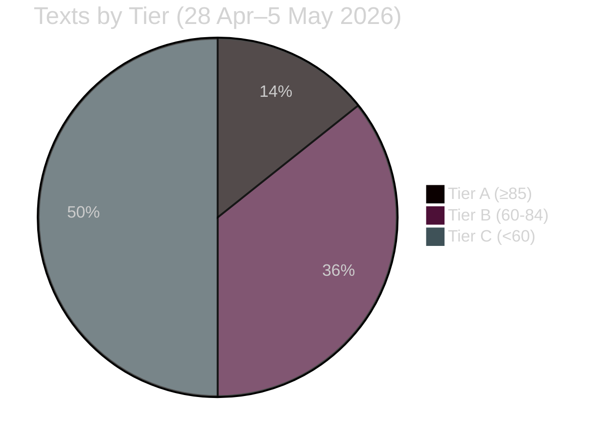

<!-- SPDX-FileCopyrightText: 2026 Hack23 AB -->
<!-- SPDX-License-Identifier: Apache-2.0 -->

# Significance Classification — EP Committee Reports Week 28 April–5 May 2026

**Analysis Date:** 2026-05-05 | **Methodology:** Multi-Criteria Significance Analysis
**Confidence:** 🟢 High

---

## Classification Framework

Texts are assessed on five significance dimensions:
1. **Legislative Weight** (binding vs. non-binding; scope of EU obligation)
2. **Political Salience** (visibility, public interest, coalition significance)
3. **Economic Impact** (direct or indirect financial implications)
4. **Rights Implications** (fundamental rights, rule of law)
5. **Strategic Significance** (EU strategic autonomy, foreign policy, institutional authority)

**Tier A** — Cross-institutional, high-impact: binding legislation or politically transformative resolution
**Tier B** — Significant: major political signal or substantive oversight finding
**Tier C** — Standard: routine legislative progress, technical instruments, follow-on resolutions

---

## Tier A — Cross-Institutional, High-Impact

### TA-10-2026-0112 + TA-10-2026-04-30-ANN01: 2027 Budget Framework (BUDG) ⭐⭐⭐⭐⭐
**Significance Score: 95/100**

These two texts together launch the annual EU budgetary procedure for 2027 — the final year of the 2021–2027 Multiannual Financial Framework. The budget guidelines establish Parliament's negotiating position with the Council; the EP own-estimates define Parliament's institutional spending plans. Together they:
- Trigger Article 314 TFEU constitutional procedure with firm October-November conciliation deadline
- Signal Parliament's spending priorities (defence, competitiveness, climate) for inter-institutional negotiation
- Initiate the last MFF-year budget procedure while MFF-successor negotiations are simultaneously underway

**Classification:** Tier A — Routine constitutional procedure of highest institutional significance
**Committees:** BUDG (lead), all specialised committees contributing opinions
**Legislative weight:** Mixed — own-estimates are binding; guidelines are political signal for mandatory procedure

### TA-10-2026-0160: Enforcement of the Digital Markets Act (IMCO) ⭐⭐⭐⭐⭐
**Significance Score: 90/100**

The DMA enforcement resolution is a politically significant assertion of parliamentary authority over Commission enforcement. By demanding three binding decisions before year-end 2026, Parliament sets a quantified, time-bound political target with reputational consequences for both Commission and Parliament if not met. The text:
- Directly affects trillion-dollar global companies (Apple, Google, Meta, Amazon) and their EU market operations
- Establishes the EU as the global frontier of digital market regulation enforcement
- Creates a mechanism for ongoing Parliamentary oversight of executive enforcement discretion
- Has significant secondary effects on digital market competition, innovation, and EU digital sovereignty

**Classification:** Tier A — High political salience; significant economic implications; strategic EU governance signal
**Committee:** IMCO (lead)

---

## Tier B — Significant

### TA-10-2026-0157: EU Livestock Sector Sustainability (AGRI) ⭐⭐⭐⭐
**Significance Score: 78/100**

Parliament-initiated INI resolution with strong cross-party mandate for a comprehensive EU Livestock Strategy. Significant because:
- Addresses a €170 billion/year sector employing millions across rural EU
- Pre-positions Parliament's demands for CAP pre-reform consultations
- Creates political mandate for Commission to develop substantive policy instrument
- Reflects managed EPP-S&D-Greens compromise that stabilises agricultural coalition ahead of MFF negotiations

**Classification:** Tier B — High economic impact sector; medium legislative weight (INI); strategic for CAP pre-reform

### TA-10-2026-0161: Ukraine Accountability (AFET) ⭐⭐⭐⭐
**Significance Score: 75/100**

Parliament's continued advocacy for Ukraine accountability mechanisms and full use of immobilised Russian assets carries political weight even as a non-binding resolution:
- Maintains EU Parliament's solidarity signal to Ukrainian government and civil society
- Creates political context for Council CFSP discussions on sanctions and support mechanisms
- References the €300 billion immobilised Russian asset question — an ongoing legal-financial-diplomatic challenge
- Shapes the narrative frame for EU-Russia relations in ways that influence member state positions

**Classification:** Tier B — High foreign policy salience; limited legislative weight

### TA-10-2026-0119: EIB Financial Activities Annual Report (CONT) ⭐⭐⭐⭐
**Significance Score: 72/100**

The EIB annual scrutiny text carries significant weight because:
- Identifies systemic verification gaps in the world's largest multilateral development bank's green finance claims
- Creates a track record of parliamentary oversight that will be referenced in subsequent years' reports
- Calls for enhanced OLAF cooperation — potentially triggering investigations into specific EIB projects
- Affects the credibility of EU green bonds and EU climate finance globally

**Classification:** Tier B — High financial and reputational implications; moderate legislative weight

### TA-10-2026-0163: Cyberbullying and Online Harassment (LIBE) ⭐⭐⭐
**Significance Score: 65/100**

INI resolution with a clear mandate for Commission legislative action:
- Addresses a documented and growing social harm affecting millions of EU citizens
- Calls for harmonised criminal law provisions — a constitutionally sensitive area (criminal law remains primarily national)
- Platform operator obligations connect to ongoing DSA implementation
- Protection of journalists and political actors has democracy-preservation implications beyond individual welfare

**Classification:** Tier B — High social salience; medium legislative ambition; path to future binding legislation

### TA-10-2026-0162: Armenian Democratic Resilience (AFET) ⭐⭐⭐
**Significance Score: 62/100**

Foreign policy resolution with genuine strategic significance:
- Armenia's EU integration pathway is geopolitically consequential in the South Caucasus
- Parliament's signal activates Commission/Council engagement processes
- Connects to EU strategic autonomy narrative (expanding EU neighbourhood sphere)

**Classification:** Tier B — Moderate legislative weight; high strategic significance

---

## Tier C — Standard Legislative Progress

### TA-10-2026-0142: EU-Iceland PNR Agreement (LIBE) ⭐⭐⭐
**Significance Score: 55/100**

Standard consent procedure completing the legal framework for Schengen-plus aviation security data sharing. Important for implementation completeness; limited political controversy; well-established legal framework model.

**Classification:** Tier C — Standard international agreement consent; moderate LIBE fundamental rights significance

### TA-10-2026-0115: Dog and Cat Welfare Traceability (AGRI) ⭐⭐⭐
**Significance Score: 52/100**

Significant consumer and welfare legislation that closes an important regulatory gap. High public popularity; limited economic complexity; COD procedure advancing through stages.

**Classification:** Tier C — Standard regulatory progression; high public visibility; moderate economic scope

### TA-10-2026-0122: Performance-Based Instruments Transparency (BUDG) ⭐⭐⭐
**Significance Score: 50/100**

Procedural and oversight text improving the accountability framework for EU performance-conditioned spending. Important for long-term EU financial management but not an immediate policy-change trigger.

**Classification:** Tier C — Accountability/governance improvement; important but not urgent

### TA-10-2026-0132: Discharge 2024 — Committee of Regions (CONT) ⭐⭐
**Significance Score: 38/100**

Standard annual discharge decision. The CoR escape adverse observations; procedurally clean outcome. Relevant to CoR governance but limited wider significance.

**Classification:** Tier C — Routine accountability procedure

### TA-10-2026-0151: Haiti Trafficking/Criminal Groups (AFET) ⭐⭐
**Significance Score: 42/100**

Urgency resolution on a significant humanitarian crisis. Limited EU legislative or executive power directly responsive; primarily political signal and advocacy for humanitarian funding increase.

**Classification:** Tier C — Urgency humanitarian resolution; moral significance exceeds institutional leverage

### TA-10-2026-0105: Immunity Waiver — Patryk Jaki (JURI) ⭐⭐
**Significance Score: 30/100**

Standard individual immunity waiver. Procedural significance for the specific MEP; no general legislative implications.

**Classification:** Tier C — Routine JURI procedure

---

## Significance Distribution

**Tier A texts**: 2 (14.3%) — Budget cycle texts + DMA enforcement
**Tier B texts**: 5 (35.7%) — Livestock, Ukraine, EIB, Cyberbullying, Armenia
**Tier C texts**: 7 (50%) — Routine legislative progress

---

*Significance scoring methodology: composite of 5 sub-dimensions (Legislative Weight 25%, Political Salience 25%, Economic Impact 20%, Rights Implications 15%, Strategic Significance 15%). Scores are analytical assessments, not official EP classifications.*
