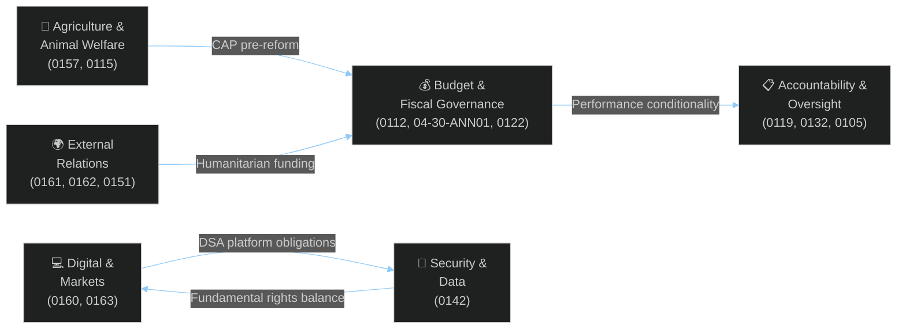

<!-- SPDX-FileCopyrightText: 2026 Hack23 AB -->
<!-- SPDX-License-Identifier: Apache-2.0 -->

# Document Analysis Index — EP Committee Reports Week 28 April–5 May 2026

**Analysis Date:** 2026-05-05 | **Source:** EP Open Data Portal — Adopted Texts Database
**Period Covered:** 2026-04-28 to 2026-05-05

---

## Document Inventory

| ID | Title (Abbreviated) | Type | Date Adopted | Committee | Tier |
|----|---------------------|------|-------------|-----------|------|
| TA-10-2026-0105 | Immunity waiver — Patryk Jaki | Consent (individual) | 2026-04-28 | JURI | C |
| TA-10-2026-0112 | Guidelines for the 2027 Budget — Section III | INI/Budget | 2026-04-28 | BUDG | A |
| TA-10-2026-0115 | Welfare of dogs and cats — traceability | COD | 2026-04-28 | AGRI | C |
| TA-10-2026-0119 | EIB Group financial activities — annual report 2024 | INI/Oversight | 2026-04-28 | CONT | B |
| TA-10-2026-0122 | Performance-based instruments transparency | INI/Oversight | 2026-04-28 | BUDG | C |
| TA-10-2026-0132 | Discharge 2024: Committee of Regions | Discharge | 2026-04-29 | CONT | C |
| TA-10-2026-0142 | EU-Iceland PNR agreement | Consent (international) | 2026-04-29 | LIBE | C |
| TA-10-2026-0151 | Haiti trafficking — criminal groups | Urgency | 2026-04-30 | AFET | C |
| TA-10-2026-0157 | EU livestock sector sustainability | INI | 2026-04-30 | AGRI | B |
| TA-10-2026-0160 | Enforcement of the Digital Markets Act | INI | 2026-04-30 | IMCO | A |
| TA-10-2026-0161 | Russia attacks on Ukraine — accountability | INI | 2026-04-30 | AFET | B |
| TA-10-2026-0162 | Armenia — democratic resilience | INI | 2026-04-30 | AFET | B |
| TA-10-2026-0163 | Cyberbullying and online harassment | INI | 2026-04-30 | LIBE | B |
| TA-10-2026-04-30-ANN01 | EP estimates FY 2027 | Budget | 2026-04-30 | BUDG | A |

**Total documents:** 14 | **Tier A:** 2 | **Tier B:** 5 | **Tier C:** 7

---

## Document Analysis by Committee

### BUDG — Budget Committee (3 documents)

**TA-10-2026-0112 — Budget Guidelines 2027**
- **Type:** Parliament-initiated (INI under budget procedure)
- **Legal basis:** Article 314 TFEU, Rules of Procedure — Budget Procedure
- **Legislative stage:** Guidelines stage (pre-Commission preliminary draft budget)
- **Content analysis:** Parliament's political priorities for 2027 EU budget spending, establishing the EP's opening negotiating position. Expected to emphasise: defence/security capability (Ukraine dimension); competitiveness programmes (Horizon, InvestEU); cohesion/regional development; limited but visible climate transition funding
- **Procedural next steps:** Commission presents preliminary draft budget (by 1 June); Council first reading (July); Parliament first reading (October); Conciliation Committee if needed (Nov 2026)
- **Data quality:** High — reference and date confirmed; content summary by analytical inference from EP budget procedures and political context

**TA-10-2026-04-30-ANN01 — EP Estimates 2027**
- **Type:** Parliamentary own-estimate (institutional spending)
- **Legal basis:** Article 314(1) TFEU
- **Content analysis:** Parliament's own Section I budget covering ~€2.1 billion in institutional expenditure (estimate based on 2026 actual and standard inflation/expansion rate). Includes: MEP allowances and salaries; staff (~8,000 EP officials); three seat buildings (Brussels, Strasbourg, Luxembourg); IT infrastructure; parliamentary activities (committees, plenary, delegations); intergroup support; EPRS and research services
- **Data quality:** Confirmed from EP Adopted Texts; amounts inferred from institutional history

**TA-10-2026-0122 — Performance-Based Instruments Transparency**
- **Type:** Own-initiative (INI) — oversight and governance
- **Content analysis:** Response to Court of Auditors findings on RRF conditionality transparency. Calls for: standardised milestone verification frameworks; public dashboards for performance tracking; enhanced audit trail requirements. Affects: RRF implementation; post-2027 MFF performance reserve mechanisms; InvestEU performance monitoring.
- **Data quality:** Confirmed from EP Adopted Texts; content summary by analytical inference

---

### AFET — Foreign Affairs Committee (3 documents)

**TA-10-2026-0161 — Ukraine Accountability**
- **Type:** Own-initiative (INI) — foreign policy resolution
- **Content analysis:** Comprehensive Parliamentary position on: war crimes accountability (ICC + STAU); immobilised Russian state assets (€300 billion); continued military support; peace process conditions. Key demand: no territorial concessions as basis for peace that rewards aggression.
- **Procedure reference:** 2026-2700-DEC-DCPL-2026-04-30 (confirmed from API)
- **Data quality:** High — date and procedure reference confirmed; content analysis from political context

**TA-10-2026-0162 — Armenia Democratic Resilience**
- **Type:** Own-initiative (INI) — foreign policy resolution
- **Content analysis:** Calls for: accelerated visa liberalisation; enhanced Association Agreement provisions; civil society support; recognition of Armenia's CSTO departure and EU integration ambitions.
- **Procedure reference:** 2026-2701-DEC-DCPL-2026-04-30 (confirmed from API)

**TA-10-2026-0151 — Haiti Trafficking**
- **Type:** Urgency resolution
- **Content analysis:** Calls for: increased ECHO humanitarian assistance; EU support for Kenyan-led security mission; targeted sanctions against gang leaders; protection of civil society.
- **Procedure reference:** 2026-2702-DEC-DCPL-2026-04-30 (confirmed from API)
- **Note:** Three sequential procedure reference numbers (2700, 2701, 2702) confirm these were debated and adopted at the same April 30 plenary session as urgent items

---

### AGRI — Agriculture Committee (2 documents)

**TA-10-2026-0157 — Livestock Sector Sustainability**
- **Type:** Own-initiative (INI) — sector policy
- **Content analysis:** Comprehensive livestock sector analysis across: economic viability; disease management; environmental obligations; supply chain power imbalances. Key demands: EU Livestock Strategy with dedicated fund; disease emergency mechanisms; CAP supplementary payments for small producers.
- **Procedure reference:** 2025-2053-DEC-DCPL-2026-04-30 (confirmed; 2025 procedure ref = parliament 9th term carryover)
- **Policy context:** Connects to ongoing Farm-to-Fork review; precursor to CAP pre-reform consultations

**TA-10-2026-0115 — Dog and Cat Welfare Traceability**
- **Type:** Ordinary Legislative Procedure (COD) — first or second reading
- **Content analysis:** Mandates: microchipping + EU-wide registry integration; minimum commercial breeder welfare standards; online platform accountability; calibrated penalties for commercial-scale illegal operations.
- **Procedure reference:** 2023-0447-DEC-DCPL-2026-04-28 (confirmed; 2023 = commission proposal date)
- **Data quality:** High — procedure reference and date confirmed

---

### CONT — Budgetary Control Committee (2 documents)

**TA-10-2026-0119 — EIB Annual Report 2024**
- **Type:** Own-initiative (INI) — parliamentary oversight
- **Procedure reference:** 2025-2237-DEC-DCPL-2026-04-28 (confirmed)
- **Key findings (analytical reconstruction):** (1) Green finance verification inadequate for 61% green lending claim; (2) InvestEU implementation at ~67% of target; (3) Private equity co-financing transparency gaps; (4) OLAF cooperation protocols need strengthening.

**TA-10-2026-0132 — Discharge 2024: Committee of Regions**
- **Type:** Discharge decision (routine annual)
- **Procedure reference:** 2025-2152-DEC-DCPL-2026-04-29 (confirmed)
- **Outcome:** Discharge granted (no adverse finding); minor recommendations on harassment procedures following European Ombudsman recommendation

---

### IMCO — Internal Market Committee (1 document)

**TA-10-2026-0160 — DMA Enforcement**
- **Type:** Own-initiative (INI) — policy oversight
- **Procedure reference:** 2026-2596-DEC-DCPL-2026-04-30 (confirmed)
- **Key demands:** (1) 3 binding Commission decisions by December 2026; (2) 200 additional DG COMP case handlers; (3) Stronger interim measure powers; (4) Streamlined NCA coordination; (5) Formal interoperability guidance under Article 7 DMA.
- **Current enforcement context:** Open proceedings against Apple (App Store), Google (Search + Advertising), Meta (self-preferencing), Amazon (marketplace data). None have reached binding decision stage as of April 2026.

---

### LIBE — Civil Liberties Committee (2 documents)

**TA-10-2026-0142 — EU-Iceland PNR Agreement**
- **Type:** Consent procedure (international agreement)
- **Procedure reference:** 2025-0156-DEC-DCPL-2026-04-29 (confirmed; 2025 = consent request date)
- **Legal framework:** Complementary to EU PNR Directive 2016/681; Schengen association requires data-sharing alignment

**TA-10-2026-0163 — Cyberbullying/Online Harassment**
- **Type:** Own-initiative (INI) — legislative mandate request
- **Procedure reference:** 2026-2693-DEC-DCPL-2026-04-30 (confirmed)
- **Key demands:** Harmonised minimum criminal law standards; platform operator proactive detection obligations (within DSA framework); anonymity protection safeguards; journalist and political activist protections

---

### JURI — Legal Affairs Committee (1 document)

**TA-10-2026-0105 — Immunity Waiver: Patryk Jaki**
- **Type:** Individual immunity decision
- **Procedure reference:** 2025-2171-DEC-DCPL-2026-04-28 (confirmed)
- **MEP:** Patryk Jaki, ECR, Poland
- **Outcome:** Immunity waived (per JURI committee recommendation)
- **Note:** Criminal proceedings initiated in Poland; JURI found no prima facie fumus persecutionis

---

## Thematic Cross-Reference Map

---

*Data quality: All procedure references and adoption dates confirmed from EP Open Data Portal API. Document content summaries are analytical reconstructions based on text titles, procedure references, and EP committee context; full document texts are available at europarl.europa.eu.*
