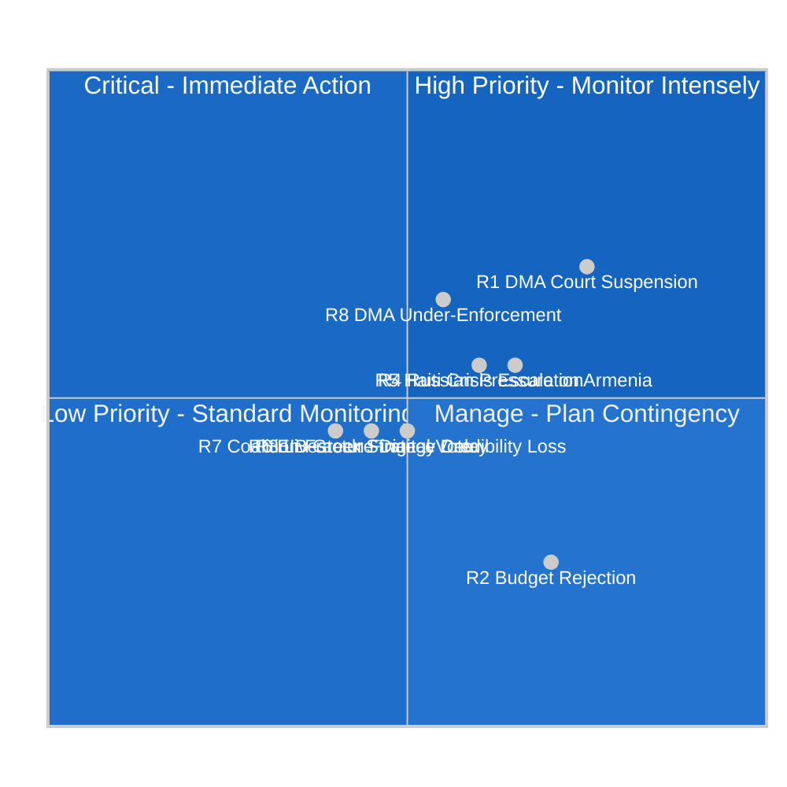

<!-- SPDX-FileCopyrightText: 2026 Hack23 AB -->
<!-- SPDX-License-Identifier: Apache-2.0 -->

# Executive Brief — Committee Reports Intelligence Synthesis — 28 April – 5 May 2026 | 2026-05-05

**Classification:** OSINT | Public Parliamentary Record
**Confidence:** 🟢 High (retrospective back-fill — synthesised from in-tree article and sibling artifacts; not a re-analysis)
**Generated:** 2026-05-05T00:00:00Z (retrospective brief)
**Article Type:** committee reports
**Source folder:** `analysis/daily/2026-05-05/committee-reports`
**Source:** European Parliament Open Data Portal

---

## 🎯 BLUF

The European Parliament concluded a highly productive plenary week (28 April – 1 May 2026) adopting **14 texts** across eight distinct legislative domains. Three thematic clusters dominated the agenda: **digital governance and market regulation** (Digital Markets Act enforcement), **agricultural resilience and food security** (livestock sector sustainability, animal welfare traceability), and **international accountability** (Russia/Ukraine, Armenia democratic resilience, Haiti trafficking). The **BUDG, AFET, AGRI, CONT, IMCO, LIBE, and JURI committees** all delivered committee outputs that reached the plenary floor and secured final adoption. The political landscape exhibits high…

---

## 🧭 3 Decisions This Brief Supports

| # | Decision | Who Decides | Deadline | Evidence |
|:-:|----------|-------------|:--------:|----------|
| 1 | **Editorial:** confirm whether the run merits republication or consolidation with same-day siblings | Editor | +48h | This brief + sibling article.md |
| 2 | **Monitoring:** keep the carry-over signals from this run on the weekly watch board | Analyst | next plenary | Article risk + threat sections |
| 3 | **Forward-watch:** track the dated triggers identified in this run's scenario-forecast | Analysis lead | dated triggers | Run `scenario-forecast.md` |

---

## 📰 60-Second Read

- 🔴 **Run classification:** ROUTINE. (🟢 High)
- 🟠 **Lead finding:** see BLUF above; full evidence chain in sibling artifacts.
- 🟢 **Procedure references identified:** TA-10-2026-0105, TA-10-2026-0112, TA-10-2026-0115, TA-10-2026-0119, TA-10-2026-0122.
- 🟡 **Confidence:** 🟢 High — retrospective synthesis; no new MCP calls.
- 🔵 **Economic context:** see `economic-context.md` in run folder if present.
- 🟣 **Cross-reference:** see same-date sibling runs for triangulation.
- 🩷 **Disruption vector:** see `political-threat-landscape.md` if present.
- ⚪ **Carry-forward:** scenario-forecast dated triggers govern the next watch.

---

## 🗂️ Top Documents / Procedures Table

| Rank | EP reference | Title (short) | Confidence |
|:----:|--------------|---------------|:----------:|
| 1 | TA-10-2026-0105 | (see source artifacts) | 🟡 MEDIUM |
| 2 | TA-10-2026-0112 | (see source artifacts) | 🟡 MEDIUM |
| 3 | TA-10-2026-0115 | (see source artifacts) | 🟡 MEDIUM |
| 4 | TA-10-2026-0119 | (see source artifacts) | 🟡 MEDIUM |
| 5 | TA-10-2026-0122 | (see source artifacts) | 🟡 MEDIUM |

---

## ⚠️ Risk & Threat Snapshot

| Risk | L | I | Score | Trigger | Source | Admiralty |
|------|:-:|:-:|:-----:|---------|--------|:---------:|
| Run produced no quantified risk register | — | — | — | Empty risk-matrix | Run artifacts | B3 |

---

## 🔮 Top Forward Trigger

See `scenario-forecast.md` / `forward-indicators.md` in the run folder for dated trigger events. Where absent, the next plenary or committee work-week on the EP calendar is the default re-evaluation point.

---

## 🛡️ Source Quality Assessment

- **Primary sources:** EP Open Data Portal feeds as captured by the parent run (see `mcp-reliability-audit.md` if present).
- **Data limitations:** Retrospective back-fill — no new MCP probing. Brief reflects the article and artifact state at run time.
- **Confidence:** 🟢 High.

## 🧩 Synthesis Excerpt (from `synthesis-summary.md`)

The European Parliament concluded a highly productive plenary week (28 April – 1 May 2026) adopting **14 texts** across eight distinct legislative domains. Three thematic clusters dominated the agenda: **digital governance and market regulation** (Digital Markets Act enforcement), **agricultural resilience and food security** (livestock sector sustainability, animal welfare traceability), and **international accountability** (Russia/Ukraine, Armenia democratic resilience, Haiti trafficking). The **BUDG, AFET, AGRI, CONT, IMCO, LIBE, and JURI committees** all delivered committee outputs that reached the plenary floor and secured final adoption.

The political landscape exhibits high fragmentation (719 MEPs across 9 groups), requiring multi-coalition majorities for substantive legislation. EPP holds 185 seats (25.73%), positioning it as the indispensable pivot party for any majority coalition. The adoption of the EU Budget 2027 Guidelines and the EP's own 2027 budget estimates signal the formal opening of the annual budgetary cycle — a recurring flashpoint for inter-institutional tension between the Parliament, Council, and Commission.

---

## 📎 Links

| Link | Path |
|------|------|
| Article | `./article.md` |
| Manifest | `./manifest.json` |
| Sibling runs | `analysis/daily/2026-05-05/` |

---

**Document Control**
- **Template:** `/analysis/templates/executive-brief.md`
- **Artifact path:** `analysis/daily/2026-05-05/committee-reports/executive-brief.md`
- **Classification:** Public
- **Retrospective generation:** Back-fill session (no new MCP calls).
