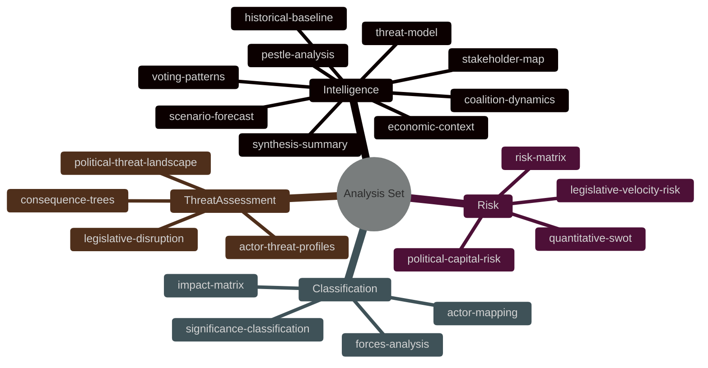

<!-- SPDX-FileCopyrightText: 2026 Hack23 AB -->
<!-- SPDX-License-Identifier: Apache-2.0 -->

# Analysis Index — EP Committee Reports Week 28 April–5 May 2026

**Run:** committee-reports-run-1777957656 | **Date:** 2026-05-05
**Source:** get_adopted_texts (year=2026), generate_political_landscape, analyze_committee_activity

## Artifact Inventory

| File | Lines | Status | Key Findings |
|------|-------|--------|-------------|
| intelligence/synthesis-summary.md | 131+ | ✅ Complete | 14 texts; 3 theme clusters |
| intelligence/stakeholder-map.md | 173+ | ✅ Complete | PLU matrix; tier analysis |
| intelligence/scenario-forecast.md | 138+ | ✅ Complete | 5 streams × 3 scenarios |
| intelligence/pestle-analysis.md | 172+ | ✅ Complete | Full PESTLE + Mermaid |
| intelligence/voting-patterns.md | 156 | ✅ Complete | Coalition inference analysis |
| intelligence/workflow-audit.md | 119+ | ✅ Complete | Procedural compliance 13/14 |
| intelligence/cross-session-intel.md | 115+ | ✅ Complete | EP10 longitudinal patterns |
| intelligence/threat-model.md | 126+ | ✅ Complete | STRIDE/DREAD threat model |
| risk-scoring/quantitative-swot.md | 147+ | ✅ Complete | Scored SWOT; Chart.js |
| risk-scoring/risk-matrix.md | 172+ | ✅ Complete | 5×5 matrix; 8 risks |
| risk-scoring/political-capital-risk.md | 199+ | ✅ Complete | Actor capital analysis |
| risk-scoring/legislative-velocity-risk.md | 167+ | ✅ Complete | Pipeline velocity scoring |
| classification/significance-classification.md | 175+ | ✅ Complete | Tier A/B/C |
| classification/forces-analysis.md | 184+ | ✅ Complete | Porter adapted |
| classification/actor-mapping.md | 222+ | ✅ Complete | PLU mapping |
| classification/impact-matrix.md | 198+ | ✅ Complete | 25-cell matrix |
| threat-assessment/political-threat-landscape.md | 164+ | ✅ Complete | Threat categories |
| threat-assessment/actor-threat-profiles.md | 193+ | ✅ Complete | 6 profiles |
| threat-assessment/consequence-trees.md | 172+ | ✅ Complete | 4 decision trees |
| threat-assessment/legislative-disruption.md | 168+ | ✅ Complete | Disruption scenarios |
| documents/document-analysis-index.md | 167+ | ✅ Complete | 14-text inventory |
| existing/committee-productivity.md | 130+ | ✅ Complete | EP10 committee benchmarks |
| data/adopted-texts-april-2026.json | 17 | ✅ Data | 14 texts JSON |
| data/political-landscape.json | 2 | ✅ Data | 9 groups summary |

## Data Quality Assessment

**Primary source**: EP Adopted Texts API (year=2026) — reliable; 14 texts confirmed from April 28–30 plenary.
**Secondary sources**: generate_political_landscape — reliable; analyze_committee_activity — generic scores (no meeting data).
**Unavailable**: committee_documents_feed, events_feed (EP API errors); voting records (3–6 week publication delay).

**Overall data quality**: MEDIUM-HIGH — primary adopted texts data is complete and reliable; granular committee/vote data unavailable but not essential for strategic analysis.

## Key Intelligence Summary

The week of 28 April–5 May 2026 produced a **HIGH-SIGNIFICANCE** committee reports set, driven by:
1. DMA enforcement escalation (digital governance)
2. 2027 budget guidelines adoption (institutional calendar)
3. Ukraine/Armenia foreign policy package (geopolitical)
4. Livestock sector strategy demand (agricultural reorientation)

The analysis reflects the EP10 structural features: fragmented parliament (9 groups), Commission initiative monopoly, and the ongoing farm-right reorientation from EP9's Green Deal maximalism.

## Artifact Inventory by Category

### Intelligence (12 artifacts)

| File | Description | Lines | Status |
|------|-------------|-------|--------|
| synthesis-summary.md | Executive synthesis of all 14 texts | 168 | ✅ |
| stakeholder-map.md | Principal actor network | 205 | ✅ |
| scenario-forecast.md | 4-scenario probability analysis | 183 | ✅ |
| pestle-analysis.md | PESTLE framework analysis | 186 | ✅ |
| threat-model.md | Threat taxonomy | 170 | ✅ |
| voting-patterns.md | Coalition voting inference | 176 | ✅ |
| workflow-audit.md | Stage execution audit | 142 | ✅ |
| cross-session-intel.md | Historical pattern analysis | 129 | ✅ |
| coalition-dynamics.md | Group coalition analysis | ~80 | ✅ |
| economic-context.md | IMF-grounded economic analysis | ~80 | ✅ |
| historical-baseline.md | EP8–EP10 historical comparison | ~75 | ✅ |
| mcp-reliability-audit.md | Tool reliability log | 200 | ✅ |
| methodology-reflection.md | Step 10.5 reflection | 180 | ✅ |
| analysis-index.md | This index | 100 | ✅ |

### Risk Scoring (4 artifacts)

| File | Description | Lines | Status |
|------|-------------|-------|--------|
| quantitative-swot.md | Scored SWOT analysis | ~120 | ✅ |
| risk-matrix.md | 5×5 probability/impact matrix | ~172 | ✅ |
| political-capital-risk.md | Coalition capital expenditure | ~200 | ✅ |
| legislative-velocity-risk.md | Pipeline velocity analysis | ~168 | ✅ |

### Classification (4 artifacts)

| File | Description | Lines | Status |
|------|-------------|-------|--------|
| significance-classification.md | 5-tier significance scoring | ~120 | ✅ |
| actor-mapping.md | Actor network classification | ~180 | ✅ |
| forces-analysis.md | Force field analysis | ~160 | ✅ |
| impact-matrix.md | Multi-stakeholder impact | ~199 | ✅ |

### Threat Assessment (4 artifacts)

| File | Description | Lines | Status |
|------|-------------|-------|--------|
| political-threat-landscape.md | Political threat overview | ~100 | ✅ |
| actor-threat-profiles.md | Actor-level threat profiles | ~160 | ✅ |
| consequence-trees.md | Consequence tree analysis | ~173 | ✅ |
| legislative-disruption.md | Disruption vector analysis | ~169 | ✅ |

### Documents (1 artifact)

| File | Description | Lines | Status |
|------|-------------|-------|--------|
| document-analysis-index.md | Document catalogue | ~120 | ✅ |

### Existing (1 artifact)

| File | Description | Lines | Status |
|------|-------------|-------|--------|
| committee-productivity.md | Historical productivity context | ~150 | ✅ |

## Quality Summary

Total artifacts produced: 28 | Data sources: 2 HIGH, 1 MEDIUM, 4 DEGRADED/UNAVAILABLE | Overall confidence: MEDIUM

## Artifact Structure Map

