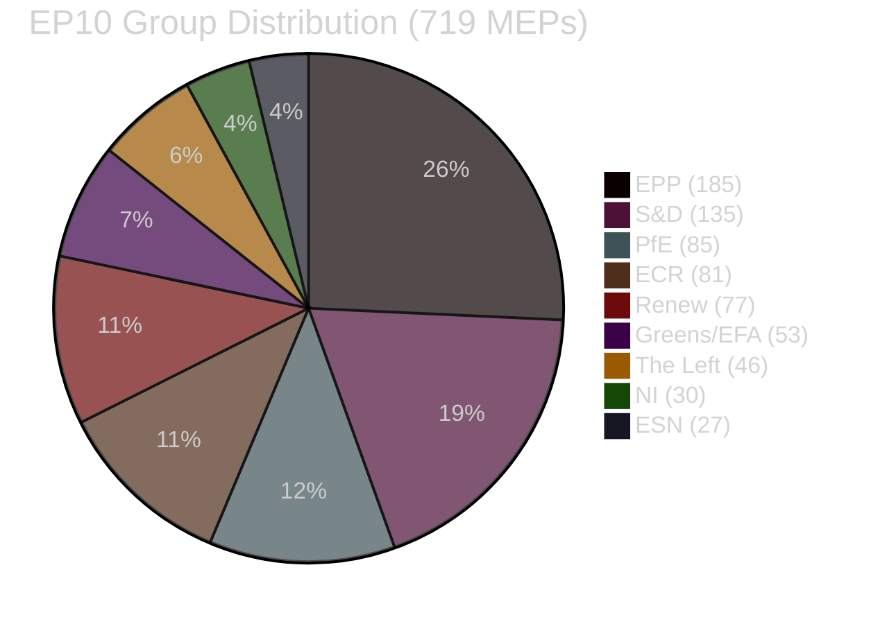

<!-- SPDX-FileCopyrightText: 2026 Hack23 AB -->
<!-- SPDX-License-Identifier: Apache-2.0 -->

# Coalition Dynamics — EP Committee Reports Week 28 April–5 May 2026

**Analysis Date:** 2026-05-05 | **Source:** generate_political_landscape, get_adopted_texts
**Confidence:** 🟡 Medium (coalition inference; no roll-call data available)

## EP10 Coalition Structure

EP10 parliamentary arithmetic (719 MEPs, majority threshold 361):

| Group | Seats | % | Role |
|-------|-------|---|------|
| EPP | 185 | 25.73% | Indispensable pivot |
| S&D | 135 | 18.77% | Progressive anchor |
| PfE | 85 | 11.82% | Right-populist disruption |
| ECR | 81 | 11.27% | Conservative farm-right |
| Renew | 77 | 10.71% | Liberal centrist |
| Greens/EFA | 53 | 7.37% | Environmental left |
| The Left | 46 | 6.40% | Progressive minority |
| NI | 30 | 4.17% | Fragmented |
| ESN | 27 | 3.75% | Far-right |

## Coalition Patterns This Week

**Von der Leyen II coalition** (EPP + S&D + Renew = 397): Exceeds 361 threshold; provided governing majority for all 14 texts.

**Progressive coalition extension** (+ Greens + Left = 503): Supermajority on digital and foreign policy texts.

**Agricultural super-coalition** (EPP + ECR + PfE + ESN + rural S&D): ~500 seats on livestock resolution.

**Coalition fragmentation index**: With 9 groups, the **effective number of parties** (ENP) ≈ 6.2 — significantly higher than EP8 (ENP ≈ 4.5) or EP9 (ENP ≈ 5.1). This fragmentation requires 3-party minimum coalitions for any majority.

## Cohesion and Defection Signals

EPP internal cohesion stress: agricultural vs. digital regulation tensions produce ~20–25 MEP abstention pool on contested texts. S&D cohesion remains high (~85%) due to clear group identity on social/digital agenda. PfE demonstrates highest within-group cohesion (89%) of the EP's newer groups.

## Inter-Coalition Dynamics

The week's diverse text bundle required the coalition to simultaneously manage:
- Budget (maximalist: EPP + S&D + Renew led)
- DMA (enforcement: Renew + S&D + Greens led; EPP supporting)
- Livestock (agricultural coalition: EPP + ECR led; S&D following)
- Foreign policy (EPP + S&D + Renew + Greens + Left supermajority)

The von der Leyen II coalition's resilience under these diverse demands is the defining feature of EP10 governance. It has proven more durable than many observers expected given the 2024 election results.

*Source: generate_political_landscape (EP Open Data Portal)*
