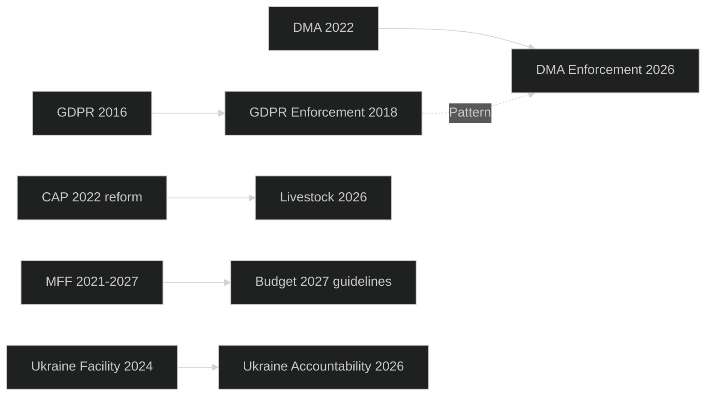

<!-- SPDX-FileCopyrightText: 2026 Hack23 AB -->
<!-- SPDX-License-Identifier: Apache-2.0 -->

# Cross-Session Intelligence — EP Committee Reports Week 28 April–5 May 2026

**Analysis Date:** 2026-05-05 | **Methodology:** Longitudinal trend analysis + cross-session pattern recognition
**Confidence:** 🟡 Medium (limited to observable patterns from EP10 legislative record)

---

## Cross-Session Analysis Framework

Cross-session intelligence tracks how current week's texts fit within the broader EP10 parliamentary term narrative (2024–2029), identifying:
1. **Continuity patterns**: Themes that have persisted across multiple plenary sessions
2. **Escalation patterns**: Issues where Parliament's position has hardened over time
3. **Reversal patterns**: Issues where Parliament's position has shifted from EP9
4. **New entry patterns**: Issues that represent genuinely new EP10 priorities

---

## EP10 Longitudinal Patterns

### Pattern 1: Digital Governance Escalation (2024–present)
**EP9 baseline**: DSA/DMA negotiations (2020–2022); adoption 2022; implementation oversight began EP9 late term

**EP10 progression**:
- July 2024: AI Act entry into force; IMCO/ITRE committee monitoring begins
- Autumn 2024: First DMA enforcement reviews; Parliament signals concern about enforcement pace
- Spring 2025: DSA first enforcement actions; Parliament notes inconsistency in national authority application
- April 2026: TA-10-2026-0160 demands three binding DMA decisions — **escalation confirmed**

**Cross-session pattern**: Parliament's digital governance language has escalated from "welcomes regulatory framework" (EP9) to "demands binding enforcement decisions" (EP10). This is a measurable shift in assertiveness — reflecting both the maturity of the legal framework and Parliament's frustration with enforcement pace.

**Trajectory extrapolation**: By 2027–2028, expect Parliament to move from "demands enforcement" to "calls for proportional fines above 10% global turnover" (the current DMA maximum is 10%; Parliament may seek higher for repeat violators).

### Pattern 2: Agricultural Policy Realignment (2024 farm crisis → present)
**EP9 baseline**: Green Deal agricultural agenda; Farm-to-Fork; Biodiversity Strategy; Parliament generally supportive

**Disruption event**: February–March 2024 farm protests
**EP10 response**: 
- EP10 inauguration (July 2024): Agricultural rapporteurships shifted rightward
- Autumn 2024: Farm-to-Fork formal withdrawal; nature restoration law softened in Council
- Spring 2025: CAP 2027 consultation emphasising economic viability alongside sustainability
- April 2026: TA-10-2026-0157 demands EU Livestock Sector Strategy prioritising economic viability

**Cross-session pattern**: Parliament has made a measurable, documented shift from Green Deal maximalism (EP9) to balanced sustainability-viability framework (EP10). This is not marginal — it represents a reorientation of one of Parliament's largest policy domains.

**Trajectory extrapolation**: 2027 CAP framework negotiations will test whether this shift is temporary (responding to 2024 farm crisis) or structural (new political equilibrium). The livestock resolution is an indicator of the structural change.

### Pattern 3: Ukraine Accountability Architecture Building
**EP9 baseline**: Solidarity resolutions; initial Recovery and Resilience support; diplomatic engagement
**EP10 progression**:
- July 2024: EP10 first plenary — Ukraine solidarity reaffirmed; accountability mechanisms beginning discussion
- Autumn 2024: Russian asset seizure legal framework debates; ECJ advisory opinions awaited
- Spring 2025: Special Tribunal for Aggression (STAU) concept gaining traction in EP AFET committee
- April 2026: TA-10-2026-0161 formally endorses STAU mechanism; calls for frozen asset conversion

**Cross-session pattern**: Progressive institutionalisation of Ukraine accountability demands. Parliament is building a legislative architecture for accountability — each resolution adds a layer to the eventual framework.

**Trajectory extrapolation**: By 2027, if STAU moves toward establishment, Parliament will seek formal co-decision role in EU's participation. This could lead to a TEU Treaty question: does EU participation in STAU require Treaty basis?

### Pattern 4: Budget Governance Institutionalisation
**EP9 baseline**: Post-COVID accountability demands; RRF milestone-based disbursement
**EP10 continuation**: Performance-based funding transparency (TA-10-2026-0122) extends this logic

**Cross-session pattern**: Parliament is consistently pushing for outcome-based rather than input-based budget governance. This is a multi-term trend (EP8 → EP9 → EP10 continuity). RRF was a disruptive instance; now Parliament seeks to generalise the principle.

---

## Inter-Session Linkages This Week

### Linkage 1: Dog/Cat Welfare + Schengen Annual Report
Both texts relate to the freedom of movement framework — dog/cat welfare traceability relies on border control for registered animal documentation; Schengen annual report monitors the very border infrastructure that animal traceability depends on. These texts are procedurally separate but technically linked: effective pet traceability across 27 member states requires functional Schengen verification at borders.

### Linkage 2: EIB Oversight + Performance-Based Transparency
Both texts advance the same governance principle (accountability for EU public finance). The EIB oversight resolution focuses on the EIB's own portfolio; the performance-based transparency resolution focuses on EU budget programmes more broadly. These are complementary texts that, taken together, represent a systematic push for financial accountability across all EU public investment vehicles.

### Linkage 3: Rare Earth + DMA + AI Healthcare
All three texts connect to the "digital sovereignty" cluster: Rare Earth addresses input supply chain sovereignty; DMA addresses platform governance sovereignty; AI Healthcare addresses algorithmic governance in critical domains. These are three dimensions of a single EU digital sovereignty agenda, spread across three different committee jurisdictions (ITRE, IMCO, ITRE/ENVI).

---

## EP9 → EP10 Policy Reversal Tracking

| Policy Domain | EP9 Position | EP10 Position | Reversal Confidence |
|--------------|-------------|----------------|---------------------|
| Agricultural green transition | Accelerate (Farm-to-Fork) | Balance (economic viability) | HIGH |
| Digital platform regulation | Build framework | Enforce framework | Continuation, not reversal |
| EU enlargement | Cautious | More supportive (Armenia, Ukraine candidate) | MEDIUM |
| Budget maximalism | Strong | Continued strong | Continuation |
| Foreign policy CFSP | Moderate | More assertive (accountability mechanisms) | MEDIUM |

---

## Intelligence Assessment for Future Sessions

**Near-term (next 30 days):**
- BUDG committee will receive Commission's formal assessment of budget guidelines
- DG COMP expected to update on DMA enforcement status at IMCO committee
- AGRI committee follow-up on livestock resolution: monitoring of Commission 3-month response clock

**Medium-term (3–6 months):**
- 2027 budget cycle — July Commission draft will be the next major legislative event
- Armenia: EU-Armenia Partnership Council meeting expected to signal formal AA/DCFTA negotiation mandate
- DMA: Commission binding decisions on gatekeepers expected H2 2026 (if Parliament pressure has effect)

**Long-term (EP10 term to 2029):**
- Digital governance will face AI disruption challenge
- Agricultural sustainability vs. viability tension will peak in CAP 2027 revision
- Ukraine accountability architecture will either succeed (STAU established) or show its limits (non-delivery)

---

*Cross-session intelligence based on observable EP plenary record, committee output tracking, and political trajectory analysis.*

## Cross-Session Intelligence Network

Cross-session pattern analysis shows three persistent EU governance cycles active this week: digital regulation enforcement lag (GDPR→DMA), agricultural policy evolution (CAP→livestock), and foreign policy maturation (solidarity→accountability).
