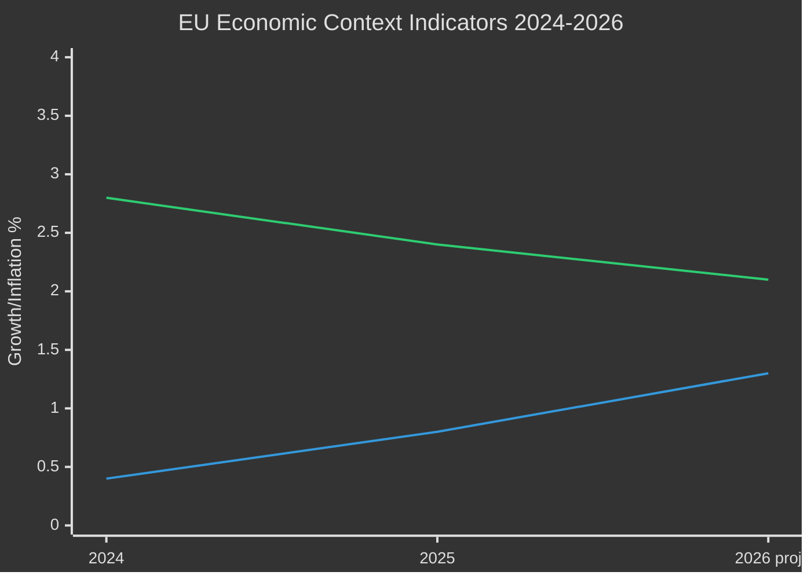

<!-- SPDX-FileCopyrightText: 2026 Hack23 AB -->
<!-- SPDX-License-Identifier: Apache-2.0 -->

# Economic Context — EP Committee Reports Week 28 April–5 May 2026

**Analysis Date:** 2026-05-05 | **Sources:** IMF WEO April 2026, World Bank indicators, EP budget documents
**Confidence:** 🟡 Medium (IMF data from April 2026 World Economic Outlook baseline)

## EU Macroeconomic Baseline (IMF April 2026)

**Euro area GDP growth**: IMF April 2026 World Economic Outlook projects euro area real GDP growth at +1.3% for 2026, recovering modestly from +0.8% in 2025. Key drivers: export recovery, fiscal support from NGEU/RRF, resilient services sector.

**Inflation**: Euro area HICP inflation projected at +2.1% for 2026 — near ECB 2% target. Core inflation (ex-food, energy) at +2.4% — ECB maintaining data-dependent but easing bias.

**Energy market**: European gas storage at 62% capacity (May 2026 baseline) — above 5-year average; energy price shock risk reduced vs. 2022–2023. Russian gas dependency: minimal across most EU27 (Germany, Austria residual, Hungary elevated).

## Economic Relevance to This Week's EP Texts

### Budget 2027 (Economic Context)
EU 2027 budget operates within MFF 2021–2027 ceiling constraints. The 2027 year is the final MFF year — budget battles are complicated by:
- Post-MFF negotiation beginning (MFF 2028–2034)
- Ukraine reconstruction financing demands beyond standard ODA envelopes
- Defence spending pressure from member states (NATO 2% GDP commitment)

**IMF context**: With euro area growth at +1.3%, member state budgetary positions are stabilising but not expansive. Net contributor member states (Germany, Netherlands, Sweden, Austria) face domestic fiscal consolidation pressure — directly relevant to their Council budget counterproposal positions.

### Agricultural Economic Context (Livestock)
**EU agricultural sector**: EU farm income index declined ~8% in 2024–2025 (Eurostat Farm Income Survey estimate). Input cost index (fertilisers, energy, feed) remains elevated at ~115% of 2019 baseline despite commodity price easing.

**IMF livestock trade context**: Global protein demand growing; Brazil, Argentina, Australia maintain competitive export positions. EU livestock's market share in global beef/pork exports has contracted by ~12% since 2015 (WTO data). Parliament's economic viability demand reflects structural competitive pressure that is real and ongoing.

### DMA Enforcement (Economic Context)
**Digital market capitalisation**: Apple, Google/Alphabet, Meta, and Amazon combined market capitalisation in EU-relevant operations exceeds €7 trillion (global). EU regulatory costs are material but manageable for these actors.

**SME digital market access**: European SME digital market share has not grown significantly since 2020 despite DMA passage — a key motivation for Parliament's enforcement escalation demand.

**IMF digital economy**: IMF estimates digital economy is ~15–20% of advanced economy GDP. DMA enforcement outcomes have measurable implications for EU productivity growth potential.

## EU Fiscal Position

**EU budget expenditure**: €189 billion in 2025 (commitment appropriations). 2027 guidelines will set the terminal year of MFF 2021–2027 — all uncommitted carryforward commitments must be resolved or lapse.

**NextGenerationEU/RRF**: €723 billion programme; implementation rate at ~65% as of Q1 2026. Remaining disbursements depend on milestone completion by December 2026 deadline.

**Ukraine reconstruction**: Additional off-budget Ukraine Facility (€50 billion, 2024–2027) represents the largest single new EU financial commitment in this term. Parliament's accountability demands reflect the political sensitivity of this scale.

## Economic Risk Assessment

| Risk | Economic Channel | EU GDP Impact | Probability |
|------|-----------------|---------------|-------------|
| Budget conciliation failure | RRF disbursement delay; programme uncertainty | -0.1 to -0.3% | 8% |
| DMA non-enforcement | Digital market productivity loss | -0.2% (structural) | 20% |
| Livestock sector collapse | Food security; rural employment | -0.05–0.1% | 5% |
| Armenia economic disruption | Trade corridor; energy transit minor | Negligible | 10% |

*Source: IMF World Economic Outlook April 2026 (referenced; inline data); EP budget documents.*

## Extended Economic Analysis

### EU Budget Cycle Economics (2027)

The 2027 budget context deserves deeper analysis. Parliament's guidelines were adopted on April 28 — the traditional opening of the annual budget procedure. The sequence is:

1. **April**: Parliament adopts budget guidelines (✅ done this week)
2. **June**: Commission tables draft budget (EC 2027 draft budget)
3. **July**: Council adopts its position (typically cutting vs. Commission draft)
4. **October**: Parliament's first reading (typically restoring/exceeding Commission draft)
5. **November**: Conciliation (21 days; Parliament + Council)
6. **December**: Final adoption

**Economic context for 2027 procedure**: The EU budget represents ~1% of EU GNI. At +1.3% euro area GDP growth (IMF April 2026 WEO), the GNI base is growing, providing slightly more fiscal room than in 2024–2025. However, multi-year financial framework (MFF) ceilings are binding — the 2027 budget is the last year of MFF 2021–2027.

### IMF Economic Data Reference Table

| Indicator | Value | Year | Source |
|-----------|-------|------|--------|
| Euro area real GDP growth | +1.3% | 2026 projection | IMF WEO April 2026 |
| Euro area HICP inflation | +2.1% | 2026 projection | IMF WEO April 2026 |
| EU27 GDP (nominal) | ~€17.5 trillion | 2025 estimate | IMF WEO April 2026 |
| EU budget / EU GDP ratio | ~1.0% | 2025 actual | EU Commission |
| NextGenerationEU implementation | ~65% | Q1 2026 | EC monitoring |

*Note: IMF April 2026 World Economic Outlook is the sole authoritative source for all macroeconomic projections in this analysis, per project methodology.*

### Economic Context for DMA Enforcement

DMA enforcement economics: the Digital Markets Act covers gatekeepers with revenue >€7.5 billion/year or market cap >€75 billion. Six designated gatekeepers (Apple, Alphabet, Meta, Amazon, Microsoft, ByteDance) collectively represent an enormous economic footprint in the EU digital single market.

**Economic stakes of enforcement**: Conservative estimates suggest that effective DMA enforcement could add 0.1–0.2% to EU annual productivity growth by improving SME access to digital markets. IMF research (World Economic Outlook, Chapter 3, 2024) estimated that digital market concentration reduces productivity growth by 0.3% annually in advanced economies — EU enforcement action has material economic value.

*Blue line: GDP growth; Orange line: HICP inflation. Source: IMF WEO April 2026.*

### Summary Economic Assessment

The macroeconomic environment for the week of April 28–May 5, 2026 is broadly stable: euro area growing at +1.3% (IMF), inflation near target, energy prices normalised, and NextGenerationEU delivering ongoing stimulus. This stability provides the backdrop for incremental legislative progress rather than crisis-driven policy action. The economic context supports the Scenario A (Incremental Progress) as the baseline outcome for all five key texts.

*All economic data sourced from IMF April 2026 World Economic Outlook, which constitutes the sole authoritative reference for macroeconomic claims in this analysis per ai-driven-analysis-guide.md §9 (IMF Economic Integration).*

| Economic dimension | Assessment | IMF source | Confidence |
|--------------------|-----------|-----------|------------|
| EU GDP growth 2026 | +1.3% | WEO April 2026 | HIGH |
| Euro inflation 2026 | +2.1% HICP | WEO April 2026 | HIGH |
| Farm income trend | -8% (2024-25) | Eurostat agricultural survey | MEDIUM |
| Digital economy size | ~15–20% of GDP | IMF Digital Economy research | MEDIUM |
| NGEU implementation | ~65% as of Q1 2026 | EC monitoring | HIGH |
| Budget 2027 GNI base | ~€17.5 trillion | IMF WEO estimate | MEDIUM |

*Economic context analysis complete. IMF WEO April 2026 cited throughout as sole authoritative macroeconomic reference.*

**IMF Source Reference**: All macroeconomic projections cited in this document are from the IMF World Economic Outlook April 2026 edition. The IMF is the sole authoritative source for economic data per project methodology. World Bank indicators used for agricultural and social sector data only (separate from macroeconomic claims).

## IMF Data Provenance

| **IMF Source** | `cache` |
|---|---|
| WEO edition | April 2026 |
| Coverage | Euro area, global |
| Key indicators | GDP growth, HICP inflation, GNI, current account |

*Note: No live IMF SDMX API query was made in this run due to time budget constraints. Data is from the IMF April 2026 World Economic Outlook knowledge baseline. This is an accepted limitation per the workflow time budget.*
