<!-- SPDX-FileCopyrightText: 2026 Hack23 AB -->
<!-- SPDX-License-Identifier: Apache-2.0 -->

# MCP Reliability Audit — EP Committee Reports Week 28 April–5 May 2026

**Analysis Date:** 2026-05-05 | **Run:** committee-reports-run-1777957656

## MCP Tool Reliability Assessment

This audit documents the reliability and data quality of EP MCP server tools used in Stage A data collection.

| Tool | Status | Data Quality | Notes |
|------|--------|-------------|-------|
| `get_adopted_texts` (year=2026) | ✅ AVAILABLE | HIGH | 50 results returned; 14 texts April 28–30; titles, dates, procedure refs present |
| `generate_political_landscape` | ✅ AVAILABLE | HIGH | Full 9-group composition; 719 MEPs; seat counts accurate |
| `analyze_committee_activity` (ENVI) | ✅ AVAILABLE | MEDIUM | Generic HIGH workload scores; no actual meeting data |
| `analyze_committee_activity` (ECON) | ✅ AVAILABLE | MEDIUM | Generic HIGH workload scores; no actual meeting data |
| `analyze_committee_activity` (IMCO) | ✅ AVAILABLE | MEDIUM | Generic HIGH workload scores; no actual meeting data |
| `get_committee_documents_feed` | ❌ UNAVAILABLE | N/A | EP API error; no data returned |
| `get_events_feed` | ❌ UNAVAILABLE | N/A | EP API error; no data returned |
| `get_procedures_feed` | ⚠️ DEGRADED | LOW | Returns historical procedures (1972–1990) without metadata; not useful |
| `get_plenary_sessions` | ⚠️ DEGRADED | LOW | Returns count but empty session data |
| `get_voting_records` (Apr 28–May 5) | ❌ EMPTY | N/A | Roll-call data publication delay (3–6 weeks); expected empty |
| `get_plenary_documents` (2026) | ⚠️ DEGRADED | LOW | Returns reference numbers only; no titles or summaries |
| `get_committee_documents` | ⚠️ DEGRADED | LOW | Returns AFCO documents without dates/summaries |

## Data Coverage Assessment

**Coverage rate**: 2/11 tools returned HIGH quality data. Primary analysis based on `get_adopted_texts` (strong) and `generate_political_landscape` (strong). 9 tools either unavailable, degraded, or returning empty data.

**Impact on analysis quality**: The analysis is based primarily on adopted texts (the final legislative output) rather than committee process inputs (documents, meetings, proceedings). This means the analysis reflects the results of committee work but cannot assess the quality of the underlying process — rapporteur choices, amendment negotiations, committee vote margins.

**Mitigation**: Adopted texts provide sufficient basis for strategic analysis. The 14 texts contain full titles, adoption dates, procedure references, and legal basis — adequate for impact assessment, stakeholder mapping, scenario analysis, and risk scoring.

## EP API Known Issues (Run #25358722153)

1. **committee_documents_feed**: Known EP API instability; returned errors. This is a recurring issue in EP10 — the committee documents feed has been intermittently unavailable.
2. **events_feed**: Known EP API instability; returned errors. Workaround: use `get_plenary_sessions` with year filter (also degraded this run).
3. **procedures_feed**: Historical record ordering bug — returns 1970s–1990s procedures without current-year metadata. Known upstream EP API bug; flagged in prior runs.
4. **voting_records**: Expected empty for recent dates; EP roll-call publication delay is structural, not a bug.

## Reliability Comparison vs. Prior Runs

The EP MCP server reliability pattern in this run is consistent with previous committee-reports runs. The adopted texts feed remains the most reliable primary data source for this article type. Committee documents and events feeds are the least reliable — the analysis pipeline for committee-reports should be designed to degrade gracefully when these feeds are unavailable.

**Recommendation**: Future committee-reports runs should prioritise `get_adopted_texts` as primary source and treat committee documents feeds as supplementary/optional.

*Audit generated from Stage A data collection log.*

## Detailed Tool Response Audit

### Tool: get_adopted_texts (year=2026)

**Status**: ✅ OPERATIONAL  
**Response time**: ~8 seconds  
**Data returned**: 50 items (paginated, limit=50, offset=0)  
**Items in analysis window** (April 28–May 5): 14 texts  
**Data fields available**: id, title, dateAdopted, committee, subjectMatter  
**Data fields missing**: vote margins, amendment counts, rapporteur name, full text body  

**Quality Assessment**: HIGH for strategic analysis purposes. Titles and subject matter codes provide sufficient basis for committee activity analysis. The absence of vote margins and rapporteur details reduces depth of committee process analysis but does not prevent strategic impact assessment.

**Representative items returned**:
- TA-10-2026-0112: "Guidelines for the 2027 budget - Section III" (BUDG, 2026-04-28)
- TA-10-2026-0157: "How to secure a sustainable future for the EU livestock sector" (AGRI, 2026-04-30)
- TA-10-2026-0160: "Enforcement of the Digital Markets Act" (IMCO, 2026-04-30)
- TA-10-2026-0161: "Ensuring accountability and justice in response to Russia's continued attacks against Ukraine" (AFET, 2026-04-30)
- TA-10-2026-0162: "Supporting democratic resilience in Armenia" (AFET, 2026-04-30)

---

### Tool: generate_political_landscape

**Status**: ✅ OPERATIONAL  
**Response time**: ~12 seconds  
**Data returned**: Full 9-group composition; 719 MEPs; 27 countries  
**Data quality**: HIGH — all fields populated  
**Reliability note**: This tool aggregates MEP mandate data from the EP Open Data Portal MEPs endpoint. Seat counts are authoritative as of the collection date.

**Key data extracted**:
- EPP: 185 seats (25.73%)
- S&D: 135 seats (18.78%)
- PfE: 85 seats (11.82%)
- ECR: 81 seats (11.27%)
- Renew: 77 seats (10.71%)
- Greens/EFA: 53 seats (7.37%)
- The Left: 46 seats (6.40%)
- Non-Attached (NI): 30 seats (4.17%)
- ESN: 27 seats (3.76%)

**Limitation**: Does not include historical trend data or per-country breakdown by group. Cannot assess recent defections or group realignments.

---

### Tool: analyze_committee_activity (ENVI, ECON, IMCO)

**Status**: ✅ OPERATIONAL (with caveat)  
**Response time**: ~5–8 seconds per committee  
**Data returned**: Generic workload scores ("HIGH"), no meeting data  
**Data quality**: MEDIUM — scores present but not grounded in specific meeting counts  

**ENVI result**: Overall workload HIGH; 0 meetings data; 0 documents data  
**ECON result**: Overall workload HIGH; 0 meetings data; 0 documents data  
**IMCO result**: Overall workload HIGH; 0 meetings data; 0 documents data  

**Interpretation**: The generic "HIGH" scores likely reflect the committee's standing workload classification rather than a specific assessment of this week's activity. The absence of meeting-level data makes these scores analytically limited. However, all three committees are known to be among the most active in EP10 — the classification is consistent with qualitative expectations.

**Limitation**: Cannot verify whether the HIGH scores reflect this week's activity or a static baseline. Meeting-level granularity not available from this tool.

---

### Tool: get_committee_documents_feed

**Status**: ❌ UNAVAILABLE  
**Error type**: EP API error (HTTP 5xx or timeout)  
**Data returned**: None  
**Analysis impact**: MEDIUM — cannot assess current committee document production rate  
**Mitigation**: Adopted texts provide sufficient basis for impact analysis; committee process documents would have enhanced rapporteur and amendment-level analysis  
**Known issue**: This feed has been intermittently unavailable in prior runs. The EP Open Data Portal committee documents feed is among the less stable endpoints. Flagged to EP MCP server team.

---

### Tool: get_events_feed (timeframe: one-week)

**Status**: ❌ UNAVAILABLE  
**Error type**: EP API error  
**Data returned**: None  
**Analysis impact**: LOW — plenary session data available through adopted texts; hearings and inter-committee meetings not available  
**Note**: Events feed reliability has been declining in EP10. The EP Open Data Portal events endpoint is documented as slower than other feeds and prone to timeout.

---

### Tool: get_procedures_feed (timeframe: one-week)

**Status**: ⚠️ DEGRADED (historical only)  
**Error type**: Ordering anomaly — returns 1970s–1990s procedures  
**Data returned**: Historical procedures without current-year metadata  
**Analysis impact**: MEDIUM — cannot track active legislative procedures through this channel  
**Known issue**: EP Open Data Portal procedures feed has a documented "historical-tail ordering" bug. The feed returns old records instead of recently updated records. Workaround: use `get_procedures` with explicit pagination. Not used in this analysis due to time budget.

---

### Tool: get_voting_records (dateFrom: 2026-04-28, dateTo: 2026-05-05)

**Status**: ❌ EMPTY (expected)  
**Data returned**: 0 records  
**Analysis impact**: HIGH — cannot confirm vote margins for this week's texts  
**Known structural limitation**: EP publishes roll-call voting data with a 3–6 week delay. This is a permanent structural feature of EP data publication, not an API bug. Analysis for week-current vote data must rely on political group position inference rather than confirmed roll-call data.  
**Historical workaround**: For retrospective analysis after the 6-week window, `get_voting_records` would return confirmed margins.

---

## Mermaid Tool Reliability Map

```mermaid
%%{init: {"theme":"dark"}}%%
graph LR
    AT[get_adopted_texts] -->|HIGH| AN[Analysis]
    PL[generate_political_landscape] -->|HIGH| AN
    CA[analyze_committee_activity] -->|MEDIUM| AN
    CF[get_committee_documents_feed] -->|ERROR| NAN[No data]
    EF[get_events_feed] -->|ERROR| NAN
    PF[get_procedures_feed] -->|DEGRADED| NAN
    VR[get_voting_records] -->|EMPTY| NAN
    style AT fill:#2e7d32
    style PL fill:#2e7d32
    style CA fill:#f9a825
    style CF fill:#b71c1c
    style EF fill:#b71c1c
    style PF fill:#e65100
    style VR fill:#37474f
```

## Reliability Grade Summary

| Tool | Grade | Impact | Admiralty |
|------|-------|--------|-----------|
| get_adopted_texts | HIGH | Primary source | B1 |
| generate_political_landscape | HIGH | Primary source | B1 |
| analyze_committee_activity | MEDIUM | Context only | C3 |
| committee_documents_feed | UNAVAILABLE | Analysis gap | F6 |
| events_feed | UNAVAILABLE | Minor gap | F6 |
| procedures_feed | DEGRADED | Analysis gap | E5 |
| voting_records | EMPTY (structural) | Analysis gap | A6 |

## Recommendations for Future Runs

Based on this reliability audit, the following improvements are recommended for future committee-reports runs:

1. **Primary data strategy**: Continue using `get_adopted_texts` as the primary source. Set year filter to current year for best results. Consider paginating with offset=50 to check for additional texts.
2. **Committee documents fallback**: Implement fallback to `get_committee_documents` (non-feed endpoint) when feed is unavailable. This endpoint is more stable.
3. **Voting records window**: For committee-reports, add a query for dates 6–10 weeks prior to get confirmed roll-call data for older plenary sessions.
4. **Committee activity**: Consider enriching with `get_committee_info` for each key committee to get current membership and chair information.

| Recommendation | Priority | Effort | Expected benefit |
|----------------|----------|--------|-----------------|
| Committee docs fallback | HIGH | LOW | Moderate process depth gain |
| Voting records offset window | MEDIUM | LOW | Confirmed margins for prior week |
| Committee info enrichment | LOW | LOW | Member roster and chair data |
| Procedures pagination | LOW | MEDIUM | Active procedure tracking |
