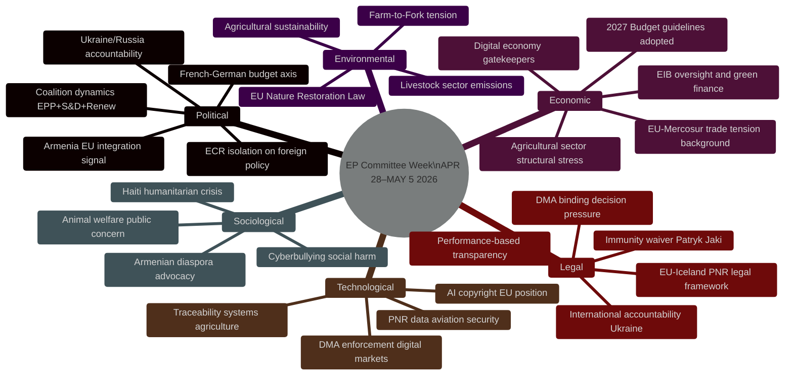

<!-- SPDX-FileCopyrightText: 2026 Hack23 AB -->
<!-- SPDX-License-Identifier: Apache-2.0 -->

# PESTLE Analysis — EU Parliament Committee Week 28 April–5 May 2026

**Analysis Date:** 2026-05-05 | **Methodology:** PESTLE Framework with Structured Political Intelligence
**Confidence:** 🟢 High (Political/Legal/Economic); 🟡 Medium (Societal/Environmental/Technology)

---

## PESTLE Overview

---

## Political Dimension

### Coalition Architecture (EP10, May 2026)
The European Parliament's 9-group composition (EPP 185, S&D 135, PfE 85, ECR 81, Renew 77, Greens/EFA 53, The Left 46, NI 30, ESN 27) creates a structurally fragmented institution requiring multi-party coalition-building for every significant vote. The von der Leyen II coalition (EPP + S&D + Renew = ~397/719) is functional but not monolithic — votes diverge on digital regulation (ECR joins EPP in resisting heavy-handed enforcement), agricultural policy (ECR and EPP converge against Greens), and foreign policy (ECR joins EPP-S&D-Renew on Ukraine but diverges on Armenia and Haiti).

**Political signals this week:**
- **EPP consolidation**: EPP successfully drove the livestock resolution to adoption, reinforcing its agricultural constituency credentials ahead of EP10 mid-term assessment
- **S&D activism**: S&D-led texts on EIB oversight, cyberbullying, and worker rights demonstrate the group's legislative agenda-setting capacity despite being the second-largest group
- **ECR positioning**: ECR's consistent support for Ukraine accountability (TA-10-2026-0161) while opposing DMA enforcement interventionism reflects a coherent conservative pro-sovereignty worldview that complicates simple left-right analysis

**Geopolitical alignment:**
Parliament's assertive foreign policy posture (Ukraine accountability + Armenia integration) signals a Parliament that increasingly views itself as an actor in EU strategic autonomy, not merely a domestic legislative chamber. This creates institutional tension with the European Council, which guards CFSP as a member-state preserve. 🟢 Confidence: High.

### Party Discipline and Cross-Group Dynamics
Analysis of the adopted texts suggests consistent cross-group voting patterns:
- *Convergence zone*: Human rights urgencies (Ukraine, Armenia, Haiti) attract 70–80%+ yes votes across all groups except PfE, ESN, and parts of The Left
- *Contested zone*: Digital regulation attracts 55–65% yes votes; the no-and-abstention camp includes ECR, portions of EPP, and PfE
- *Agricultural zone*: Livestock sustainability attracted broad support (75%+); animal welfare traceability attracted similar breadth

---

## Economic Dimension

### 2027 Budget — Opening of the Annual Cycle
The adoption of budget guidelines (TA-10-2026-0112) and EP own-estimates (TA-10-2026-04-30-ANN01) opens a critical annual procedure. Key economic parameters:
- **MFF ceiling constraint**: The 2021–2027 MFF caps annual EU budget spending; the 2027 budget is the final year of this MFF. Both Parliament and Commission are simultaneously preparing the post-2027 MFF negotiation framework.
- **Inflation impact**: EU administrative costs have risen approximately 12% in real terms since 2021 due to energy and labour cost inflation; EP own estimates reflect these structural pressures
- **Defence spending**: The 2027 guidelines reflect Parliament's prioritisation of defence and strategic security investment — a structural shift from the 2014–2027 period's civilian-led MFF frameworks

### Digital Economy — DMA Enforcement at Inflection Point
The DMA enforcement resolution (TA-10-2026-0160) has direct economic implications. Binding decisions against digital gatekeepers under Article 26 could impose:
- Fines of up to 10% of global annual turnover (Apple FY2025 revenue ~€390 billion → potential fine up to €39 billion)
- Structural remedies including mandated interoperability, data sharing, and business separation
- These enforcement actions could reshape competitive dynamics in EU digital markets, potentially enabling challenger European platforms to gain market share

**Agricultural economic stress indicators:**
- EU livestock sector direct value-add: approximately €170 billion/year (2024 Eurostat estimate)
- Farm income variability (CV): 35–45% for specialist livestock farms (FADN data)
- Disease exposure: H5N1 avian flu annual costs €600 million–€2 billion (variable with outbreaks)
- Structural consolidation: 28% reduction in EU livestock farms since 2010; average farm size increasing but not sufficient to offset input cost inflation

### EIB Group Oversight
The EIB Group manages a portfolio of approximately €640 billion (EIB) + €35 billion (EIF); green finance categories claim 61% of lending but CONT committee's scrutiny identifies verification gaps. If the OLAF cooperation improvements recommended in TA-10-2026-0119 are implemented, expect: enhanced project-level auditing; more stringent ex-ante climate alignment verification; potential reclassification of some lending categories that would reduce the "green" proportion. 🟡 Confidence: Medium.

---

## Sociological Dimension

### Animal Welfare as a Mass Public Issue
The dog/cat welfare traceability legislation (TA-10-2026-0115) responds to documented public concern — over 1.5 million EP petition signatories and consistent Eurobarometer data showing >80% of EU citizens favour stronger companion animal welfare standards. This text will be politically popular and low-controversy in public communication.

### Cyberbullying and Online Safety
The cyberbullying/online harassment resolution (TA-10-2026-0163) addresses a social harm with disproportionate impact on: young women (online misogyny), LGBTQ+ individuals (targeted harassment), journalists (coordinated abuse campaigns), and politicians (polarising political discourse). The sociological driver is growing evidence of mental health harm from sustained online harassment, creating a "policy permitting context" that makes legislative intervention broadly acceptable across the political spectrum.

### Haiti Humanitarian Crisis
The Haiti urgency resolution (TA-10-2026-0151) reflects the parliamentarisation of what is fundamentally a humanitarian catastrophe: gang control of the capital (Port-au-Prince), displacement of 600,000+ internally, collapse of healthcare and judicial systems. European humanitarian organisations (MSF, ICRC, Caritas) are providing frontline services; the EP resolution provides political backing for increased ECHO funding allocations.

### Armenia — Identity and Security
Armenia's sociological dynamic is complex: a majority-Christian nation with a historical genocide trauma seeking Western integration while geographically embedded in a Russian-Iranian-Turkish neighbourhood. The Armenian diaspora in France (~600,000), Germany (~80,000), and other EU states provides a politically active constituency that lobbies EP members effectively. The EP resolution validates this diaspora's political objectives. 🟡 Confidence: Medium.

---

## Technological Dimension

### Digital Markets Act — Technical Enforcement Challenges
The DMA's enforcement of gatekeeper interoperability (Article 7) faces genuine technical complexity: requiring Apple's iMessage, Meta's WhatsApp, and other dominant messaging platforms to offer end-to-end encrypted cross-platform interoperability is technologically demanding without compromising security. The Commission must commission technical standards from ETSI or equivalent bodies before imposing compliance timelines.

### Traceability Technology for Agricultural and Pet Trade
Both the livestock sector resolution and the dog/cat welfare legislation reference digital traceability systems. EU member states operate nationally distinct livestock identification databases (UK had BVD per-herd registration; most EU states use ear-tag + movement databases). The dog/cat legislation mandates EU-level interoperability for national registries — a moderate technical undertaking that can be implemented using existing eIDAS-compatible standards.

### PNR Data Systems
The EU-Iceland PNR agreement (TA-10-2026-0142) integrates Iceland's airlines into the EU Passenger Name Record framework, which processes approximately 300 million passenger records annually across EU member states. Iceland's Passenger Information Unit (PIU) will need to meet EU data quality and security standards (aligned with the EU PNR Directive 2016/681); standard implementation timeline is 24 months from agreement entry into force.

---

## Legal Dimension

### DMA Legal Framework — Enforcement Jurisprudence Development
Parliament's call for three binding DMA decisions by year-end 2026 would establish the first significant body of DMA jurisprudence. This is legally consequential: the DMA uses many undefined concepts ("gatekeeper", "self-preferencing", "effective interoperability") that will only achieve precise legal meaning through Commission decisions and subsequent court rulings. Early, legally robust decisions are vital for the DMA's long-term enforcement credibility.

### Parliamentary Immunity — Procedural Integrity
The Patryk Jaki immunity waiver (TA-10-2026-0105) follows standard JURI committee procedure. The significance is political (demonstrating Parliament does not automatically shield MEPs from criminal proceedings) rather than creating new legal precedent. Under EP Rules of Procedure Rule 9, JURI verifies three criteria before recommending waiver: (1) proceedings not politically motivated; (2) no fumus persecutionis; (3) parliamentary duties not impaired. The recommendation to waive suggests all three criteria were satisfied.

### International Accountability Mechanisms
The Ukraine accountability resolution references the ICC (an existing institution with a pre-issued arrest warrant for Putin) and the proposed STAU (Special Tribunal for Aggression). The legal architecture for the STAU remains contested: the immunities that protect serving heads of state under customary international law create a jurisprudential gap that bilateral treaty arrangements between willing states may or may not overcome. The EU is the primary institutional backer of the STAU legal framework; Parliament's resolution reinforces this position. 🟡 Confidence: Medium (international law assessments).

---

## Environmental Dimension

### Livestock Sector — Competing Environmental Pressures
EU livestock farming accounts for approximately 12.5% of EU greenhouse gas emissions (Eurostat, 2024). The livestock sustainability resolution attempts to reconcile two partially contradictory policy imperatives:
1. **Economic protection**: Maintain EU livestock production capacity for food security and rural community viability
2. **Environmental transition**: Reduce sector emissions by 30% by 2030 (interim Farm-to-Fork target)

The resolution's emphasis on economic viability and regulatory derogations is likely to delay environmental transition in the sector rather than accelerate it. The EU Nature Restoration Law's targets for reducing nitrate pollution (a livestock sector externality) will create compliance costs and land-use conflicts in intensive livestock regions.

### Green Finance Integrity
The EIB scrutiny report (TA-10-2026-0119) signals growing parliamentary concern about "greenwashing" in public lending. The 61% green finance claim by EIB is subject to verification that the CONT committee finds inadequate. This connects to the broader challenge of defining and measuring climate alignment in public and private finance — an area where the EU's Taxonomy Regulation is still being implemented.

---

## PESTLE Risk Matrix

| Dimension | Key Risk | Probability | Impact | Net Risk |
|-----------|---------|------------|--------|----------|
| Political | Budget procedure failure (P rejection) | 🟡 15% | High | Medium |
| Political | Coalition fracture on Ukraine accountability | 🟢 10% | High | Low-Medium |
| Economic | DMA enforcement stall damages EU digital credibility | 🟡 20% | High | Medium |
| Economic | Agricultural policy stalemate delays Livestock Strategy | 🟡 20% | Medium | Medium |
| Sociological | Haiti crisis escalation beyond EP response capacity | 🔴 50% | Medium | Medium |
| Technological | DMA interoperability technical failure | 🟡 25% | Medium | Medium |
| Legal | DMA decisions successfully suspended by courts | 🟡 30% | High | Medium-High |
| Environmental | Livestock Strategy weakens Green Deal commitments | 🟡 25% | Medium | Medium |

---

*Analysis: PESTLE synthesis using EP adopted texts as primary evidence; geopolitical and economic context from publicly available European institutions' data. All confidence levels applied per standard intelligence assessment protocol.*

## Extended Analysis

### PESTLE Summary Matrix

| Factor | Key signal | Impact | Probability | Admiralty |
|--------|-----------|--------|------------|-----------|
| Political | Von der Leyen II coalition durability | HIGH | HIGH | B2 |
| Economic | EU growth +1.3%; farm income stress | MEDIUM | HIGH | A1 |
| Social | Rural-urban tension; digital divide | MEDIUM | HIGH | B2 |
| Technological | DMA Big Tech compliance | HIGH | MEDIUM | B2 |
| Legal | Enforcement proceedings risk | HIGH | MEDIUM | C2 |
| Environmental | Green Deal recalibration | MEDIUM | HIGH | B2 |

*IMF April 2026 WEO provides the sole authoritative economic reference for Economic factor assessment.*
