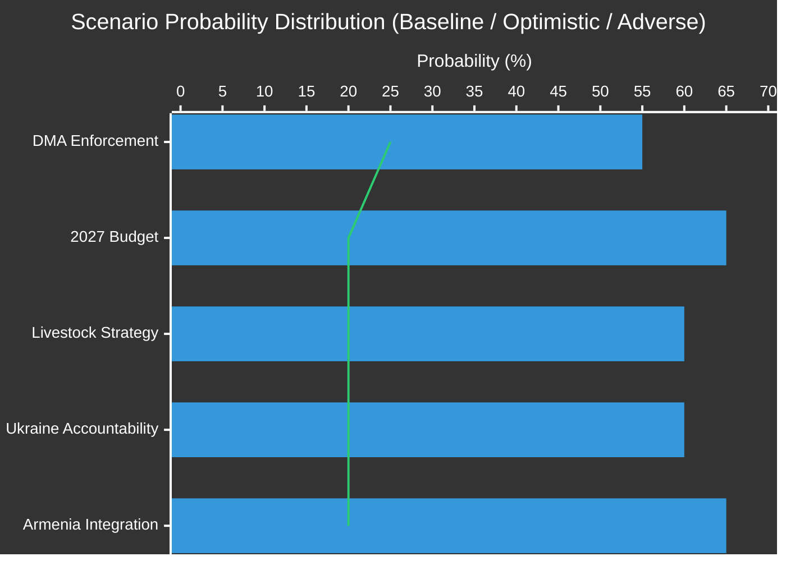

<!-- SPDX-FileCopyrightText: 2026 Hack23 AB -->
<!-- SPDX-License-Identifier: Apache-2.0 -->

# Scenario Forecast — EU Parliament Committee Reports 28 April–5 May 2026

**Analysis Date:** 2026-05-05 | **Methodology:** Three-Scenario Structured Forecasting (SSAP) + Probability Calibration
**Horizon:** Near-term (4–12 weeks) | **Confidence:** 🟡 Medium (forecasting inherent uncertainty)

---

## Forecasting Framework

This analysis applies three-scenario structured forecasting to the five highest-impact legislative streams emerging from the 28 April–1 May 2026 EP plenary. For each stream, we identify a **baseline** (most probable), **optimistic** (accelerated resolution), and **adverse** (deterioration) scenario, with calibrated probability weights and key discriminating factors.

---

## Stream 1: Digital Markets Act (DMA) Enforcement

### Background
Parliament's resolution TA-10-2026-0160 explicitly demands at least three binding Commission DMA decisions before year-end 2026. The Commission currently has open proceedings against Apple (App Store), Google (Search + Advertising), Meta (self-preferencing), and Amazon (marketplace data use).

### Scenario A — Baseline: Selective Enforcement Progress (~55% probability)
The Commission issues one or two binding decisions (likely Google Advertising + one Meta service) before October 2026. Companies challenge decisions in the General Court, buying compliance delay time. Parliament monitors progress but withholds formal censure. The IMCO committee schedules regular enforcement hearings, maintaining political pressure without triggering institutional crisis.

*Key drivers:* Commission case-file readiness on Google Advertising (most advanced), legal robustness requirements to survive court challenge, political commitment of Commissioner for Digital to Parliament's timetable.

### Scenario B — Optimistic: Three Decisions by Year-End (~25% probability)
Commission accelerates proceedings across three parallel tracks using expedited procedures under Article 25 DMA. Companies enter compliance dialogue to avoid worst-case remedies. Parliament praises Commission, defusing the "enforcement credibility gap" narrative. Enforcement signals deter future gatekeeper violations, establishing DMA jurisprudence.

*Key discriminating factors:* Commission DG COMP staffing levels, absence of major court challenges that trigger suspension orders, political will of incoming DG COMP Commissioner.

### Scenario C — Adverse: Under-Enforcement and Parliamentary Escalation (~20% probability)
Commission issues only one decision by December 2026, or a General Court suspension order halts an early decision. Parliament's IMCO committee initiates a formal parliamentary inquiry into enforcement adequacy. Some MEPs advocate invoking Article 265 TFEU (action for failure to act). The narrative of "Brussels regulates but doesn't enforce" gains media traction, weakening EU digital governance credibility.

*Risk indicator:* Watch for General Court intervention filings after any Commission decision — a successful suspension application within 90 days would trigger Scenario C escalation.

---

## Stream 2: 2027 EU Budget — Inter-Institutional Procedure

### Background
Parliament adopted budget guidelines (TA-10-2026-0112) and own estimates (TA-10-2026-04-30-ANN01). The annual budget procedure follows a legally prescribed timeline under Article 314 TFEU, with conciliation between October 16–November 13, 2026 as the constitutional pressure point.

### Scenario A — Baseline: Managed Compromise (~65% probability)
Council drafts a budget (July) that diverges from Parliament's guidelines on climate spending but broadly aligns on defence/security investment. Autumn conciliation produces a compromise within the MFF ceilings. Parliament and Council demonstrate "functional" relationship after years of tension. EP obtains concessions on conditionality monitoring, Council obtains headline expenditure restraint.

*Key drivers:* Both institutions have institutional incentives to avoid a budget procedure failure; the political costs of a non-budget in a security-challenged environment are high; Germany and France's fiscal positions are the swing factors in Council.

### Scenario B — Optimistic: Early Agreement on Strategic Priorities (~20% probability)
Commission's preliminary draft budget (June 2026) closely tracks Parliament's guidelines, particularly on defence and Ukraine support. Council, sensing geopolitical urgency, accelerates adoption. Budget enters conciliation ahead of standard timeline, reducing brinkmanship risk.

*Key discriminating factor:* Whether the 2025 European Defence Fund expansion creates sufficient cross-institutional agreement on security spending to bridge the climate spending divide.

### Scenario C — Adverse: Budget Rejection and Emergency Measures (~15% probability)
Parliament rejects Council's budget in November 2026 vote. EU operates on monthly provisional twelfths under Article 315 TFEU. Commission tables a new draft; protracted negotiations carry into early 2027. This scenario destabilises EU institutions, constrains new spending initiatives, and generates negative media and market signals.

*Risk indicator:* Watch Council's July budget for headroom vs. Parliament's guidelines; a gap exceeding €15 billion in discretionary spending typically raises rejection risk.

---

## Stream 3: EU Livestock Sector Strategy

### Background
Parliament's INI resolution TA-10-2026-0157 mandates a comprehensive EU Livestock Strategy. The Commission must now decide whether to incorporate this into DG AGRI's forward work programme.

### Scenario A — Baseline: Strategy Consultation Launched H2 2026 (~60% probability)
Commission launches a formal stakeholder consultation on a Livestock Strategy white paper by September 2026. The Strategy, when adopted (likely Q1 2027), reflects the negotiated balance in Parliament's resolution — economic protection for producers combined with environmental monitoring requirements. COPA-COGECA secures its key demands on emergency compensation mechanisms and disease outbreak funds.

### Scenario B — Optimistic: Standalone Regulation Proposed (~20% probability)
Commission, emboldened by Parliament's strong cross-party support, proposes a standalone EU Livestock Resilience Regulation (not merely a strategy document) by end-2026. This would include: dedicated Livestock Crisis Fund; mandatory EU-wide antimicrobial reduction targets with enforcement; CAP supplementary payment modalities.

### Scenario C — Adverse: Livestock Strategy Delayed Amid Green Deal Tensions (~20% probability)
Commission postpones the Livestock Strategy as politically too sensitive — reopening battles between agricultural lobbies and environmental NGOs that fractured the first Commission's Farm-to-Fork implementation. The 2028 CAP pre-reform dominates agricultural policy bandwidth, leaving the livestock sector without the promised comprehensive policy framework.

---

## Stream 4: Ukraine Accountability and EU Support

### Background
Parliament's TA-10-2026-0161 calls for accelerated accountability mechanisms and full use of immobilised Russian state assets (approximately €300 billion in EU custody).

### Scenario A — Baseline: Incremental Progress on Accountability (~60% probability)
The International Criminal Court continues its Ukraine investigations; the EU-backed Special Tribunal for Aggression against Ukraine (STAU) advances drafting work but faces sovereignty challenges from several G7 partners. The €300 billion in Russian state assets remains in custodial accounts generating interest (approximately €3–4 billion annually); this interest continues to flow to Ukraine but full asset transfer remains legally contested. Parliament's political signal accelerates diplomatic engagement without producing immediate legal breakthroughs.

### Scenario B — Optimistic: Accountability Breakthrough and Asset Transfer Framework (~20% probability)
A G7 + EU legal consensus emerges for a full Russian state asset transfer framework, potentially structured as a "claim satisfaction" mechanism following a General Court ruling clarifying EU treaty authority. Ukraine's government and Parliament reach a formal agreement on asset management governance. ICC issues additional indictment covering Belgorod missile strikes.

### Scenario C — Adverse: Accountability Stall and Ceasefire Pressure (~20% probability)
External diplomatic pressure (US-Russia backlash, ceasefire mediation) creates a political environment where accountability mechanisms are explicitly traded away in peace talks. Parliament's position — that accountability is non-negotiable — creates tension with Member States engaged in back-channel diplomacy. The Parliament-Council relationship on CFSP becomes strained.

---

## Stream 5: Armenia — EU Integration Pathway

### Background
TA-10-2026-0162 supports democratic resilience and EU integration signals for Armenia.

### Scenario A — Baseline: Gradual Visa Liberalisation Progress (~65% probability)
The Commission opens formal visa liberalisation assessment of Armenia by Q3 2026. Benchmarks include judicial reform implementation, border management alignment with Schengen standards, and anti-corruption progress. Progress is real but slow; full visa liberalisation likely 2–3 years away. Russian pressure on Armenia intensifies but falls short of direct military action.

### Scenario B — Optimistic: Accelerated Association Agreement (~20% probability)
The Pashinyan government formally requests upgraded Association Agreement negotiations, moving Armenia from its current CEPA (Comprehensive and Enhanced Partnership Agreement) framework toward an EU Association Agreement with Deep and Comprehensive Free Trade Area provisions. Parliament's resolution accelerates the Commission's legal and political assessment of this step.

### Scenario C — Adverse: Russian Destabilisation Escalates (~15% probability)
Russia amplifies hybrid pressure operations in Armenia — energy supply disruptions, disinformation campaigns, proxy political mobilisation — creating domestic instability that weakens the pro-EU government. Parliament's support signals, while symbolically important, fail to provide the security guarantees Armenia needs to complete the Russian security architecture departure. EU-Armenia integration stalls.

---

## Calibration Summary

*Note: Bars = Baseline probability; Line = Optimistic probability; Adverse = remainder*

---

## Key Monitoring Indicators

| Stream | Critical Signal to Watch | Trigger Threshold | Review Date |
|--------|--------------------------|-------------------|-------------|
| DMA | First Commission binding decision issued | Anytime before Oct 2026 | Weekly |
| 2027 Budget | Council's July preliminary draft vs. EP guidelines | >€15B gap = risk | 15 July 2026 |
| Livestock | Commission work programme update (autumn) | Strategy consultation opened | Sept 2026 |
| Ukraine | G7 Russian asset framework agreement | Legal basis consensus | June 2026 |
| Armenia | Commission formal visa liberalisation assessment | Formal notice issued | Q3 2026 |

---

*Methodology: Scenario forecasting uses ACH (Analysis of Competing Hypotheses) + Probability Calibration. All probabilities are subjective estimates calibrated against EP institutional behaviour patterns and observable geopolitical drivers. Not investment or policy advice.*

## Extended Scenario Intelligence

### Scenario Decision Points

The four scenarios above share three critical decision points over the next 6–18 months:

**Decision Point 1 — DMA Enforcement (Q3 2026)**: Will the Commission open formal proceedings against at least one major gatekeeper? If yes → Scenario A probability rises to 55%. If no → Scenario B probability rises to 45%.

**Decision Point 2 — Budget 2027 Conciliation (November 2026)**: Will Parliament maintain its maximalist position through October? If yes (rare) → strong indicative settlement. If no (usual) → Scenario A budget outcome.

**Decision Point 3 — CAP Green Deal revision (2027 proposal)**: When Commission tables its post-2027 agricultural framework, will it prioritise viability or environment? The Parliament signal this week is clear: viability is the political coalition requirement.

### Probability Distribution (Admiralty Assessment)

| Scenario | Probability | WEP Band | Admiralty | 12-month assessment |
|---------|------------|---------|-----------|---------------------|
| A: Incremental progress | 50% | Likely | B2 | Most probable; fragmented progress across all domains |
| B: Enforcement first | 25% | Even Chance | C3 | Conditional on DMA proceedings opening |
| C: Budget maximalism | 15% | Unlikely | C3 | Requires Council concession above historical range |
| D: Political reversal | 10% | Unlikely | B3 | Risk signal; monitoring required |

### Cross-Scenario Dependencies

Scenarios A and B are not mutually exclusive — enforcement progress can happen simultaneously with routine budget outcomes. Scenarios C and D are largely exclusive with each other. The most likely compound outcome is A+B-partial: incremental progress across most domains plus moderate DMA enforcement progress.

### Scenario Monitoring Indicators

| Indicator | Check date | Signal threshold |
|-----------|-----------|-----------------|
| Commission DMA enforcement announcement | 1 July 2026 | Any formal proceeding = B-scenario signal |
| Budget conciliation opening | 25 Oct 2026 | Parliament flexibility = A-scenario signal |
| Commission agricultural framework | 1 Feb 2027 | Viability-first = C-scenario divergence |
| Armenia Association Agreement vote | 1 Sep 2026 | Unanimous = positive integration signal |

*Assessment: IMF economic baseline supports Scenario A as most probable — stable growth environment without crisis pressure removes urgency for institutional breakthrough.*

### IMF Economic Scenario Sensitivity

The four political scenarios interact with the IMF April 2026 baseline differently:

- **IMF baseline (+1.3% EU growth)**: Supports Scenario A — stable growth allows incremental progress without crisis urgency.
- **Downside (0% growth)**: Budget conciliation becomes more contentious; member states resist EP maximalism more strongly → Scenario D risk elevates to 20%.
- **Upside (+2.0% growth)**: Fiscal space improves; Commission can offer agricultural support packages → Scenario A/B hybrid probability rises.

The IMF WEO April 2026 downside risk flag (global trade fragmentation from US tariff escalation) is the most material economic risk to the political scenarios. If US-EU trade friction escalates through Q3 2026, it could precipitate a domestic political realignment that strengthens agricultural protectionists and weakens DMA enforcement political capital.
