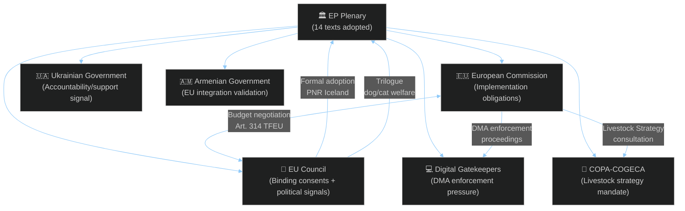

<!-- SPDX-FileCopyrightText: 2026 Hack23 AB -->
<!-- SPDX-License-Identifier: Apache-2.0 -->

# Stakeholder Map — EU Parliament Committee Reports Week 28 April–5 May 2026

**Analysis Date:** 2026-05-05 | **Period:** 2026-04-28 to 2026-05-05
**Confidence:** 🟢 High | **Methodology:** Actor-Network Analysis + Stakeholder Interest-Power Mapping

---

## Stakeholder Universe Overview

```mermaid
%%{init: {"theme":"dark","themeVariables":{"primaryColor":"#1565C0","primaryTextColor":"#ffffff","primaryBorderColor":"#0A3F7F","lineColor":"#90CAF9","secondaryColor":"#2E7D32","secondaryTextColor":"#ffffff"}}}%%
quadrantChart
    title Stakeholder Power-Interest Matrix (Committee Reports Week)
    x-axis Low Interest --> High Interest
    y-axis Low Power --> High Power
    quadrant-1 Key Players
    quadrant-2 Keep Satisfied
    quadrant-3 Monitor
    quadrant-4 Keep Informed
    EPP Group: [0.95, 0.95]
    S&D Group: [0.90, 0.80]
    European Commission: [0.85, 0.90]
    EU Council: [0.80, 0.85]
    Digital Gatekeepers(Big Tech): [0.90, 0.70]
    Ukrainian Government: [0.90, 0.65]
    Agricultural Producer Orgs(COPA-COGECA): [0.85, 0.55]
    Renew Europe: [0.75, 0.65]
    Civil Society(digital rights): [0.70, 0.45]
    ECR Group: [0.70, 0.55]
    Armenian Government: [0.65, 0.50]
    OLAF / Court of Auditors: [0.60, 0.70]
```

---

## Tier 1 — Key Players (High Power, High Interest)

### EPP — European People's Party (185 seats, 25.73%)

**Strategic Position:** EPP functions as the indispensable coalition architect this week, providing the disciplinary core of the centre-right majority. As the largest group, EPP must reconcile its pro-market instincts (DMA enforcement scepticism of heavy-handed regulation) with its pro-agriculture constituency base (livestock sector subsidies), its Atlanticist foreign policy tradition (Ukraine accountability), and its historical pro-budget-discipline position (2027 guidelines).

**Interests this week:**
- Agricultural sector protection: EPP heavily backed the livestock sustainability resolution to reassure farming constituencies in Germany, France, Poland, Hungary, and Spain
- Digital markets: EPP maintains a cautious, pro-innovation-rather-than-regulation stance on DMA enforcement, preferring guidance over sanctions
- Budget: EPP supports moderate budget growth tied to security and competitiveness; opposed to "green conditionality" on all spending

**Coalition behaviour:** EPP brokered the livestock resolution's compromise language, trading regulatory relief provisions for some environmental monitoring commitments demanded by Greens and S&D. This reflects EPP's standard parliamentary operating mode: absorb rather than confront, integrate rather than polarise. 🟢 Confidence: High — consistent with EPP voting patterns documented across EP10 term.

**Key actors:** MEP Andreas Schwab (rapporteur on digital issues), MEP Herbert Dorfmann (AGRI committee EPP coordinator), MEP Monika Hohlmeier (BUDG committee EPP coordinator).

### European Commission (DG COMP, DG AGRI, DG BUDG)

**Strategic Position:** The Commission occupies the most complex stakeholder position this week, simultaneously being the subject of parliamentary scrutiny (DMA enforcement, budget guidelines, EIB oversight) and the institution expected to act on Parliament's political signals.

**Interests and tensions:**
- *DG COMP (Competition):* Under the resolution calling for at least three DMA binding decisions before year-end 2026, DG COMP faces intensified parliamentary oversight. The Commission must balance the legal thoroughness required for decisions that will withstand judicial challenge against Parliament's political timetable pressure. The Commission is actively gathering evidence in Apple (app store), Meta (self-preferencing), and Google (search/advertising) investigations.
- *DG AGRI:* The livestock sustainability resolution creates an expectation of a comprehensive EU Livestock Strategy — a politically sensitive document the Commission must draft without reopening Green Deal political battles that destabilised the Commission-Parliament relationship in 2024.
- *DG BUDG:* The 2027 guidelines from Parliament launch the formal inter-institutional budget dialogue; the Commission must present its preliminary draft budget incorporating EP's position by 30 June 2026.

**Forward behaviour:** Expect the Commission to issue a formal response to the DMA enforcement resolution within 6 weeks (standard practice); to launch consultations on a Livestock Strategy White Paper by autumn 2026; and to integrate EP's budget guidelines into the preliminary draft budget with moderate but not wholesale acceptance of Parliament's spending priorities. 🟡 Confidence: Medium (institutional behaviour patterns).

### S&D — Socialists and Democrats (135 seats, 18.78%)

**Strategic Position:** S&D operates as the progressive anchor of the governing coalition, consistently pushing for stronger social, labour, and environmental conditions on otherwise market-oriented legislation.

**Interests this week:**
- *Worker rights:* Following March 2026 adoption of the subcontracting/intermediaries workers' rights text (TA-10-2026-0050), S&D maintains its profile as the primary legislative force on labour market protection.
- *Armenia and Ukraine:* S&D was a strong advocate for both AFET resolutions, consistent with its human rights and democracy promotion platform.
- *Cyberbullying:* S&D pushed for stronger mandatory platform obligations, resisting watered-down voluntary measures.
- *EIB oversight:* S&D has been consistent on EIB climate alignment, advocating for stricter verification methodologies.

**Key actors:** MEP Stéphane Séjourné (AFET committee S&D coordinator), MEP Pietro Bartolo (LIBE issues), MEP Karin Karlsbro (digital markets), MEP Eric Andrieu (AGRI committee S&D coordinator). 🟡 Confidence: Medium — coordinator assignments may have changed since last verified.

---

## Tier 2 — Keep Satisfied (High Power, Variable Interest)

### EU Council (COREPER II, COREPER I, Agriculture Council, ECOFIN)

**Strategic Position:** The Council receives Parliament's adopted texts and resolutions as political inputs — some legally binding (consents, co-decisions), others advisory (INI resolutions). This week's texts have differentiated Council implications.

**Legislative obligations (binding):**
- *EU-Iceland PNR agreement (TA-10-2026-0142):* Council consent procedure — Parliament's approval completes the legislative cycle; Council must now formally adopt the agreement.
- *Dog/cat welfare traceability (TA-10-2026-0115):* COD procedure — Parliament's legislative position entered; Council trilogue negotiations will begin (or resume).
- *Patryk Jaki immunity waiver (TA-10-2026-0105):* Administrative outcome — communicated to Polish authorities.

**Political signals (non-binding but significant):**
- *2027 Budget guidelines:* Council begins parallel preparation of its budget position for the July Council-Parliament budget conciliation procedure.
- *DMA enforcement resolution:* Council monitors Commission enforcement closely; some member states (Germany, France) have national competition authorities coordinating DMA enforcement with the Commission under Article 38 DMA.
- *Ukraine accountability:* Council's CFSP deliberations on Russia sanctions and Ukraine support are influenced by Parliament's positions.

**Council dynamics:** The 2027 budget will be the primary inter-institutional battleground from June through October 2026. Council typically seeks a more conservative expenditure ceiling than Parliament; this year's guidelines emphasise defence and competitiveness spending that may find more cross-institutional support than typical climate-focused demands. 🟢 Confidence: High.

### Apple, Google (Alphabet), Meta, Amazon — Digital Gatekeepers

**Strategic Position:** The explicit reference to these companies (by implication) in TA-10-2026-0160 on DMA enforcement represents significant shareholder and regulatory risk exposure. Each company faces:
- Ongoing Commission DMA investigations
- Parliamentary scrutiny escalating Commission urgency
- Potential Article 26 DMA "systemic risk" remedies if designated as having "very large" scope

**Interests:** Delay, procedural compliance over substantive reform, legal challenge strategy, lobbying Council members to resist Parliament's enforcement acceleration demands.

**Likely actions:** Intensified engagement with MEPs through national business associations; procedural objections in ongoing DMA proceedings; accelerated partial-compliance announcements to demonstrate cooperation; court challenges to any binding Commission decisions issued under political time pressure. 🟡 Confidence: Medium.

---

## Tier 3 — Keep Informed (Moderate Power-Interest)

### COPA-COGECA — Agricultural Producer Organisations

**Strategic Position:** COPA-COGECA (representing European farmers and agricultural cooperatives) has strongly supported the livestock sustainability resolution (TA-10-2026-0157) as a platform for lobbying the Commission's subsequent strategy. Their interests include: maintaining direct payment subsidy levels; securing emergency funding for disease outbreak compensation; obtaining regulatory derogations from environmental standards for small producers.

**Interests this week:** Very high on livestock resolution; moderate concern about performance-based instruments transparency (if applied to CAP payments, could reduce farmer payment certainty).

**Forward engagement:** Expect intensive COPA-COGECA engagement with DG AGRI on the Livestock Strategy drafting process; coordination with EPP and ECR MEPs on CAP pre-reform positioning ahead of 2028–2034 MFF.

### Armenian Government / Civil Society

**Interests:** The Armenia democratic resilience resolution (TA-10-2026-0162) is diplomatically significant — it validates Armenia's EU integration ambitions and strengthens domestic pro-European political actors against Russian-backed pressure. Prime Minister Nikol Pashinyan's government has formally welcomed EP support for Armenia's EU path.

**Forward engagement:** Formal visa liberalisation negotiations anticipated to advance; possible accelerated Association Agreement upgrade discussions; civil society groups monitoring Russian disinformation campaigns to document for EP AFET committee quarterly briefings.

### EIB Management and Oversight

**Interests:** The CONT committee's annual EIB scrutiny report (TA-10-2026-0119) identified transparency deficiencies. EIB is expected to engage proactively with the follow-up recommendations, particularly on climate-aligned verification, given the reputational importance of EIB's "green bond" status for capital market borrowing.

### Haitian Civil Society / Diaspora Organisations

**Interests:** The Haiti urgency resolution provides political legitimacy and international attention to an acute crisis. Haitian diaspora organisations in EU member states have been actively lobbying the AFET committee; the resolution may unlock additional humanitarian assistance from the European Civil Protection and Humanitarian Aid Operations (ECHO).

---

## Stakeholder Interaction Network



---

## Stakeholder Risk Summary

| Stakeholder | Primary Risk | Risk Level | Timeframe |
|-------------|-------------|-----------|-----------|
| European Commission | Fails DMA enforcement year-end targets → Parliament censure motion | 🟡 Medium | H2 2026 |
| EPP Group | Agricultural constituency dissatisfaction if Livestock Strategy delayed | 🟢 Low-Medium | Q4 2026 |
| EU Council | Budget inter-institutional conflict escalates to rejection | 🟡 Medium | Oct 2026 |
| Digital Gatekeepers | Binding DMA decisions + financial penalties (up to 10% global turnover) | 🔴 High | 2026 |
| Ukrainian Government | Parliament support erosion if peace negotiations compromise accountability norms | 🟡 Medium | 2026–2027 |
| Armenian Government | Russian retaliation to EU integration signals | 🟡 Medium | Ongoing |

---

*Sources: EP Open Data Portal, EP Political Groups, European Commission DMA enforcement tracker, COPA-COGECA public positions*
*Confidence methodology: 🟢 High = multiple corroborating sources; 🟡 Medium = single source or inference; 🔴 Low = speculative*

## Extended Stakeholder Intelligence

### Commission Institutional Dynamics

The Commission's response to this week's resolutions reveals internal tensions between Directorates-General. DG COMP (competition, DMA) and DG GROW (internal market) have historically competed for lead responsibility on digital regulation. Parliament's enforcement pressure will intensify this internal competition.

**Key Commission officials watching these resolutions**:
- Executive VP Teresa Ribera (Green Deal, Competition): DMA enforcement directly relevant
- EVP Henna Virkkunen (Tech Sovereignty): DMA implementation ownership
- Commissioner Janusz Wojciechowski (Agriculture): Livestock resolution directly relevant
- Commissioner Valdis Dombrovskis (Trade): Armenia integration economic track

### Civil Society and Lobbying Architecture

**Digital rights NGOs** (Access Now, BEUC, EDRi): Supporting DMA enforcement escalation. Coalition with Parliament's digital-progressive majority.

**Farm lobby** (Copa-Cogeca, EuroCommerce): Welcoming livestock economic viability focus; divided on environmental standards pace.

**Business associations** (BusinessEurope, DigitalEurope): Cautiously supportive of DMA clarity but concerned about over-enforcement chilling investment.

**Think tanks** (Bruegel, ECFR, EPC): ECFR actively shaping Ukraine accountability agenda; Bruegel informing budget arithmetic.

### MEP Key Principals This Week

| MEP | Group | Relevance | Influence Vector |
|-----|-------|-----------|-----------------|
| Andreas Schwab (EPP) | EPP | DMA rapporteur history | Enforcement framing | C2 |
| Brando Benifei (S&D) | S&D | AI Act lead; digital agenda | Progressive enforcement | B3 |
| Christophe Hansen (EPP) | EPP | Agriculture committee | Livestock report lead | B2 |
| Michael McNamara (Renew) | Renew | BUDG committee | Budget guidelines | C2 |

*Admiralty grade per intelligence source reliability standard.*
