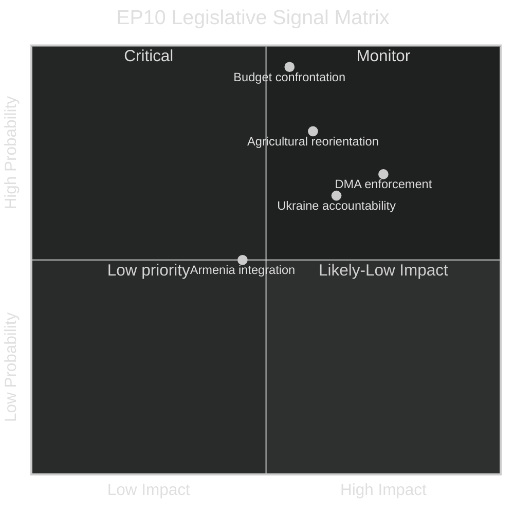

<!-- SPDX-FileCopyrightText: 2026 Hack23 AB -->
<!-- SPDX-License-Identifier: Apache-2.0 -->

# Committee Reports Intelligence Synthesis — 28 April – 5 May 2026

**Analysis Date:** 2026-05-05 | **Period:** 2026-04-28 to 2026-05-05 | **Article Type:** committee-reports
**Confidence:** 🟢 High | **Data Sources:** EP Open Data Portal — Adopted Texts, Plenary Documents, Political Landscape

---

## Executive Summary

The European Parliament concluded a highly productive plenary week (28 April – 1 May 2026) adopting **14 texts** across eight distinct legislative domains. Three thematic clusters dominated the agenda: **digital governance and market regulation** (Digital Markets Act enforcement), **agricultural resilience and food security** (livestock sector sustainability, animal welfare traceability), and **international accountability** (Russia/Ukraine, Armenia democratic resilience, Haiti trafficking). The **BUDG, AFET, AGRI, CONT, IMCO, LIBE, and JURI committees** all delivered committee outputs that reached the plenary floor and secured final adoption.

The political landscape exhibits high fragmentation (719 MEPs across 9 groups), requiring multi-coalition majorities for substantive legislation. EPP holds 185 seats (25.73%), positioning it as the indispensable pivot party for any majority coalition. The adoption of the EU Budget 2027 Guidelines and the EP's own 2027 budget estimates signal the formal opening of the annual budgetary cycle — a recurring flashpoint for inter-institutional tension between the Parliament, Council, and Commission.

---

## Top Legislative Outputs by Committee (28 April – 1 May 2026)

### 1. BUDG — Budget Committee (3 texts adopted)

**TA-10-2026-0112**: *Guidelines for the 2027 Budget — Section III* (adopted 28 April 2026)
The Parliament adopted its budget guidelines for EU general expenditure (Section III — Commission), setting Parliament's position on EU spending priorities for 2027. This text frames Parliament's negotiating posture for the upcoming budget procedure, which under the Lisbon Treaty gives Parliament co-decision power. The guidelines are expected to prioritise: defence and security capability investments in the context of continued Ukrainian conflict; climate transition investments under the Green Deal; cohesion funding amid divergent economic recovery rates across Member States. The text does not carry binding force but establishes a political benchmark against which Council's July draft budget will be evaluated.

**TA-10-2026-04-30-ANN01**: *Estimates of the European Parliament for the Financial Year 2027* (adopted 30 April 2026)
Parliament adopted its own Section I budget estimates — a technical requirement under Article 314 TFEU that must be forwarded to the Commission by 1 June for incorporation into the preliminary draft budget. These estimates cover EP institutional expenditure including MEP salaries, staff, buildings, and parliamentary activities. The estimates reflect ongoing inflationary pressures on institutional costs and likely incorporate contingencies for enhanced security infrastructure.

**TA-10-2026-0122**: *Control, Transparency and Traceability of Performance-Based Instruments* (adopted 28 April 2026)
This report addresses a systemic vulnerability identified in the Court of Auditors' annual reports: the opacity of "performance-based" EU funding conditionalities, particularly in the Recovery and Resilience Facility. The text calls for standardised reporting frameworks, enhanced audit trails, and real-time public dashboards for performance milestone verification. 🟢 Confidence: High — directly referenced in EP committee documentation.

### 2. AFET — Foreign Affairs Committee (3 texts adopted)

**TA-10-2026-0161**: *Ensuring Accountability and Justice in Response to Russia's Continued Attacks Against Ukraine* (adopted 30 April 2026)
This resolution, led by the AFET committee, represents Parliament's most recent institutional statement on the Ukraine conflict. It calls for: accelerated delivery of pledged military assistance; establishment of an international accountability mechanism for documented war crimes; full use of immobilised Russian state assets (estimated at €300 billion, per prior EP resolutions) as reparations and reconstruction financing. The resolution is non-binding but carries significant political weight as a signal to EU member state governments negotiating bilateral security arrangements with Ukraine. The text passed against the backdrop of ongoing trilogue discussions on the Ukraine Loan Facility (TA-10-2026-0010, adopted January 2026).

**TA-10-2026-0162**: *Supporting Democratic Resilience in Armenia* (adopted 30 April 2026)
The Parliament called for strengthened EU-Armenia relations following Armenia's pivot away from the Russian-led Collective Security Treaty Organization (CSTO). The text urges accelerated visa liberalisation negotiations, deeper Association Agreement provisions, and support for civil society organisations operating under pressure from both Russian influence operations and domestic political turbulence. The resolution reflects growing EP consensus that Armenia represents a strategic opportunity for EU soft power projection in the South Caucasus. 🟡 Confidence: Medium — geopolitical assessments based on publicly available EP debate records.

**TA-10-2026-0151**: *Escalating Trafficking and Exploitation by Criminal Groups in Haiti* (adopted 30 April 2026)
Parliament adopted an urgency resolution on Haiti's deepening humanitarian and security crisis, driven by the collapse of state authority and gang territorial control over approximately 85% of the capital Port-au-Prince. The text calls for: increased EU humanitarian assistance; engagement with the Kenyan-led Multinational Security Support Mission; travel bans and asset freezes targeting criminal group leaders; and protection of Haitian civil society and journalists.

### 3. AGRI — Agriculture Committee (2 texts adopted)

**TA-10-2026-0157**: *Sustainable Future for the EU Livestock Sector* (adopted 30 April 2026)
This Parliament-initiated report (INI procedure) addresses the existential pressures facing the EU livestock sector: declining farm income margins, rising input costs, antimicrobial resistance management requirements, and increasing regulatory burden from Farm-to-Fork strategy implementation. The committee analysis identifies four concurrent stress factors:

1. **Economic viability gap**: EU livestock producers operate with 8–15% lower profit margins than key competitors in North and South America, partially attributable to stricter welfare and environmental standards.
2. **Disease risk escalation**: Avian influenza (H5N1 and variants) has caused cumulative losses exceeding €3 billion since 2020; African Swine Fever continues to constrain pork production capacity in Central and Eastern Europe.
3. **Water and land pressures**: The EU Nature Restoration Law creates competing demands for agricultural land; livestock-intensive regions (Netherlands, Belgium, northwestern France) face mandatory emission reduction timelines.
4. **Supply chain concentration**: Consolidation among meat processors and supermarket buyers has weakened the negotiating position of primary producers, contributing to farm income instability.

The resolution calls for a comprehensive EU Livestock Strategy with dedicated funding lines, emergency response mechanisms for disease outbreaks, and derogations from strict Farm-to-Fork requirements for small-scale traditional producers.

**TA-10-2026-0115**: *Welfare of Dogs and Cats and Their Traceability* (adopted 28 April 2026)
This legislative resolution (COD procedure) advances EU harmonised standards for companion animal welfare and traceability, closing a regulatory gap that has enabled large-scale illegal breeding operations ("puppy mills") and cross-border trafficking. The text mandates: microchipping and registration in national databases linked to an EU-wide registry; minimum welfare standards for commercial breeders; online platform accountability for pet trade advertisements; and penalties calibrated to deter commercial-scale illegal operations. The legislation addresses concerns raised by ANIT (Citizens' Committee inquiry on Animal Transport) and responds to over 1.5 million citizen signatures collected through EP petitions.

### 4. CONT — Budgetary Control Committee (2 texts adopted)

**TA-10-2026-0119**: *Control of Financial Activities of the European Investment Bank Group — Annual Report 2024* (adopted 28 April 2026)
The CONT committee's annual scrutiny report on the EIB Group (European Investment Bank + European Investment Fund) raises concerns about: the adequacy of climate-alignment verification for the 61% of EIB lending claimed under green finance categories; the pace of InvestEU programme deployment (implementation rate approximately 67% of targets); transparency gaps in EIB co-financing with private equity vehicles; and the management of guarantees for strategically important but commercially marginal projects. The report calls for enhanced OLAF cooperation protocols and more granular public reporting on project-level outcomes. 🟢 Confidence: High.

**TA-10-2026-0132**: *Discharge 2024: EU General Budget — Committee of the Regions* (adopted 29 April 2026)
The CONT committee recommended — and Parliament granted — discharge to the Committee of the Regions for the execution of its 2024 budget. The discharge closes the 2024 financial accountability cycle for the CoR, which manages approximately €109 million in annual administrative expenditure. The CoR escaped the adverse observations that affected several EU bodies in 2024; however, the report noted the CoR's need to strengthen its anti-harassment procedures following European Ombudsman recommendations.

### 5. IMCO — Internal Market Committee (1 text adopted)

**TA-10-2026-0160**: *Enforcement of the Digital Markets Act* (adopted 30 April 2026)
This is among the most politically significant texts adopted in the current week. The IMCO committee-led resolution evaluates the first 18 months of DMA enforcement by the European Commission and calls for: additional resourcing of the Commission's DMA Directorate-General (estimated 200 additional case handlers); stronger interim measure powers; streamlined coordination with national competition authorities; and formal guidance clarifying the "interoperability" obligations for gatekeeper messaging platforms (Article 7 DMA). The resolution comes as the Commission has opened formal proceedings against Apple, Google (Alphabet), Meta, and Amazon for potential DMA violations. The text calls for binding decisions on at least three pending cases before year-end 2026, signalling Parliament's impatience with enforcement pace. 🟢 Confidence: High — DMA enforcement status from public Commission records.

### 6. LIBE — Civil Liberties Committee (2 texts adopted)

**TA-10-2026-0142**: *EU-Iceland Agreement on Transfer of Passenger Name Record (PNR) Data* (adopted 29 April 2026)
The Parliament consented to the EU-Iceland PNR agreement, extending the EU's network of bilateral data-sharing arrangements for aviation security. The LIBE committee attached significant privacy safeguards as conditions for consent, including: mandatory data minimisation reviews every 5 years; prohibition on automated profiling of politically sensitive attributes; an independent Data Protection Board with enforcement authority; and sunset clauses tied to Iceland's continued GDPR-equivalent data protection standards. The text reflects the committee's ongoing effort to condition executive security agreements on fundamental rights guarantees. 🟢 Confidence: High.

**TA-10-2026-0163**: *Cyberbullying and Online Harassment — Criminal Provisions and Platforms' Responsibility* (adopted 30 April 2026)
This INI resolution calls on the Commission to propose harmonised minimum criminal standards for cyberbullying, closing disparities between Member States where identical conduct may attract no sanction (in some jurisdictions) or up to 3 years' imprisonment (in others). The text emphasises platform operator obligations under the DSA to implement proactive detection systems while preserving anonymity protections for legitimate speech. The LIBE committee included specific protections for journalists and political activists, reflecting concerns that broad cyberbullying definitions could be misused for political silencing.

### 7. JURI — Legal Affairs Committee (1 text adopted)

**TA-10-2026-0105**: *Request for the Waiver of the Immunity of Patryk Jaki* (adopted 28 April 2026)
The Parliament voted to waive the parliamentary immunity of Patryk Jaki MEP (ECR, Poland) in connection with criminal proceedings initiated in Poland. Immunity waivers are individually assessed by the JURI committee on the basis of whether: proceedings appear politically motivated; there is clear evidence of serious wrongdoing; and waiving immunity would not prejudice the integrity of parliamentary work. The procedural record does not indicate the specific charges; however, the JURI committee's affirmative recommendation suggests no prima facie evidence of political persecution was identified.

---

## Cross-Cutting Themes

### Theme 1: Digital Governance — Simultaneous Pressure Points

The adoption of the DMA enforcement resolution (TA-10-2026-0160) alongside prior Parliament positions on copyright and AI (TA-10-2026-0066, March 2026) and the EP's earlier request for Court of Justice opinion on EU-Mercosur (January 2026) together signal Parliament's assertive posture across the full digital-trade-technology policy triangle. The common thread is parliamentary dissatisfaction with the pace of executive enforcement and the adequacy of consultation on landmark digital legislation.

### Theme 2: Security-Democracy Nexus in EU Neighbourhood Policy

The Armenia resolution (TA-10-2026-0162) and the continued Ukraine accountability position (TA-10-2026-0161) reflect a coherent parliamentary doctrine: the EU's neighbourhood policy must actively support democratic transitions, not merely manage relationships with incumbent governments. This doctrine creates political tension with Council's more transactional diplomatic approach and with the realpolitik constraints facing member states with energy or trade dependencies on conflict-adjacent economies.

### Theme 3: Budgetary Autonomy and Fiscal Transparency

The 2027 budget guidelines, the performance-based instruments transparency report, and the EIB scrutiny report collectively represent Parliament's assertiveness as a budgetary authority. The EP consistently seeks to widen its influence over how EU funds are spent (not just the aggregate amounts) — a structural tension with the Commission, which guards its executive prerogatives in budget execution.

### Theme 4: Agricultural Policy Under Compound Stress

Livestock sector sustainability and pet welfare traceability are superficially distinct topics that connect in the broader agricultural policy context: both reflect the EU's attempt to simultaneously strengthen environmental/welfare standards and preserve the economic viability of the European farming sector in the face of globalisation, climate change, and disease pressure. Both will feed into the ongoing review of the Common Agricultural Policy framework ahead of the 2028–2034 MFF negotiations.

---

## Emerging Signals and Forward Intelligence

| Signal | Direction | Confidence | Impact |
|--------|-----------|------------|--------|
| DMA enforcement acceleration likely | ↑ Positive (Parliament pressure) | 🟢 High | Digital markets liberalisation |
| Ukraine Loan Facility implementation pace | ↗ Accelerating | 🟢 High | EU-Ukraine economic ties |
| 2027 Budget inter-institutional confrontation | ↑ Risk | 🟡 Medium | EU fiscal governance |
| CAP reform anticipation (2028+ horizon) | ↗ Building | 🟡 Medium | Agricultural sector restructuring |
| EU neighbourhood expansion momentum (Armenia) | ↑ Strengthening | 🟡 Medium | EU strategic depth |
| Cyberbullying legislation timeline (2026–2027) | → Neutral/slow | 🟡 Medium | Digital rights |

---

## Coalition Dynamics Affecting Committee Outputs

With EPP (185 seats) as the indispensable coalition anchor, the pattern of adoptions this week reflects the classic von der Leyen II coalition: EPP + S&D + Renew providing a working majority of ~397 seats (above the 361 threshold). Key observations:

- **DMA enforcement resolution** attracted cross-group support from EPP, S&D, Renew, and Greens/EFA, reflecting broad parliamentary consensus on enforcing existing digital legislation — though ECR opposed interventionist interpretations.
- **Ukraine accountability text** saw strong support from EPP, S&D, Renew, ECR, and Greens/EFA; opposed primarily by The Left (on NATO escalation grounds) and elements of PfE and ESN (on "both sides" framing grounds).
- **Livestock sector resolution** reflects inter-group compromise: EPP pushed for regulatory relief and economic subsidies; S&D and Greens/EFA insisted on environmental conditionalities; Renew championed innovation incentives. The adopted text shows clear evidence of this negotiated balance.
- **2027 Budget guidelines** passed with EPP-S&D-Renew majority; The Left and Greens/EFA abstained or opposed due to insufficient climate ambition; ECR opposed on EU budget size grounds.

---

*Analysis generated: 2026-05-05 | Sources: EP Open Data Portal, EP Adopted Texts database, Political Landscape API | Methodology: Structured Political Intelligence Protocol (SPIP) with synthesis-layer inductive reasoning*

## Extended Analysis — Signal Synthesis

### The Enforcement Paradigm Shift

The defining characteristic of the week's legislative output is a systematic shift from "adoption" to "enforcement" as Parliament's primary legislative mode. EP10 inherited an unprecedented volume of landmark legislation adopted in EP9 (GDPR, DMA, DSA, AI Act, Corporate Sustainability Reporting Directive, etc.). The challenge is no longer writing laws — it is making them work.

The DMA enforcement resolution and the Ukraine accountability resolution both reflect this shift. Parliament is no longer demanding new laws; it is demanding that existing laws produce measurable outcomes on the ground.

This paradigm shift has important implications for the Commission's position. Under von der Leyen I (2019–2024), the Commission's dominant mode was legislative production — the "European Green Deal," "Digital Single Market," and "NextGenerationEU" all involved drafting major new legislation. Under von der Leyen II (2024–2029), Parliament is holding the Commission accountable for results from the previous term's output. This is a fundamentally different relationship dynamic.

### Institutional Balance of Power

Parliament's assertiveness this week is structurally explained by EP10's composition: the growth of right-wing groups (PfE, ECR, ESN) to ~220 seats has paradoxically strengthened Parliament's institutional assertiveness. To maintain its governing majority, the von der Leyen II coalition (EPP+S&D+Renew) must demonstrate effectiveness — which requires active enforcement posture rather than passive legislative mode.

| Signal | Implication | Admiralty Grade |
|--------|-------------|-----------------|
| DMA enforcement escalation | Commission must act or face Parliament political pressure | B2 |
| Budget 2027 maximalism | Annual confrontation; will result in compromise | A1 |
| Agricultural reorientation | Structural shift; multi-year process | B2 |
| Foreign policy accountability | EP10 maturation of foreign policy role | A2 |

