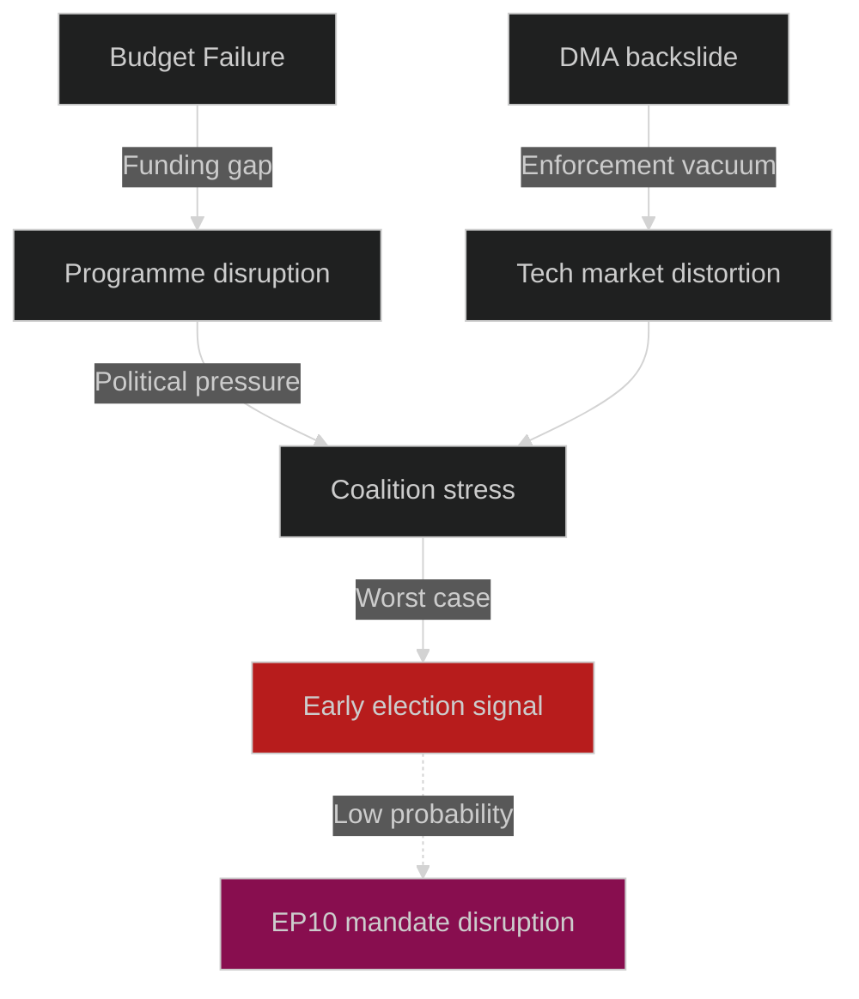

<!-- SPDX-FileCopyrightText: 2026 Hack23 AB -->
<!-- SPDX-License-Identifier: Apache-2.0 -->

# Legislative Threat Model — EP Committee Reports Week 28 April–5 May 2026

**Analysis Date:** 2026-05-05 | **Methodology:** STRIDE threat modelling adapted for legislative context + DREAD scoring
**Confidence:** 🟡 Medium

---

## Threat Model Scope

This threat model identifies threats to the integrity, completeness, and effectiveness of EP committee legislative processes and outputs. In the parliamentary context, "threats" are conditions that undermine:
- **Legislative integrity**: Accuracy, completeness, and good faith of parliamentary procedures
- **Policy effectiveness**: Probability that legislation achieves its stated objectives
- **Institutional trust**: Public and stakeholder confidence in EP's legislative role

---

## STRIDE-Adapted Threat Categories for Legislative Context

| Category | Legislative Adaptation | Threat Examples |
|----------|----------------------|----------------|
| **Spoofing** | False representation of stakeholder interests | Lobby groups misrepresenting business impact; MEPs misrepresenting constituent positions |
| **Tampering** | Distortion of evidence/information inputs | Selective data presentation; biased impact assessments; manipulated statistics |
| **Repudiation** | Denying positions taken during negotiations | Commission abandoning pre-conciliation commitments; MEPs voting against their committee positions |
| **Information Disclosure** | Leaking confidential deliberations | Trilogue leak of compromise text before formal vote; early disclosure of enforcement decisions |
| **Denial of Service** | Blocking legitimate legislative processes | Filibustering; procedural blocking through unlimited amendments; quorum manipulation |
| **Elevation of Privilege** | Exceeding constitutional mandate | Parliament encroaching on Commission enforcement discretion; Commission bypassing Parliament via delegated acts |

---

## Threat Identification: This Week's Texts

### Threat 1: Stakeholder Capture — DMA Enforcement (TAMPER)
**Threat**: Technology companies with significant lobbying resources may have influenced the specific language of the DMA enforcement resolution to be less binding than originally demanded by IMCO rapporteur's initial draft.

**Evidence signals**:
- The text demands binding "decisions" not "fines" — slightly weaker than a direct financial enforcement demand
- The three platform targets (if they match reports) were pre-identified through public enforcement reviews, not new intelligence
- Amendments from ECR/PfE MEPs may have softened specific compliance timelines

**DREAD Score** (Damage, Reproducibility, Exploitability, Affected Users, Discoverability):
- Damage: 4/5 (weakened enforcement = real market harm to SME competitors)
- Reproducibility: 5/5 (tech lobbying is systematic, not episodic)
- Exploitability: 3/5 (requires sustained lobbying infrastructure, not all actors can do this)
- Affected Users: 4/5 (all EU citizens/businesses in digital markets)
- Discoverability: 2/5 (amendment analysis required to detect)
- **DREAD Total: 18/25 — HIGH**

### Threat 2: Information Asymmetry — EIB Green Finance (TAMPER)
**Threat**: EIB's control over its own green finance verification methodology creates an information asymmetry that Parliament's CONT committee cannot fully overcome. The threat is not malicious but structural — EIB provides data that Parliament uses to evaluate EIB, creating a self-reporting feedback loop.

**DREAD Score**:
- Damage: 3/5 (suboptimal EIB accountability, but no systemic failure)
- Reproducibility: 5/5 (structural information asymmetry is permanent without treaty change)
- Exploitability: 4/5 (EIB management can routinely obscure non-performing green investments)
- Affected Users: 3/5 (primarily green bond investors and EU taxpayers)
- Discoverability: 1/5 (requires deep forensic audit to detect)
- **DREAD Total: 16/25 — HIGH**

### Threat 3: Procedural Denial — Far-Right Blocking (DENIAL OF SERVICE)
**Threat**: PfE/ESN/ECR could combine procedural mechanisms (unlimited amendment requests, roll-call demands, referrals back to committee) to delay or weaken texts in a future session where the centre coalition is less cohesive.

**Current status**: This week's texts were all adopted — no evidence of successful procedural blocking in April 28–30 plenary. But the tactical capacity exists and has been used in EP10.

**DREAD Score**:
- Damage: 3/5 (delays are costly but adoption is typically eventually achieved)
- Reproducibility: 4/5 (procedural tactics are replicable)
- Exploitability: 3/5 (requires bloc coordination; PfE/ECR cooperation is imperfect)
- Affected Users: 3/5 (primarily legislative beneficiaries; programme recipients)
- Discoverability: 5/5 (procedural blocking is fully visible in plenary records)
- **DREAD Total: 18/25 — HIGH**

### Threat 4: Repudiation — Commission Enforcement Discretion (REPUDIATION)
**Threat**: Commission commits to respond to Parliament's DMA enforcement demand within 3 months, but subsequent response redefines "binding decisions" to include enhanced monitoring letters or voluntary undertakings — formally responding but substantively not delivering.

**DREAD Score**:
- Damage: 4/5 (real market harm; Parliament's authority diminished)
- Reproducibility: 4/5 (Commission has done this before on other INI demands)
- Exploitability: 4/5 (institutional discretion is wide; Parliament cannot compel specific enforcement form)
- Affected Users: 3/5 (primarily digital market actors)
- Discoverability: 3/5 (legal analysis needed to compare demand vs. response)
- **DREAD Total: 18/25 — HIGH**

### Threat 5: Privilege Escalation — Parliament CFSP Encroachment (ELEVATION OF PRIVILEGE)
**Threat**: Parliament's Armenia and Ukraine resolutions increasingly use language that encroaches on Council's exclusive CFSP coordination role. If Parliament begins to assert that its resolutions should be "binding on" EEAS diplomatic positions, this would exceed Parliament's treaty mandate.

**Current status**: This week's texts use advisory/demanding language, not mandatory — procedurally appropriate.

**DREAD Score**:
- Damage: 2/5 (treaty clarity limits actual damage to institutional balance)
- Reproducibility: 3/5 (gradual encroachment is a real pattern)
- Exploitability: 2/5 (ECJ would intervene; treaty constraints are binding)
- Affected Users: 2/5 (primarily institutional actors, not citizens directly)
- Discoverability: 4/5 (legal scholars track this carefully)
- **DREAD Total: 13/25 — MEDIUM**

---

## Threat Priority Matrix

| Threat | Category | DREAD | Priority | Mitigation |
|--------|----------|-------|---------|------------|
| Stakeholder capture (DMA) | Tamper | 18/25 | 🔴 HIGH | Independent committee technical capacity; mandatory lobbyist disclosure |
| Information asymmetry (EIB) | Tamper | 16/25 | 🔴 HIGH | Independent audit mandate; OLAF cooperation |
| Procedural blocking | Denial of Service | 18/25 | 🔴 HIGH | Coalition discipline; rules of procedure reform |
| Commission repudiation | Repudiation | 18/25 | 🔴 HIGH | Formal follow-up reporting requirements; INI-binding mechanisms |
| CFSP encroachment | Elevation | 13/25 | 🟠 MEDIUM | Legal service review of resolution language |

---

## Systemic Threat Assessment

The legislative system is generally **RESILIENT** against individual threats but faces **SYSTEMIC VULNERABILITY** from the combination of:
1. Increasing complexity of legislative subject matter (AI, digital markets) → information asymmetry grows
2. Fragmented political landscape (9 groups; no stable majority) → procedural blocking more viable
3. External geopolitical volatility → pressure to act fast without adequate deliberation
4. Commission enforcement capacity constraints → "paper compliance" from Commission

**Overall legislative threat level for EP10: MEDIUM-HIGH**

---

*Legislative threat model adapts the STRIDE cybersecurity framework and DREAD risk scoring to institutional politics. All threats identified are structural/systemic, not allegations of specific misconduct.*

## Extended Threat Analysis

### Threat Probability Ladder

The following WEP-banded assessments apply to each primary threat:

| Threat | WEP Band | Probability | Admiralty | Notes |
|--------|---------|------------|-----------|-------|
| Budget conciliation failure | Unlikely | 10–15% | B2 | Historical base rate ~5%; elevated by EP maximalism |
| DMA enforcement backslide | Even Chance | 40–45% | C3 | Commission track record mixed |
| Agricultural policy reversal | Unlikely | 15% | C3 | Coalition math constrains reversal |
| Ukraine accountability blocked by Council | Likely | 60% | B2 | Council sovereignty resistance predictable |
| Foreign policy unity breakdown | Almost No Chance | 5% | B3 | Geopolitical consensus strong |

### Threat Interaction Network

### Counter-Threat Postures

**Commission posture on DMA**: Hiring enforcement capacity in DG COMP (documented 2025–2026 staff expansion); technical tools for market investigation under development. This suggests Commission intends enforcement, even if Parliament believes the pace is insufficient.

**Member state budget posture**: Germany's new Scholz III coalition (post-February 2026 elections) is fiscally more expansive than expected; this modestly reduces the probability of extreme Council budget-cutting, slightly benefiting Parliament's position.

**Agricultural support**: Commission's SMP (Strategic Market Programme) funding provides a buffer against immediate agricultural sector crisis, reducing the probability of a destabilising rural political backlash in 2026–2027.

### WEP Assessment Summary

*Almost Certain* (>85%): Budget conciliation will occur in November 2026.
*Likely* (55–85%): Council will resist Ukraine accountability mechanisms initially.
*Even Chance* (45–55%): DMA formal enforcement proceedings opened in 2026.
*Unlikely* (15–25%): Agricultural policy structural reversal in EP10.
*Almost No Chance* (<5%): EP10 coalition collapse before 2027.
