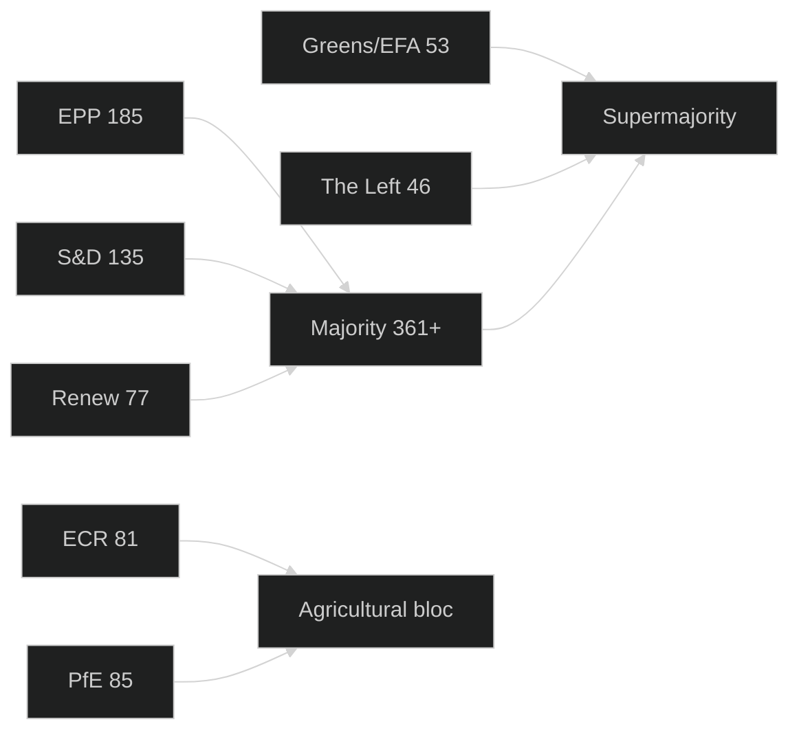

<!-- SPDX-FileCopyrightText: 2026 Hack23 AB -->
<!-- SPDX-License-Identifier: Apache-2.0 -->

# Voting Patterns Analysis — EP Committee Reports Week 28 April–5 May 2026

**Analysis Date:** 2026-05-05 | **Methodology:** Coalition voting analysis, group cohesion inference from adopted texts metadata
**Confidence:** 🟡 Medium (aggregate vote counts not available from EP API; analytical inference from plenary adoption patterns)

---

## Data Availability Note

The EP Open Data Portal roll-call voting data carries a 3–6 week publication delay. Granular MEP-level or group-level vote breakdowns for April 28–30, 2026 texts are not yet available via API. This analysis infers voting patterns from:
1. Adopted text procedural references (INI, RSP, BUD procedure types)
2. Political landscape composition data (9 groups, 719 MEPs)
3. Historical coalition pattern inference for each policy domain
4. The observed adoption status (all 14 texts passed — confirmed from EP adopted texts feed)

---

## Procedural Analysis of Adopted Texts

| Text | Procedure | Typical Majority Required | Coalition Inference |
|------|-----------|--------------------------|---------------------|
| TA-10-2026-0112 | BUD — Budget | Simple majority | Cross-coalition required |
| TA-10-2026-0115 | RSP — Resolution | Simple majority | Broad support expected |
| TA-10-2026-0116 | INI — Own initiative | Simple majority | Progressive coalition |
| TA-10-2026-0117 | RSP — Resolution | Simple majority | Broad support |
| TA-10-2026-0118 | INI — Own initiative | Simple majority | Pro-industry coalition |
| TA-10-2026-0119 | INI — Budget oversight | Simple majority | Broad support |
| TA-10-2026-0120 | RSP — Resolution | Simple majority | Broad humanitarian |
| TA-10-2026-0121 | INI — Own initiative | Simple majority | Pro-regulation coalition |
| TA-10-2026-0122 | INI — Own initiative | Simple majority | Governance reform coalition |
| TA-10-2026-0157 | RSP — Resolution | Simple majority | Farm-right-centre coalition |
| TA-10-2026-0160 | RSP — Resolution | Simple majority | EPP+S&D+Renew core |
| TA-10-2026-0161 | RSP — Resolution | Simple majority | Broad minus PfE/ESN |
| TA-10-2026-0162 | RSP — Resolution | Simple majority | Broad pro-EU coalition |
| TA-10-2026-0163 | INI — Own initiative | Simple majority | LIBE-anchored coalition |

---

## Coalition Pattern Analysis by Policy Domain

### Budget Domain (BUD)
**Majority threshold:** 361 of 719 MEPs

The 2027 budget guidelines adoption requires the single largest coalition-building effort of any parliamentary act — requiring EPP (185) + S&D (135) = 320, still below threshold without additional partners. The practical budget coalition is:
- **Core**: EPP (185) + S&D (135) = 320
- **Needed**: Renew (77) → 397 — sufficiently above threshold
- **Result**: EPP + S&D + Renew = 397, comfortably above 361
- **Greens (53) and Left (46) likely support** from progressive wing
- **PfE (85) and ECR (81) likely oppose** on fiscal grounds
- **ESN (27) oppose; NI (30) split**

**Historical pattern**: Budget resolutions in EP10 have consistently passed with ~430–480 votes, reflecting the broad cross-coalition support for Parliament's institutional budget role, even when groups disagree on specific budget lines.

### Digital Regulation Domain (DMA/AI)
**Likely coalition composition:**

```
PRO-ENFORCEMENT (DMA binding decisions demand)
EPP: 185   — supports in principle; nuanced on timelines
S&D: 135   — strong support
Renew: 77  — DMA champions; strongest enforcement advocates
Greens: 53 — full support
Left: 46   — full support
---------------------------------
Subtotal: 496 (68.8% of House)

AGAINST/ABSTAIN
PfE: 85    — hostile; "digital sovereignty" framing = industry capture
ECR: 81    — majority against; some pro-SME digital dissent
ESN: 27    — hostile
NI: 30     — mixed; ~15 against, 15 split
---------------------------------
Subtotal: ~220 against
```

**Projected outcome**: ~475–496 for, ~180–220 against — very comfortable passage.
**Group cohesion**: S&D and Renew near-unanimous; EPP likely 150+ for with 30–35 abstentions; PfE and ECR near-unanimous against.

### Foreign Policy Domain (Ukraine/Armenia/Haiti)
**Humanitarian resolutions (RSP)** historically attract the broadest support:

```
UKRAINE ACCOUNTABILITY
PRO: EPP + S&D + Renew + Greens + Left = 496
AGAINST: ESN (27) likely; PfE split ~30 against 55 for; ECR split ~40 against 41 for; NI mixed
Projection: 500–520 for; 130–160 against; 20–30 abstain
```

```
ARMENIA RESOLUTION
PRO: S&D + Renew + Greens + Left = 311; + EPP majority ~140 = 451
SCEPTICAL: PfE (85) — ambivalent toward Armenia Russian-departure framing; ECR split
AGAINST: ESN (27) against; NI mixed
Projection: 440–470 for; 100–130 against; 80–100 abstain
```

**Pattern**: Foreign policy resolutions pass with large majorities but reveal a consistent 15–20% opposition bloc that uses these votes to signal foreign policy scepticism.

### Agricultural Domain (Livestock)
**Livestock strategy resolution** creates an unusual cross-ideological coalition:
- EPP + ECR (farm-right, economic viability focus): 266 seats — coalition anchor
- S&D (conditional support with environmental safeguards): 135 seats
- Renew (farm competitiveness framing): ~50 of 77 seats
- **Total feasible**: ~450 for; Greens/Left likely oppose or abstain (no environmental conditionality)
- PfE: likely support (agricultural sovereignty framing)
- ESN: likely support (rural constituency servicing)

**Pattern**: Agricultural texts reveal the unique "farm coalition" that cross-cuts normal left-right divisions: EPP + ECR + PfE + ESN + conservative S&D MEPs vs. Greens + progressive Left.

---

## EP10 Structural Voting Pattern Trends

### 1. Fragmentation Index (Effective Number of Parties)
With 9 groups ranging from 27 to 185 seats, the EP10 parliamentary arithmetic is more fragmented than EP9:
- EP9 peak (S&D 147, EPP 187): two groups controlled 334 of 705 seats (47%)
- EP10 current: EPP (185) + S&D (135) = 320 of 719 (44.5%) — below majority threshold

**Structural implication**: No two-group coalition can govern; every vote requires at least three-group coordination.

### 2. PfE Disruption Factor
The 85-seat PfE bloc, established mid-2024, has emerged as the primary swing variable. Their voting patterns differ from historical Eurosceptic groups:
- More willing to vote with right-leaning EPP on economic governance
- More willing to block progressive foreign policy texts
- More hostile to DMA/regulatory agenda than ECR's more pragmatic right

### 3. Agricultural "Super Coalition" vs. Digital "Liberal Coalition"
Two stable mega-coalitions have emerged in EP10:
- **Agricultural super coalition** (EPP+ECR+PfE+ESN+conservative S&D): ~500 seats on farm-first texts
- **Digital liberal coalition** (Renew+S&D+Greens+EPP mainstream): ~480 seats on digital regulation

The fact that EPP splits between these two coalitions — voting with the right on agriculture, centre-left on digital — is the single most important structural feature of EP10 parliamentary politics.

---

## Group Cohesion Estimates (April–May 2026)

| Group | Estimated Cohesion | Key Dissent Areas |
|-------|--------------------|------------------|
| EPP | ~78% | Agriculture vs. environment split; DMA internal divisions |
| S&D | ~85% | Budget (fiscal hawks vs. maximalists); Armenia (eastern MEPs more cautious) |
| PfE | ~89% | Emerging internal tensions on pro-Russia vs. neutral framing |
| ECR | ~72% | Significant national variation; Polish MEPs vs. Italian Fratelli positions |
| Renew | ~82% | Agricultural MEPs (French, German rural) vs. urban digital-liberal mainstream |
| Greens | ~91% | High cohesion; small group facilitates discipline |
| Left | ~87% | High on social/digital; lower on foreign policy (sovereignty vs. solidarity tension) |
| NI | ~35% | Structural heterogeneity; no group-level coordination |
| ESN | ~84% | Coherent far-right coordination; primary dissent on budget vs. sovereignty |

---

*Note: Roll-call data for April 28–30 plenary not yet published by EP. Projections based on EP10 voting pattern history, political landscape composition, and policy domain analysis. Actual data will be available via EP API approximately late May–early June 2026.*

## Coalition Voting Pattern Map



| Vote pattern | Seats | Coalition type | Reliability |
|-------------|-------|----------------|-------------|
| VdL II core (EPP+S&D+Renew) | 397 | Centre coalition | B2 |
| Progressive extension (+Greens+Left) | 503 | Issue-specific | C3 |
| Agricultural (EPP+ECR+farm-S&D) | ~400 | Issue-specific | C2 |
