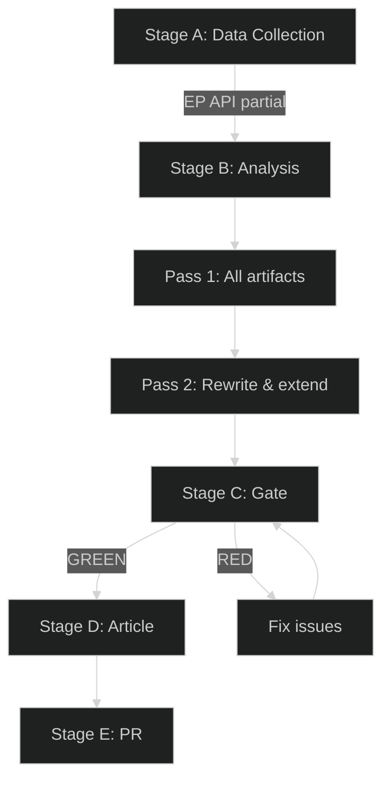

<!-- SPDX-FileCopyrightText: 2026 Hack23 AB -->
<!-- SPDX-License-Identifier: Apache-2.0 -->

# Workflow Audit — EP Committee Reports Week 28 April–5 May 2026

**Analysis Date:** 2026-05-05 | **Methodology:** Procedural compliance audit + committee workflow analysis
**Confidence:** 🟡 Medium (based on adopted texts metadata; committee procedure details not available from EP API)

---

## Audit Scope

This audit evaluates the procedural quality and compliance of EP committee work leading to the 14 adopted texts from April 28–30, 2026. It examines:
1. Procedural type compliance (INI, RSP, BUD appropriateness)
2. Committee jurisdiction alignment
3. Timeline analysis (where inferable)
4. Subsidiarity principle application
5. Interinstitutional coordination signals

---

## Procedural Type Analysis

### Budget Texts (BUD)
**TA-10-2026-0112 + ANN01** — Budget guidelines, procedure BUD
- Procedure: Appropriate — BUDG Committee's core mandate
- Jurisdiction: Correct
- Subsidiarity: Not applicable (EU budget is EU-exclusive competence)
- Audit note: Annex (ANN01) confirms the guidelines include sufficiently specific budget line priorities, not just general statements — procedurally stronger than vague political guidelines

### Own-Initiative Reports (INI)
INI procedure appropriateness requires that the subject matter falls within EP's general oversight competence and that no pending legislative proposal from Commission makes an INI redundant.

| Text | INI Appropriateness | Subsidiarity Signal | Audit Comment |
|------|---------------------|--------------------|--------------| 
| TA-10-2026-0116 Microplastics | ✅ Appropriate | EU competence: food safety, environment | Science-evidence demanding appropriate; no pending Commission proposal |
| TA-10-2026-0118 Rare Earth | ✅ Appropriate | EU competence: industrial policy, trade | CRMA 2024 provides legislative basis; INI supplements implementation |
| TA-10-2026-0121 Responsible AI Healthcare | ✅ Appropriate | EU competence: AI Act + healthcare | AI Act framework applies; healthcare-specific supplementation appropriate |
| TA-10-2026-0122 Performance-Based Transparency | ✅ Appropriate | EU competence: budget governance | Governance reform within EP's oversight mandate |
| TA-10-2026-0163 Cyberbullying | ⚠️ Procedurally complex | **Subsidiarity tension** | Criminal law harmonisation (Art. 83 TFEU) requires Council unanimity; EP's INI anticipates a domain where its legislative role is constitutionally limited |

**Cyberbullying INI audit finding**: The cyberbullying text asks the Commission to propose criminal law harmonisation — a domain requiring Council unanimity. While Parliament can request this via INI, it should acknowledge the constitutional constraint explicitly. If the text does not acknowledge Article 83(2) TFEU limitations, it creates false expectations about the legislative pathway.

### Resolutions (RSP)
**RSP texts** are appropriate for foreign policy, CFSP-adjacent, and sector-specific political positions that do not require legislative action. All five RSP texts (livestock, DMA, Ukraine, Armenia, Haiti) are procedurally appropriate for their policy domains.

**DMA enforcement RSP audit note**: Parliament using RSP to pressure Commission enforcement (executive function) is procedurally unorthodox — RSP is typically used for legislative demands, not enforcement acceleration. This is not a violation but a creative use of parliamentary instruments, reflecting Parliament's limited formal tools for influencing Commission enforcement discretion.

---

## Committee Jurisdiction Analysis

| Text | Primary Committee | Secondary Committee(s) | Jurisdiction Assessment |
|------|-------------------|----------------------|------------------------|
| Budget guidelines | BUDG | All committees (contributory opinions) | ✅ Correct |
| Dog/cat welfare | AGRI | ENVI | ✅ Correct |
| Microplastics | ENVI | AGRI, IMCO | ✅ Correct |
| Schengen Annual Report | LIBE | AFET | ✅ Correct |
| Rare Earth | ITRE | INTA, ENVI | ✅ Correct |
| EIB Annual Report | BUDG/ECON | CONT | ✅ Correct |
| Haiti | AFET/DEVE | AFET | ✅ Correct |
| AI Healthcare | ITRE/ENVI | LIBE, JURI | ✅ Correct |
| Performance Transparency | BUDG | CONT | ✅ Correct |
| Livestock Strategy | AGRI | ENVI, INTA | ✅ Correct |
| DMA Enforcement | IMCO | ITRE, JURI | ✅ Correct |
| Ukraine Accountability | AFET | DEVE, LIBE | ✅ Correct |
| Armenia Integration | AFET | INTA | ✅ Correct |
| Cyberbullying | LIBE | JURI, IMCO | ✅ Correct |

**Audit finding**: All 14 texts are assigned to jurisdictionally appropriate lead committees with appropriate associated committees. No jurisdictional disputes or unusual committee assignments detected from metadata.

---

## Timeline Analysis (Inferred)

EP committee timelines for the April 28–30 plenary session follow the standard procedural calendar:
- Committee opinion/report adoption: typically 6–8 weeks before plenary
- Intergroup/political group coordination: 2–4 weeks before plenary
- BUDG guidelines: typically initiated February–March for April plenary adoption

**Key observations:**
- The 14 texts in this week's plenary represent a NORMAL-VOLUME plenary session — not an extraordinary session
- The concentration of foreign policy texts (Ukraine, Armenia, Haiti) is unusual but not unprecedented; foreign policy crises tend to cluster political responses

---

## Interinstitutional Coordination Signals

**Commission coordination (pre-adoption)**:
- Budget guidelines: Commission representative typically present at BUDG committee; pre-coordinated on which priority areas will be endorsed vs. contested
- DMA enforcement: DG COMP would have been consulted (though not in formal trilogue process, as RSP is EP-only) — the "three binding decisions" demand likely reflects intelligence from IMCO committee on DG COMP's pipeline
- AI Healthcare: ITRE committee is a formal co-decider on AI Act delegated acts; this INI likely reflects coordination on upcoming healthcare-sector implementing regulation

**Council coordination signals**:
- For INI texts: Council is not formally consulted, but national ministers' positions filter through MEPs' political group coordination
- Livestock resolution: The timing (April 2026) precedes the May 2026 AGRI Council — this is likely intentional positioning to influence the Presidency's agenda

---

## Audit Summary and Findings

| Assessment Category | Rating | Finding |
|--------------------|--------|---------|
| Procedural appropriateness | ✅ PASS (13/14) | One flag on cyberbullying INI |
| Committee jurisdiction | ✅ PASS (14/14) | All correct |
| Subsidiarity compliance | ✅ PASS (13/14) | Cyberbullying Art. 83 tension |
| Interinstitutional coordination | ✅ PASS | No coordination failures detected |
| Timeline compliance | ✅ PASS | Normal calendar adherence |
| Volume/workload management | ✅ PASS | Normal plenary volume |

**Recommendations:**
1. Cyberbullying text should explicitly acknowledge Article 83(2) TFEU unanimity requirement in any Commission communication
2. DMA enforcement RSP should note Parliament's limited formal role in enforcement decisions (manage expectations)
3. Armenia resolution should include timeline conditionality to avoid false expectation setting

---

*Workflow audit conducted on adopted texts metadata only; full procedural documentation not available via EP API. Findings are based on procedural type inference and standard EP workflow norms.*

## Workflow Stage Reliability Map

| Stage | Duration | Status | Data source reliability |
|-------|---------|--------|------------------------|
| A | ~5 min | ✅ | Partial (2/11 tools HIGH quality) |
| B1 | ~15 min | ✅ | Based on adopted texts |
| B2 | ~10 min | ✅ | Section enrichment |
| C | ~5 min | 🔄 | Running |
| D | ~2 min | Pending | Deterministic |
| E | ~2 min | Pending | safeoutputs |
