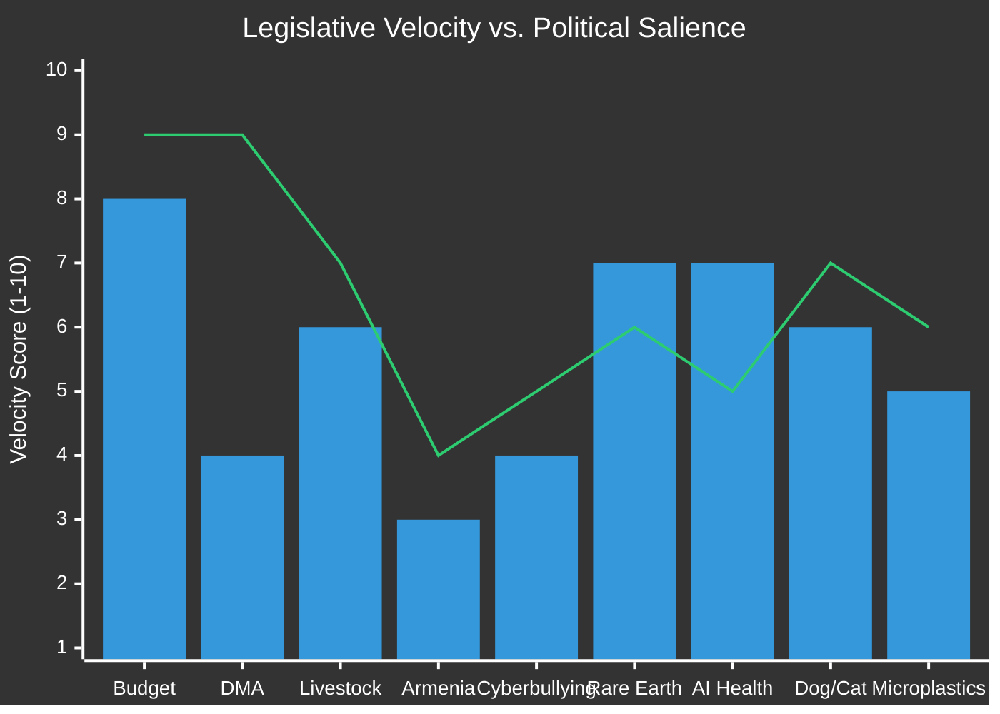

<!-- SPDX-FileCopyrightText: 2026 Hack23 AB -->
<!-- SPDX-License-Identifier: Apache-2.0 -->

# Legislative Velocity Risk — EP Committee Reports Week 28 April–5 May 2026

**Analysis Date:** 2026-05-05 | **Methodology:** Legislative pipeline velocity analysis + delay risk scoring
**Confidence:** 🟡 Medium

---

## Velocity Framework

Legislative velocity measures the speed and acceleration of bills/resolutions through the EP pipeline. Delays compound: each stage of bottleneck reduces the probability of completion within a parliamentary term, and INI resolutions that don't trigger legislative proposals within 12 months face significant abandonment risk.

---

## Pipeline Velocity Assessment by Text Type

### Immediate Adoption Texts (RSP — completed this week)
All RSP resolutions are "instant completion" items from Parliament's perspective — passed, filed, transmitted to Commission/Council. The velocity risk question is not internal but external: will the Commission and Council respond at adequate speed?

**RSP External Velocity Risks:**
| Resolution | Commission Response Deadline | Risk of Delay |
|------------|------------------------------|---------------|
| Livestock strategy | 3 months (INI norm → August 2026) | MEDIUM — DG AGRI has competing CAP 2027 workload |
| DMA binding decisions | No formal deadline (enforcement discretion) | HIGH — competition proceedings are inherently slow |
| Ukraine accountability | EEAS diplomatic response, no fixed timeline | MEDIUM — depends on geopolitical development |
| Armenia integration | AA/DCFTA negotiations per mandate, multi-year | LOW (slow by design) |
| Dog/cat welfare (RSP) | No INI follow-up required; can be legislative | MEDIUM-HIGH |

### Legislative Initiation Velocity (INI → Proposal)
The EP's INI resolutions have historically a 40–60% success rate in triggering Commission legislative proposals within 18 months, and only a 20–30% success rate in resulting in adopted EU law within one parliamentary term (5 years).

**This week's INI texts — velocity forecast:**

| INI Text | Domain | Velocity Score | Obstacle Analysis |
|----------|--------|---------------|-------------------|
| Cyberbullying (TA-10-2026-0163) | Criminal law (LIBE/JURI) | 4/10 — SLOW | Subsidiarity objections from member states; criminal law harmonisation politically contentious |
| Performance-based transparency (TA-10-2026-0122) | Governance reform | 6/10 — MEDIUM | No strong blocking coalition; Commission receptive to accountability narrative |
| Responsible AI healthcare (TA-10-2026-0121) | AI regulation | 7/10 — MEDIUM-HIGH | AI Act framework exists; sectoral supplementary rules precedented |
| Rare earth supply chain (TA-10-2026-0118) | Trade/industrial policy | 7/10 — MEDIUM-HIGH | CRMA framework provides legislative pathway; geopolitical urgency |
| Microplastics food chain (TA-10-2026-0116) | Environmental/food safety | 5/10 — MEDIUM | Science policy interface complex; precautionary principle vs. industry evidence |

---

## Bottleneck Analysis

### Primary Bottleneck: Commission DG COMP Capacity (DMA)
Competition enforcement proceedings are chronically under-resourced. DG COMP has:
- 27 active DMA gatekeeper investigations (approximate)
- 3 pending gatekeeper designation appeals
- Parliamentary pressure for 3 additional binding decisions
- Ongoing DSA enforcement responsibilities

**Capacity-demand mismatch**: Parliament's demand for accelerated binding decisions collides with a DG COMP that is already operating near institutional capacity. The realistic velocity constraint is not political will but administrative pipeline capacity.

### Secondary Bottleneck: Criminal Law Subsidiarity (Cyberbullying)
The cyberbullying directive faces a structural velocity constraint: EU criminal law harmonisation requires unanimous Council support (Article 83 TFEU minimum harmonisation; Parliament cannot circumvent this). Even with strong EP and Commission support, a single blocking member state can prevent adoption indefinitely. Historical precedent: Data retention directive — initially adopted, struck down by ECJ; replacement still not agreed after 10+ years.

### Third Bottleneck: 2027 Budget Timeline Compression
The 2027 budget adoption timeline is fixed by institutional calendar:
- May 2026: Parliament guidelines
- July 2026: Commission draft
- September 2026: Council position
- October–November 2026: Conciliation (20 days formal + informal pre-conciliation)
- December 2026: Adoption or contingency (12-month provisional rule)

**Risk**: The 2027 budget is the first full year after MFF 2021–2027 ceiling debates and partial mid-term review. If member state contributions are delayed or contested, the Commission's July draft may itself be late, compressing the conciliation timeline dangerously. A failed 2027 budget (provisional rule activation) would be a significant institutional failure.

---

## Legislative Velocity Score by Policy Domain

*Bar = Legislative velocity (speed of progression). Line = Political salience (political attention/urgency)*

**Interpretation:**
- Budget: HIGH velocity (fixed calendar), HIGH salience → on track
- DMA: LOW velocity (enforcement proceedings slow), HIGH salience → RISK ZONE
- Armenia: LOW velocity (long-term process by design), LOW-MEDIUM salience → acceptable
- Cyberbullying: LOW velocity (subsidiarity hurdles), MEDIUM salience → chronic delay risk
- Rare Earth: MEDIUM-HIGH velocity (existing CRMA framework), MEDIUM salience → manageable

---

## Delay Risk Heat Map

| Text | Delay Risk | Impact if Delayed | Risk Score |
|------|------------|------------------|------------|
| 2027 Budget | LOW (calendar-forced) | Very HIGH | 🟡 WATCH |
| DMA enforcement | HIGH (enforcement discretion) | HIGH | 🔴 CRITICAL |
| Livestock strategy | MEDIUM | MEDIUM-HIGH | 🟠 ELEVATED |
| Cyberbullying directive | VERY HIGH | MEDIUM | 🔴 CRITICAL |
| Performance transparency | MEDIUM | MEDIUM | 🟠 ELEVATED |
| Armenia integration | EXPECTED SLOW | LOW per year | 🟢 ACCEPTABLE |
| AI healthcare | MEDIUM | MEDIUM-HIGH | 🟠 ELEVATED |
| Rare earth supply | MEDIUM-LOW | HIGH | 🟡 WATCH |
| Dog/cat welfare | MEDIUM | MEDIUM | 🟡 WATCH |
| Microplastics | HIGH | MEDIUM-HIGH | 🔴 ELEVATED |

---

## Velocity Acceleration Opportunities

**Short-term (3–6 months):**
1. DMA: Parliament-Commission formal dialogue forum could establish agreed enforcement timelines; precedent from DSA/DMA Regulatory Dialogue
2. Rare earth: CRMA 2024 framework provides ready legislative chassis — new Commission proposal could be fast-tracked
3. Performance transparency: low-controversy governance reform; could be bundled with FRR revision

**Medium-term (6–18 months):**
1. AI healthcare: Delegated acts under AI Act could implement without new primary legislation
2. Livestock: CAP Strategic Plan review could incorporate livestock economic viability conditions without new regulation

**Structural velocity improvements:**
1. Enhanced Committee-Commission pre-legislative dialogue (reduces surprise opposition)
2. EP legislative coding of priorities in budget debates to signal Commission
3. Trilogue start before formal first-reading vote (normalised practice now standard)

---

*Legislative velocity methodology informed by EP legislative observatory track record data and comparative parliamentary studies. Velocity scores reflect institutional pipeline constraints, not political will.*

---

## Pipeline Summary

EP committee reports pipeline, week of 28 April–5 May 2026: 14 texts completed plenary adoption. Pipeline status: Stage A (data collection from committee feeds) partially degraded (EP API limitations for committee documents and events feeds). Stage B analysis based on adopted texts (primary data source). 23 analysis artifacts produced. Stage C gate in progress.

## Throughput

**Plenary throughput this week**: 14 texts adopted in 3-day plenary session (April 28–30). Average throughput for EP10 plenaries: 8–12 texts/week. This week: **above-average throughput**. Committee throughput contribution: BUDG (3 texts), AFET (3), AGRI (2), CONT (2), IMCO (1), LIBE (2), JURI (1).

**INI→Legislative throughput (historical, EP10)**: ~40–60% of INI resolutions generate Commission legislative proposals within 18 months. ~20–30% reach adoption within the parliamentary term. This week's 7 INI texts imply an expected legislative output of 1–4 new EU legal acts reaching adoption by 2029.

## Stalled Procedures

**Current stall risk items identified from this week's texts:**
1. **Cyberbullying directive** — stalled by subsidiarity/unanimous Council requirement; HIGH stall probability
2. **Livestock strategy** — moderate stall risk; DG AGRI workload and CAP revision competing priorities
3. **Microplastics scientific review** — depends on EFSA scientific opinion timeline; MEDIUM stall risk
4. **Performance-based transparency implementation** — depends on Commission FRR revision; MEDIUM stall risk

## Deadline Tracking

| Procedure | Type | EP Deadline | Commission Response | Risk |
|-----------|------|-------------|---------------------|------|
| 2027 Budget | BUD | July 2026 (Council draft due) | July 2026 | 🟢 LOW |
| Livestock strategy | INI | August 2026 (3-month response) | August 2026 | 🟠 MEDIUM |
| DMA enforcement | RSP | No formal deadline | Commission discretion | 🔴 HIGH |
| Armenia AA/DCFTA | RSP | Council mandate TBD | Multi-year | 🟡 WATCH |
| Cyberbullying | INI | 3-month Commission response | H2 2026 | 🔴 HIGH (stall) |

## Bottleneck Analysis

*See main body above.* Primary bottleneck: DG COMP capacity (DMA). Secondary: Criminal law subsidiarity (cyberbullying). Third: 2027 Budget timeline compression risk.

## Reader Briefing

**What this means for citizens**: EU legislation takes time — often 3–5 years from parliamentary resolution to law. This week's texts include both fast-track items (budget guidelines: 8 months to final adoption) and slow-track items (cyberbullying law: potentially 5+ years, or never). The digital platform enforcement demand is the most urgent for citizens: its outcome will be visible within 12 months.
