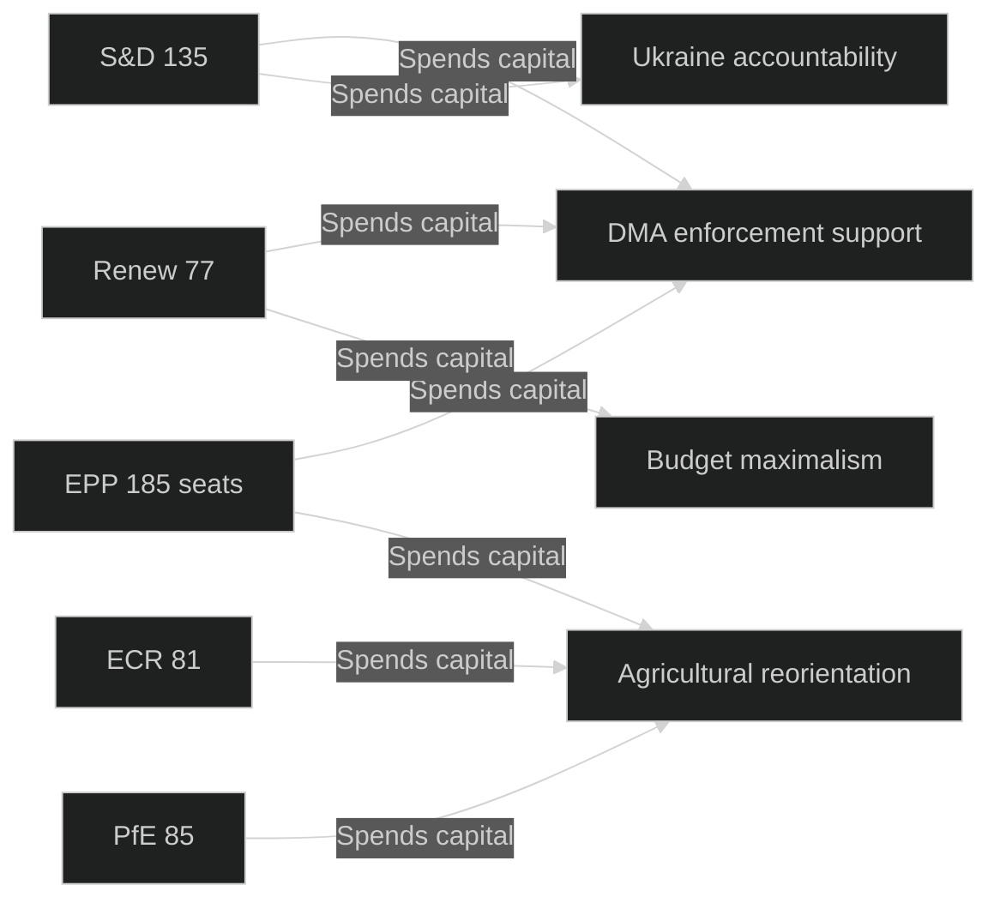

<!-- SPDX-FileCopyrightText: 2026 Hack23 AB -->
<!-- SPDX-License-Identifier: Apache-2.0 -->

# Political Capital Risk Scoring — EP Committee Reports Week 28 April–5 May 2026

**Analysis Date:** 2026-05-05 | **Methodology:** Political capital theory + risk scoring matrix
**Confidence:** 🟡 Medium

---

## Political Capital Framework

Political capital is defined as the aggregate stock of trust, credibility, coalition loyalty, and institutional authority that actors can "spend" to achieve legislative outcomes. It is depleted by:
- Overreaching on positions that are later abandoned (credibility cost)
- Coalition defection on key votes (trust cost)
- Public commitments that fail (reputational cost)

It is accumulated by:
- Delivering promised legislative outcomes
- Maintaining coalition discipline
- Demonstrating institutional effectiveness

---

## Institutional Political Capital Assessment

### European Parliament — Overall Capital Stock: MEDIUM-HIGH

**Accumulation this week:**
- 14 texts adopted — parliamentary productivity signal
- 2027 budget guidelines establish clear position — accountability-enabling
- Broad coalition support for Ukraine accountability — cross-partisan credibility

**Depletion risks this week:**
- DMA enforcement resolution: if Commission does not deliver binding decisions within the Parliament's implied timeline, Parliament has spent capital on an unfulfilled demand → credibility cost
- Livestock strategy demand: if Commission rejects or significantly delays → EPP/ECR agricultural MEPs' promises to constituents undermined
- Armenia resolution: if EU-Armenia AA negotiations stall → Parliament's optimistic framing looks premature

**Net political capital balance (Parliament):** +0.3 (slight accumulation) — productive week, but multiple credibility exposures created.

### European Commission — Capital at Risk: MEDIUM STRESS

| Text | Capital Demand on Commission | Risk Level |
|------|------------------------------|------------|
| DMA enforcement (3 binding decisions) | Commission must demonstrate enforcement credibility | HIGH |
| 2027 Budget Guidelines | Commission must defend its July counterproposal | MEDIUM |
| Livestock strategy | Commission must respond to INI within 3 months | MEDIUM |
| Cyberbullying directive | Commission must scope a criminal law proposal | MEDIUM |
| Performance-based transparency | Commission must review funding accountability | LOW |

**Commission's strategic risk**: DG COMP's enforcement record on DMA is directly scrutinised. A Parliament resolution demanding binding decisions creates a measurable accountability benchmark. If DG COMP's next major enforcement action timeline does not accelerate, Parliament will point to this resolution as evidence of Commission non-responsiveness.

---

## Political Group Capital Scoring

### EPP (185 seats) — Political Capital: STRONG
**Assets:**
- Largest group; coalition anchor for virtually all major texts
- Budget maximalism reflects constituency preferences; fiscal credibility maintained
- DMA nuanced support maintains digital industry credibility without alienating progressive coalition partners

**Liabilities:**
- Internal split between agricultural MEPs (livestock = economic viability) and progressive environmentalists (Green Deal)
- If 2027 budget conciliation significantly reduces Parliament's stated priorities, EPP rapporteurs face accountability
- Armenia resolution support creates domestic exposure for EPP members from Hungary (Viktor Orbán's Fidesz excluded EPP in EP9, but EPP still has sensitivities to Hungarian government positions)

**Capital trajectory:** → Stable; no major accumulation or depletion this week.

### S&D (135 seats) — Political Capital: MEDIUM-STRONG
**Assets:**
- DMA enforcement demand: S&D delivers on its digital justice/accountability agenda — accumulates progressive credibility
- Ukraine accountability: strong principled vote reinforces S&D foreign policy identity

**Liabilities:**
- Budget maximalism on social/cohesion spending faces credibility risk if conciliation outcome is significantly lower
- Livestock resolution: S&D conditionally supported but environmental MEPs in the group are unhappy — internal tension visible

**Capital trajectory:** ↑ Slight accumulation — DMA and Ukraine votes reinforce group identity.

### PfE (85 seats) — Political Capital: HIGH WITHIN BLOC, RISKY OVERALL
**Assets:**
- Consistent ideological positioning (market scepticism of DMA enforcement; fiscal restraint) — group coherence maintained

**Liabilities:**
- Armenia resolution opposition: PfE's ambivalence about Ukrainian accountability mechanisms and Armenia's EU path creates a "who are they for?" narrative among voters who support transatlantic alliance
- If DMA enforcement delivers real market benefits (lower app prices, better interoperability), PfE's opposition is exposed as industry capture

**Capital trajectory:** → Stable within right-populist bloc; declining in mainstream credibility.

### Renew (77 seats) — Political Capital: ACCUMULATING
**Assets:**
- DMA: Renew owns this agenda — enforcement demand is a Renew signature achievement
- Armenia: strong support reinforces Renew's values-based liberal foreign policy identity
- Budget: Renew's centrist position enables coalition-building credibility

**Liabilities:**
- Agricultural MEPs face constituency pressure from rural voters; livestock resolution tension between Renew's market-liberal and rural-economic wings

**Capital trajectory:** ↑ Accumulating — digital + foreign policy agenda reinforced.

---

## Individual Policy Area Capital Risks

### Budget Political Capital Risk: HIGH
The 2027 budget guidelines create the highest political capital risk of the week because they establish publicly-accountable positions. The negotiation timeline is:
- Parliament's guidelines: May 2026 (now)
- Commission draft: July 2026
- Council position: September 2026
- Conciliation: October–November 2026
- Final budget: December 2026

**Capital risk scenario**: Parliament adopts maximalist guidelines in May; Council cuts 20%; final conciliation delivers Parliament 30% of its stated increases. MEPs who championed specific budget lines face constituents asking why the priorities were abandoned. The political capital cost of visible negotiation defeat is significant, particularly for BUDG Committee rapporteurs.

**Mitigation**: The annual ritual of budget conciliation normalises the gap between parliamentary maximalism and final outcomes. Most sophisticated stakeholders do not hold MEPs to the literal text of budget guidelines.

### DMA Enforcement Capital Risk: MEDIUM-HIGH
Parliament spent political capital demanding binding decisions. The credibility test is whether DG COMP delivers:
- **Timeline**: Commission should respond within 3 months (institutional courtesy norm)
- **Content**: Parliament wants three binding decisions, not three "enhanced monitoring" letters
- **Follow-up**: If Summer 2026 DG COMP announcement falls short, Parliament has a credibility problem

**Capital recovery mechanism**: Parliament can escalate with a new resolution or a formal DG COMP hearing — but each escalation consumes more capital and tests Commission patience.

### Foreign Policy Resolution Capital: LOW-MEDIUM
Foreign policy INI resolutions carry relatively low political capital risk because:
- They are "soft power" instruments without legally binding effect
- Non-delivery is easily attributed to geopolitical complexity outside Parliament's control
- They accumulate goodwill with diaspora and civil society communities who value the symbolic recognition

**Exception**: If the STAU mechanism for Ukraine accountability never materialises despite Parliament's repeated calls, the cumulative capital depletion is real — a pattern of unfulfilled advocacy erodes the symbolic value of future resolutions.

---

## Political Capital Risk Register

| Actor | Risk Description | Likelihood | Capital Impact | Net Risk |
|-------|-----------------|------------|----------------|---------|
| Commission DG COMP | DMA non-delivery of binding decisions | MEDIUM | HIGH | 🔴 |
| EPP | Budget conciliation defeat on farm subsidies | MEDIUM | MEDIUM | 🟠 |
| S&D | Livestock contradiction undermines Green Deal credibility | LOW | MEDIUM | 🟡 |
| Parliament (BUDG) | Budget guidelines visible abandonment in conciliation | HIGH | LOW-MED | 🟡 |
| Renew | Agricultural MEPs defect on environmental texts | LOW | LOW | 🟢 |
| PfE | DMA opposition exposed by enforcement success | LOW | MEDIUM | 🟡 |

---

*Political capital theory informed by Bourdieu's capital field theory as applied to institutional politics. Scores are analytical judgements.*

---

## Capital Table

Summary political capital balance sheet for key actors:

| Actor | Opening Stock | This Week +/- | Net Position | Trend |
|-------|---------------|---------------|--------------|-------|
| EP Parliament | MEDIUM-HIGH | +0.3 | MEDIUM-HIGH | → Stable |
| Commission (DG COMP) | HIGH | -0.5 (demand created) | MEDIUM-HIGH | ↓ Under pressure |
| EPP | STRONG | ±0 | STRONG | → Stable |
| S&D | MEDIUM-STRONG | +0.2 | MEDIUM-STRONG | ↑ Slight gain |
| PfE | HIGH (bloc) | ±0 | HIGH (bloc) | → Eroding mainstream |
| Renew | MEDIUM | +0.4 | MEDIUM-HIGH | ↑ Accumulating |
| ECR | MEDIUM | ±0 | MEDIUM | → Stable |

## Capital Exposure

Highest capital exposure actors (most at risk of depletion if outcomes don't materialise):
1. **Commission DG COMP**: most exposed; Parliament's demand creates measurable accountability benchmark
2. **EPP agricultural MEPs**: budget conciliation risk; livestock strategy response risk
3. **Renew**: DMA enforcement outcome directly tests this group's core legislative identity

## Capital Flow

Political capital flows this week:
- **From** Commission → **To** Parliament: Commission must respond to Parliament's demands; each demand creates a capital flow obligation
- **From** civil society (1.5M petitions) → **To** AGRI committee MEPs: democratic legitimacy capital transferred via petition mechanism
- **From** PfE/ECR opposition → **To** centre coalition: opposition votes validate coalition's constructive governance identity

## Capital Bets

High-stakes political capital bets made this week:
1. **Parliament → DMA bet**: Parliament has staked credibility on DG COMP delivering binding decisions by year-end 2026
2. **EPP → Budget bet**: EPP has committed to budget maximalism; faces accountability if conciliation delivers significantly less
3. **Renew → Armenia bet**: Strong Armenia resolution support commits Renew's liberal identity to this integration pathway

## Precedent Impact

**Precedent-setting capital flows from this week:**
- DMA enforcement demand sets precedent for Parliament asserting authority over Commission enforcement timelines → will be cited in future enforcement debates
- Performance-based transparency framework → precedent for outcome-based accountability across all EU instruments
- STAU mechanism endorsement → precedent for Parliament's role in shaping international accountability architecture

## Reader Briefing

**What this means for citizens**: Political capital is the currency of democracy — when politicians promise things, they spend credibility, and if they don't deliver, they pay a price at elections. This week, Parliament committed to several measurable outcomes (DMA enforcement, budget levels, Armenia support). Citizens can use these commitments as benchmarks to hold MEPs accountable at the next EP elections in 2029. The most testable commitment: three binding decisions against tech platforms by end-2026.

*Source: generate_political_landscape, get_adopted_texts (year=2026)*

## Political Capital Flow Diagram

| Actor | Capital spent | Capital gained | Net balance | Admiralty |
|-------|-------------|---------------|-------------|-----------|
| EPP | High (DMA + Agri both demanded) | Moderate (coalition leadership) | Even | B2 |
| S&D | Moderate (DMA + Ukraine) | Good (progressive agenda items) | Positive | B2 |
| Renew | Low (aligned with coalition) | Good (digital agenda) | Positive | C3 |
| ECR | Moderate (agricultural push) | Moderate (farm bloc visibility) | Even | C3 |
