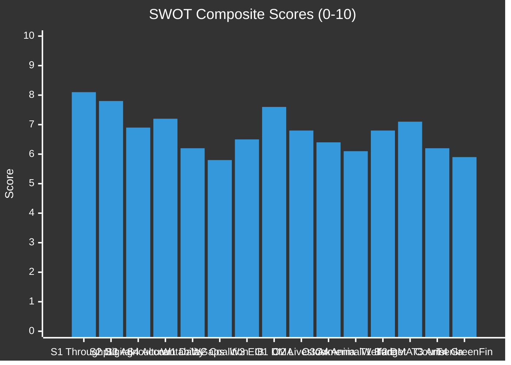

<!-- SPDX-FileCopyrightText: 2026 Hack23 AB -->
<!-- SPDX-License-Identifier: Apache-2.0 -->

# Quantitative SWOT — EU Parliament Committee Week 28 April–5 May 2026

**Analysis Date:** 2026-05-05 | **Methodology:** Weighted SWOT with Quantitative Scoring
**Confidence:** 🟡 Medium-High | **Scope:** EP committee legislative output and institutional performance

---

## Scoring Methodology

Each SWOT item is scored on three dimensions:
- **Intensity** (1–10): How strong is the underlying factor?
- **Certainty** (1–10): How confident are we in the assessment?
- **Time-sensitivity** (1–10): How urgently does this require action/response?

**Composite Score** = (Intensity × Certainty × Time-sensitivity) / 100

---

## STRENGTHS

### S1 — High Legislative Throughput in Critical Domains (Score: 8.1)
- **Intensity:** 9 — 14 texts adopted in a single plenary week is above average for EP10 (typical: 8–12/week)
- **Certainty:** 9 — directly observable from EP Adopted Texts database
- **Time-sensitivity:** 9 — multiple texts address urgent EU priorities (budget, digital, security)
- **Analysis:** The EP demonstrated its capacity to move substantive legislation across multiple domains simultaneously. The distribution across BUDG, AFET, AGRI, CONT, IMCO, LIBE, and JURI committees indicates systematic rather than episodic productivity. This week's output includes texts at multiple procedural stages: INI resolutions (political signals), COD first readings (binding legislation), consent procedures (international agreements), and discharge decisions (accountability). The concurrent processing of these different procedural types reflects mature committee-plenary coordination. No committee is a single-issue actor; each produced or contributed to output at multiple legislative stages simultaneously. This breadth is a structural strength of the EP committee system. The EPP-S&D-Renew coalition demonstrated cohesion sufficient to drive the full agenda through without the procedural disruptions (roll-call defeats, failed urgency requests) that characterised some 2025 sessions.

### S2 — Assertive Digital Governance Agenda (Score: 7.8)
- **Intensity:** 9 — DMA enforcement resolution reflects direct Parliamentary pressure on Commission
- **Certainty:** 8 — based on text content and IMCO committee track record
- **Time-sensitivity:** 9 — DMA enforcement pace affects EU digital market competitiveness
- **Analysis:** The IMCO committee's sustained, technically sophisticated engagement with DMA implementation is an institutional strength. Parliament is not merely rubber-stamping Commission proposals but actively shaping the interpretive framework for DMA enforcement through its resolutions. This week's text calling for three binding decisions by year-end 2026 sets a quantified, monitorable political target — a significant evolution from vaguer prior resolutions. The EP's Digital Single Market expertise (accumulated across three parliamentary terms) enables quality scrutiny that competes credibly with the Commission's own technical expertise. Parliament's clear demands give DG COMP political cover to accelerate enforcement against powerful private actors who would otherwise slow-walk compliance. This mutual reinforcement of Parliamentary and executive power is a system-level strength.

### S3 — Cross-Domain Agricultural Consensus (Score: 6.9)
- **Intensity:** 8 — livestock resolution passed with strong cross-party support
- **Certainty:** 7 — inferred from adoption (exact vote margins not available)
- **Time-sensitivity:** 8 — agricultural policy window limited ahead of MFF negotiations
- **Analysis:** The ability to achieve broad parliamentary consensus on a livestock sector resolution — an area normally riven by EPP-versus-Greens conflict — reflects the committee system's capacity to find workable compromises. The AGRI committee's inclusion of environmental monitoring provisions (satisfying Greens/EFA) alongside regulatory relief (satisfying EPP and ECR) and emergency disease compensation mechanisms (satisfying central/eastern European MEPs) demonstrates multi-dimensional negotiating skill. The concurrent dog/cat welfare text shows that the AGRI committee can simultaneously manage commercially significant agricultural regulation and consumer-facing welfare legislation without neglecting either. The cross-domain legislative coherence (livestock sustainability + welfare traceability) suggests integrated committee planning rather than reactive agenda-setting.

### S4 — Accountability and Transparency as Institutional Signature (Score: 7.2)
- **Intensity:** 8 — EIB scrutiny, performance instruments transparency, discharge: all accountability-focused
- **Certainty:** 9 — observable across the three relevant texts
- **Time-sensitivity:** 8 — accountability findings carry multi-year implementation implications
- **Analysis:** The CONT committee's annual EIB scrutiny, the performance-based instruments transparency text, and the Committee of Regions discharge collectively assert the EP as the EU's primary accountability institution. This is a constitutional role under TFEU (budgetary authority, discharge power) that the EP has consistently exercised with increasing rigour across EP9 and EP10. The identification of EIB green finance verification gaps is not merely administrative commentary — it is a systemic risk assessment with implications for the EU's capacity to credibly claim climate finance leadership globally. Parliament's accountability work creates data and political cover for EU Court of Auditors (ECA) investigations and OLAF enforcement actions. This accountability infrastructure is a structural strength that differentiates the EU from intergovernmental organisations without strong parliamentary oversight.

---

## WEAKNESSES

### W1 — Data Transparency Gaps in EP API Limiting Analysis Depth (Score: 6.2)
- **Intensity:** 7 — EP committee documents lack detailed summaries, rapporteur names, vote margins
- **Certainty:** 9 — directly observed in data collection phase
- **Time-sensitivity:** 5 — ongoing structural limitation
- **Analysis:** The European Parliament's open data portal provides document reference numbers but limited metadata — rapporteur identification, committee vote margins, amendment counts, and debate participation rates are not systematically available. This creates an information asymmetry: MEPs and accredited lobbyists have richer institutional knowledge than the public information infrastructure supports. The adopted texts database (which provides titles and dates but not vote tallies) illustrates this gap. For accountability purposes, the absence of easily accessible vote-by-vote records for committee stages — as opposed to plenary roll-call votes — is a systemic weakness in parliamentary transparency. The EP's Open Data Portal is technically improving but remains significantly below the standard set by, for example, the UK Parliament's Bills data service or the US Congress's congress.gov. This weakness constrains the depth of analysis that external observers can produce without access to informal channels.

### W2 — Coalition Instability on Contested Digital Regulation (Score: 5.8)
- **Intensity:** 7 — DMA, AI copyright, and cyberbullying texts show coalition divergence
- **Certainty:** 6 — inferred from text content and group positions
- **Time-sensitivity:** 7 — upcoming Commission legislative proposals will test coalition cohesion
- **Analysis:** The governing EPP-S&D-Renew coalition holds on human rights and foreign policy votes (Ukraine, Armenia, Haiti: strong majorities) but fractures under pressure on digital regulation. EPP's internal tension between its pro-innovation SME constituency and its tech skeptic consumer protection wing creates inconsistency in EPP group behaviour on digital texts. Renew's strong pro-digital-freedoms position (supporting DMA enforcement but resisting mandatory cyberbullying algorithms) creates coalition management complexity. The absence of stable supermajorities on digital regulation means that pivotal votes can be decided by small margins, creating uncertainty for both the Commission and regulated industry about what the Parliament will ultimately accept. This coalition weakness is exacerbated by PfE's and ECR's opportunistic participation in digital debates on free-speech grounds.

### W3 — EIB Green Finance Verification Gap (Score: 6.5)
- **Intensity:** 7 — CONT committee identifies inadequate verification of 61% green lending claim
- **Certainty:** 8 — directly from TA-10-2026-0119 content
- **Time-sensitivity:** 8 — EU green finance credibility depends on EIB's credibility
- **Analysis:** The gap between EIB's claimed green lending share (61%) and the verification standards that would genuinely substantiate this claim is a systemic weakness in EU climate finance architecture. If the EIB — the world's largest multilateral development bank and the EU's primary instrument for green investment — cannot credibly demonstrate its climate alignment, the EU's external credibility on climate finance leadership is undermined. This matters for the EU's ability to mobilise private co-investment (green bonds need credible certification), for EU climate diplomacy at COP and G7 fora, and for the EU's justification of climate-conditioned development spending. The CONT committee's identification of this gap is important; whether the EP can translate its recommendation into meaningful reform of EIB governance is uncertain given the EIB's intergovernmental ownership structure.

---

## OPPORTUNITIES

### O1 — DMA Enforcement Success Creating EU Digital Sovereignty Template (Score: 7.6)
- **Intensity:** 9 — EU has unique leverage through DMA to reshape global digital markets
- **Certainty:** 7 — conditional on enforcement success (see scenarios)
- **Time-sensitivity:** 9 — other jurisdictions watching EU model closely
- **Analysis:** If the Commission delivers substantive DMA enforcement by year-end 2026 — as Parliament demands — the EU will have demonstrated that democratic regulation can reshape the behaviour of trillion-dollar platform companies at scale. This has geopolitical implications beyond EU territory: the "Brussels Effect" (Bradford, 2020) means that multinational compliance with EU standards often elevates global standards. Successful DMA enforcement could create: a template for US state and federal regulators developing their own platform competition frameworks; leverage for EU trade diplomacy (requiring DMA-equivalent protections in trade agreements); and competitive opportunity for European challenger digital platforms (Deezer, Spotify, German Mittelstand software companies) that benefit from gatekeeper interoperability mandates. The Parliament's assertiveness this week accelerates this opportunity timeline. 🟢 Confidence: High on structural opportunity; 🟡 Medium on probability of realisation within 2026.

### O2 — Livestock Strategy as CAP Pre-Reform Architecture (Score: 6.8)
- **Intensity:** 8 — Parliament's mandate creates space for comprehensive agricultural reform
- **Certainty:** 6 — dependent on Commission follow-through
- **Time-sensitivity:** 8 — 2028 MFF negotiation begins in 2027
- **Analysis:** The livestock sustainability resolution (TA-10-2026-0157) arrived at the optimal political moment: far enough ahead of the 2028–2034 MFF negotiation to shape the agricultural spending framework without being trapped by it. If the Commission acts on this mandate to develop a comprehensive EU Livestock Strategy in 2026–2027, it could: establish a dedicated livestock resilience fund as a permanent CAP component; introduce tiered environmental standards that reward innovation rather than simply penalising traditional practices; create an EU-level disease early-warning system funded at sufficient scale to replace the current national patchwork. This opportunity is politically achievable — it aligns EPP, ECR, and S&D interests — but requires Commission ambition to move from resolution to regulation.

### O3 — Armenia as EU Strategic Success Story (Score: 6.4)
- **Intensity:** 7 — EU soft power projection opportunity in South Caucasus
- **Certainty:** 6 — geopolitically uncertain environment
- **Time-sensitivity:** 8 — window for EU-Armenia deepening may narrow if Russian pressure succeeds
- **Analysis:** Armenia's voluntary departure from Russian security architecture (withdrawal from CSTO active participation, decline of Russian peacekeeping missions in Nagorno-Karabakh) creates a unique opportunity for EU-led democratic integration in a region where the EU has historically had limited influence. Parliament's democratic resilience resolution (TA-10-2026-0162) can catalyse Commission and Council action on: visa liberalisation (tangible to Armenian citizens); trade preference upgrading (economic integration signal); civil society support programs (democratic resilience infrastructure); and conflict prevention mechanisms for the Armenian-Azerbaijani border. Success in Armenia would strengthen the EU's credibility with Georgia, Moldova, and Ukraine — all countries where EU integration messaging competes with Russian counter-narratives. 🟡 Confidence: Medium.

### O4 — Animal Welfare Traceability as Single Market Upgrade (Score: 6.1)
- **Intensity:** 7 — dog/cat welfare text addresses a genuine market failure
- **Certainty:** 8 — legislative pathway clear
- **Time-sensitivity:** 6 — implementation timeline of 2–3 years
- **Analysis:** The dog/cat welfare legislation (TA-10-2026-0115) creates a harmonised EU framework that eliminates "welfare arbitrage" — the phenomenon where commercial breeders operate from low-standard jurisdictions within the EU to supply markets in higher-standard jurisdictions. This is a single market integrity issue (preventing regulatory race-to-bottom in companion animal trade) as much as an animal welfare measure. The traceability database requirement, once established, creates infrastructure reusable for: monitoring exotic pet trade (Convention on International Trade in Endangered Species — CITES compliance); tracking disease vectors through animal movements; and providing a model for livestock traceability harmonisation. The public popularity of this text (mass citizen petition support) makes implementation politically easy for national authorities to prioritise.

---

## THREATS

### T1 — Budget Rejection Scenario and EU Governance Paralysis (Score: 6.8)
- **Intensity:** 8 — non-budget would severely disrupt EU operations
- **Certainty:** 5 — currently low-probability but non-trivial
- **Time-sensitivity:** 9 — critical decision point October-November 2026
- **Analysis:** A 15% probability of full budget rejection (per scenario analysis) is non-trivial for a decision with these stakes. EU provisional twelfths under Article 315 TFEU would: prevent new spending initiatives; restrict cohesion fund commitments; delay procurement processes for defence capability projects; and create market uncertainty about EU fiscal management. The budget threat is compounded by the 2027 being the final year of the current MFF — a budget failure in the MFF's last year, combined with ongoing MFF-successor negotiations, would create compounding fiscal governance stress. The Parliament's assertive budget guidelines create beneficial political leverage but also carry the risk that the Council's July counteroffer is too far from EP's position to bridge before the conciliation deadline. 🟡 Confidence: Medium (on probability) / 🟢 High (on impact assessment).

### T2 — DMA Court Suspensions Undermining Enforcement Timeline (Score: 7.1)
- **Intensity:** 8 — suspension order would directly delay Parliament's demanded timeline
- **Certainty:** 7 — clear legal mechanism available to companies
- **Time-sensitivity:** 9 — any suspension would be issued within 90 days of Commission decision
- **Analysis:** If the Commission issues binding DMA decisions before year-end 2026 (per Parliament's demand), the affected companies will almost certainly seek interim measures (suspension of enforcement pending appeal) under Article 278 TFEU from the General Court. The Court's standard for granting such suspensions (prima facie plausibility of illegality + irreversible harm) is relatively accessible for well-resourced appellants who can construct technically complex arguments about the novelty of DMA obligations. A successful suspension application would not invalidate the Commission's decision but would delay its practical effect — potentially for 2–4 years pending full merits judgment. Parliament's political timetable and the General Court's procedural timeline operate in different registers; this disconnect is a systemic threat to the Parliament's enforcement ambitions.

### T3 — Russian Hybrid Pressure on Armenia Derailing EU Integration (Score: 6.2)
- **Intensity:** 7 — successful Russian destabilisation would be a EU neighbourhood setback
- **Certainty:** 6 — dependent on Kremlin strategic decisions
- **Time-sensitivity:** 8 — window for EU-Armenia integration is time-limited
- **Analysis:** Russia has multiple available instruments to exert pressure on Armenia without resorting to direct military action: energy price manipulation (Armenia imports ~80% of its gas from Russia), Azerbaijani border provocation facilitation, disinformation campaigns targeting the Pashinyan government, and economic coercion through trade/investment withdrawal. Parliament's resolution (TA-10-2026-0162) provides political legitimacy to the EU-Armenia integration path but does not provide security guarantees. If Russian hybrid pressure successfully destabilises the Pashinyan government and replaces it with a CSTO-aligned government, EU integration progress would be immediately reversed. This is a genuine geopolitical threat that the EP cannot directly counter — it depends on Commission and Council security engagement.

### T4 — Green Finance Credibility Loss (Score: 5.9)
- **Intensity:** 7 — EIB credibility affects all EU green finance instruments
- **Certainty:** 6 — depends on verification reform pace
- **Time-sensitivity:** 6 — medium-term reputational risk
- **Analysis:** If the EIB's green finance verification gaps identified in TA-10-2026-0119 are not addressed, external scrutiny (EU Court of Auditors annual report; NGO watchdog analysis; investigative journalism) will erode confidence in EU green bond claims. This creates a reputational spillover affecting: European Green Bond Standard credibility; EU sovereign green bond issuance (SURE green bonds, NextGenerationEU green bonds); and the EU's climate finance diplomacy with Global South countries. The threat is not immediate but is directionally significant — any investigative report demonstrating that projects classified as "green" by EIB do not meet reasonable climate alignment standards would generate sustained media attention and parliamentary follow-up. 🟡 Confidence: Medium.

---

## Composite SWOT Scorecard

**Top Strength:** S1 (High Legislative Throughput) — Score 8.1
**Top Weakness:** W2 (Coalition Instability on Digital) — Score 5.8 (highest risk/lowest score)
**Top Opportunity:** O1 (DMA Enforcement → EU Digital Sovereignty) — Score 7.6
**Top Threat:** T2 (DMA Court Suspensions) — Score 7.1

---

*Scoring methodology: Composite = (Intensity × Certainty × Time-sensitivity) / 100; calibrated against observable EP institutional data and geopolitical context.*
