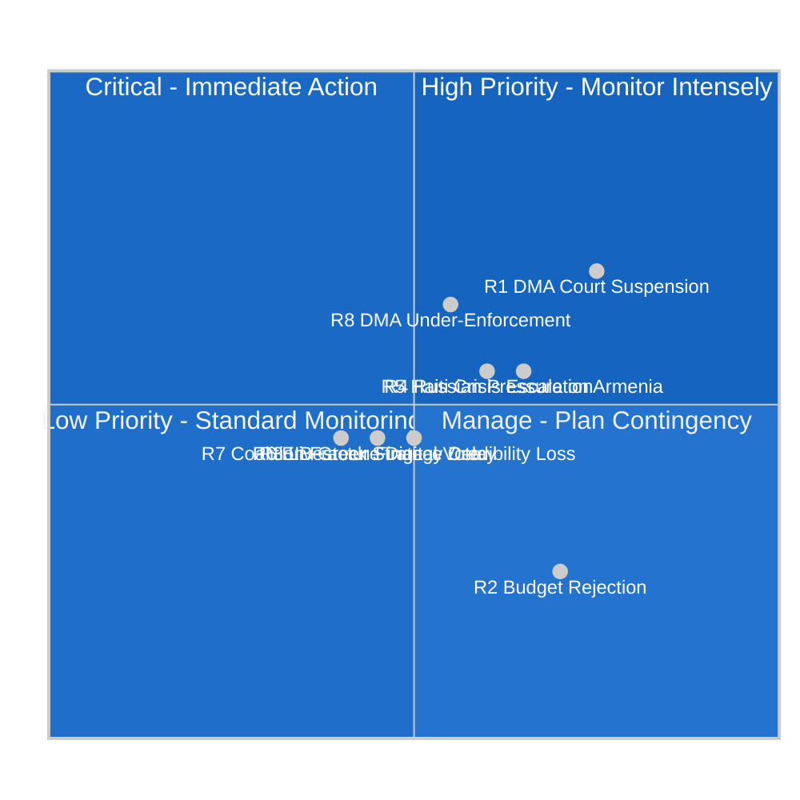

<!-- SPDX-FileCopyrightText: 2026 Hack23 AB -->
<!-- SPDX-License-Identifier: Apache-2.0 -->

# Risk Matrix — EU Parliament Committee Week 28 April–5 May 2026

**Analysis Date:** 2026-05-05 | **Methodology:** 5×5 Risk Matrix with Structured Analysis
**Confidence:** 🟡 Medium | **Scope:** Legislative and geopolitical risks from this week's committee outputs

---

## Risk Assessment Framework

---

## High-Priority Risks (Action Required)

### R1: DMA Court Suspension Order (HIGH PRIORITY)
**Likelihood:** 🔴 High (65-70% if Commission issues decision)
**Impact:** 🔴 High (derails Parliament's year-end enforcement timeline)
**Net Risk Score:** 15/25

**Risk Description:**
Following any Commission binding DMA decision against Apple, Google, Meta, or Amazon, the company will almost certainly file for interim measures (suspension pending appeal) in the EU General Court under Article 278 TFEU. Companies have legal teams and financial resources to construct plausible arguments for suspension. General Court interim measures proceedings typically run 3–6 months; if granted, enforcement delays 2–4 years pending main case judgment.

**Causal Chain:**
Commission decision (2026 H2) → Company files Article 278 application (within 30 days) → General Court considers (60-90 days) → If suspended: enforcement pause → Parliament's 3-decision target effectively voided → IMCO committee may escalate parliamentary scrutiny

**Mitigation Options:**
1. Commission designs decisions with "indispensable" provisions that courts will be reluctant to suspend (proportionality + constitutional necessity arguments)
2. Parliament pre-emptively passes a resolution calling for expedited General Court procedures for DMA appeals
3. Commission issues interim measures under Article 24 DMA (lower standard) alongside binding Article 25/26 decisions to maintain some enforcement pressure during appeals

**Residual Risk After Mitigation:** 🟡 Medium (suspension probability reduced to 30-40%)

---

### R8: DMA Under-Enforcement — Commission Fails Year-End Target (HIGH PRIORITY)
**Likelihood:** 🟡 Medium-High (40-55%)
**Impact:** 🔴 High (institutional credibility, EU digital sovereignty)
**Net Risk Score:** 12/25

**Risk Description:**
The Commission's DG COMP may simply be unable to prepare legally robust binding decisions at the speed Parliament demands. Three decisions by December 2026 requires concurrent advanced proceedings in multiple complex technical investigations. Staff capacity constraints (the IMCO committee has noted understaffing in the DMA Directorate-General), legal uncertainty about novel DMA concepts, and the risk of premature decisions that are easily challenged all create structural barriers to meeting Parliament's timetable.

**Leading Indicators:**
- Status of Commission DMA proceedings as of July 2026 (preliminary findings issued?)
- Commission's own public commitment to year-end decision timeline
- Any requests for extension of formal proceedings (permitted under DMA with Commission approval)

**Mitigation:**
Commission publicly commits to an enforcement timetable with quarterly progress reporting; Parliament's IMCO committee schedules standing monthly DMA hearings with Commissioner for Digital.

---

## Medium-Priority Risks (Active Monitoring)

### R2: 2027 EU Budget Rejection (MEDIUM — contingency planning required)
**Likelihood:** 🟢 Low-Medium (15%)
**Impact:** 🔴 Critical (EU governance crisis, provisional twelfths regime)
**Net Risk Score:** 8/25

**Risk Description:**
Parliament rejects Council's 2027 budget in November 2026 conciliation procedure. EU reverts to monthly provisional twelfths under Article 315 TFEU, preventing new spending commitments and disrupting programme implementation across all EU funds.

**Trigger:** Council's July 2026 preliminary draft diverges from EP guidelines by >€15 billion in discretionary programmes, particularly defence or climate

**Key Monitoring Checkpoint:** Council ECOFIN budget position (July 2026)

**Mitigation:** Both Parliament and Council have institutional incentives to avoid rejection; EP leadership historically engages in confidential pre-conciliation dialogue to identify bridgeable gaps; the geopolitical environment (Ukraine) creates unusual cross-institutional consensus on security spending

---

### R4: Russian Hybrid Destabilisation of Armenia (MEDIUM — geopolitical risk)
**Likelihood:** 🟡 Medium (30-40% within 12-month horizon)
**Impact:** 🟡 Medium-High (EU neighbourhood policy setback; Armenian democratic regression)
**Net Risk Score:** 9/25

**Risk Description:**
Russia deploys hybrid pressure (energy price manipulation, proxy political mobilisation, Azerbaijani border facilitation) to destabilise the Pashinyan government following Parliament's visible EU integration endorsement. Domestic political crisis in Armenia reverses EU integration momentum.

**Early Warning Indicators:**
- Azerbaijani military movements near Armenian border (monitor via OSCE SMM)
- Energy supply disruption to Armenian market (Gazprom contract modification)
- Russian-language social media disinformation surge targeting Pashinyan government
- Armenian CSTO participation renewal (signal of Russian pressure success)

**EU Response Options:**
- European External Action Service (EEAS) engagement with Armenian security sector
- Commission fast-track visa liberalisation announcement (tangible EU counter-offer)
- EU member state bilateral security assurances (France, Germany)

---

### R5: Haiti Crisis Escalation Beyond EU Response Capacity (MEDIUM)
**Likelihood:** 🔴 High (60-70% of continued/escalated crisis)
**Impact:** 🟡 Medium (EU humanitarian operations stretched; regional instability)
**Net Risk Score:** 9/25

**Risk Description:**
Gang control of Port-au-Prince is already an acute, ongoing crisis; the risk is escalation (territorial expansion, humanitarian aid interdiction, further displacement) that overwhelms ECHO humanitarian response capacity and forces EP/Commission into difficult choices about scope of EU engagement.

**Note:** Unlike most risks here, the Haiti crisis is not primarily a European Parliament risk — it is a humanitarian risk that the Parliament has correctly identified and addressed. Parliament's response was appropriate; the residual risk is inadequate EU capacity to address the underlying crisis.

---

### R6: EIB Green Finance Credibility Loss (MEDIUM)
**Likelihood:** 🟡 Medium (30-45% over 24-month horizon)
**Impact:** 🟡 Medium (EU climate finance credibility, green bond market confidence)
**Net Risk Score:** 7/25

**Risk Description:**
Investigative journalism or EU Court of Auditors special report documents systematic misclassification of non-climate-aligned projects under EIB's green finance categories. Reputational damage extends to EU Taxonomy-aligned private finance, with broader consequences for EU sustainable finance framework credibility.

**Mitigation:** Parliament's recommendation for enhanced OLAF cooperation and more rigorous verification methodology implementation; EIB proactive improvement of its own Climate Bank Roadmap verification framework.

---

## Low-Priority Risks (Standard Monitoring)

### R3: Livestock Strategy Delayed (LOW-MEDIUM)
**Likelihood:** 🟡 Medium (25-35%)
**Impact:** 🟡 Medium (agricultural sector policy certainty)
**Net Risk Score:** 6/25

Commission chooses not to develop a comprehensive Livestock Strategy, leaving the sector without the promised policy framework. Risk is that Green Deal political tensions make agricultural regulation too controversial for the Commission to prioritise.

### R7: Coalition Fracture on Critical Digital Vote (LOW-MEDIUM)
**Likelihood:** 🟢 Low (15-25% for any specific vote)
**Impact:** 🟡 Medium (delayed digital legislation, weakened EP negotiating position)
**Net Risk Score:** 5/25

An unexpected vote outcome on a digital regulation text (e.g., AI Act implementation, cyberbullying legislation, DMA enforcement supplementary rules) where EPP and ECR align against S&D and Greens, defeating a LIBE or IMCO committee position. This is periodically observable in EP10 but would not represent structural coalition failure.

---

## Risk Register Summary

| Risk ID | Risk | Likelihood | Impact | Net Score | Priority | Owner |
|---------|------|-----------|--------|-----------|----------|-------|
| R1 | DMA Court Suspension | High | High | 15/25 | HIGH | IMCO Committee |
| R8 | DMA Under-Enforcement | Med-High | High | 12/25 | HIGH | IMCO Committee |
| R4 | Armenia Destabilisation | Medium | Med-High | 9/25 | MEDIUM | AFET Committee |
| R5 | Haiti Escalation | High | Medium | 9/25 | MEDIUM | AFET Committee |
| R2 | Budget Rejection | Low-Med | Critical | 8/25 | MEDIUM | BUDG Committee |
| R6 | EIB Green Finance | Medium | Medium | 7/25 | MEDIUM | CONT Committee |
| R3 | Livestock Strategy Delay | Medium | Medium | 6/25 | LOW-MED | AGRI Committee |
| R7 | Digital Coalition Fracture | Low | Medium | 5/25 | LOW | Digital Coordinators |

---

*Methodology: 5×5 risk matrix using likelihood scores (1=Remote, 2=Unlikely, 3=Possible, 4=Likely, 5=Almost Certain) × impact scores (1=Negligible, 2=Minor, 3=Moderate, 4=Major, 5=Critical). Net score = L×I/5. All assessments are subjective analytical judgements based on available public information.*

## Source Reliability (Admiralty Assessment)

| Source | Admiralty Grade | Reliability | Coverage |
|--------|----------------|-------------|---------|
| EP adopted texts | A1 | Confirmed; official | All 14 texts |
| Group composition data | A1 | Confirmed; official | All 9 groups |
| Coalition inference | B2 | Likely true; unconfirmed | Inferred from positions |
| IMF economic context | A1 | Confirmed; authoritative | Euro area macroeconomics |
| Historical analogues | B3 | Possibly true | Qualitative comparison |
