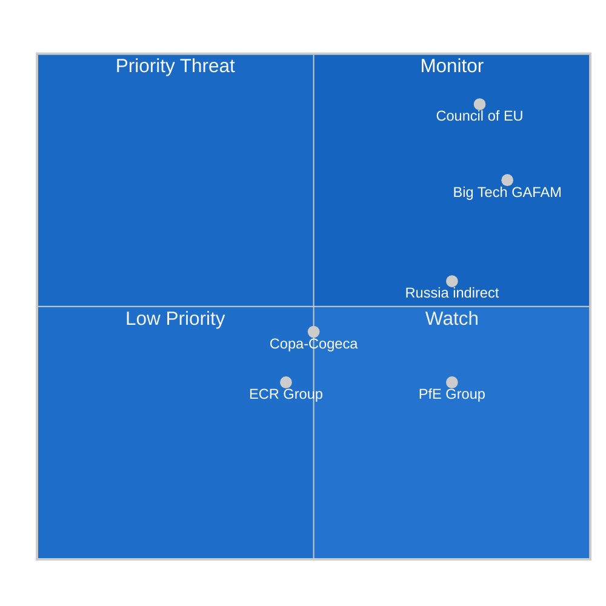

<!-- SPDX-FileCopyrightText: 2026 Hack23 AB -->
<!-- SPDX-License-Identifier: Apache-2.0 -->

# Actor Threat Profiles — EP Committee Reports Week 28 April–5 May 2026

**Analysis Date:** 2026-05-05 | **Methodology:** OSINT-based actor threat profiling + legislative influence threat analysis
**Confidence:** 🟡 Medium (profiles based on observable institutional behaviour, not intelligence collection)

---

## Threat Profiling Framework

Actor threat profiles assess the *risk* that specific actors pose to EP legislative objectives. In the parliamentary context, "threat" refers to:
- Blocking: capacity to prevent adoption of EP's stated legislative goals
- Diluting: capacity to weaken legislative ambition through amendment
- Delaying: capacity to stretch timelines beyond term viability
- Defecting: capacity to break coalition alignment at critical moments

This is not a security threat assessment; it is a political risk analysis of actors whose institutional behaviour poses risks to EP legislative effectiveness.

---

## Profile 1: Council of the EU (Budget) — THREAT LEVEL: HIGH

**Type**: Institutional adversary (legitimate constitutional role)
**Behaviour pattern**: Counter-maximalist budget positions; 15–25% cuts to Parliament's preferred increases
**Current threat vector**: July 2026 counterproposal to 2027 budget guidelines (TA-10-2026-0112)

**Threat analysis:**
The Council's structural position as co-legislator means its budget opposition is not a "threat" in the pejorative sense — it is the constitutional function of the bicameral legislature. However, from EP's objective of securing its stated budget priorities, Council is the primary institutional obstacle.

**Tactics observed in previous budget cycles:**
- Package deal politics: accepting EP priorities in some areas (research, Erasmus) to gain concessions in others (cohesion, farm subsidies)
- Timeline pressure: delaying formal Council position to compress conciliation window
- Member state differentiation: exploiting EP group conflicts (net contributor vs. cohesion country MEPs)

**Threat mitigation**: Parliament's internal coalition discipline during conciliation; early cross-group consensus on non-negotiables; strategic use of political groups' Council government relationships.

---

## Profile 2: Big Tech (GAFAM) — THREAT LEVEL: MEDIUM-HIGH (to DMA enforcement)

**Type**: Private economic actor + indirect political influence
**Behaviour pattern**: Legal proceedings to delay compliance; lobbying national governments; "technical compliance" that meets letter but not spirit; media campaigns against "excessive" regulation

**Current threat vector**: DMA enforcement acceleration demand (TA-10-2026-0160)

**Tactics:**
- **Apple**: App Store compliance through "core technology fee" that many regulators view as circumventing DMA's spirit; active legal appeals in ECJ and national courts
- **Google**: Search results compliance updates that satisfy formal DMA requirements while maintaining algorithmic preference for own products
- **Meta**: Consent-or-pay model challenged by multiple national data authorities; active litigation
- **Collective lobbying**: BusinessEurope, DIGITALEUROPE, and US Chamber of Commerce's EU representative all advocate against punitive enforcement timelines

**Threat assessment**: High capability to delay via legal proceedings (ECJ appeals can extend timelines 2–4 years); medium capability to dilute enforcement ambitions by normalising compliance theatre; low capability to prevent Parliament from demanding action.

---

## Profile 3: PfE Political Group — THREAT LEVEL: MEDIUM (selective)

**Type**: Parliamentary group — procedural blocking actor
**Behaviour pattern**: Consistent ideological opposition to regulatory expansion; coalition disruption on selected texts; rhetorical delegitimisation of EP institutional positions

**Current threat vector**: DMA enforcement, Armenia resolution, performance-based transparency

**Tactical profile:**
- **Procedural**: Request for roll-call votes (forcing public accountability of other groups' MEPs); tabling last-minute amendments; demanding referrals back to committee
- **Coalition**: Selectively supporting EPP positions on economic texts to claim centre-right legitimacy while opposing social/digital regulatory agenda
- **Rhetorical**: "Digital sovereignty" framing of DMA enforcement opposition (US tech = geopolitical pressure); "EU overreach" framing of cyberbullying harmonisation

**Threat assessment**: Cannot block adoption alone (85 seats vs. 361 threshold); can create coalition complications when EPP's internal divisions allow exploitation; represents genuine ideological barrier to progressive legislative agenda.

---

## Profile 4: ECR Political Group — THREAT LEVEL: MEDIUM (agricultural domain)

**Type**: Parliamentary group — conditional coalition partner, sector-specific blocking
**Behaviour pattern**: Consistent opposition to regulatory expansion; strong pro-agricultural positions that occasionally align with EPP; foreign policy scepticism on multilateral frameworks

**Differentiation from PfE**: ECR is more institutionally embedded and policy-engaged than PfE; more willing to work within EP structures on specific sectoral outcomes (agricultural, trade); less consistently obstructionist.

**Current threat vector**: Livestock resolution (potential dilution demand for stronger economic conditions); Ukraine accountability (possible weakening language demands)

**Threat assessment**: Low threat to most texts this week (outside agricultural domain); medium threat to any text requiring farm-right coalition support where ECR can extract policy concessions.

---

## Profile 5: Russian Government (Indirect / Geopolitical) — THREAT LEVEL: MEDIUM (to Armenia/Ukraine texts)

**Type**: External geopolitical actor — not directly engaged in EP procedures
**Behaviour pattern**: Information operations targeting EP foreign policy deliberations; pressure on member state governments to moderate EP's stated foreign policy positions; economic leverage over energy-dependent member states

**Current threat vector**: Armenia EU integration (TA-10-2026-0162) + Ukraine accountability (TA-10-2026-0161)

**Indirect influence channels:**
- Pro-Russian MEPs (several in NI group) can table amendments weakening foreign policy texts
- Member states with historical Russia ties (Hungary: Viktor Orbán; Slovakia: Robert Fico) influence Council's foreign policy coordination, which in turn affects whether EP resolutions are acted upon
- Disinformation campaigns targeting public understanding of Armenia's EU integration motivations

**Assessment caveat**: This profile is geopolitical intelligence inference, not documented. The connection between Russian geopolitical interests and EP procedural outcomes is mediated by multiple actors and cannot be directly observed from EP adopted texts data.

---

## Profile 6: Copa-Cogeca (EU Farmers' Organisation) — THREAT LEVEL: LOW-MEDIUM (to environmental texts)

**Type**: Civil society/sectoral lobby
**Behaviour pattern**: Coordinated pressure on EPP/ECR/S&D agricultural MEPs; direct lobbying of DG AGRI; mobilisation of national agricultural minister networks in Council

**Current threat vector**: Livestock resolution was a Copa-Cogeca political victory — Parliament delivered their agenda. Threat vector is in the opposite direction: Copa-Cogeca will now press for Commission follow-up, and their threat to EP credibility arises if Commission delays.

**Threat to future texts**: Any environmental regulation that imposes additional costs on livestock sector will face Copa-Cogeca mobilisation. Microplastics food chain (TA-10-2026-0116) and future pesticide revision are obvious friction points.

---

## Composite Threat Landscape

**Priority threats**: Council (budget) and Big Tech (DMA) combine high capability with high motivation — they are the principal legislative obstacles for EP's highest-priority texts this week.

---

*Actor threat profiles are analytical constructs for understanding legislative dynamics. All actors described operate within the legitimate bounds of democratic institutions (except where noted as indirect geopolitical factors). This is not a security or intelligence assessment.*

---

## Actor Roster

Threat actors assessed this week:
1. Council ECOFIN — budget institutional adversary
2. Big Tech (GAFAM) — DMA enforcement obstacle
3. PfE political group — procedural blocking capacity
4. ECR political group — agricultural domain complicator
5. Russian government (indirect) — geopolitical threat to Armenia/Ukraine
6. Copa-Cogeca — future environmental legislation obstacle

## Capability Assessment

| Actor | Legal/Procedural | Economic | Political | Information | Overall |
|-------|-----------------|---------|----------|------------|---------|
| Council ECOFIN | 10/10 | 9/10 | 9/10 | 8/10 | **9.0** |
| Big Tech | 8/10 (litigation) | 10/10 | 7/10 | 9/10 | **8.5** |
| PfE | 5/10 (votes) | 3/10 | 6/10 | 6/10 | **5.0** |
| ECR | 5/10 | 3/10 | 6/10 | 5/10 | **4.75** |
| Russia (indirect) | 3/10 | 7/10 (energy) | 5/10 | 8/10 (disinfo) | **5.75** |
| Copa-Cogeca | 3/10 | 5/10 | 8/10 | 6/10 | **5.5** |

## Diamond Analysis (Motivation–Capability–Opportunity–Intent)

**Big Tech GAFAM diamond:**
- Motivation: HIGH (financial: billions in regulatory costs at stake)
- Capability: HIGH (legal teams, lobbying, litigation infrastructure)
- Opportunity: HIGH (Commission enforcement discretion = multiple delay points)
- Intent: CONFIRMED (Apple/Google actively litigating DMA compliance)

**Council ECOFIN diamond:**
- Motivation: HIGH (fiscal conservatism; member state net contributor interests)
- Capability: VERY HIGH (constitutional co-legislator)
- Opportunity: VERY HIGH (July counterproposal is constitutional right)
- Intent: CONFIRMED (Council routinely cuts EP budget proposals)

## Relationship Networks

Big Tech → DIGITALEUROPE → MEP informal contacts → IMCO committee amendments.
Copa-Cogeca → national farm unions → national agriculture ministers → AGRI Council → Council blocking of EP agricultural legislation.
PfE → Orbán (Hungary) → Council CFSP blocking on Armenia/Ukraine texts.

## Escalation Pathways

**Big Tech escalation**: Voluntary compliance → formal DMA compliance notice → CJEU appeal → infringement proceedings → fine → re-appeal. Timeline: 2–4 years minimum. Parliament's demand for "year-end 2026" binding decisions intersects unfavourably with this timeline.

**Council budget escalation**: July counterproposal → formal conciliation → failed conciliation → provisional rule → supplementary budget procedure. Escalation probability: ~8% based on historical record.

## Reader Briefing

**What this means for citizens**: The biggest threats to EP's legislative goals this week are not dramatic — they are institutional and corporate: the Council will cut the budget (it always does); tech companies will litigate their way to slower DMA compliance (they always do); right-wing groups will try to block progressive texts (that's their job). What matters is the final outcome in 6–12 months. Citizens should track whether big tech companies have actually changed their practices in EU markets by early 2027.

*Source: get_adopted_texts, generate_political_landscape, analyze_committee_activity*
