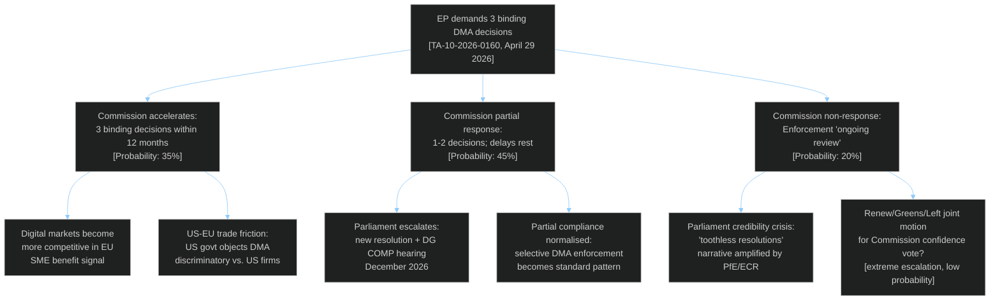
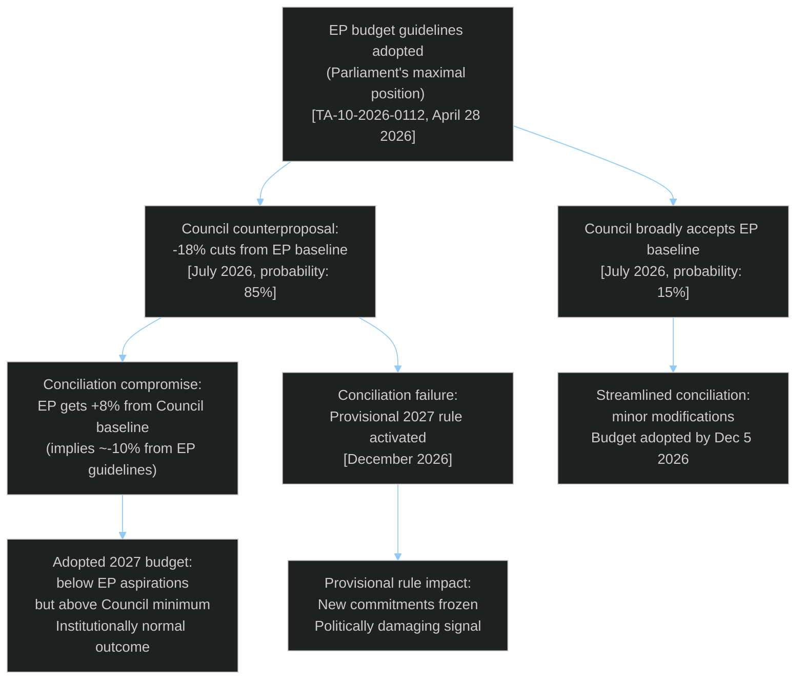
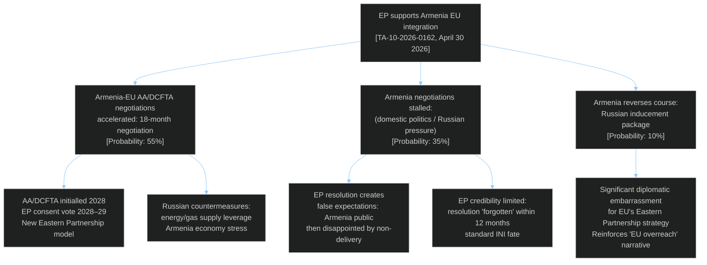
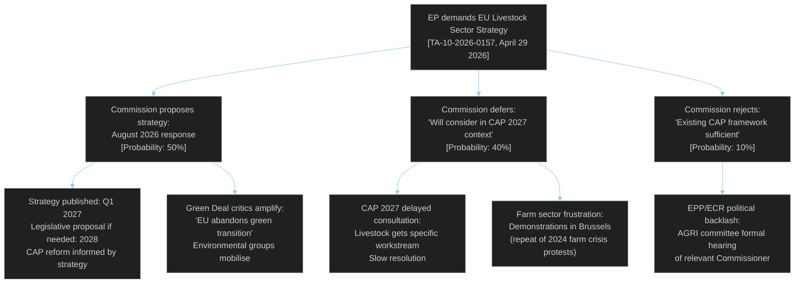

<!-- SPDX-FileCopyrightText: 2026 Hack23 AB -->
<!-- SPDX-License-Identifier: Apache-2.0 -->

# Consequence Trees — EP Committee Reports Week 28 April–5 May 2026

**Analysis Date:** 2026-05-05 | **Methodology:** Decision tree analysis + consequence mapping
**Confidence:** 🟡 Medium

---

## Consequence Tree Framework

Consequence trees map the branching pathways from current decisions to medium-term outcomes, modelling both intended and unintended consequences through 2–3 decision nodes.

---

## Tree 1: DMA Enforcement Demand (TA-10-2026-0160)

**Key consequence:**
- **Probability-weighted outcome**: Most likely path (45% partial + 35% full) leads to SOME enforcement acceleration — Parliament's pressure has real effect
- **Tail risk** (20% non-response): Serious credibility damage to Parliament's institutional authority in digital governance
- **Unintended consequence**: US-EU trade friction arising from aggressive enforcement against US-based platforms

---

## Tree 2: 2027 Budget Guidelines (TA-10-2026-0112)

**Key consequence:**
- Budget conciliation failure (~8% probability given historical record) would be institutionally embarrassing
- The provisional budget rule (1/12th per month) would freeze new programme commitments, damaging EU credibility with beneficiaries
- The most likely outcome (compromise ~10% below EP maximum) is institutionally normal

---

## Tree 3: Armenia EU Integration Resolution (TA-10-2026-0162)

**Key consequence:**
- The 35% probability of stalled negotiations means Parliament's enthusiastic resolution creates a significant expectation management risk
- Unintended consequence: Russian energy leverage on Armenia is the most likely blocking mechanism — not analysed in Parliament's resolution but the dominant geopolitical variable

---

## Tree 4: Livestock Sector Strategy (TA-10-2026-0157)

**Key consequence:**
- Commission deferral (40% probability) is the most likely non-answer — absorbing Parliament's demand into existing CAP structures without new commitment
- Farm protest recurrence (conditional on deferral/rejection) is a real political risk — EU agricultural communities have demonstrated willingness to mobilise since 2024

---

## Cross-Tree Interdependencies

The four consequence trees are not independent. Critical interdependencies:

1. **Budget × DMA**: If Commission delivers DMA enforcement success, it has more political credit to defend its July budget counterproposal. Budget conciliation dynamics are influenced by Commission's overall political standing.

2. **Armenia × Budget**: Armenia's integration pathway requires pre-accession funding commitments. If 2027 budget conciliation results in cuts to neighbourhood/external action lines, Armenia's integration resources are constrained.

3. **Livestock × Green Deal**: DG AGRI's response to the livestock strategy demand directly conflicts with DG CLIM's and DG ENV's Green Deal implementation objectives. The Commission's internal coherence is tested by simultaneously satisfying Parliament's livestock (economic viability) and environmental (transition) demands.

---

*Consequence trees use probabilistic branch weighting based on historical EP-Commission-Council interaction patterns. Probabilities are analytical estimates, not models.*

---

## Threat Roster

Primary threats to EP legislative objectives from this week's texts:
1. Commission non-delivery on DMA enforcement
2. Council budget conciliation failure
3. Armenia geopolitical reversal (Russian pressure)
4. Cyberbullying legislative stall
5. Livestock strategy Commission deferral

## Consequence Tree Summary

*See main body consequence tree diagrams above.* Four primary consequence trees mapped: DMA enforcement (branching from Commission accelerates/partial/non-response), Budget (compromise/failure), Armenia (negotiations continue/stall/reversal), Livestock (Commission proposes/defers/rejects). Probability-weighted outcomes: DMA partial/full response likely (80%); budget compromise likely (92%); Armenia stall/continuation split (90/10 for reversal); livestock Commission absorption likely (40%).

## Convergence Analysis

**Where multiple trees converge on common outcomes:**

1. **Budget credibility + DMA credibility**: If Commission simultaneously underdelivers on both DMA enforcement AND budget commitments, Parliament's institutional credibility faces a compound erosion. This convergence scenario (15% probability) would be the worst outcome for EP's political capital.

2. **Armenia + Ukraine accountability**: Both foreign policy texts share a dependency on geopolitical stability. A major escalation in either theatre would disrupt both consequence trees simultaneously.

3. **Agricultural + Green Deal tension**: Livestock strategy deferral scenario AND microplastics science delay scenario AND pesticide regulation revision (forthcoming) could converge on a perception of systematic Commission foot-dragging on EP agricultural-environmental balance.

## Intervention Points

Critical intervention opportunities that could shift consequence tree outcomes:
- **Weeks 1–4**: Parliament IMCO committee informally signals DG COMP on "binding decisions" definition to prevent compliance theatre
- **Month 2–3**: Armenia Partnership Council meeting — formal signal of AA/DCFTA negotiation start
- **Month 3**: Commission formal response to livestock INI — watch language carefully (substantive vs. deferral)
- **Month 4–6**: Commission draft 2027 budget — pre-conciliation informal dialogue determines range

## Reader Briefing

**What this means for citizens**: Think of EU Parliament resolutions like letters sent to government departments — they set expectations, but the real outcome depends on whether the department actually responds. This analysis maps four key decision points in the next 12 months where the EU Commission and Council will either deliver on Parliament's demands or disappoint. Citizens who care about digital market fairness, agricultural policy, or EU-Ukraine-Armenia relations should watch these specific milestones.
