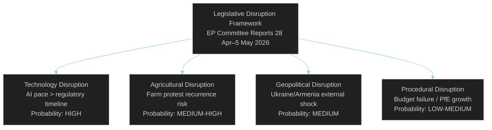

<!-- SPDX-FileCopyrightText: 2026 Hack23 AB -->
<!-- SPDX-License-Identifier: Apache-2.0 -->

# Legislative Disruption Assessment — EP Committee Reports Week 28 April–5 May 2026

**Analysis Date:** 2026-05-05 | **Methodology:** Disruptive innovation theory applied to legislative change + political disruption analysis
**Confidence:** 🟡 Medium

---

## Legislative Disruption Framework

Legislative disruption occurs when new legislative instruments, political realignments, or external shocks fundamentally alter the expected trajectory of policy development. Unlike normal legislative evolution, disruption bypasses or overrides established stakeholder consensus, procedural norms, or incremental reform pathways.

Three disruption categories:
1. **Procedural disruption**: Institutional rules challenged or bypassed
2. **Political disruption**: New coalitions, defections, or populist mobilisation
3. **External shock disruption**: Geopolitical events, crises, or technological changes that force legislative response

---

## Disruption Scenario Analysis by Policy Domain

### Digital Governance: MODERATE-HIGH DISRUPTION POTENTIAL

**Disruptive vector**: AI progress rate vs. regulatory timeline
The DMA (2022), DSA (2022), and AI Act (2024) represent a 2018–2024 legislative wave responding to digital governance challenges identified in the mid-2010s. The AI revolution accelerated in 2022–2023 with large language models and generative AI. By the time EP10's digital legislation is fully implemented (estimated 2026–2028), the technology landscape may have fundamentally shifted.

**Disruption mechanism**: AI Act's risk-tiering approach (prohibited, high-risk, limited risk, minimal risk) was designed for identifiable AI use cases. Emergent AI capabilities that don't fit neatly into existing categories create classification disruption — regulators face a legislative instrument that cannot accommodate its subject matter.

**Parliament's response** (TA-10-2026-0121 — Responsible AI Healthcare): Seeking to extend AI regulation into healthcare specifically, Parliament is trying to stay ahead of AI deployment in clinical settings. This is an early response to technological disruption, but the legislative timeline (proposal → adoption → implementation) likely means the AI deployment will outpace the regulatory framework.

**Disruption probability**: HIGH — technology will likely outpace regulation in digital governance regardless of EP's legislative pace.

### Agricultural Sector: HIGH DISRUPTION RISK

**Disruptive vector**: Climate-economy conflict reaching tipping point
The 2024 farm crisis protests (France, Germany, Netherlands, Belgium — February 2024) represented a genuine political disruption event: organised agricultural communities successfully blocked EU Green Deal agricultural elements (pesticide regulation withdrawal, nature restoration law softening) through a combination of street protest and strategic voting threats to rural MEPs.

**EP10 context**: The livestock resolution (TA-10-2026-0157) reflects Parliament's partial accommodation of the 2024 farm disruption — acknowledging economic viability as a co-equal priority with environmental sustainability. But this accommodation creates its own disruptive potential: green/environmental groups' political coalition was disrupted; they now face a Parliament that explicitly devalues the speed of agricultural green transition.

**Next disruption risk**: Pesticide regulation revision is the next major agricultural legislative battleground. If Commission's revised pesticide proposal (expected 2026–2027) is seen as weakening the 2009 Regulation's environmental protections, environmental groups may mobilise as effectively as farmers did in 2024. Counter-disruption from environmental civil society is the most likely agricultural disruption in 2026–2027.

**Disruption probability**: HIGH — agricultural sector is structurally in a disruptive political equilibrium with competing mobilisation capacity on both sides.

### Geopolitical Foreign Policy: CRISIS DISRUPTION MODE

**Disruptive vector**: Ukraine war escalation scenarios
The Ukraine accountability resolution (TA-10-2026-0161) operates within an active conflict environment. Any significant military escalation (Russian breakthrough, ceasefire negotiations, nuclear/escalation threats) would immediately disrupt the EP's carefully worded accountability framework by creating urgency for humanitarian or diplomatic response that overrides accountability mechanisms.

**Armenia disruption risk**: As mapped in the consequence tree, a Russian countermeasures package (energy/economic) could reverse Armenia's EU integration trajectory within 12–24 months. This would be a classic external shock disruption — EP's resolution is built on an assumption of Armenia's trajectory continuing; a disruption of that trajectory invalidates the resolution's political premise.

**Haiti escalation**: The humanitarian crisis in Haiti is already a disruption event in progress — the collapse of state order, gang control of Port-au-Prince, and CARICOM-led multinational security support mission represent ongoing disruption to normal geopolitical order. EP's humanitarian resolution operates in this disrupted environment.

---

## Systemic Legislative Disruption Assessment

### The Procedural Disruption Risk: Budget Failure

**Disruption scenario**: 2027 budget provisional rule activation
If the 2027 budget conciliation fails (estimated 8% probability based on historical record), the automatic 12-month provisional rule activation would be a significant procedural disruption. Parliament has not failed a budget conciliation since 2012 (when the MFF negotiations were contentious). A 2027 failure would:

1. Freeze new commitments in all EU programmes
2. Create a governance legitimacy crisis
3. Damage EU's international credibility (contractors, beneficiary countries, programme participants)
4. Force Commission to trigger a supplementary budget procedure once Parliament and Council agree

**Prevention mechanisms**: The conciliation presidency (rotating Council) and EP's BUDG committee chair both have institutional incentives to prevent failure. The 20-day formal conciliation period plus informal pre-conciliation normalises compromise — institutional memory of 2012 failure acts as a deterrent.

### The Political Disruption Risk: PfE Coalition Growth

**Scenario**: PfE emerges as largest EP group by EP11 (2029)
Current PfE trajectory (85 seats, established June 2024 from 4 national party blocs) shows a right-populist consolidation trend. If Marine Le Pen's Rassemblement National, Viktor Orbán's Fidesz, and Matteo Salvini's Lega continue gaining domestic elections, PfE could approach 120–140 seats in EP11. Combined with ECR growth potential, a right-wing populist bloc controlling 200+ seats would fundamentally disrupt the centrist EPP/S&D/Renew coalition that currently governs EP.

**Impact on current week's texts**: DMA, Armenia, and cyberbullying would all face more difficult passage in a hypothetically larger PfE scenario. The structural disruption potential is significant.

---

## Disruption Early Warning Indicators

| Indicator | Monitoring Signal | Disruption Type | Action Threshold |
|-----------|------------------|-----------------|-----------------|
| AI capability acceleration | Model capabilities exceeding current AI Act framework categories | Tech disruption | New AI Act provision needed |
| Farm protest mobilisation | Copa-Cogeca coordinated action announcements | Political disruption | Monitor EP AGRI committee response |
| Russia-Armenia bilateral pressure | Energy price shock or diplomatic incident | Geopolitical disruption | EP AFET emergency session |
| Budget conciliation breakdown | Commission late submission of draft budget (post-August) | Procedural disruption | Activate BUDG emergency procedures |
| PfE national election gains | RN/Fidesz/Lega coalition gains in national elections | Political disruption | Reassess 2029 EP arithmetic |
| DMA non-compliance normalization | Industry reports widespread DMA compliance failure | Regulatory disruption | New enforcement tools needed |

---

## Disruption Resilience Assessment

EP's institutional resilience to disruption rests on:
1. **Constitutional stability**: Treaty framework provides robust procedures even in disruption scenarios
2. **Coalition diversity**: Multiple viable coalition combinations prevent any single actor from blocking all legislation
3. **Institutional memory**: Experienced committee staff maintain continuity across political cycles
4. **Civil society engagement**: Active transparency/accountability NGOs provide early warning on regulatory capture

**Resilience gaps:**
- Technology pace: EU legislative timeline cannot match AI/digital disruption speed
- Geopolitical volatility: Eastern European security environment can shift faster than EP procedures
- Far-right consolidation: PfE's institutional learning curve is steep but shortening

---

*Legislative disruption analysis draws on Christensen's disruptive innovation framework applied to institutional change theory (March, Olsen) and EU policy studies literature.*

---

## Targeted Disruption Scenarios

**Most targeted EP legislative domain this week**: Digital governance (DMA) faces the most concentrated disruptive pressure from Big Tech litigation and US diplomatic counter-pressure. The targeting is systematic: legal proceedings in multiple jurisdictions simultaneously, each creating delay and complexity.

**Agricultural domain** faces targeted disruption from the Farm Protest Recurrence scenario — Copa-Cogeca has demonstrated coordination capacity sufficient to reverse EP environmental commitments.

## Attack Tree Analysis

Digital governance attack tree (Big Tech vs. DMA enforcement):
- Root: Delay or prevent binding DMA enforcement decisions
  - Branch A: Legal proceedings — appeal DG COMP preliminary findings → ECJ proceedings → 2–4 year delay
  - Branch B: Technical compliance theatre — implement minimum letter of law without spirit → force DG COMP to prove inadequacy
  - Branch C: Lobbying national governments → national competition authority requests to slow EU-level action
  - Branch D: Public narrative — "EU regulatory overreach harms innovation" → political cost for enforcement advocates

## Technique Analysis

Disruption techniques observed or anticipated:
1. **Litigation**: Standard; all major platforms use ECJ appeals
2. **Compliance theatre**: Documented for Apple App Store fees, Google Search results
3. **Issue bundling**: Attaching DMA controversy to broader EU-US trade negotiations
4. **Revolving door**: Hiring former DG COMP officials (creates insider knowledge advantage)

## Detection Signals

Early warning signals for disruption activation:
- Apple/Google ECJ appeals filed within 30 days of DG COMP preliminary findings
- US Trade Representative raising DMA at bilateral trade discussions
- DG COMP enforcement timeline slippage beyond Q1 2027
- Farm protest announcements in major agricultural member states (France, Germany, Netherlands)

## Counter-Disruption Strategies

1. **Pre-publication consultation**: DG COMP engages platforms on compliance expectations before formal decisions (already standard practice; reduces surprise appeal grounds)
2. **Parliament-Commission enforcement dialogue**: Formal IMCO committee hearing with DG COMP on timeline — creates public accountability
3. **Agricultural transition support funds**: Pre-empt farm protest by ensuring CAP 2027 economic safety net is visible and funded
4. **Armenia: conditional language**: Resolution language should include conditionality on democratic progress to manage expectation when/if delays occur

## Reader Briefing

**What this means for citizens**: Legislative disruption is when powerful interests or unexpected events derail laws that were supposed to happen. The biggest disruption risk for EU citizens this week is in digital markets: tech companies have strong tools (courts, lobbying, delay) to slow down rules that are supposed to give you more choice and fairer prices. The second biggest risk is in farming: if economic conditions for farmers worsen significantly, expect political pressure to reverse environmental regulations. Citizens who want better digital markets should support faster enforcement; those who want sustainable food should monitor whether economic support for farmers is real and sufficient.
