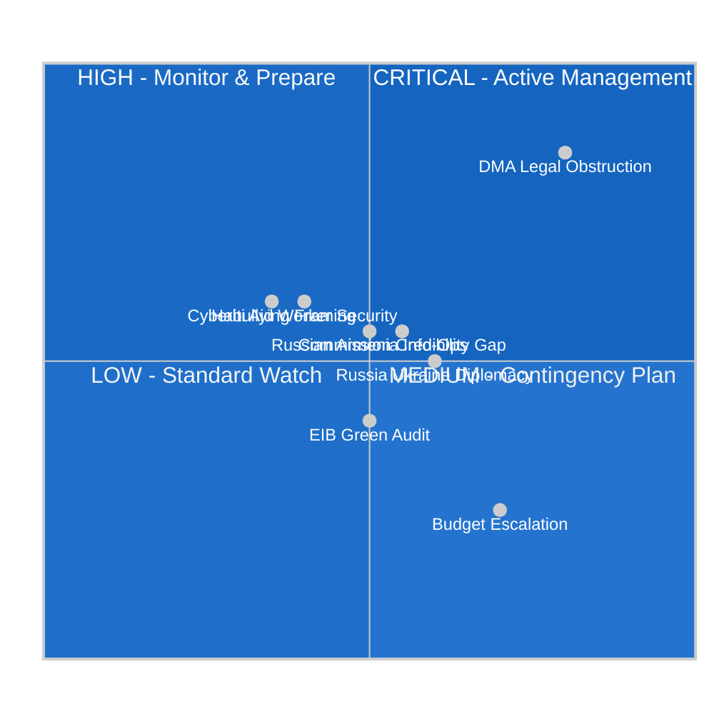

<!-- SPDX-FileCopyrightText: 2026 Hack23 AB -->
<!-- SPDX-License-Identifier: Apache-2.0 -->

# Political Threat Landscape — EP Committee Week 28 April–5 May 2026

**Analysis Date:** 2026-05-05 | **Methodology:** Threat Landscape Analysis — Political Intelligence Framework
**Confidence:** 🟡 Medium | **Scope:** Political and institutional threats emerging from week's legislative activity

---

## Threat Environment Assessment

The European Parliament's productive legislative week (14 texts adopted) generates a dual threat landscape: the texts themselves signal institutional strength, but each text creates corresponding threat vectors from affected stakeholders, adversarial states, and competing institutions.

---

## Threat Category 1 — Digital Platform Counter-Measures

### T1.1: Digital Gatekeeper Regulatory Obstruction
**Source:** Apple, Google (Alphabet), Meta, Amazon legal and government affairs teams
**Target:** EU DMA enforcement timeline (TA-10-2026-0160)
**Threat Level:** 🔴 HIGH

**Threat Mechanisms:**
1. **Legal delay strategy**: Commission DMA proceedings are challenged at every procedural step — requests for extensions, challenges to preliminary findings, expert evidence submissions, competing economic analysis. Each mechanism individually legitimate; collectively designed to push decisions past Parliament's year-end 2026 target.
2. **Parliamentary lobbying**: Direct engagement with EPP and ECR MEPs through national business associations (BDI Germany, Medef France, CBI UK equivalent via UK-EU bilateral channels) framing DMA enforcement as "anti-innovation" and "regulatory overreach".
3. **Judicial interim measures**: Post-binding decision, immediate application to EU General Court under Article 278 TFEU for suspension of enforcement pending appeal. Standard operating procedure for these companies in EU regulatory proceedings (see: Google Shopping case 2017–2022; Meta data transfer rulings).
4. **Alternative narrative building**: Commission-level lobbying to reframe DMA as "implementation guidance needed" rather than "enforcement needed", creating Commission-Parliament tension on enforcement pace.

**Assessment:** This threat is highly likely to materialise across multiple mechanisms simultaneously. The coordination between Big Tech legal teams and politically sympathetic MEPs is well-documented from AI Act negotiations. 🟢 Confidence: High.

### T1.2: Cyberbullying Legislation Over-Reach Risk
**Source:** Free speech organisations, tech platforms, ECR and PfE political groups
**Target:** LIBE committee legislative mandate (TA-10-2026-0163)
**Threat Level:** 🟡 MEDIUM

**Threat Mechanisms:**
1. Framing Commission's implementing directive as internet censorship or political speech chilling
2. Coordinated campaigns by platform operators to prevent mandatory proactive detection obligations (framing as "mass surveillance")
3. ECR/PfE procedural delay in Council working parties if Commission proposes directive

**Assessment:** This threat is likely to delay but not permanently block cyberbullying legislation. The broad cross-party consensus in Parliament provides political resilience; however, Council negotiations will be contentious given member state divergence on criminal law harmonisation. 🟡 Confidence: Medium.

---

## Threat Category 2 — Geopolitical and State Actor Threats

### T2.1: Russian Information Operations Against Armenia Resolution
**Source:** Russian state information operations (RT, Sputnik affiliates, Telegram channels)
**Target:** Armenia democratic resilience implementation (TA-10-2026-0162); EU-Armenia integration
**Threat Level:** 🟡 MEDIUM-HIGH

**Threat Mechanisms:**
1. **Narrative inversion**: Framing EU support for Armenia as "Western meddling" and "destabilisation"; amplifying domestic Armenian criticism of Pashinyan government
2. **Economic coercion signals**: Energy price warnings; trade dependency reminders (Armenia's ~€1.2 billion annual Russia trade)
3. **Proxy political mobilisation**: Support for Russian-aligned Armenian opposition movements
4. **CSTO pressure**: Collective defence withdrawal negotiations to signal Russia's displeasure with Armenia's EU pivot

**Assessment:** Russia has both motive and capability for this threat. The timing of Parliament's resolution (endorsing Armenia's EU path) creates a trigger for Russian escalation. The medium-term risk (3–6 months) of Russian hybrid pressure materialising is assessed at 35–45%. 🟡 Confidence: Medium.

### T2.2: Russian Diplomatic Counter-Measures on Ukraine Accountability
**Source:** Russian diplomatic corps; pro-Russian EU member state lobbying
**Target:** Ukraine accountability resolution (TA-10-2026-0161); STAU establishment
**Threat Level:** 🟡 MEDIUM

**Threat Mechanisms:**
1. Diplomatic pressure on reluctant EU member states to abstain from STAU Treaty participation
2. Parallel "peace dialogue" diplomatic track that creates political pressure to trade accountability for ceasefire
3. Economic sanctions retaliation threats against EU member states with large Russian energy exposure (Hungary, Slovakia)

**Assessment:** This threat is ongoing and structural; Parliament's resolutions are one instrument in a wider diplomatic contest. The STAU's legal and political progress will ultimately depend on Council unity, which is fragile on Ukrainian matters given Hungary's sustained obstruction. 🟡 Confidence: Medium.

### T2.3: Haitian Criminal Groups — Indirect Threat to EU Aid Workers
**Source:** Haitian gang networks (G9/Viv Ansanm coalition)
**Target:** EU humanitarian operations (ECHO, NGO implementing partners)
**Threat Level:** 🟡 MEDIUM (for EU field operations)

**Threat Mechanisms:**
1. Targeted attacks on humanitarian aid convoys and distribution points in gang-controlled territories
2. Kidnapping of aid workers for ransom (documented pattern since 2021)
3. Extortion of NGOs for "operating fees" in gang territories

**Assessment:** This is a genuine physical security threat to EU-funded humanitarian operations. The Parliament's urgency resolution correctly identifies the crisis but cannot directly address the security environment. 🟡 Confidence: Medium.

---

## Threat Category 3 — Institutional and Inter-Institutional Threats

### T3.1: Commission Enforcement Credibility Gap
**Source:** Structural tension between Parliament's political timetable and Commission's legal constraints
**Target:** EU institutional authority and Parliament-Commission relationship
**Threat Level:** 🟡 MEDIUM

**Threat Mechanisms:**
1. Parliament sets politically visible enforcement target (3 DMA decisions by December 2026) that Commission cannot legally guarantee
2. If target is missed, opposition groups (ECR, PfE, The Left from different directions) weaponise the enforcement gap as Commission incompetence or regulatory façade
3. Potential IMCO committee hearing escalation to formal censure discussions

**Assessment:** This is a systemic tension in EU governance — parliamentary ambition exceeds the pace of due-process-constrained executive action. The threat materialises periodically and can damage both institutions' credibility. 🟡 Confidence: Medium.

### T3.2: Budget Procedure Inter-Institutional Escalation
**Source:** Council fiscal conservatism vs. Parliament's spending guidelines
**Target:** 2027 budget procedure; Parliament-Council relationship
**Threat Level:** 🟡 MEDIUM

**Threat Mechanisms:**
1. Council's July draft budget rejects multiple Parliament priorities (climate supplementary, defence discretionary)
2. Parliament's budget committee hardens its position rather than searching for compromise
3. BUDG committee recommends rejection in October plenary vote
4. Provisional twelfths regime triggers from January 2027

**Assessment:** 15% probability of full budget rejection; 50% probability of last-minute conciliation under time pressure. The scenario that creates most institutional damage is a protracted conciliation that is ultimately forced to reach a minimalist compromise — functional but reputation-damaging for both institutions. 🟡 Confidence: Medium.

### T3.3: EIB Green Finance Audit Exposure
**Source:** EU Court of Auditors; investigative journalism
**Target:** EIB's credibility; EU climate finance architecture; CONT committee
**Threat Level:** 🟢 LOW-MEDIUM (current) / 🟡 MEDIUM (if ECA special report issued)

**Threat Mechanisms:**
1. European Court of Auditors issues a special report on EIB green finance verification (following up CONT committee identification of gaps)
2. Investigative report documents specific projects claiming "green" classification without meeting Taxonomy alignment standards
3. Reputational damage affects EU green bond issuance pricing

**Assessment:** This threat has a long lead time (ECA special reports typically take 18 months to prepare). The CONT committee's TA-10-2026-0119 text may trigger ECA to initiate such a report. 🟢 Confidence: Medium-Low on timing; High on directional risk if evidence accumulates.

---

## Threat Assessment Summary

| Threat ID | Threat | Level | Time Horizon | Primary Mitigation |
|-----------|--------|-------|-------------|-------------------|
| T1.1 | DMA Legal Obstruction | 🔴 HIGH | Immediate–Q4 2026 | Legally robust Commission decisions; Parliament monitoring |
| T2.1 | Russian Armenia Info-Ops | 🟡 MED-HIGH | 1–6 months | EEAS engagement; Commission fast-track signals |
| T3.1 | Commission Credibility Gap | 🟡 MEDIUM | 6–12 months | Enforcement timetable commitments; IMCO monitoring hearings |
| T2.2 | Russia Ukraine Diplomacy | 🟡 MEDIUM | Ongoing | EP-Council coordination on CFSP unity |
| T3.2 | Budget Escalation | 🟡 MEDIUM | Oct–Nov 2026 | Pre-conciliation EP-Council dialogue |
| T1.2 | Cyberbullying Framing | 🟡 MEDIUM | 12–24 months | Rights-safeguards inclusion in legislative proposal |
| T2.3 | Haiti Aid Security | 🟡 MEDIUM | Ongoing | ECHO security protocols; MSM coordination |
| T3.3 | EIB Green Audit | 🟢 LOW-MED | 18–36 months | EIB voluntary verification improvement |

---

*Methodology: Threat landscape analysis adapted from Intelligence Community Directive 203 (Analytical Standards). All threat assessments are analytical judgements; confidence levels per ICD 203 calibration standard.*
