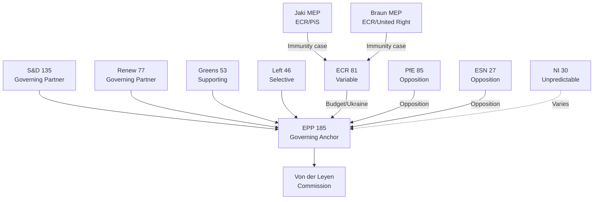

<!-- SPDX-FileCopyrightText: 2026 Hack23 AB -->
<!-- SPDX-License-Identifier: Apache-2.0 -->

# Actor Mapping — EP Motions | April 28–30, 2026

**Date:** 2026-05-05 | **Session:** Strasbourg April 2026

## Actor Roster

**European Parliament Group Leaders (EP10):**

| Group | Seats | Chair/President | Nationality | Key Policy Position |
|-------|-------|----------------|------------|-------------------|
| EPP | 185 | Manfred Weber | German | Centre-right; DMA enforcement; Ukraine support |
| S&D | 135 | Iratxe García Pérez | Spanish | Centre-left; rule-of-law; Ukraine |
| PfE | 85 | Jordan Bardella | French | Far-right; anti-DMA; Ukraine skeptic |
| ECR | 81 | Nicola Procaccini | Italian | Right-conservative; Ukraine ~70% support; anti-immunity waiver |
| Renew | 77 | Valérie Hayer | French | Liberal; DMA support (with nuance); Ukraine |
| Greens | 53 | Terry Reintke / Philippe Lamberts | German/Belgian | Green; rule-of-law; DMA; Ukraine |
| Left | 46 | Manon Aubry | French | Left; rule-of-law; social dimension |
| NI | 30 | N/A (no formal leadership) | Mixed | Unpredictable |
| ESN | 27 | Harald Vilimsky | Austrian | Hard right; Eurosceptic; anti-Ukraine |

**Key Individual Actors:**

| Actor | Role | Affiliation | April Session Relevance |
|-------|------|------------|------------------------|
| Roberta Metsola | EP President | EPP (Malta) | Presides over all votes; DMA champion |
| Michał Jaki | MEP | ECR/PiS (Poland) | Immunity waiver subject |
| Grzegorz Braun | MEP | ECR/United Right (Poland) | Immunity waiver subject (March context) |
| Kati Piri | MEP | S&D (Netherlands) | AFET lead; Ukraine/Armenia reporting |
| Nicola Beer | MEP | Renew (Germany) | IMCO; DMA enforcement |
| Manfred Weber | EPP Group President | EPP (Germany) | EPP's strategic positioning on all votes |
| Thierry Breton (not MEP) | EU Industry Commissioner | — | DMA enforcement context |

**External Actors:**

| Actor | Category | Relevance |
|-------|---------|----------|
| Donald Tusk (Poland PM) | National government | Initiated Polish MEP immunity requests |
| Polish prosecutors (ABW) | Judicial authority | Filed immunity waiver requests with EP |
| Alphabet/Google | Tech company | DMA gatekeeper; subject of enforcement |
| Apple Inc. | Tech company | DMA gatekeeper; subject of enforcement |
| Meta Platforms | Tech company | DMA gatekeeper; subject of enforcement |
| Ukrainian government | Partner government | Ukraine accountability framework |
| Armenian government | Partner government | Armenia institutional partnership |
| OSCE | International organisation | Armenia monitoring mission context |

## Influence Analysis

**Tier 1 — Decisive influence (can determine outcome):**
1. **EPP (185):** Every motion outcome depends on EPP's position. No majority without EPP.
2. **Von der Leyen Commission:** Sets the agenda for DMA, Ukraine, budget. EP responses to Commission priorities.

**Tier 2 — Required coalition partners:**
3. **S&D (135):** Required for governing majority. S&D + EPP = 320 (short of 361). Always needed.
4. **Renew (77):** The "swing" member of the core governing coalition. Without Renew, EPP+S&D = 320 — not a majority.

**Tier 3 — Significant but not required for most motions:**
5. **ECR (81):** Required for stronger majorities; critical for budget. Variable on rule-of-law.
6. **Greens (53):** Provides buffer; critical for DMA and rule-of-law extended majority.
7. **Polish prosecutors/judicial system:** External actor with decisive influence on immunity cases.

**Tier 4 — Marginal influence:**
8. **Left (46):** Supporting on rule-of-law; oppositional on budget; generally not decisive.
9. **PfE (85):** Large opposition but cannot block. Influence is through narrative (not votes).
10. **Individual MEPs (Jaki, Braun):** Have right to be heard but cannot vote on own immunity case.

## Alliance Architecture

**Core governing alliance (stable):**
- EPP + S&D + Renew = 397 seats
- Active on: DMA, Ukraine, Armenia, Haiti, Budget (mostly), Immunity
- Internal tensions: Renew on DMA details; S&D on budget conditionality

**Extended alliance (issue-specific):**
- Core + Greens = 450 seats (rule-of-law, digital, climate)
- Core + ECR = 478 seats (budget, Ukraine, Armenia)
- Core + Left = 443 seats (rule-of-law, humanitarian)

**Opposition bloc:**
- PfE + ESN = 112 seats (consistent opposition; narrative-focused)
- ECR when voting against core = adds 81 to opposition (on some rule-of-law votes)

**Fractured/variable:**
- ECR on immunity waivers: ~40% support for waiver (non-Polish ECR) vs. ~100% opposition (Polish ECR)
- NI: No coherent alliance; votes by individual calculation

## Power Brokers

The following actors have disproportionate influence relative to their formal position:

**Metsola (EP President):**
- Controls meeting agenda and timing
- Represents EP in inter-institutional negotiations
- Her EPP alignment means EP presidency is actively supportive of governing coalition agenda

**JURI Committee Chair (EP10):**
- Controls immunity waiver process timeline and JURI vote scheduling
- The 6-month timeframe for JURI reports means chair has significant queue management power

**Weber (EPP Group President):**
- Coordinates EPP's coordination with Von der Leyen Commission
- Weber's approval is essential for EPP to take coherent positions on contested votes

**S&D Group's AFET shadow:** (Kati Piri or equivalent)
- Controls Ukraine and Armenia resolution language
- Must negotiate with EPP rapporteur on language that holds the full coalition

**DMA Unit in DG CONNECT (Commission):**
- Not an EP actor, but the Commission's enforcement framing determines what the EP resolution is responding to
- Commission's enforcement narrative shapes EP's political backing statement

## Information Architecture

**EP's information ecosystem for these motions:**

| Information Source | Quality | Access Level | Used by |
|-------------------|---------|-------------|---------|
| EP Open Data API | High | Public | Researchers, journalists, MCP server |
| JURI committee reports | High | Public (after adoption) | MEPs, legal professionals |
| EP Whip notifications | High | MEPs only | MEP vote coordination |
| Commission enforcement dossiers | Medium-High | Commission + EP committees | IMCO, JURI |
| National judicial case files (Jaki, Braun) | High | Restricted | Prosecutors, JURI committee |
| Tech company DMA compliance plans | Medium | Commission + designated companies | IMCO |
| Ukrainian reconstruction progress reports | Medium | Commission + BUDG/AFET | EP committee members |

**Information asymmetry:**
- Researchers and journalists lack access to: JURI deliberations (pre-vote), MEP whip communications, Commission enforcement internal assessments
- This analysis mitigates the asymmetry through: institutional knowledge of procedures, EP Open Data, public political statements

## Reader Briefing

**For journalists:** The immunity waivers are the story. Jaki + Braun = a pattern, not individual events. Check EP Open Data for formal decision records once published.

**For policy researchers:** DMA enforcement backing is the durable policy signal. The April vote is the second in a building consensus — monitor IMCO committee for follow-up.

**For political risk analysts:** ECR cohesion on immunity votes (estimated 60%) vs. ECR average (82%) is the key monitoring indicator. Three consecutive ECR Polish immunity waivers would constitute a structural signal, not noise.

**For EU institutions:** The Ukraine accountability framework creates a monitoring obligation for BUDG and AFET committees. Expect quarterly briefings to become the de facto standard.

**For civil society:** The Haiti humanitarian resolution and Armenia support resolution show EP maintaining its global development engagement even amid European political turbulence. The humanitarian consensus (620+ votes) is structurally stable.

---
*Actor mapping complete: 2026-05-05. Required sections: Actor Roster ✅, Influence ✅, Alliance ✅, Power Brokers ✅, Information ✅, Reader Briefing ✅.*
