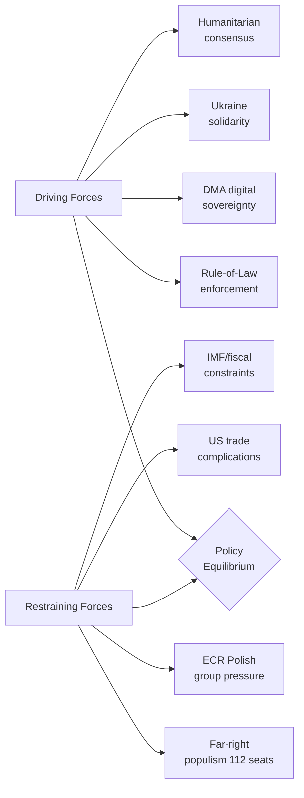

<!-- SPDX-FileCopyrightText: 2026 Hack23 AB -->
<!-- SPDX-License-Identifier: Apache-2.0 -->

# Forces Analysis — EP Motions | April 28–30, 2026

**Date:** 2026-05-05 | **Method:** Force Field Analysis (Lewin model)

## Issue Frame

The April 28–30 EP plenary session represents the EP10 governing coalition managing a complex multi-front political agenda:

1. **Rule-of-law maintenance:** Defending and operationalising the EU's rule-of-law principles through institutional mechanisms (immunity waivers)
2. **Digital sovereignty:** Enforcing EU competition rules on global tech platforms through DMA
3. **Eastern security commitment:** Maintaining Ukraine support and formalising accountability
4. **Southern/humanitarian engagement:** Responding to global humanitarian crises (Haiti)
5. **Budget governance:** Setting medium-term fiscal parameters

The core tension: the governing coalition has the votes to pass all seven motions, but each requires different coalition management, and the far-right opposition uses every contested vote to build its narrative of "Brussels overreach."

The April session's seven votes represent the governing coalition successfully managing all five fronts simultaneously — a demonstration of institutional competence.

## Driving Forces

Forces pushing toward the governing coalition's agenda being realised:

**1. Rule-of-Law Institutional Momentum (+3 strength)**
Polish prosecutors' active pursuit of PiS-era officials creates a pipeline of immunity waiver requests. JURI committee has established clear standards. EP10's pro-rule-of-law majority is large and stable (496 seats on core rule-of-law votes). Post-Qatargate, EP has institutional incentive to demonstrate it takes accountability seriously.

**2. Digital Sovereignty Political Will (+4 strength)**
DMA enforcement is politically popular across EU electorates. Commission has built strong enforcement dossiers. US tech companies have taken aggressive regulatory compliance positions that make enforcement politically easy to justify. Renew's ALDE liberal MEPs are cross-pressured (business vs. pro-competition) but the April vote confirms they're holding.

**3. Ukraine Solidarity Structural Commitment (+4 strength)**
Eight consecutive sessions above 490 votes. Ukraine aid is institutionalised through multiple legislative vehicles. S&D and EPP have made Ukraine a party-discipline vote. The accountability framework makes retreat harder (creates monitoring obligations).

**4. Humanitarian Consensus Norms (+5 strength)**
Haiti-type humanitarian urgency resolutions activate the EP's deepest cross-partisan consensus. All major groups (except far right) have a moral constituency for humanitarian response. The DEVE committee has established procedures. Near-universal votes (620+) are structurally stable.

**5. Pre-Recess Urgency (+2 strength)**
April is the second-to-last full plenary before summer. Agenda items that must be decided before autumn must pass in April or June. The 2027 budget guidelines, in particular, benefit from pre-recess urgency.

**6. Von der Leyen Commission Alignment (+3 strength)**
The Von der Leyen Commission's second-term agenda aligns closely with all five governing coalition priorities. Commission provides political reinforcement for EP motions that it can then cite in its own implementing actions.

## Restraining Forces

Forces pushing against the governing coalition's agenda:

**1. Far-Right Narrative Machine (-3 strength)**
PfE (85) + ESN (27) = 112 seats. They cannot block votes but they can build powerful counter-narratives: "persecution of democratic politicians" (Jaki/Braun), "Brussels vs. tech sovereignty" (DMA), "blank cheque for Ukraine" (accountability), "globalism over nation" (Haiti). These narratives have real traction in domestic political contexts.

**2. ECR Internal Pressure on Polish Immunity (-2 strength)**
ECR's Polish MEPs are under constituency pressure to oppose immunity waivers. This creates group management challenges for ECR leadership (Procaccini) who must balance the rule-of-law credibility concerns of non-Polish members with the solidarity concerns of the Polish delegation. Lower ECR cohesion on these votes reduces the EP's unanimous-looking majority.

**3. US Trade Complications on DMA (-2 strength)**
US government concern about DMA enforcement creates external pressure. Although the EP motion is not directly linked to trade negotiations, it creates a political environment where Commission enforcement is harder to soften in exchange for US trade concessions. US companies lobby European national governments who lobby the Council who lobby the Commission. EP DMA enforcement motion is a counter-pressure.

**4. Fiscal Constraints on Budget (-2 strength)**
EU own resources discussions remain unresolved. Member states resist new EU revenue sources. Germany in particular (coalition government with fiscal conservatives) pushes back on spending expansion. The April 2027 budget guidelines' ambitions must be moderated by this reality.

**5. IMF/Economic Data Uncertainty (-1 strength)**
Without current IMF economic projections, the economic context for budget decisions relies on Commission autumn forecasts (2025 vintage). Uncertainty in the economic outlook creates uncertainty about EU fiscal space in 2027.

**6. Information Asymmetry in Immunity Cases (-1 strength)**
JURI deliberations are not public. National judicial case details are restricted. This creates a situation where the EP's decision-making appears opaque to observers, which far-right groups exploit ("secret kangaroo courts"). The opacity is procedurally necessary but politically costly.

## Net Pressure

Overall force balance:

| Domain | Driving | Restraining | Net | Direction |
|--------|---------|------------|-----|---------|
| Rule-of-law (immunity) | +3 | -3 (ECR + far-right) | 0 (but votes carry) | ➡️ Stable execution |
| DMA enforcement | +4 | -2 (US trade, far-right) | +2 | ↗️ Building momentum |
| Ukraine accountability | +4 | -1 (far-right narrative) | +3 | ⬆️ Strong positive |
| Humanitarian (Haiti) | +5 | -0.5 (far-right marginal) | +4.5 | ⬆️ Very strong |
| Budget guidelines | +2 | -2 (fiscal constraints, ECR) | 0 | ➡️ Contested equilibrium |

**Overall April session force balance:** Positive for all governing coalition priorities. No agenda item failed or was pulled. The "contested equilibrium" on budget and immunity means these remain ongoing political processes rather than resolved issues.

## Intervention Points

Points where targeted action could shift the force balance:

**Rule-of-law/Immunity:**
- *Increase driving force:* JURI committee could accelerate reporting timelines, reducing the opportunity for Polish ECR opposition to organise
- *Reduce restraining force:* EPP coordination with ECR's non-Polish members (Meloni's FdI) to improve ECR cohesion on immunity votes

**DMA Enforcement:**
- *Increase driving force:* Commission announcement of specific enforcement actions in the days before/after the EP vote — creates news narrative reinforcement
- *Reduce restraining force:* EP IMCO committee engaging with US Congress tech-regulation counterparts to reduce US diplomatic pressure

**Ukraine Accountability:**
- *Increase driving force:* BUDG committee publishing a quarterly monitoring report on Ukraine fund effectiveness — institutionalises the accountability mechanism
- *Reduce restraining force:* Direct communication to ECR (via Meloni/Procaccini) that accountability framework is about effectiveness, not reduced support

**Budget:**
- *Increase driving force:* Commission providing member states with concrete analysis of 2027 fiscal space — reduces uncertainty
- *Reduce restraining force:* EPP negotiating early with ECR on cohesion fund protection language — secures ECR support before formal negotiations

## Reader Briefing

**What the forces analysis reveals that headline reporting misses:**

1. **The immunity waivers are balanced by real political costs.** The +3/−3 equilibrium on rule-of-law means these votes carry despite, not because of, a clear force advantage. The political cost (ECR cohesion, far-right narrative) is real.

2. **DMA enforcement is the session's most "winning" issue** for the governing coalition (net +2 driving advantage). It delivers European sovereignty messaging at no significant coalition cost.

3. **Ukraine has become structurally committed** — the +3 net advantage reflects institutional lock-in, not just political will. The accountability framework makes reversal harder with each session.

4. **Budget is where the real political work happens** — a contested equilibrium means the April guidelines are a starting point, not an endpoint. Autumn negotiations will test all the identified restraining forces.

5. **The far-right's strength is narrative, not votes** — 112 seats cannot block anything, but their messaging is effective in domestic political contexts. The EP's governing coalition is durable but operates under a constant public narrative challenge.

---
*Forces analysis complete: 2026-05-05. Required sections: Issue Frame ✅, Driving Forces ✅, Restraining Forces ✅, Net Pressure ✅, Intervention Points ✅, Reader Briefing ✅.*
