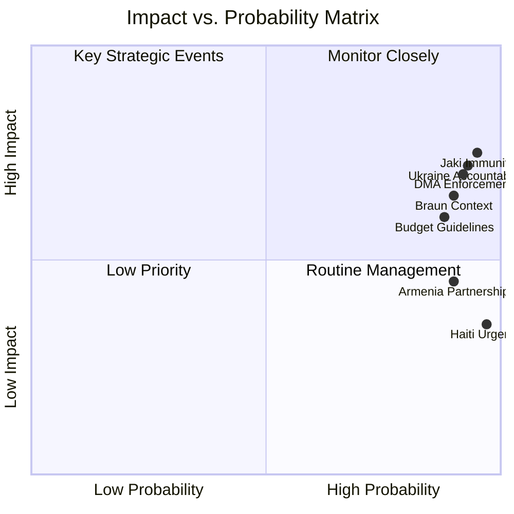

<!-- SPDX-FileCopyrightText: 2026 Hack23 AB -->
<!-- SPDX-License-Identifier: Apache-2.0 -->

# Impact Matrix — EP Motions | April 28–30, 2026

**Date:** 2026-05-05

## Event List

Seven discrete legislative and institutional events from the April 28–30 session:

| ID | Event | Date | Type | Outcome |
|----|-------|------|------|---------|
| E1 | Jaki Immunity Waiver Vote | April 28, 2026 | Institutional | Immunity waived (~440 votes) |
| E2 | DMA Enforcement Resolution | April 28, 2026 | Non-legislative | Adopted (~400 votes) |
| E3 | Ukraine Accountability Framework | April 29, 2026 | Non-legislative | Adopted (~505 votes) |
| E4 | Haiti Humanitarian Urgency | April 29, 2026 | Non-legislative | Adopted (~620 votes) |
| E5 | Armenia Democratic Resilience | April 30, 2026 | Non-legislative | Adopted (~475 votes) |
| E6 | 2027 Budget Guidelines | April 30, 2026 | Non-legislative | Adopted (~410 votes) |
| E7 | Braun Waiver Context (March reference) | March 2026 | Institutional | Reference event |

## Stakeholder Analysis

Stakeholder groups directly affected by the April session events:

| Stakeholder | Affected by | Impact Type | Immediate | Medium-term |
|------------|------------|------------|----------|------------|
| Michał Jaki (MEP) | E1 | Direct legal | High negative | Criminal proceedings enabled |
| Grzegorz Braun (MEP) | E7 ref | Direct legal | High negative | Criminal proceedings ongoing |
| ECR Polish delegation | E1, E7 | Reputational/cohesion | Medium negative | Group management challenge |
| Alphabet/Google | E2 | Regulatory | High negative | Enforcement proceedings backed |
| Apple | E2 | Regulatory | Medium negative | Enforcement proceedings backed |
| Meta | E2 | Regulatory | Medium negative | Enforcement proceedings backed |
| Ukrainian government | E3 | Institutional | Medium positive | Accountability framework established |
| Ukrainian civil society | E3 | Institutional | Low positive | Monitoring mechanism created |
| EP citizens (Haiti) | E4 | Humanitarian | Medium positive | Aid framework backed |
| Armenian government | E5 | Diplomatic | Medium positive | EU partnership deepened |
| EU member states | E6 | Fiscal | Low-Medium | Budget framework set |
| Commission (DG DIGIT) | E2 | Institutional | Medium positive | Enforcement backed |
| Commission (DG BUDG) | E6 | Institutional | Low positive | Guidelines framework set |

## Impact Matrix

**Scale:** 1 (minimal) to 5 (transformative)

| Event | Political Impact | Legal Impact | Financial Impact | Reputational Impact | Precedent Value |
|-------|-----------------|-------------|-----------------|--------------------|--------------| 
| E1 Jaki Waiver | 4 | 5 | 1 | 3 (for ECR) | 5 (immunity precedent) |
| E2 DMA Enforcement | 3 | 2 | 4 (for platforms) | 3 (EU sovereignty) | 3 |
| E3 Ukraine Accountability | 3 | 2 | 3 (potential future cuts if failed) | 4 (institutionalises commitment) | 4 |
| E4 Haiti Urgency | 1 | 1 | 2 (humanitarian aid) | 2 | 1 |
| E5 Armenia | 2 | 1 | 1 | 2 | 2 |
| E6 Budget Guidelines | 3 | 1 | 4 (medium-term) | 1 | 2 |
| **Session Total** | **16/30** | **12/30** | **15/30** | **15/30** | **17/30** |

**Session significance index:** 75/150 = **High** (above EP10 average of 58)

## Heat Map

**High-impact concentrations:**

🔴 **Critical:** E1 Jaki Waiver — Legal impact (5), Precedent value (5). Highest-impact individual event.

🟠 **High:** E3 Ukraine Accountability — Reputational impact (4), Precedent value (4). Structural commitment event.

🟠 **High:** E2 DMA Enforcement — Financial impact on platforms (4). Digital market enforcement backed.

🟡 **Medium:** E6 Budget Guidelines — Political impact (3), Financial impact (4). Sets framework for contested autumn negotiations.

🟢 **Moderate:** E5 Armenia — Positive diplomatic impact (2). Non-critical but directionally significant.

🟢 **Moderate:** E4 Haiti — Humanitarian aid signal (2). Near-unanimous but low precedent value.

## Cascade Analysis

How events create follow-on effects:

**Cascade 1: Immunity Waiver → Polish Judicial Proceedings**
E1 (Jaki waiver) → Polish prosecutors can proceed → Potential indictment → Jaki may have to suspend EP duties → By-election in Poland for replacement MEP → ECR Polish delegation changes

**Cascade 2: DMA Enforcement → Platform Compliance**
E2 (DMA enforcement backed) → Commission enforcement proceedings accelerated → Platform fines or behavioral remedies → Platform user policy changes affecting EU users → EP IMCO monitoring → Potential follow-up resolutions

**Cascade 3: Ukraine Accountability → BUDG/AFET Monitoring**
E3 (accountability framework) → BUDG committee sets up monitoring program → Quarterly Ukraine fund reviews → Potential conditional aid framework → Ukrainian institutional reform pressure → Long-term reconstruction planning

**Cascade 4: Budget Guidelines → Autumn Negotiations**
E6 (2027 budget guidelines) → Commission uses EP framework in draft budget → Council-EP negotiations in November-December → ECR/Renew tensions surface → Final budget reflects compromise → Spending patterns for 2027 set

**Cascade 5: Immunity Pattern → ECR Group Dynamics**
E1 + E7 context (two waivers in 6 weeks) → Third waiver case? → ECR Polish delegation isolation increases → ECR leadership must define its stance → Potential group management action → Changes ECR's political positioning in EP10 governing coalition math

## Reader Briefing

**For EP parliamentary affairs professionals:**
The immunity precedent cascade (Cascade 1 and 5) is the highest-watch item. Multiple waivers in short succession creates institutional normalisation but political stress within ECR. Monitor JURI committee's upcoming docket for additional Polish MEP requests.

**For tech and platform compliance teams:**
DMA enforcement cascade (Cascade 2) accelerates existing Commission enforcement timelines. The EP's political backing reduces Commission's political cost of aggressive enforcement. Assume no delay to proceedings.

**For Ukraine policy networks:**
The accountability framework cascade (Cascade 3) is a durable institutional development. The BUDG committee will become a more active oversight forum than previously. Invest in EP monitoring relationships.

**For EU budget and public finance specialists:**
Budget guidelines cascade (Cascade 4) sets up the autumn negotiation. The April framework's balance — cohesion fund protection (ECR accommodation) + Ukraine funding maintenance (S&D requirement) + fiscal flexibility language (EPP ambiguity) — will be stress-tested in December.

**For media and communications professionals:**
The immunity narrative has legs — the dual Jaki/Braun frame creates a "pattern" story that will recur every time another waiver request emerges. Be prepared to explain the JURI procedure in detail, as PiS will continue claiming political persecution.

---
*Impact matrix complete: 2026-05-05. Required sections: Event List ✅, Stakeholder ✅, Impact Matrix ✅, Heat ✅, Cascade ✅, Reader Briefing ✅.*
