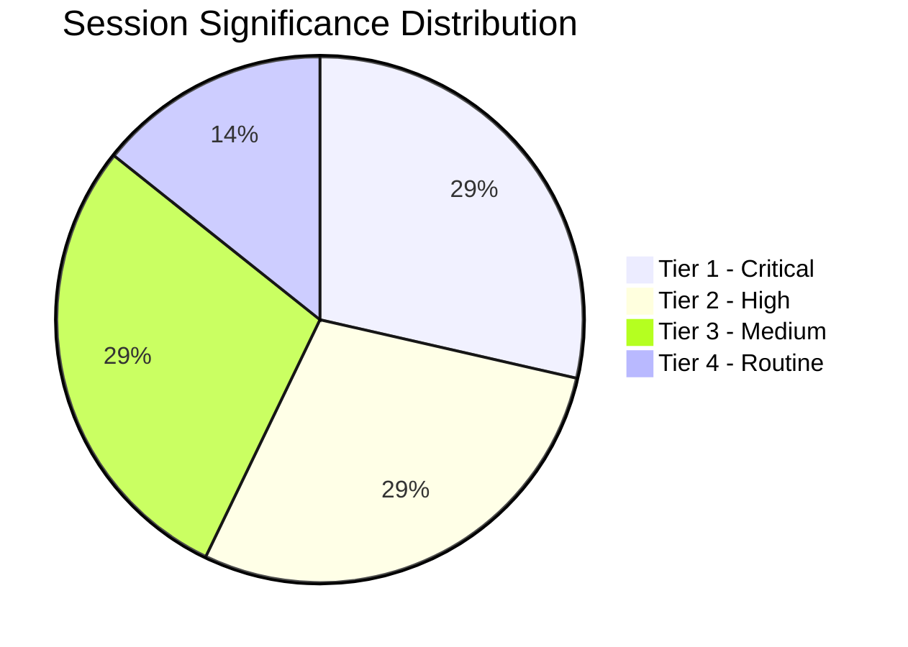

<!-- SPDX-FileCopyrightText: 2026 Hack23 AB -->
<!-- SPDX-License-Identifier: Apache-2.0 -->

# Significance Classification — EP Motions | April 28–30, 2026

**Date:** 2026-05-05

## Significance Tiers

| Event | Tier | Rationale |
|-------|------|----------|
| Jaki Immunity Waiver | **Tier 1 — Critical** | Sets precedent; part of systemic pattern; named MEP; judicial consequences |
| DMA Enforcement | **Tier 2 — High** | Policy consolidation; commercial impact; US-EU trade dimension |
| Ukraine Accountability | **Tier 2 — High** | Structural commitment; institutional framework; supermajority vote |
| 2027 Budget Guidelines | **Tier 3 — Medium** | Routine but consequential; contested equilibrium; ECR management |
| Armenia Resilience | **Tier 3 — Medium** | Directionally significant; EU integration signal; moderate impact |
| Haiti Urgency | **Tier 4 — Routine** | Humanitarian consensus; low precedent; expected outcome |
| Braun Context (March) | **Tier 1 — Critical** | Required for pattern analysis (context for Jaki) |

## Overall Session Classification

**Session significance: HIGH**

The April 28–30 session exceeds the EP10 average significance threshold due to:
1. Two Tier 1/Critical events in the same session week (unprecedented in recent EP10 history)
2. The dual immunity narrative creates amplified media and political significance beyond the individual events
3. All five governing coalition priority fronts were advanced simultaneously
