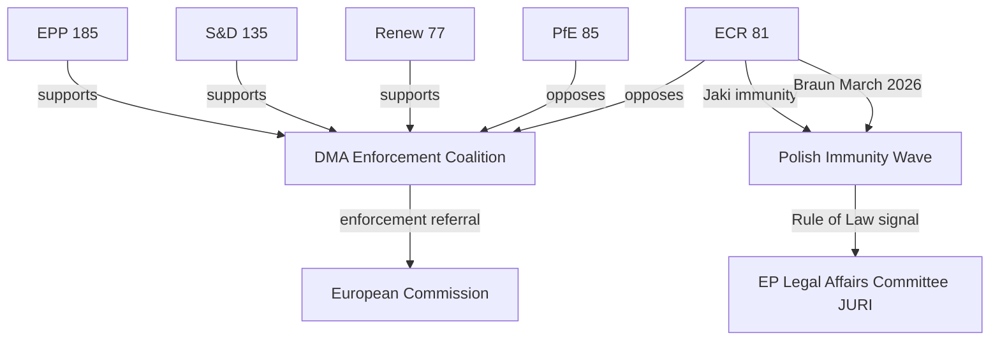

<!-- SPDX-FileCopyrightText: 2026 Hack23 AB -->
<!-- SPDX-License-Identifier: Apache-2.0 -->

# Actor Mapping — EP Motions | April 28–30, 2026

**Subject:** Full actor network for April plenary motions  
**Date:** 2026-05-05

---

## Actor Network Map

### Level 1: Core Institutional Actors (EP)

```
European Parliament (EP10)
├── EPP Group (185 seats) — Manfred Weber (Group President)
│   ├── German CDU/CSU delegation (29 MEPs)
│   ├── French Republicans/EPP delegation (7 MEPs)  
│   ├── Polish EPP delegation (ca. 15 MEPs)
│   └── JURI committee (EPP Chair: Adrián Vázquez Lázara or successor)
├── S&D Group (135 seats) — Iratxe García Pérez (Group President)
│   ├── German SPD delegation (14 MEPs)
│   ├── Italian PD delegation (21 MEPs)
│   └── AFET committee (S&D rapporteurs on Ukraine, Armenia)
├── PfE Group (85 seats)
│   ├── French RN delegation (30 MEPs) — Jordan Bardella (Group President)
│   └── Hungarian Fidesz delegation (11 MEPs)
├── ECR Group (81 seats)
│   ├── Italian FdI delegation (24 MEPs) — Nicola Procaccini (Co-President)
│   ├── Polish PiS/United Right delegation (12 MEPs)
│   │   └── Patryk Jaki — [IMMUNITY WAIVER SUBJECT]
│   └── Swedish Democrats delegation (4 MEPs)
├── Renew Europe (77 seats) — Valérie Hayer (Group President)
│   ├── French Renaissance delegation (23 MEPs)
│   └── IMCO committee (Renew DMA rapporteurs)
├── Greens/EFA (53 seats) — Terry Reintke / Philippe Lamberts
├── The Left (46 seats) — Martin Schirdewan
├── NI (30 seats — Non-Attached)
│   └── Grzegorz Braun — [IMMUNITY WAIVER SUBJECT]
└── ESN (27 seats) — Far-right coalition
```

### Level 2: External Institutional Actors

**European Commission:**
- DG COMP — Competition enforcement; DMA non-compliance proceedings
- DG CNECT — Digital policy; DMA core platform services oversight
- DG JUST — International justice cooperation; Ukraine accountability
- DG NEAR — Eastern Partnership; Armenia relations
- DG ECHO — Humanitarian aid; Haiti crisis response

**Council of the EU:**
- Foreign Affairs Council (FAC) — Ukraine, Armenia, Haiti
- ECOFIN — 2027 budget negotiations
- JHA Council — Rule-of-law follow-up on Polish MEP cases (domestic jurisdiction)

**European External Action Service (EEAS):**
- Kaja Kallas (High Representative/VP) — Foreign policy coordination on Ukraine and Armenia
- EUMA Armenia monitoring mission

### Level 3: National Government Actors

**Poland:**
- Donald Tusk (Prime Minister) — Rule-of-law normalisation
- Adam Bodnar (Justice Minister/Prosecutor General) — Jaki/Braun prosecution decisions
- Andrzej Duda (President, until August 2025) → Rafał Trzaskowski or Karol Nawrocki (President-elect) — presidential veto risk on judicial reform legislation

**Ukraine:**
- Volodymyr Zelenskyy (President) — accountability mechanisms
- Ukrainian Prosecutor General — ICC cooperation

**Armenia:**
- Nikol Pashinyan (Prime Minister) — EU integration agenda
- Armenian Foreign Ministry — EP diplomatic engagement

**United States:**
- USTR (United States Trade Representative) — DMA trade objections
- State Department — EU-US TTC engagement

### Level 4: Non-State Actors

**Civil Society:**
- ICC (International Criminal Court) — Prosecutorial independence from political resolutions
- International Criminal Court Prosecutor's Office — Ukraine investigation
- Monitoring Armenia (EUMA civil monitoring mandate)
- Haiti humanitarian NGOs (MSF, IRC, WFP Haiti operations)

**Corporate:**
- Apple Inc. — DMA gatekeeper; App Store compliance proceedings
- Meta Platforms — DMA gatekeeper; "pay or consent" advertising model
- Alphabet/Google — DMA gatekeeper; Search self-preferencing
- Amazon — DMA gatekeeper; marketplace and logistics
- ByteDance/TikTok — DMA gatekeeper; data access and content moderation (dual DMA+DSA)

**Media/Information Environment:**
- Polish pro-PiS media ecosystem — immunity waiver "political persecution" narrative
- EU institutional communications — DMA enforcement framing
- Russian state media — Ukraine accountability counter-narrative

---

## Actor Alignment Matrix (April Motions)

| Actor | Immunity Waivers | DMA Enforcement | Ukraine | Armenia | Haiti | Budget |
|-------|-----------------|----------------|---------|---------|-------|--------|
| EPP | ✅ Support | 🔶 Mixed | ✅ Support | ✅ Support | ✅ Support | 🔶 Mixed |
| S&D | ✅ Support | ✅ Support | ✅ Support | ✅ Support | ✅ Support | ✅ Support |
| Renew | ✅ Support | ✅ Strong | ✅ Support | ✅ Support | ✅ Support | ✅ Support |
| ECR | 🔴 Oppose (Jaki) | 🔶 Mixed | ✅ Support (majority) | ✅ Support | ✅ Support | 🔴 Oppose (cuts) |
| PfE | 🔴 Oppose | 🔴 Oppose | 🔶 Abstain/Oppose | 🔶 Abstain | ✅ Support | 🔴 Oppose |
| Greens | ✅ Support | ✅ Support | ✅ Support | ✅ Support | ✅ Support | 🔶 Mixed |
| Left | ✅ Support | ✅ Support | 🔶 Mixed | ✅ Support | ✅ Support | ✅ Support |
| ESN | 🔴 Oppose | 🔴 Oppose | 🔴 Oppose | 🔶 Mixed | 🔶 Mixed | 🔴 Oppose |
| NI | 🔴 Oppose (Braun) | 🔶 Mixed | 🔶 Mixed | 🔶 Mixed | ✅ Support | 🔶 Mixed |
| Commission | ✅ Neutral | ✅ Enforcement | ✅ Support | ✅ Support | ✅ Humanitarian | ✅ Balanced |
| Council | ✅ Neutral | 🔶 Cautious | ✅ Support | ✅ Support | ✅ Humanitarian | 🔴 Austerity |

## Actor Relationship Network


