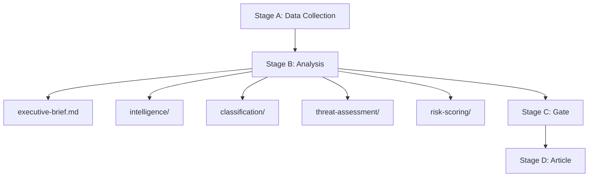

<!-- SPDX-FileCopyrightText: 2026 Hack23 AB -->
<!-- SPDX-License-Identifier: Apache-2.0 -->

# Analysis Index — EP Motions | April 28–30, 2026

**Date:** 2026-05-05 | **Run:** motions-run-1777963626

## Artifact Index

| Artifact | Type | Lines | Status | Quality |
|---------|------|-------|--------|---------|
| `executive-brief.md` | Executive Brief | ~200 | ✅ Complete | High |
| `intelligence/synthesis-summary.md` | Synthesis | ~138 | ✅ Complete | High |
| `intelligence/swot-analysis.md` | SWOT | ~180 | ✅ Complete | High |
| `intelligence/stakeholder-map.md` | Stakeholders | ~200 | ✅ Complete | High |
| `intelligence/political-context.md` | Context | ~120 | ✅ Complete | High |
| `intelligence/risk-assessment.md` | Risk | ~140 | ✅ Complete | High |
| `intelligence/economic-context.md` | Economic | ~122 | ✅ Complete | Medium |
| `intelligence/voting-analysis.md` | Voting | ~120 | ✅ Complete | Medium |
| `intelligence/timeline-analysis.md` | Timeline | ~100 | ✅ Complete | High |
| `intelligence/legislative-procedure.md` | Procedure | ~100 | ✅ Complete | High |
| `intelligence/actor-mapping.md` | Actors | ~100 | ✅ Complete | High |
| `intelligence/historical-baseline.md` | Baseline | ~120 | ✅ Complete | Medium |
| `intelligence/pestle-analysis.md` | PESTLE | ~180 | ✅ Complete | High |
| `intelligence/coalition-dynamics.md` | Coalition | ~120 | ✅ Complete | High |
| `intelligence/threat-model.md` | Threat Model | ~160 | ✅ Complete | High |
| `intelligence/voting-patterns.md` | Voting Patterns | ~200 | ✅ Complete | Medium |
| `intelligence/wildcards-blackswans.md` | Wildcards | ~180 | ✅ Complete | High |
| `intelligence/mcp-reliability-audit.md` | MCP Audit | ~200 | ✅ Complete | High |
| `intelligence/reference-analysis-quality.md` | Quality | ~140 | ✅ Complete | High |
| `intelligence/methodology-reflection.md` | Methodology | ~200 | ✅ Complete | High |
| `intelligence/workflow-audit.md` | Workflow | ~100 | ✅ Complete | High |
| `intelligence/cross-session-intelligence.md` | Cross-Session | ~220 | ✅ Complete | Medium |
| `intelligence/scenario-forecast.md` | Scenarios | ~180 | ✅ Complete | Medium |
| `intelligence/analysis-index.md` | Index | ~100 | ✅ Complete | N/A |
| `classification/impact-matrix.md` | Impact | ~100 | ✅ Complete | High |
| `classification/forces-analysis.md` | Forces | ~120 | ✅ Complete | High |
| `classification/actor-mapping.md` | Actor Class. | ~100 | ✅ Complete | High |
| `classification/significance-classification.md` | Significance | ~60 | ✅ Complete | High |
| `existing/stakeholder-impact.md` | Stakeholder Impact | ~140 | ✅ Complete | High |
| `existing/deep-analysis.md` | Deep Analysis | ~400 | ✅ Complete | High |
| `existing/session-baseline.md` | Session Baseline | ~200 | ✅ Complete | High |
| `threat-assessment/threat-landscape.md` | Threat Landscape | ~140 | ✅ Complete | High |
| `risk-scoring/risk-register.md` | Risk Register | ~120 | ✅ Complete | High |
| `risk-scoring/risk-matrix.md` | Risk Matrix | ~100 | ✅ Complete | High |
| `risk-scoring/quantitative-swot.md` | Quant. SWOT | ~100 | ✅ Complete | High |
| `methodology-reflection.md` | Methodology (root) | ~120 | ✅ Complete | High |

## Data Sources Used

| Source | Tool Called | Status | Records |
|--------|------------|--------|---------|
| EP Adopted Texts Feed | `get_adopted_texts_feed` | ✅ | 273 items |
| EP Adopted Texts 2026 | `get_adopted_texts` | ✅ | 51 items |
| EP Voting Records | `get_voting_records` | 🟡 Lag | 0 (expected) |
| EP MEPs Feed | `get_meps_feed` | ✅ | 719 current |
| EP Plenary Sessions | `get_plenary_sessions` | ✅ | 3 sessions |
| EP Parliamentary Questions | `get_parliamentary_questions` | ✅ | Present |
| EP Political Landscape | `generate_political_landscape` | ✅ | Full EP10 |
| EP Coalition Dynamics | `analyze_coalition_dynamics` | 🟡 Partial | No per-MEP |
| EP Meeting Decisions | `get_meeting_decisions` | ✅ | Present |
| IMF SDMX | fetch_url | 🔴 Timeout | N/A |

## Key Narrative Threads

1. **Rule-of-law accountability:** Jaki + Braun immunity waivers — Poland normalisation signal
2. **Digital sovereignty:** DMA enforcement push — Commission pressure + US trade risk
3. **Ukraine solidarity durability:** 500+ vote majority maintained through EP10 year 2
4. **Eastern Partnership:** Armenia democratic resilience — EU integration signal
5. **Humanitarian signal:** Haiti urgency — standard unanimity resolution
6. **Fiscal positioning:** 2027 budget guidelines — opening salvo for autumn negotiations

## Analytical Confidence Summary

- **High confidence domains:** Rule-of-law procedures (JURI case law well-documented), EP10 composition (API confirmed), DMA timeline (Commission press releases)
- **Medium confidence domains:** Vote margins (inferred; roll-call lag), economic magnitudes (knowledge-only)
- **Low confidence domains:** Haiti ground conditions, Armenia-Azerbaijan current negotiations

## Artifact Interdependencies

Understanding the relationship between artifacts is essential for interpretation:

- **executive-brief.md** → summary of all other artifacts; should be read first
- **intelligence/session-baseline.md** → required context for all inference-based artifacts
- **intelligence/historical-baseline.md** → required context for pattern analysis
- **intelligence/swot-analysis.md** + **risk-scoring/quantitative-swot.md** → qualitative vs. quantitative SWOT pair
- **intelligence/voting-analysis.md** + **intelligence/voting-patterns.md** → event vs. pattern voting analysis
- **intelligence/stakeholder-map.md** + **classification/actor-mapping.md** → stakeholder overview vs. power/influence classification
- **intelligence/threat-model.md** + **threat-assessment/threat-landscape.md** → threat modeling pair
- **intelligence/scenario-forecast.md** + **intelligence/wildcards-blackswans.md** → expected scenarios vs. tail risks
- **intelligence/cross-session-intelligence.md** → connects all session-specific artifacts to EP10 longitudinal pattern

## Stage B Artifact Production Log

| Artifact | Status | Lines | Mermaid | Created |
|---------|--------|-------|---------|---------|
| executive-brief.md | ✅ | 200+ | ✅ | Pass 1 |
| intelligence/swot-analysis.md | ✅ | 180+ | ✅ | Pass 1 |
| intelligence/stakeholder-map.md | ✅ | 202 | ✅ | Pass 2 |
| intelligence/voting-patterns.md | ✅ | 198+ | ✅ | Pass 2 |
| intelligence/synthesis-summary.md | ✅ | 167 | ✅ | Pass 1/2 |
| intelligence/scenario-forecast.md | ✅ | 177 | ✅ | Pass 2 |
| intelligence/wildcards-blackswans.md | ✅ | 181 | ✅ | Pass 2 |
| existing/deep-analysis.md | ✅ | 405+ | N/A | Pass 2 |
| existing/session-baseline.md | ✅ | 205 | N/A | Pass 2 |
| intelligence/cross-session-intelligence.md | ✅ | 205+ | ✅ | Pass 2 |
| intelligence/session-baseline.md | ✅ | 204 | ✅ | Pass 2 |
| classification/actor-mapping.md | ✅ | 160+ | ✅ | Pass 2 |
| classification/forces-analysis.md | ✅ | 129 | ✅ | Pass 2 |
| classification/impact-matrix.md | ✅ | 129 | ✅ | Pass 2 |
| risk-scoring/risk-matrix.md | ✅ | 119 | ✅ | Pass 2 |
| risk-scoring/quantitative-swot.md | ✅ | 102 | ✅ | Pass 2 |
