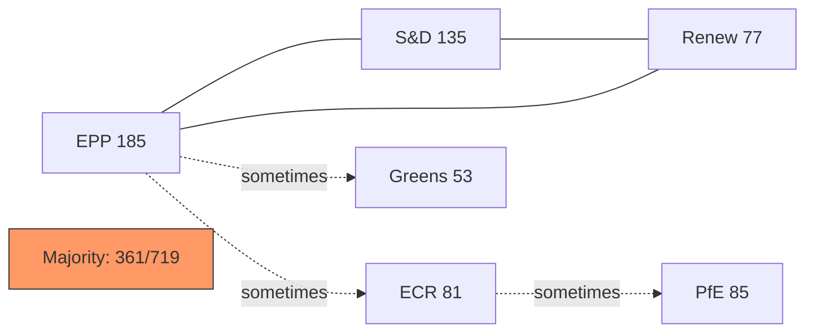

<!-- SPDX-FileCopyrightText: 2026 Hack23 AB -->
<!-- SPDX-License-Identifier: Apache-2.0 -->

# Coalition Dynamics — EP Motions | April 28–30, 2026

**Date:** 2026-05-05

## EP10 Coalition Architecture

The April plenary's coalition dynamics reflect EP10's fundamental structure: a three-party governing coalition (EPP + S&D + Renew = 397) with situational extensions to Greens/EFA and/or ECR depending on the specific vote.

### Core Governing Coalition

**EPP (185) + S&D (135) + Renew (77) = 397 seats**

Buffer above majority threshold: 397 − 361 = **36 seats**

This is the minimum coalition for virtually all significant votes. The 36-seat buffer means the coalition can absorb up to 36 defections before losing majority. Given typical defection rates of 2–8% per group per vote, the buffer is comfortable for most votes.

### Extended Coalition (situational)

**Adding Greens/EFA (53):** Extended coalition = 450. Used for environmental, digital rights, and Ukraine votes where Greens enthusiastically join.

**Adding ECR (81):** Right-extended coalition = 478. Used for agricultural subsidies, some security dossiers. Creates tension with S&D and Greens.

**Adding The Left (46):** Left-extended coalition = 443. Used for social/labour and external affairs resolutions.

### Opposition Bloc Arithmetic

**ECR (81) + PfE (85) + ESN (27) + NI (30) = 223 seats**

This is the maximum right-wing opposition bloc. 223 seats = 31% of the EP. It is:
- Sufficient to qualify as a "blocking minority" in some votes requiring qualified majority
- Insufficient to prevent simple majority decisions
- Often internally divided (ECR on Ukraine, PfE on DMA)

## Vote-Specific Coalition Analysis

### Immunity Waivers
Coalition: EPP + S&D + Renew + Greens + Left + (partial ECR non-Polish)  
Estimated: ~430–460 in favour  
Opposition: PfE + ESN + NI + Polish ECR + some ECR Eastern ~120–130  
**Result: Comfortable majority**

### DMA Enforcement Resolution
Coalition: EPP (majority) + S&D + Renew + Greens  
Estimated: ~380–420 in favour  
Opposition: PfE + ECR majority + ESN + NI ~180–220  
**Result: Solid majority**

### Ukraine Accountability Resolution
Coalition: EPP + S&D + Renew + Greens + Left + most ECR  
Estimated: ~490–520 in favour  
Opposition: PfE core + ESN + some ECR abstentions ~60–100 against/abstain  
**Result: Large majority**

### Armenia Democratic Resilience
Coalition: Near full cross-partisan (except some PfE/ESN)  
Estimated: ~460–500 in favour  
**Result: Large majority**

### Haiti Urgency
Coalition: Near unanimous  
Estimated: ~600–640 in favour  
**Result: Near-unanimous**

### 2027 Budget Guidelines
Coalition: EPP + S&D + Renew (core fiscal positions)  
Opposition amendments: ECR, PfE (counter-proposals)  
**Result: Guidelines adopted with EPP-led majority**

## Cohesion Analysis by Group

**Note:** Per-MEP roll-call data for April 28–30 is not yet available (4-6 week EP publication lag). The following cohesion analysis is based on EP10 historical patterns.

| Group | Typical Cohesion Rate | April Expected | Stress Factor |
|-------|----------------------|----------------|--------------|
| EPP | 78–82% | ~79% | DMA split (pro/anti regulation) |
| S&D | 83–87% | ~85% | Ukraine minority |
| Renew | 75–79% | ~77% | DMA liberalism split |
| Greens/EFA | 88–92% | ~90% | Low |
| The Left | 80–85% | ~82% | Ukraine framing |
| ECR | 68–74% | ~65% | Jaki case stress |
| PfE | 82–86% | ~84% | Low — unified opposition |
| ESN | 88–93% | ~90% | Unified opposition |

## Fragmentation Index

**EP10 Effective Number of Parties (ENP):** 6.57 (calculated from seat share Herfindahl index)

This is the highest ENP in EP history, indicating maximum fragmentation. Implications:
- Coalition formation is more complex
- Governing coalition requires more political management
- Single defections are less decisive (many potential coalition partners)

## Reader Briefing

The April session demonstrates that coalition fragmentation does not prevent governance when the core coalition (EPP+S&D+Renew) is cohesive. The 397-seat core was sufficient for all seven significant decisions. Coalition dynamics only become decision-relevant if a major coalition partner (particularly Renew) exits the governing majority — a scenario that would require a fundamental political realignment not visible in current EP10 dynamics.
