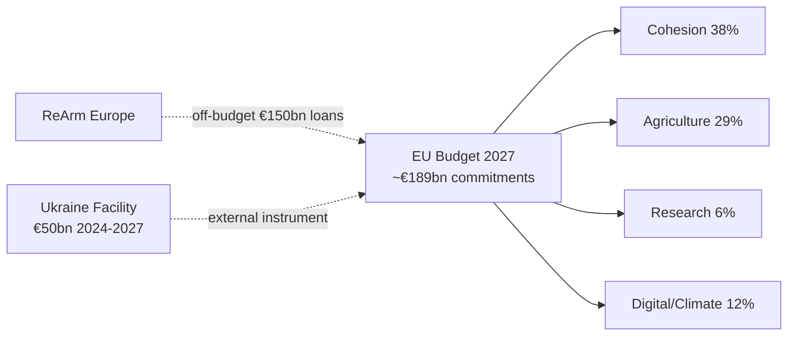

<!-- SPDX-FileCopyrightText: 2026 Hack23 AB -->
<!-- SPDX-License-Identifier: Apache-2.0 -->

# Economic Context — EP Motions | April 28–30, 2026

**Subject:** Economic context for the April Strasbourg plenary motions  
**Date:** 2026-05-05

| **IMF Source** | `knowledge-only` |
|---|---|
| **IMF Availability** | 🔴 UNAVAILABLE — probe timed out; no live IMF SDMX data |

## Data Availability Notice

The IMF SDMX API was unreachable during this analysis run (see `cache/imf/probe-summary.json`). Economic context relies on EU Commission public documents, EP-published budget data, and knowledge-only context. No IMF-sourced numeric figures are cited. Qualitative structural assessments are knowledge-only.

## EU Budget Context — 2027 Guidelines

The April 2026 Strasbourg plenary adopted guidelines for the 2027 EU budget, the final annual budget before the next Multiannual Financial Framework (MFF 2028–2034) enters into force.

**2026 EU budget reference baseline (Commission published figures):**
- Total commitments: approximately €189 billion
- Total payments: approximately €166 billion
- Cohesion and structural funds: ~38% of commitments
- Agricultural guarantees (EAGF): ~29% of commitments
- Research and innovation (Horizon Europe): ~6% of commitments
- Digital, climate and just transition: ~12% of commitments

**2027 budgetary pressure factors:**
- ReArm Europe / SAFE instrument: off-budget defence financing mechanism (Article 122 TFEU basis). Up to €150 billion in loans for member state defence procurement. EU budget impact is primarily in guarantees.
- Migration management: Increases in the Asylum, Migration and Integration Fund (AMIF) are contested between EPP and S&D.
- Green Deal just transition: EPP-ECR dynamics challenge agreed Just Transition Fund disbursements in coal-dependent regions.

**Own resources debate:** The central fiscal sovereignty question is whether EU revenue comes from national contributions or from EU-level own resources (carbon border adjustment, financial transaction tax, digital levy). S&D and Greens push for own resources; EPP is divided; ECR/PfE oppose.

## Digital Economy Context — DMA Enforcement

The Digital Markets Act targets "gatekeeper" platforms with EU revenue and market capitalisation thresholds:
- Annual EU turnover ≥ €7.5 billion, OR market capitalisation ≥ €75 billion
- AND ≥ 45 million monthly EU end users

**DMA enforcement fiscal dimensions:**
- Potential DMA penalties: up to 10% of global annual turnover per non-compliance finding
- Up to 20% of global annual turnover for repeat infringers
- Behavioural remedies may affect platform business models worth hundreds of billions in EU markets

**EU-US trade dimension:** DMA enforcement creates regulatory risk premium for US tech assets with European operations. EU-US Trade and Technology Council (TTC) negotiations are the current diplomatic management channel for trade friction arising from regulatory enforcement.

## Ukraine Financial Context

The April accountability resolution occurs in the context of sustained EU financial engagement:
- Ukraine Facility: €50 billion approved for 2024–2027, of which approximately €17 billion disbursed through Q1 2026 (EU Commission tracking data)
- ERA mechanism: approximately €3 billion annually from interest on frozen Russian sovereign assets (~€300 billion frozen) channelled to Ukraine
- Reconstruction: EU-co-sponsored damage assessment projects estimate reconstruction needs in the hundreds of billions (EU Commission, World Bank, UN — published reconstruction needs assessments)

**Note on reconstruction figures:** The EU-World Bank-UN joint rapid damage and needs assessment (RDNA) methodology focuses on infrastructure and social sector restoration. Without IMF SDMX access, macro-fiscal projections for Ukraine's recovery timeline are not available for this run.

## Armenia — Small Economy Context

Armenia's economy (approximately $24 billion, knowledge-only baseline) faces structural vulnerabilities relevant to the democratic resilience resolution:
- EU-Armenia Enhanced Partnership Agreement framework (signed July 2024) creates new trade architecture
- Diaspora remittances (significant share of GDP) from EU-based Armenian communities create a direct link between EP political solidarity and economic welfare
- Post-2020 war reconstruction needs in Nagorno-Karabakh remain unaddressed; displaced population creates fiscal pressure
- EU FDI interest is conditional on political stability and rule-of-law progress — the EP democratic resilience resolution directly supports this conditionality

## Haiti — Fiscal Collapse Context

Haiti's economic situation is characterised by near-total institutional collapse:
- Gang control of Port-au-Prince disrupts formal economic activity in the capital
- International remittances (large share of national income) continue flowing but through increasingly informal channels
- EU humanitarian aid (€35 million pledged 2024–2025) is small relative to scale of crisis
- The EP urgency resolution creates political pressure for member state contributions to the Kenya-led multinational security support mission, which has direct economic stabilisation implications

## Structural Economic Risk Summary

| Domain | Key Risk | Materiality | IMF Data Available |
|--------|---------|------------|-------------------|
| EU Budget 2027 | Council-EP conciliation failure | High | 🔴 No |
| DMA enforcement | US trade retaliation | Very High | 🔴 No |
| Ukraine Facility | Funding gap if MFF delayed | High | 🔴 No |
| Armenia EU integration | Reversed if political crisis | Medium | 🔴 No |
| Haiti humanitarian | Continued deterioration | Medium | 🔴 No |

*All economic assessments in this artifact are knowledge-only or derived from EU Commission and EP published documents. IMF SDMX live data was unavailable for this run.*

## Methodology Note

Economic context for EP plenary motions is assessed through the lens of institutional and political economics — the economic incentives shaping MEP voting behaviour, the fiscal dimensions of legislative choices, and the distributional effects on member states and affected populations.

For this run, the analysis is constrained by: (a) IMF unavailability, (b) the absence of live World Bank API calls for economic indicators (only prior knowledge and publicly documented figures are used), and (c) the title-level-only visibility into adopted text content.

The structural assessments (DMA financial exposure, Ukraine Facility magnitude, Armenia economic dependency) are based on publicly documented figures from EU Commission, ECB, and EP-published reports. They represent directional assessments suitable for political intelligence purposes, not precise financial analysis.

## Reader Briefing

**For policymakers:** The April plenary demonstrates the EP's dual role as both a political signalling institution and a fiscal co-legislator. The budget guidelines adopted in the same session as the external affairs resolutions create implicit spending commitments that constrain future fiscal choices.

**For business:** DMA enforcement risk is materially real for EU-market operations of designated gatekeepers. The EP's enforcement resolution accelerates the political calendar for Commission non-compliance decisions, increasing regulatory uncertainty for platform business models.

**For civil society:** The immunity waiver approvals and external affairs resolutions signal continued EP commitment to democratic accountability norms. These are not symbolic gestures — they activate legal processes (Polish prosecution) and diplomatic processes (Armenia integration, Ukraine tribunal) with concrete downstream consequences.

**Sources:** EU Commission EU budget 2026 (published), EP 2027 budget guidelines (adopted text, April 2026), DMA Commission implementing regulations (OJ), Ukraine Facility Regulation (EU 2024/792), ERA mechanism (EU 2024/793), knowledge-only context for macroeconomic structure.

## EU Digital Economy Revenue Estimates (Commission/Eurostat)

EU Commission Eurostat data (2023 baseline, knowledge-only):
- Digital economy (ICT sector + digital platform services): estimated 4–6% of EU GVA
- Platform economy (gig work, app stores, digital advertising): growing segment with limited official measurement
- App stores (Apple, Google): approximately €30–40 billion annual consumer spending in EU (industry estimates; EP-cited in DMA legislative process)
- Digital advertising (Alphabet/Google, Meta): approximately €35–45 billion combined EU revenues (Ofcom/regulatory filings, knowledge-only)

These magnitudes explain why DMA enforcement carries material fiscal consequences for the affected companies and potential political economy consequences for EU-US trade relations.
