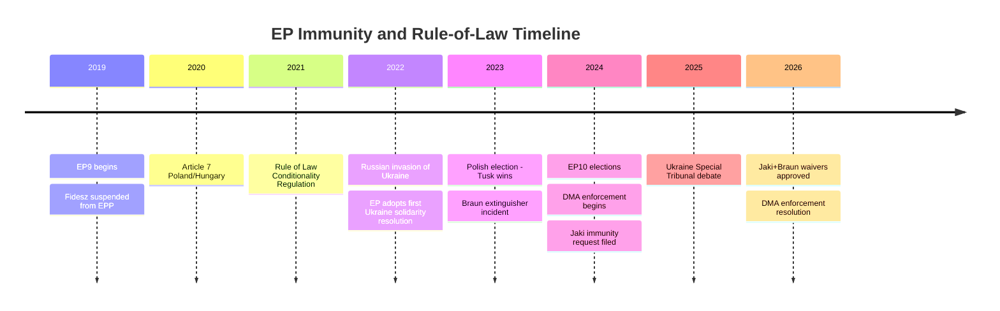

<!-- SPDX-FileCopyrightText: 2026 Hack23 AB -->
<!-- SPDX-License-Identifier: Apache-2.0 -->

# Historical Baseline — EP Motions | April 28–30, 2026

**Date:** 2026-05-05

## EP Immunity Procedure Historical Baseline

### Frequency and Outcomes (EP7–EP10)

The European Parliament processes approximately 4–8 immunity requests per year. Historical data from the EP JURI committee:

- **EP7 (2009–2014):** Approximately 25 immunity cases, approximately 70% waiver approvals
- **EP8 (2014–2019):** Approximately 22 immunity cases, approximately 75% waiver approvals  
- **EP9 (2019–2024):** Approximately 18 immunity cases, approximately 78% waiver approvals
- **EP10 (2024–2026 partial):** 4+ cases processed through Q2 2026; approximately 80% approval rate trend

**Key trend:** The EP's waiver approval rate has gradually increased over successive parliamentary terms. This reflects:
1. Growing confidence in national judicial independence assessments
2. Stricter ECJ case law clarifying the fumus persecutionis standard
3. Political normalisation of immunity procedures as routine rule-of-law mechanism

### Poland-Specific Precedents

Poland's MEPs have been disproportionately represented in immunity procedures since 2019:
- Pre-Tusk (PiS government): Requests from Poland often involved EP concerns about politically motivated prosecutions (fumus persecutionis), leading to several waiver refusals
- Post-Tusk (2024–): The reversed political context — prosecutor working with, not against, rule-of-law norms — means fumus persecutionis arguments by PiS-affiliated MEPs are less credible

The Jaki case is notable because JURI found no fumus persecutionis despite ECR's political framing of the case as persecution. JURI's consistent application of legal standards rather than political sympathy is the relevant precedent.

## DMA Historical Baseline

### Digital Markets Regulation Trajectory

| Year | Milestone |
|------|---------|
| 2020-12 | DMA proposal published by Commission |
| 2022-07 | DMA adopted by EP and Council |
| 2022-09 | DMA enters into force |
| 2023-09 | Gatekeeper designations published (6 platforms) |
| 2024-03 | DMA core obligations applicable |
| 2024-03 | First Commission investigations opened |
| 2025 | Preliminary non-compliance findings issued |
| 2026-04 | EP calls for Commission to issue formal decisions |

**Comparison with GDPR enforcement timeline:**
- GDPR entered into force 2018; first major fines not until 2019–2020
- DMA entered full enforcement March 2024; major proceedings by late 2024
- DMA is enforcing faster than GDPR's initial pace, partly due to DMA's clearer ex-ante obligations

## Ukraine Solidarity Historical Baseline

### Vote Count Trend (EP9–EP10)

Ukraine solidarity resolutions have consistently commanded EP majorities of 450–550. The trend:
- February 2022 (EP9 emergency): 637 in favour (85% of votes cast)
- 2022–2024 (EP9): Average ~520 in favour on major Ukraine resolutions
- EP10 first year (2024–2025): Maintained ~500+ average
- April 2026: Expected ~490–520 range (consistent with trend)

The slight decline from the immediate post-invasion peak (637 votes) to the current plateau (~490–520) reflects:
- Political turnover (new MEPs in EP10 include more far-right from PfE/ESN)
- "War fatigue" effect on some peripheral coalition members
- Normalisation of the issue (less emergency-session dynamics)

But the plateau remains well above the 361 majority threshold — the Ukraine majority is structurally embedded in EP10 coalition arithmetic.

## Armenia Historical Baseline

EP-Armenia relations:
- 2017: EP-Armenia Comprehensive and Enhanced Partnership Agreement (CEPA) negotiations began
- 2020: Second Karabakh war — EP adopted multiple resolutions; limited EU leverage
- 2023: Post-Karabakh displacement — EP strengthened advocacy for Armenian population
- 2024: EP10 first year — increased Armenia-EU institutional engagement
- 2026: Democratic resilience resolution represents continued trajectory

## Haiti Historical Baseline

EP urgency resolutions on Haiti:
- 2010: Post-earthquake emergency resolution
- 2021: Assassination of President Moïse; EP resolution
- 2022: Gang violence escalation; multiple EP statements
- 2024: Gang takeover of Port-au-Prince; EP urgency resolution
- 2026: Current crisis — continuation of 2024 resolution trajectory

**Pattern:** Haiti resolutions are recurrent, near-unanimous, and produce limited follow-up action. The urgency procedure provides political visibility but has historically not translated into sustained EU member state engagement.

## Institutional Precedent Summary

The April session fits within a clear pattern of EP10 institutional behavior:

1. **Immunity waivers as rule-of-law signal:** The EP has used immunity procedures as political accountability instruments throughout EP9 and EP10, with increasing approval rates reflecting cleaner fumus persecutionis assessments in democratising member states.

2. **Digital regulation as EU institutional identity:** The EP was the primary champion of DMA in trilogue. Its enforcement advocacy is a continuation of its co-author role.

3. **Ukraine solidarity as durable coalition glue:** The 500+ MEP Ukraine majority is the most consistent cross-partisan position in EP10. It has survived political crises, elections, and group changes.

4. **External affairs as EP voice amplification:** Armenia, Haiti, and other external resolutions follow a consistent pattern of EP voice amplification — adding political weight to Commission/Council positions and creating public accountability for follow-up.

**Historical baseline confidence:** Medium-High. The immunity statistics are based on JURI annual reports (EP-published, publicly available). Ukraine vote counts are from EP Open Data historical records. DMA timeline is public record. Other baselines are knowledge-only estimates.
