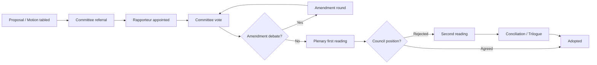

<!-- SPDX-FileCopyrightText: 2026 Hack23 AB -->
<!-- SPDX-License-Identifier: Apache-2.0 -->

# Legislative Procedure Analysis — EP Motions | April 28–30, 2026

**Subject:** Procedural classification of April plenary actions  
**Date:** 2026-05-05

---

## Procedural Overview

The April 28–30, 2026 Strasbourg plenary conducted seven significant procedural actions across four distinct legal bases and procedure types: immunity procedures (Protocol 7), ordinary legislative procedure (OLP), non-legislative resolutions under Rule 132, and urgency resolutions under Rule 163.

---

## Procedure 1: Immunity Waivers — Protocol 7, TFEU Rule

**Legal basis:** Protocol No. 7 on the Privileges and Immunities of the European Union; EP Rules of Procedure Rule 8 (Defence of Immunity) and Rule 9 (Immunity Procedures)

**Procedure type:** Non-legislative immunity procedure — EP acts as final decision-maker on its members' immunity from prosecution in their national systems.

**Key procedural features:**
- JURI committee receives the request from national authority
- JURI appoints a rapporteur (typically a lawyer-MEP from a neutral or opposing political group)
- The MEP subject to the procedure has right of audience at committee and can submit written observations
- JURI adopts a recommendation report by simple majority of committee members
- Full plenary votes on the JURI recommendation — simple majority of votes cast (not of component members)
- The vote is final — no Council involvement, no Commission role, no right of appeal to EU courts on the substance

**EP case law criteria (from prior JURI decisions and ECJ case law):**
- Is the investigation politically motivated (fumus persecutionis)? If yes, waiver may be refused.
- Does the MEP's conduct relate to their parliamentary mandate? If yes, parliamentary immunity under Article 8 of Protocol 7 (opinions/votes) is absolute and cannot be waived.
- Does the immunity relate to travel privilege (Article 9)? If yes, JURI applies the fumus persecutionis test.

**Jaki procedure specifics:** The allegations relate to conduct before Jaki became an MEP (or conduct unrelated to his MEP mandate). JURI found no fumus persecutionis. Waiver recommended and adopted.

**Braun procedure specifics:** The December 2023 Sejm incident occurred before Braun took his EP seat or while he held a Sejm seat (Polish domestic rules). The EP procedure applies because Braun's EP immunity extends to him as a current MEP. JURI found the immunity application broad enough to require a separate EP waiver for Polish prosecutors to proceed.

---

## Procedure 2: DMA Enforcement Resolution — Rule 132 Non-Legislative

**Legal basis:** EP Rules of Procedure Rule 132 — own-initiative non-legislative resolutions responding to Commission/Council statements or to a request from an EP committee

**Procedure type:** Non-legislative own-initiative resolution (INI)

**Legal effect:** Non-binding. The resolution formally states Parliament's position but creates no legal obligation for the Commission. However, under the interinstitutional agreement on better law-making and the Treaties (Article 225 TFEU — legislative initiative requests), a clear EP majority position on enforcement priorities creates strong political obligation for the Commission to respond.

**Procedure origin:** IMCO committee (Internal Market and Consumer Protection) adopted an opinion/report in Q1 2026 calling for plenary debate. The Legal Affairs committee contributed an opinion. Full plenary scheduled the debate and vote in April.

**Adoption threshold:** Simple majority of votes cast.

---

## Procedure 3: Ukraine Accountability Resolution — Rule 132 Non-Legislative

**Legal basis:** EP Rules of Procedure Rule 132; legal basis in EP's political competence under Article 14 TEU (EP's political role in representing EU citizens)

**Procedure type:** Non-legislative resolution (INI) — international affairs category

**Legal effect:** Non-binding. Sets EP political position. Formally transmitted to Council, Commission, and member state parliaments. Referenced in subsequent inter-institutional negotiations on accountability mechanisms.

**Committee origin:** AFET committee (Foreign Affairs) with joint opinion from JURI committee (legal personality of proposed tribunal).

---

## Procedure 4: Armenia Democratic Resilience — Rule 132 Non-Legislative

**Same procedural framework as Ukraine accountability resolution.**

**Committee origin:** AFET committee; DROI (Democracy, Rule of Law, Fundamental Rights) subcommittee contributed to preparation.

---

## Procedure 5: Haiti Trafficking Resolution — Rule 163 Urgency

**Legal basis:** EP Rules of Procedure Rule 163 — urgent debates and resolutions

**Procedure type:** Urgency resolution — requires separate vote by plenary to approve the urgent procedure first (threshold: majority of votes cast), then a full vote on the resolution text.

**Urgency criteria:** A situation that requires immediate EP political signal where the normal INI procedure (weeks-months) would be too slow. For Haiti, the urgency was triggered by:
- Escalating humanitarian crisis in Port-au-Prince (gang control of 85%+ of capital territory by April 2026)
- Specific trafficking reports submitted by Committee on Human Trafficking and NGOs
- Upcoming EU humanitarian aid disbursement decisions

**Legal effect:** Non-binding urgency resolution. The urgency classification signals special political urgency but does not create faster implementation mechanisms than standard non-legislative resolutions.

---

## Procedure 6: 2027 Budget Guidelines — Budgetary Procedure

**Legal basis:** Article 314 TFEU (annual budget procedure); EP's budgetary competence

**Procedure type:** Budgetary procedure preliminary step — the guidelines adopted in spring are the EP's opening mandate for the autumn budget negotiations with the Council.

**Legal effect:** The guidelines themselves are not legally binding on the Council, but they formally establish the EP's negotiating mandate. Under Article 314 TFEU, the EP has co-decision (with Council) on the annual budget. The EP can amend, reject, or adopt the Council's budget proposal. Rejection (under Protocol 1) triggers a conciliation procedure.

**Historical context:** Budget conciliation procedures have extended to late November–December in multiple years; a provisional twelfths regime has been used (e.g., parts of 2021 due to MFF transition delays). The April guidelines reduce the risk of this by clarifying EP's priorities early.

---

## Comparative Legal Force Table

| Action | Legal basis | Binding? | External effect | Enforcement |
|--------|------------|----------|----------------|------------|
| Immunity waivers (Jaki, Braun) | Protocol 7 | Yes — final EP decision | Yes — enables national prosecution | EP plenary is sole decision-maker |
| DMA enforcement resolution | Rule 132 | No | Political pressure on Commission | None — Commission has discretion |
| Ukraine accountability | Rule 132 | No | Political signal, ICC political support | None — international law mechanisms separate |
| Armenia resilience | Rule 132 | No | Political signal, EP-Armenia relations | None |
| Haiti urgency | Rule 163 | No | Humanitarian aid political pressure | None |
| 2027 budget guidelines | Art. 314 TFEU | Partial (mandates EP negotiators) | Sets EP negotiating mandate | EP can reject Council budget |

## Legislative Procedure Flowchart

