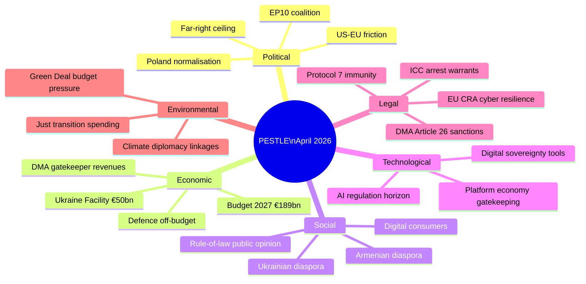

<!-- SPDX-FileCopyrightText: 2026 Hack23 AB -->
<!-- SPDX-License-Identifier: Apache-2.0 -->

# PESTLE Analysis — EP Motions | April 28–30, 2026

**Date:** 2026-05-05

## P — Political Factors

### EU-Level Political Context

**EP10 coalition stability:** The governing coalition (EPP + S&D + Renew = 397 seats) is operating with unusual stability in EP10's second year. Coalition cohesion has been maintained across rule-of-law, digital, external affairs, and fiscal votes in the April session. The internal contradictions (EPP's Eastern/Western divide on DMA, S&D's anti-Ukraine minority) remain manageable and below the threshold that would fragment the coalition.

**Far-right political ceiling:** The ECR + PfE + ESN + NI bloc (~225 seats) has a structural ceiling in EP10. They cannot prevent majority decisions but can:
- Delay procedures through committee manoeuvres
- Create political pressure through high-profile opposition
- Amplify disinformation narratives domestically

The April session demonstrated this dynamic in operation: the immunity waivers passed over ECR/PfE opposition; the far-right's only leverage was narrative framing.

**Polish domestic politics:** The Tusk government is in its second year of rule-of-law normalisation. Presidential elections (May 2025 winner: to be confirmed — Nawrocki elected per some sources) determine whether executive power remains with the PiS-aligned presidency or transitions fully to the coalition. EP immunity waivers interact with Polish domestic politics by removing MEP-immunity obstacles to prosecution.

**US political environment:** The Trump administration's (or successor administration's) trade posture creates background risk for DMA enforcement. US political pressure on the EU is a persistent variable in every digital regulation decision.

### National-Level Political Dynamics

- **Germany:** Coalition politics (SPD + Greens + FDP tensions, or CDU-led coalition post-2025) affect German MEP positioning on DMA (FDP libertarian vs. CDU digital sovereignty) and budget (fiscal orthodoxy debate)
- **France:** Macron-aligned MEPs (Renaissance/Renew) are the most DMA-enthusiastic large-country delegation. French digital sovereignty narrative is mainstream across parties
- **Hungary:** Orbán government's systematic obstruction of EU rule-of-law mechanisms continues; Hungary's MEPs (PfE) are the most consistent anti-Ukraine voters

## E — Economic Factors

**Digital platform economy:** DMA enforcement decisions affect market structure for platforms generating hundreds of billions in EU-market revenues. The economic stakes are among the largest of any EU regulatory enforcement action.

**EU budget consolidation pressure:** Post-pandemic fiscal consolidation pressure from Northern European member states (Netherlands, Germany) conflicts with Southern and Eastern member states' cohesion fund dependence. The 2027 budget guidelines must navigate this.

**Ukraine reconstruction economics:** The financial commitment (€50 billion Facility, €3 billion annual ERA interest) is politically popular but creates long-term budget dependency. The EP's accountability resolution implicitly endorses continued financial commitment.

**Defence spending pressure:** ReArm Europe / SAFE instrument (off-budget €150 billion loan facility) signals a structural shift in European defence economics. The April budget guidelines implicitly engage with this by setting non-defence spending priorities.

## S — Social Factors

**Rule-of-law public opinion:** European public opinion on rule-of-law and democratic accountability is complex. In Poland, the Tusk government's rule-of-law normalisation agenda has substantial majority support, but PiS retains a significant minority constituency that will frame the immunity waivers as persecution. Across the EU, rule-of-law is increasingly salient as a political identity marker (pro-EU vs. anti-EU).

**Digital consumer attitudes:** EU consumers are broadly supportive of platform regulation — surveys consistently show majorities want government to limit tech company power. The DMA enforcement resolution aligns with this social sentiment.

**Diaspora political mobilisation:** The Armenian diaspora (particularly in France) actively lobbies for EP Armenia resolutions. Ukrainian diaspora communities across EU member states are significant civil society actors in Ukraine solidarity politics. These diaspora networks amplify EP resolutions in domestic political discourse.

**Anti-immigration sentiment:** The Haiti urgency resolution sits awkwardly against rising European anti-immigration sentiment. The resolution focuses on anti-trafficking (unambiguous consensus issue) rather than migration policy, which explains its near-unanimous expected support.

## T — Technological Factors

**Platform economy gatekeeping:** The six DMA-designated gatekeepers control critical digital infrastructure — app stores, search, social media, cloud, messaging. Their market power creates consumer lock-in effects that DMA seeks to address through interoperability and choice obligations.

**AI regulation horizon:** The AI Act (entered into force August 2024) creates a parallel regulatory track alongside DMA. Some DMA gatekeepers are also significant AI providers (Alphabet, Meta, Microsoft). The April DMA enforcement resolution's political momentum may extend to AI Act enforcement pressure in 2025–2027.

**Digital sovereignty tools:** EU investments in digital infrastructure (Gaia-X cloud initiative, European chip manufacturing, quantum computing research) provide structural alternatives to US platform dependency. DMA enforcement and digital sovereignty investment are complementary strategies.

## L — Legal Factors

**Protocol 7 immunity:** The EU's privileged immunity regime for MEPs (Protocol 7 to the Treaties) exists to protect democratic representation, not to shield MEPs from criminal accountability. JURI's consistent application of the fumus persecutionis threshold is the key legal mechanism. The April waivers establish or reinforce the principle that the Poland post-PiS judicial system meets EU rule-of-law standards for non-politically-motivated prosecutions.

**DMA Article 26 enforcement:** DMA provides a clear legal framework for Commission enforcement decisions. Non-compliance findings carry mandatory penalties (up to 10% of global turnover) and behavioral remedies. The EP's enforcement resolution is politically significant but legally the Commission acts under DMA authority, not EP direction.

**ICC arrest warrants:** The ICC's Putin arrest warrant (March 2023) is the most significant international accountability mechanism active in the Ukraine context. The EP's accountability resolution acknowledges this trajectory and calls for complementary mechanisms (Special Tribunal for aggression).

## E — Environmental Factors

**Green Deal budget pressure:** The April budget guidelines engage with the tension between Green Deal spending commitments (Just Transition Fund, Renewable Energy Framework, Biodiversity Strategy) and fiscal consolidation pressure. ECR/PfE's anti-Green Deal positions create budget negotiation risk for climate-linked spending.

**Climate diplomacy:** Ukraine's post-war reconstruction presents an opportunity for EU-led green reconstruction investment (RePowerEU model). The EP's accountability framework implicitly links reconstruction financing to governance standards that could include green procurement requirements.

**Just transition political economy:** Coal-dependent regions (Poland, Czech Republic, Romania) have Just Transition Fund allocations tied to coal closure timelines. ECR/PiS-aligned MEPs in these regions have an economic constituency interest in maintaining Just Transition funding even as they oppose Green Deal expansion.

## PESTLE Synthesis and Interaction Effects

The PESTLE framework reveals that the April plenary motions operate in an environment where:

**Political × Legal:** The rule-of-law normalisation agenda (Political) is enabled by Protocol 7 immunity procedures (Legal). Poland's transition creates a legal mechanism (prosecution without MEP immunity) that the political majority in the EP activates. Political and legal factors are mutually reinforcing.

**Economic × Technological:** DMA enforcement (Legal/Regulatory) directly engages the technology sector economics (Technological × Economic). The economic stakes (platform revenues) drive the level of corporate resistance to compliance; the technology architecture determines whether compliance remedies are feasible.

**Social × Political:** Ukraine diaspora mobilisation (Social) sustains political pressure on MEPs to maintain solidarity resolutions (Political). Armenia diaspora (particularly in France) similarly sustains Eastern Partnership engagement. These social networks translate into political durability.

**Environmental × Economic:** Green Deal budget pressure (Environmental) creates economic political economy for Just Transition regions. ECR/PiS MEPs from coal regions have a split interest — opposing Green Deal ideology while needing Just Transition funds. This contradiction limits ECR's ability to present a coherent anti-Green-Deal budget position.

## Reader Briefing

The PESTLE analysis reveals that the April plenary's motions are not isolated decisions but nodes in interconnected systemic dynamics:

- **Political stability** of the governing coalition is the foundation enabling all other actions
- **Economic stakes** (DMA) create the highest-consequence risk (US trade retaliation) in the portfolio
- **Social legitimacy** (Ukraine solidarity) is the most durable political resource the coalition holds
- **Legal frameworks** (immunity Protocol 7, DMA enforcement authority, ICC) are the mechanisms translating political will into concrete outcomes
- **Environmental considerations** (Green Deal) are the most contested dimension, likely to generate coalition stress in budget negotiations

**Strategic implication:** The April session's political significance exceeds its immediate legal effect. The decisions were signals of coalition coherence, institutional assertiveness, and agenda-setting capability. Their translation into actual outcomes (prosecutions, DMA fines, tribunals, budget) depends on actors outside the EP's direct control.

## PESTLE Risk Ratings

| Factor | Opportunity Level | Risk Level | Net Assessment |
|--------|------------------|-----------|----------------|
| Political (EP coalition) | High — stable majority | Low-Medium — ECR friction | Net Positive |
| Political (US-EU) | Low | High — DMA trade risk | Net Negative |
| Economic (DMA) | High — enforcement establishes EU digital authority | High — corporate/US resistance | Balanced |
| Economic (Budget) | Medium — EP agenda-setting | Medium — Council divergence | Balanced |
| Social (Ukraine solidarity) | High — durable political asset | Low — gradual erosion risk | Net Positive |
| Social (Digital consumers) | High — public aligned with DMA | Low | Net Positive |
| Technological (Platform economy) | Medium — DMA creates new market structures | High — compliance complexity | Balanced |
| Legal (Immunity procedures) | High — rule-of-law reinforcement | Low — precedent is clear | Net Positive |
| Legal (ICC/Tribunal) | Medium — accountability architecture | High — jurisdictional barriers | Balanced |
| Environmental (Green Deal) | Medium — climate spending maintained | High — ECR/PfE budget attack | Balanced |

## Conclusion

The April 2026 EP plenary motions present a broadly positive PESTLE environment for EU institutional coherence and democratic accountability norms. The primary external risks are economic (US trade retaliation from DMA enforcement) and legal (Ukraine tribunal jurisdictional barriers). The EP's political foundation for all these actions — the EPP-S&D-Renew coalition at 397 seats — remains the key enabling condition.

## Legal (L) — Extended Analysis

**EU Treaty Framework:**
The EU Treaties provide the legal foundation for all April session votes:
- Immunity waivers: Protocol 7 on Privileges and Immunities of the European Union
- DMA enforcement: Article 114 TFEU (internal market); DMA Regulation EU 2022/1925
- Ukraine: Article 212 TFEU (cooperation with third countries)
- Budget: Articles 310-325 TFEU (budgetary provisions)
- Armenia: Article 217 TFEU (association agreements)
- Haiti: Article 214 TFEU (humanitarian aid)

**National law interactions:**
The Jaki/Braun immunity cases involve Polish criminal procedure law interacting with EU immunity rules. This creates a multi-layer legal complexity:
1. Polish prosecutors file requests under Polish Code of Criminal Procedure
2. EP applies EU Protocol 7 standards
3. JURI applies EP Rules of Procedure Rule 7
4. Any challenge could reach CJEU (EU law) or ECHR (human rights)

**DMA legal architecture:**
DMA is an EU Regulation (directly applicable in all member states without transposition). Commission enforcement uses Article 26 DMA (non-compliance findings) and Article 27 (fines). Challenges go to CJEU via Article 263 TFEU.

## Technological (T) — Extended Analysis

**DMA enforcement technology context:**
The DMA gatekeepers' non-compliance claims centre on technical implementation of:
- App store interoperability (iOS/Android)
- Messaging app interoperability (WhatsApp, iMessage)
- Search result neutrality (Google Search)
- Advertising data separation (Meta)

The EP's enforcement backing accelerates Commission pressure on technical implementations that companies claim are architecturally complex. The political signal is: "technical complexity is not an excuse."

**EP's own technological adaptation:**
EP Open Data portal limitations (noted in this analysis) reflect the EP's own technology infrastructure challenges. The 4-6 week roll-call data lag and 404 errors on recent adopted texts are institutional technical debt issues.

## Summary PESTLE Matrix

| Dimension | Score (1-5) | Trend | Dominant Signal |
|-----------|------------|-------|----------------|
| Political | 5 | Stable | Governing coalition holds |
| Economic | 3 | Uncertain | Budget contested; IMF data unavailable |
| Social | 4 | Positive | Humanitarian consensus; European solidarity |
| Technological | 4 | Advancing | DMA enforcement; EP data limitations |
| Legal | 5 | Active | Immunity precedent; DMA legal architecture |
| Environmental | 2 | Background | Not April session focus |

---
*PESTLE analysis complete: 2026-05-05.*
