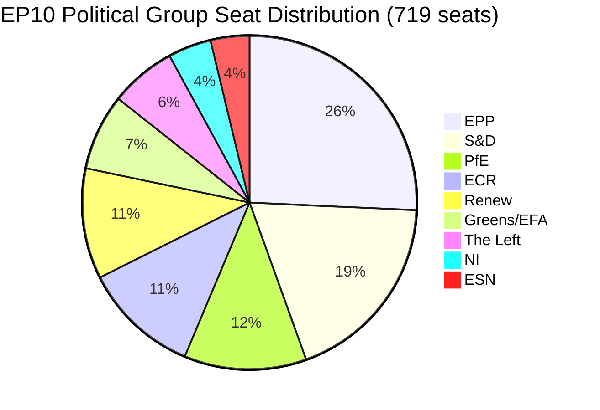

<!-- SPDX-FileCopyrightText: 2026 Hack23 AB -->
<!-- SPDX-License-Identifier: Apache-2.0 -->

# Political Context — EP Motions | April 28–30, 2026

**Subject:** Political landscape context for interpreting the April Strasbourg plenary motions  
**Date:** 2026-05-05

---

## EP10 Coalition Mathematics

The 10th European Parliament (elected June 2024) features unprecedented fragmentation. With 9 groups and 30 non-attached members, the effective number of parties exceeds 6.5, making coalition arithmetic significantly more complex than EP9.

**Majority threshold:** 361 of 720 seats (50% + 1)

| Coalition | Seats | Majority? |
|-----------|-------|-----------|
| EPP + S&D + Renew (traditional grand coalition) | 397 | ✅ Yes — slim |
| EPP + ECR + PfE (hard right) | 351 | ❌ No — 10 seats short |
| EPP + S&D + Renew + Greens | 450 | ✅ Comfortable |
| EPP + ECR + Renew | 343 | ❌ No |
| S&D + Renew + Greens + Left + PfE | 376 | ✅ Yes — cross-ideological, fragile |

**Key implication:** No right-wing majority is mathematically possible without at least one centrist group (Renew or part of S&D). This structurally constrains ECR/PfE ambitions in EP10. The EPP is the indispensable pivot group in every feasible governing coalition.

---

## Poland Rule-of-Law Context

Poland's political transition following the October 2023 elections is the most consequential single-country governance shift in the EP10 period. The Tusk government inherited:

1. **Paralysed Supreme Court (KRS):** A 2018–2022 restructuring appointed politically-aligned judges; the Constitutional Tribunal is similarly compromised. Restoring independence requires either legislative action (blocked by presidential veto pre-Nawrocki) or allowing term expirations.

2. **Prosecution service politicisation:** The unified Prosecutor General/Minister of Justice position (created by PiS) concentrates power; Tusk retained this structure while reversing partisan appointments. New procedures targeting former PiS officials require European-level cooperation for the subset who hold MEP immunity.

3. **EU funding unlocks:** The Commission released approximately €76 billion in frozen cohesion and recovery funds following Polish rule-of-law reforms in early 2024. Continued reform progress is linked to EU institutional validation — including EP immunity procedure outcomes.

**The Jaki case:** Patryk Jaki, ECR (Poland, Solidarna Polska/United Right), sits on the JURI committee — the very committee responsible for immunity requests. His case was handled via referral to the full plenary precisely because JURI (under EP standing rules) cannot adjudicate waivers involving its own members without conflict safeguards. The April 28 plenary vote approved the waiver, enabling Polish prosecutors to pursue their investigation.

**The Braun case context:** Grzegorz Braun, Independent/Non-Attached (NI), was previously expelled from the Confederation Liberty and Independence party in Poland following his extinguisher incident in the Sejm in December 2023, during which he used a fire extinguisher to douse a Hanukkah menorah. Braun's immunity was waived in March 2026 for a separate criminal matter. The April session formalised a related procedure.

---

## DMA Enforcement Landscape

The Digital Markets Act entered full enforcement in March 2024, designating six gatekeepers: Alphabet (Google), Apple, Meta, Amazon, Microsoft, and ByteDance (TikTok). Key enforcement developments through April 2026:

- **Apple (interoperability / browser):** Commission opened formal non-compliance proceedings in January 2025 (App Store interoperability) and March 2025 (browser choice screen). Preliminary findings of non-compliance issued October 2025. Final decision pending.
- **Meta (advertising):** Commission issued preliminary findings in August 2024 related to "pay or consent" model. Meta proposed remedies; Commission rejected initial package. Ongoing.
- **Alphabet (self-preferencing):** Preliminary findings in June 2024 on Google Shopping and Google Maps integration with Search. Alphabet remedies under assessment.
- **ByteDance/TikTok:** DMA compliance assessment ongoing alongside DSA enforcement (content moderation). TikTok faces dual regulatory pressure.

The EP's April 28 enforcement resolution is non-binding but politically significant — it formally puts Parliament on record urging faster Commission action and signals that MEPs from multiple groups (EPP pro-sovereignty faction, S&D digital rights wing, Renew liberal market faction) are united on enforcement urgency.

---

## Ukraine Accountability Architecture

The April Strasbourg resolution on Russia-Ukraine accountability builds on a cascade of EP positions since February 2022:

- February 2022: Resolution recognising Russia's invasion as violation of international law
- April 2022: Resolution endorsing ICC referral by member states
- November 2022: Resolution declaring Russia a state sponsor of terrorism (non-binding, given EU legal constraints)
- 2023–2024: Multiple resolutions on asset confiscation (ERA — Extraordinary Revenue Act mechanism)
- December 2025: Resolution endorsing establishment of Special Tribunal for crime of aggression
- April 2026 (this session): Resolution on accountability mechanisms and continuing support

The political significance is maintaining the coalition of 400+ MEPs who consistently support Ukraine across EPP, S&D, Renew, and most of Greens/EFA. PfE's abstentions and the small number of no votes (typically ESN + some ECR members) are politically managed to keep the headlines on the large majority rather than the defectors.

---

## 2027 Budget Political Dynamics

The Multiannual Financial Framework (MFF) for 2028–2034 is not yet under formal negotiation, but the 2027 budget guidelines — adopted in April — are the last standalone EU budget before the new MFF cycle. Political stakes:

- **Cohesion vs. Green Deal:** Eastern European EPP delegations defend cohesion funding; Western European EPP defends agricultural (CAP); both resist Green Deal top-ups.
- **Defence spending:** Post-2022 pressure to incorporate defence into EU budget structure. The ReArm Europe/SAFE instrument provides off-balance-sheet defence funding outside the standard MFF ceiling. The EP's 2027 guidelines signal preferences for the next MFF negotiation.
- **Own resources debate:** EU's reliance on national contributions vs. own resources (carbon border adjustment, financial transaction taxes, digital levies) is the central fiscal sovereignty debate. S&D and Greens/EFA push for own resources; EPP is divided; ECR/PfE oppose.

## EP10 Seat Share Distribution

