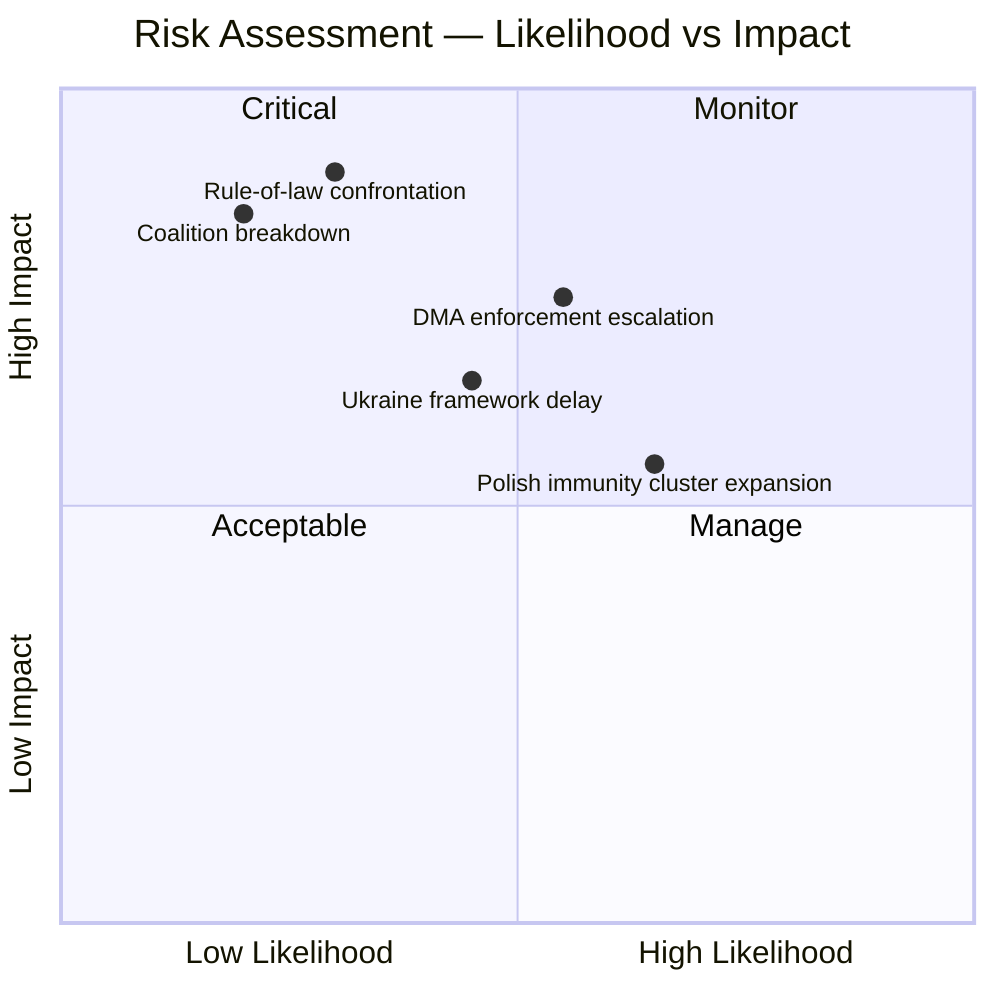

<!-- SPDX-FileCopyrightText: 2026 Hack23 AB -->
<!-- SPDX-License-Identifier: Apache-2.0 -->

# Risk Assessment — EP Motions | April 28–30, 2026

**Subject:** Political risk register for the five primary motions from the April Strasbourg plenary  
**Date:** 2026-05-05  
**Framework:** Political Risk Register (Likelihood × Impact × Velocity)

---

## Risk Register Overview

| Risk ID | Risk Event | Likelihood | Impact | Velocity | Risk Level |
|---------|-----------|-----------|--------|----------|------------|
| R-01 | Immunity waiver triggers ECR fracture in governing coalition | Medium | High | Slow | 🟡 Medium-High |
| R-02 | DMA enforcement sparks US trade retaliation | Medium | Very High | Medium | 🔴 High |
| R-03 | Ukraine accountability resolution fails to produce legal mechanism | High | Medium | Slow | 🟡 Medium |
| R-04 | Armenia resolution provokes Azerbaijani diplomatic response | Low | Medium | Fast | 🟢 Low-Medium |
| R-05 | 2027 budget fails due to EPP-ECR divergence | Low | High | Slow | 🟡 Medium |
| R-06 | Braun case triggers antisemitism procedure complications | Medium | Medium | Fast | 🟡 Medium |
| R-07 | EP10 majority arithmetic narrows post-2026 European Council outcomes | Medium | High | Slow | 🟡 Medium-High |
| R-08 | Haiti trafficking resolution remains symbolic without member state follow-up | High | Low | N/A | 🟢 Low |

---

## Detailed Risk Analysis

### R-01: Immunity Waiver Triggers ECR Coalition Fracture
**Event:** The Jaki immunity waiver passes over ECR objections. If Polish ECR delegation significantly reduces cooperative voting with EPP-S&D-Renew bloc on other dossiers in retaliation, legislative throughput suffers.

**Likelihood:** Medium (40–55%). ECR groups rarely maintain sustained retaliatory postures — individual MEP interests and committee work create incentives for continued engagement.

**Impact:** High. ECR's 81 votes are sometimes needed when Renew splits (e.g., on agricultural/energy dossiers). Losing ECR on key votes could stall specific legislation.

**Velocity:** Slow. Behavioural shifts in voting patterns emerge over weeks, not days.

**Mitigant:** ECR's formal position has been to "respect the rule of law process" while expressing concern. This provides political cover for continued cooperation on other dossiers.

---

### R-02: DMA Enforcement Triggers US Trade Retaliation
**Event:** The Commission, emboldened by the EP's enforcement resolution, accelerates non-compliance findings against Alphabet, Apple, and Meta. The Trump administration (or a successor) frames this as unfair targeting of US companies and imposes tariffs or trade measures.

**Likelihood:** Medium (35–50%). The post-2024 US trade posture under Republican administrations has shown willingness to deploy tariffs as leverage. DMA enforcement decisions in 2025–2026 are explicitly mentioned in US trade discussions.

**Impact:** Very High. EU-US trade volumes are approximately €1.5 trillion annually. Targeted tariffs on specific sectors (automotive, food and beverages, luxury goods) create asymmetric European pain.

**Velocity:** Medium. Trade measures take weeks to months to implement; signalling happens faster.

**Mitigant:** The Commission has framed DMA as applying equally to all gatekeepers, including non-US companies (ByteDance). EU-US trade negotiations under the Trade and Technology Council (TTC) provide a diplomatic channel.

---

### R-03: Ukraine Accountability Resolution Produces No Legal Mechanism
**Event:** The April resolution endorses accountability principles, but the Special Tribunal for the crime of aggression remains legally unresolved due to questions about jurisdictional immunities. Russia's Permanent Five veto at the UN Security Council blocks a Security Council-backed tribunal.

**Likelihood:** High (65–80%). Jurisdictional immunity of state officials (including Putin) under customary international law is a genuine legal obstacle. The proposed "hybrid tribunal" model requires a host state agreement and a General Assembly resolution.

**Impact:** Medium. The failure to establish the tribunal would be a political embarrassment but would not halt ICC proceedings on other charges (war crimes, crimes against humanity under ICC jurisdiction).

**Velocity:** Slow. Tribunal negotiations are multi-year processes.

**Mitigant:** ICC proceedings (arrest warrant for Putin, Lvova-Belova) continue independently. The EP resolution's political effect — signalling continued will — retains value even if the specific tribunal mechanism stalls.

---

### R-04: Armenia Resolution Provokes Azerbaijani Diplomatic Response
**Event:** Azerbaijan interprets the EP's democratic resilience resolution as partial to Armenia in the ongoing border demarcation and normalisation talks. Baku reduces cooperation with EU monitoring mission (EUMA) or expels observers.

**Likelihood:** Low (20–30%). Azerbaijan has demonstrated a willingness to challenge EU statements (it expelled EUMA temporary observers in March 2024 post-Karabakh operation). However, the April resolution is relatively balanced compared to earlier EP texts.

**Impact:** Medium. Loss of EUMA monitoring would reduce transparency in border demarcation. Direct bilateral Armenia-Azerbaijan negotiations continue independently of EP resolutions.

**Velocity:** Fast. Diplomatic responses can come within days.

**Mitigant:** The April resolution focuses on Armenia's democratic consolidation rather than apportioning blame to Azerbaijan. This framing reduces provocation.

---

### R-05: 2027 Budget Fails Due to EPP-ECR Divergence
**Event:** EPP requires ECR support for budget approval but cannot bridge the gap between ECR demands (cut Green Deal, reduce migration funding) and EPP's coalition commitments to S&D and Renew. A budget impasse triggers a provisional twelfths regime.

**Likelihood:** Low (15–25%). EP-Council budget negotiations typically find compromise; the April guidelines represent EP's opening position, not a final negotiating mandate.

**Impact:** High. A provisional twelfths regime would freeze new programme spending at 1/12 of the previous year's authorisations per month, disrupting Horizon Europe, Just Transition, and cohesion fund disbursements.

**Velocity:** Slow. Budget cycle proceeds through October–December 2026.

**Mitigant:** Both EPP and S&D have strong institutional incentives to pass a functioning budget. Renew provides the swing votes that allow EPP to side-step ECR demands.

---

### R-07: EP10 Majority Arithmetic Narrows Post-2026
**Event:** By-elections, group switches, and declining party membership at national level erode the EPP-S&D-Renew majority below 361. This forces EPP to either accommodate ECR/PfE on specific votes or face legislative gridlock.

**Likelihood:** Medium (35–50%). EP group switches are common; by-elections in large member states can shift the balance. The EPP's majority buffer (397 − 361 = 36) is slim enough that a few dozen switches could create pressure.

**Impact:** High. A structural shift in EP majority arithmetic would reshape the entire EU legislative agenda for the remainder of EP10 (through 2029).

**Velocity:** Slow. Erosion unfolds over months or years.

**Mitigant:** The Renew group's 77 MEPs provide a buffer. Even with moderate defections, the EPP-S&D-Renew coalition retains majority on most votes.

## Risk Heat Map

