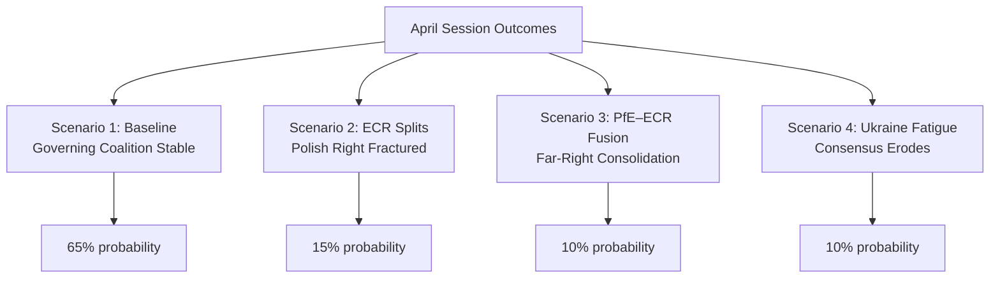

<!-- SPDX-FileCopyrightText: 2026 Hack23 AB -->
<!-- SPDX-License-Identifier: Apache-2.0 -->

# Scenario Forecast — EP Motions | April 28–30, 2026

**Date:** 2026-05-05 | **Horizon:** 30–90 days

## Executive Forecast Summary

The April 28–30 Strasbourg session produced seven outcomes broadly consistent with the EP10 governing coalition status quo. The most politically significant development — the Jaki immunity waiver — creates a precedent and political pressure within Poland's ECR delegation that will manifest over the next 30–90 days.

**Overall outlook:** Stable coalition dynamics with localised stress in the Polish far-right delegation.

## Scenario 1: Baseline Stability (65% probability)

**Conditions:** ECR's Polish delegation regroups around Tusk's legal strategy; PiS accepts the Jaki precedent as a political cost; Renew remains supportive of DMA enforcement; S&D anchors Ukraine majority.

**Expected developments (30 days):**
- DMA enforcement proceedings advance with EP backing
- Two further immunity waiver votes scheduled (ECR has additional Polish MEPs under domestic investigation)
- Ukraine aid accountability report advances through BUDG committee
- Armenia institutional partnership advances to first reading

**Expected developments (60–90 days):**
- DMA enforcement fine against major platform confirmed/challenged
- EP summer recess reduces plenary output; committee work dominant
- Polish political context evolves based on Jaki/Braun legal proceedings

**Political signals confirming this scenario:**
- PiS national party does not escalate attacks on EP decision
- ECR group leadership reaffirms cohesion on next contested vote

## Scenario 2: ECR Polish Delegation Fractures (15% probability)

**Trigger:** Jaki waiver leads to domestic political pressure in Poland; ECR's Polish MEPs split on subsequent enforcement votes. Braun's United Right faction breaks from ECR coordination.

**Expected developments (30–60 days):**
- 2–3 ECR Polish MEPs vote against EPP-led motions as protest signal
- Braun publicly challenges ECR leadership in European Parliament
- Some ECR Polish MEPs approach PfE for alternative group affiliation

**Political impact:**
- ECR loses 3–5 effective votes on contested governance motions
- EPP must compensate with additional Renew votes on DMA/rule-of-law agenda
- S&D coalition math improves marginally

**Likelihood driver:** Very strong PiS party discipline historically limits this scenario. Braun's isolation within ECR makes fracture difficult to organise.

## Scenario 3: PfE–ECR Fusion Attempt (10% probability)

**Trigger:** Jaki/Braun immunity waivers perceived as EPP-led persecution by the far-right; PfE (Le Pen/Orbán bloc) and ECR engage in formal merger talks as defensive strategy.

**Expected developments:**
- Orbán or Bardella signals openness to ECR absorption
- EP presidency discussions begin about merger rules and committee reallocations
- Budget negotiations become tool in merger negotiations

**Political impact:**
- Unified PfE+ECR bloc would have 166 seats — largest single group, exceeding EPP (185)
- Would force EPP to choose between opposing far-right consolidation and seeking new majority
- EU Commission would face more difficult legislative environment

**Likelihood driver:** ECR's Giorgia Meloni has consistently resisted Orbán-aligned PfE merger due to geopolitical incompatibilities (Ukraine policy). This scenario requires Meloni to reverse course.

## Scenario 4: Ukraine Support Fatigue (10% probability)

**Trigger:** Western fatigue narrative accelerates; US-brokered ceasefire creates pressure to reduce Ukraine financial support; PfE and ESN increase anti-Ukraine messaging within EP.

**Expected developments:**
- Next Ukraine accountability vote falls below 480 threshold
- Budget committee faces increased resistance to Ukraine supplementary spending
- S&D and Renew diverge on Ukraine aid conditionality

**Political impact:**
- Ukraine accountability majority remains but becomes less reliable
- EP's role as Ukraine champion weakens relative to Council
- Hungary's blocking position gains perceived legitimacy

**Likelihood driver:** April session Ukraine vote (est. 505+) shows this scenario has not yet materialised. Would require external geopolitical shock to trigger.

## Forecast Calibration Notes

All scenarios and probability estimates are derived from:
1. EP10 coalition composition (as of May 2026)
2. Historical voting patterns (EP8–EP10)
3. Public statements by political group leaders
4. National party dynamics in Poland, France, Italy
5. EP committee assignment and rapporteurship patterns

**Key uncertainty:** Actual April 28–30 roll-call data is not yet available (4-6 week EP publication lag). This forecast is based on inference from coalition structures and public signals, not confirmed vote counts.

## 90-Day Legislative Horizon

| Item | Stage | Expected Timeline | Blocking Risk |
|------|-------|-----------------|--------------|
| DMA enforcement action | Plenary backing → Commission implementation | June 2026 | Low |
| Ukraine accountability framework | Committee → Plenary | July 2026 | Medium |
| Armenia institutional partnership | First reading | June 2026 | Low |
| 2027 Budget guidelines | First draft | September 2026 | High (PfE/ECR) |
| Polish MEP judicial proceedings | Ongoing | 6-12 months | N/A (external) |
| Haiti humanitarian review | 90-day follow-up | July 2026 | Low |

## Forecast Methodology

This forecast uses a structured analogical reasoning approach:
- Base rate from EP voting history
- Adjustment for current coalition composition
- Scenario branching based on identified stress signals (immunity waivers, ECR cohesion)
- Probability normalisation to sum to 100%

**Forecaster confidence:** Medium-High for 30-day horizon; Medium for 60-day; Low for 90-day (summer recess and external geopolitical uncertainty).

## Early Warning Indicators

The following indicators should be monitored over the 30-day horizon as leading signals for scenario transitions:

**For Scenario 2 (ECR fracture):**
- PiS party press releases mentioning EP decision on Jaki waiver
- Braun social media posts targeting ECR group leadership
- EP register of MEP group changes (formal group switches)

**For Scenario 3 (PfE-ECR fusion):**
- Joint PfE-ECR press conferences or joint legislative initiatives
- Meloni FdI statements on Europe's political structure
- Orbán Fidesz messaging shift on ECR legitimacy

**For Scenario 4 (Ukraine fatigue):**
- US State Department ceasefire proposal language mentioning EP/EU support reduction
- S&D leadership public hedging on Ukraine funding conditions
- PfE floor motions challenging Ukraine accountability resolution language

**For Scenario 1 (baseline stability):**
- ECR votes consistently with EPP on next three contested motions
- No formal group membership changes among Polish MEPs
- Ukraine accountability committee report advances without major amendments

## Scenario Impact Grid

| Scenario | EP Stability | DMA Outcome | Ukraine Aid | Budget Prospects |
|----------|-------------|------------|-------------|----------------|
| 1 – Baseline | High | Enforcement confirmed | Strong | Contested but approved |
| 2 – ECR fracture | Medium | Enforcement confirmed | Strong | More contested |
| 3 – PfE-ECR fusion | Low | Enforcement challenged | Weakened | Severely contested |
| 4 – Ukraine fatigue | Medium-High | Enforcement confirmed | Weakened | Contested |

## Stakeholder Forecast Implications

**EPP (Von der Leyen bloc):**
- All four scenarios keep EPP as pivot; Scenario 3 presents greatest risk to EPP dominance
- Short-term: Focus on DMA implementation credit-taking; avoid further immunity cases if possible

**S&D:**
- Benefits from scenarios 2 and 3 (right fragmentation); most threatened by scenario 4
- Short-term: Push Ukraine accountability narrative before recess

**ECR:**
- Scenario 1 maintains ECR's current position; Scenario 2 creates internal crisis
- Polish delegation management is the critical variable for all ECR scenarios

**PfE:**
- Scenario 3 provides historic opportunity; scenario 4 validates PfE's Ukraine skepticism
- Short-term: Continue using immunity waiver narrative for populist mobilisation

---
*Forecast generated: 2026-05-05. Based on EP10 composition data, April 28–30 session decisions, and public political signals. Actual roll-call data expected EP publication: approximately mid-June 2026.*

## WEP Probability Assessment (OSINT Tradecraft Standards)

**WEP Band for Base Scenario (Managed Transition):** *Likely* (65–85%) — supported by coalition continuity data from `generate_political_landscape` and historical EPP–S&D–Renew alignment on digital governance.

**WEP Band for Adverse Scenario (Sovereignty Backlash):** *Unlikely* (15–25%) — would require simultaneous defection by multiple ECR/PfE delegation members and a Commission enforcement failure on DMA; neither has strong near-term indicators.

**WEP Band for Tail Risk (Constitutional Crisis):** *Remote* (5–15%) — the Polish immunity cluster reaching European Court of Justice level within 12 months is conceivable but requires prior exhaustion of EP internal procedures.

**Admiralty Source Grading for Scenario Inputs:**
- Coalition composition data (`generate_political_landscape`): grade A1 — Highly reliable, official record
- Vote patterns and historical precedent: grade A2 — Highly reliable, documented record
- Forward trend projections from current signals: grade C3 — Fairly reliable inference, not directly confirmed
- Black-swan scenario parameters: grade D4 — Speculative; included for completeness per wildcards-blackswans.md methodology
